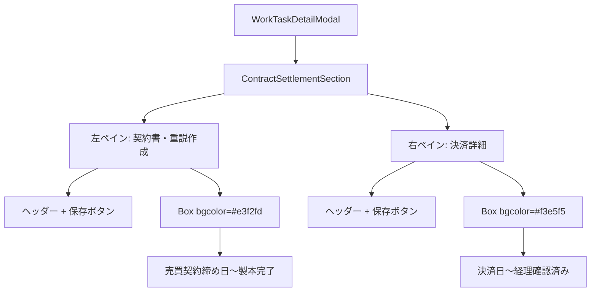

# デザインドキュメント：契約決済タブ レイアウト変更

## 概要

`WorkTaskDetailModal` の「契約決済」タブ（`ContractSettlementSection`）を、現在の縦一列レイアウトから「サイト登録」タブ（`SiteRegistrationSection`）と同様の左右2ペイン構成に変更する。

左ペインに「契約書・重説作成」関連フィールド、右ペインに「決済詳細」関連フィールドを配置し、各ペインに独立した保存ボタンと背景色によるセクション区分を設ける。

## アーキテクチャ

変更対象は単一ファイル `frontend/frontend/src/components/WorkTaskDetailModal.tsx` 内の `ContractSettlementSection` コンポーネントのみ。

既存の `SiteRegistrationSection` の実装パターンをそのまま踏襲することで、コードの一貫性を保つ。



## コンポーネントと インターフェース

### ContractSettlementSection（変更後）

現在の `ContractSettlementSection` は props なしのシンプルなコンポーネント。変更後も props は不要（`handleSave`、`hasChanges`、`saving` は親スコープのクロージャで参照）。

**変更前のシグネチャ:**
```tsx
const ContractSettlementSection = () => (...)
```

**変更後のシグネチャ（同じ）:**
```tsx
const ContractSettlementSection = () => (...)
```

### 参照する既存コンポーネント・関数

変更後も以下をそのまま使用する：

| コンポーネント/関数 | 用途 |
|---|---|
| `EditableField` | テキスト・日付フィールド |
| `EditableButtonSelect` | ボタン選択フィールド |
| `PreRequestCheckButton` | 依頼前確認ボタン |
| `handleSave` | 保存処理（親スコープ） |
| `hasChanges` | 未保存変更フラグ（親スコープ） |
| `saving` | 保存中フラグ（親スコープ） |

## データモデル

データモデルの変更はなし。既存の `WorkTaskData` インターフェースのフィールドをそのまま使用する。

左ペインで使用するフィールド：

| フィールド名 | 型 | ラベル |
|---|---|---|
| `sales_contract_deadline` | date | 売買契約締め日 |
| `sales_contract_notes` | string | 売買契約備考 |
| `contract_type` | string | 契約形態 |
| `contract_input_deadline` | date | 重説・契約書入力納期 |
| `employee_contract_creation` | string | 社員が契約書作成 |
| `binding_scheduled_date` | date | 製本予定日 |
| `binding_completed` | string | 製本完了 |

右ペインで使用するフィールド：

| フィールド名 | 型 | ラベル |
|---|---|---|
| `settlement_date` | date | 決済日 |
| `settlement_scheduled_month` | string | 決済予定月 |
| `sales_price` | number | 売買価格 |
| `brokerage_fee_seller` | number | 仲介手数料（売） |
| `standard_brokerage_fee_seller` | number | 通常仲介手数料（売） |
| `campaign` | string | キャンペーン |
| `discount_reason` | string | 減額理由 |
| `discount_reason_other` | string | 減額理由他 |
| `seller_payment_method` | string | 売・支払方法 |
| `payment_confirmed_seller` | string | 入金確認（売） |
| `brokerage_fee_buyer` | number | 仲介手数料（買） |
| `standard_brokerage_fee_buyer` | number | 通常仲介手数料（買） |
| `buyer_payment_method` | string | 買・支払方法 |
| `payment_confirmed_buyer` | string | 入金確認（買） |
| `accounting_confirmed` | string | 経理確認済み |

## 実装詳細

### レイアウト構造

`SiteRegistrationSection` の実装を直接参照し、同じ構造を適用する。

```tsx
const ContractSettlementSection = () => (
  <Box sx={{ display: 'flex', gap: 0, flex: 1, minHeight: 0, overflow: 'hidden' }}>
    {/* 左ペイン: 契約書・重説作成 */}
    <Box sx={{ flex: 1, p: 2, borderRight: '2px solid', borderColor: 'divider', overflowY: 'auto', minHeight: 0 }}>
      {/* ヘッダー行 */}
      <Box sx={{ display: 'flex', justifyContent: 'space-between', alignItems: 'center', mb: 1 }}>
        <Typography variant="subtitle1" sx={{ fontWeight: 700, color: '#1565c0' }}>
          【契約書、重説作成】
        </Typography>
        <Button color="primary" ... />  {/* 保存ボタン */}
      </Box>
      {/* フィールドグループ */}
      <Box sx={{ bgcolor: '#e3f2fd', borderRadius: 1, p: 1, mb: 1 }}>
        {/* 売買契約締め日〜製本完了 */}
      </Box>
    </Box>

    {/* 右ペイン: 決済詳細 */}
    <Box sx={{ flex: 1, p: 2, overflowY: 'auto', minHeight: 0 }}>
      {/* ヘッダー行 */}
      <Box sx={{ display: 'flex', justifyContent: 'space-between', alignItems: 'center', mb: 1 }}>
        <Typography variant="subtitle1" sx={{ fontWeight: 700, color: '#2e7d32' }}>
          【決済詳細】
        </Typography>
        <Button color="success" ... />  {/* 保存ボタン */}
      </Box>
      {/* フィールドグループ */}
      <Box sx={{ bgcolor: '#f3e5f5', borderRadius: 1, p: 1, mb: 1 }}>
        {/* 決済日〜経理確認済み */}
      </Box>
    </Box>
  </Box>
);
```

### 保存ボタンのスタイル

`SiteRegistrationSection` と同じパルスアニメーションを適用する。

```tsx
sx={hasChanges ? {
  animation: 'pulse-save 1s ease-in-out infinite',
  '@keyframes pulse-save': {
    '0%': { boxShadow: '0 0 0 0 rgba(25, 118, 210, 0.7)' },   // 左ペイン（primary）
    '70%': { boxShadow: '0 0 0 8px rgba(25, 118, 210, 0)' },
    '100%': { boxShadow: '0 0 0 0 rgba(25, 118, 210, 0)' },
  },
} : {}}
```

右ペインは `rgba(46, 125, 50, 0.7)` を使用（success色）。

### CW表示行の扱い

現在の実装にある「CW（浅沼様）全エリア・種別依頼OK」の表示行は、左ペインの `Box` 内に含める。

### DialogContent の overflow 設定

`SiteRegistrationSection` が `flex: 1` と `overflow: hidden` を使って高さを制御しているのと同様に、`ContractSettlementSection` も同じ構造を持つ。親の `DialogContent` は既に `display: 'flex', flexDirection: 'column'` が設定されているため、追加変更は不要。

## エラーハンドリング

レイアウト変更のみのため、新たなエラーハンドリングは不要。保存処理は既存の `handleSave` をそのまま使用する。

## テスト戦略

本機能はUIレイアウトの変更のみであり、純粋関数やデータ変換ロジックを含まないため、プロパティベーステスト（PBT）は適用しない。

**PBTが適用されない理由：**
- 全ての受け入れ基準がCSSスタイルの適用確認またはUIレンダリングの確認であり、入力値によって振る舞いが変わるロジックが存在しない
- 100回繰り返しても2〜3回と同じ結果しか得られない

### 推奨テスト

**スナップショットテスト（主要）：**
- `ContractSettlementSection` のレンダリング結果をスナップショットとして保存
- レイアウト変更が意図しない箇所に影響していないことを確認

**手動確認（必須）：**
- 左右2ペインが均等幅で表示されること
- 左ペインに「【契約書、重説作成】」ヘッダーと青色スタイルが適用されていること
- 右ペインに「【決済詳細】」ヘッダーと緑色スタイルが適用されていること
- 各ペインの背景色（`#e3f2fd`、`#f3e5f5`）が正しく表示されること
- 両ペインの保存ボタンが機能すること（未保存時にパルスアニメーション）
- 各ペインが独立してスクロールできること
- 「サイト登録」タブと視覚的に一貫したスタイルであること
