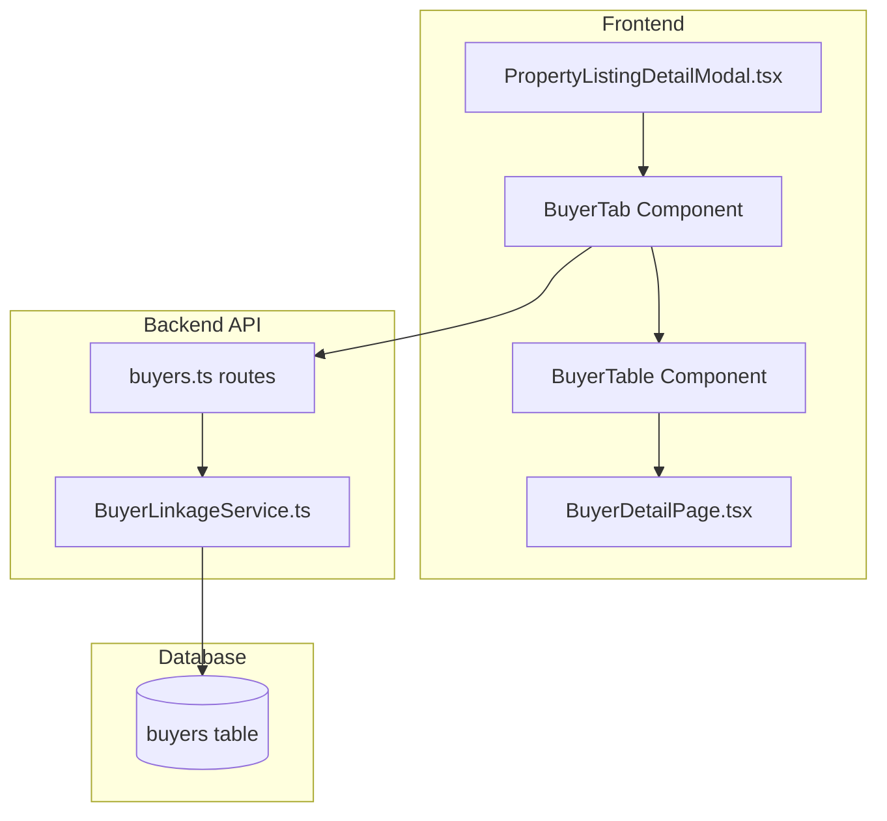

# Design Document: Property Detail Buyer Tab

## Overview

物件詳細モーダル内買主タブ機能は、PropertyListingDetailModal内に新しい「買主」タブを追加し、その物件に紐づく買主リストをテーブル形式で表示する。既存のBuyerLinkageServiceを活用して買主データを取得し、Material-UIのTableコンポーネントを使用して見やすいテーブル形式で表示する。買主行をクリックすると買主詳細ページに遷移する。

## Architecture



## Components and Interfaces

### 1. PropertyListingDetailModal Enhancement

既存のPropertyListingDetailModalに買主タブを追加。

```typescript
// 既存のタブに買主タブを追加
const tabLabels = ['基本情報', '売主', '買主', '手数料・価格', '物件詳細'];

interface BuyerTabState {
  buyers: BuyerSummary[];
  loading: boolean;
  error: string | null;
  loaded: boolean; // データが既にロード済みかどうか
}
```

### 2. BuyerTable Component

買主リストをテーブル形式で表示するコンポーネント。

```typescript
interface BuyerTableProps {
  propertyNumber: string;
  onBuyerClick?: (buyerId: string) => void;
}

interface BuyerSummary {
  id: string;
  buyer_number: string;
  name: string;
  phone_number: string;
  email: string;
  latest_status: string;
  inquiry_confidence: string;
  reception_date: string;
  latest_viewing_date: string | null;
  next_call_date: string | null;
}

const BuyerTable: React.FC<BuyerTableProps> = ({ propertyNumber, onBuyerClick }) => {
  const [buyers, setBuyers] = useState<BuyerSummary[]>([]);
  const [loading, setLoading] = useState(false);
  const [error, setError] = useState<string | null>(null);
  
  // データ取得ロジック
  // テーブル表示ロジック
  // クリックハンドラー
};
```

### 3. Table Columns Definition

```typescript
const columns = [
  { field: 'buyer_number', label: '買主番号', width: '120px' },
  { field: 'name', label: '氏名', width: '150px' },
  { field: 'inquiry_confidence', label: '確度', width: '80px' },
  { field: 'latest_status', label: 'ステータス', width: '120px' },
  { field: 'reception_date', label: '受付日', width: '110px' },
  { field: 'next_call_date', label: '次電日', width: '110px' },
  { field: 'contact', label: '連絡先', width: '150px' },
];
```

## Data Models

### Buyer-Property Linkage

既存のbuyers.property_numberカラムを使用して買主データを取得。

```sql
-- 特定物件の買主リスト取得（既存クエリ）
SELECT 
  id, buyer_number, name, phone_number, email,
  latest_status, inquiry_confidence, reception_date,
  latest_viewing_date, next_call_date
FROM buyers
WHERE property_number LIKE '%AA12345%'
ORDER BY reception_date DESC;
```

## UI/UX Design

### Tab Layout

```typescript
// PropertyListingDetailModal.tsx
const tabLabels = ['基本情報', '売主', '買主', '手数料・価格', '物件詳細'];

// 買主タブのラベルに件数を表示
const getBuyerTabLabel = () => {
  if (buyerTabState.loading) return '買主';
  return `買主 (${buyerTabState.buyers.length})`;
};
```

### Create New Buyer Button

```typescript
// BuyerTab内に新規作成ボタンを配置
const BuyerTabContent = () => {
  const navigate = useNavigate();
  
  const handleCreateBuyer = () => {
    // 物件番号をURLパラメータとして渡す
    navigate(`/buyers/new?propertyNumber=${propertyNumber}`);
    onClose(); // モーダルを閉じる
  };
  
  return (
    <Box sx={{ p: 2 }}>
      <Box sx={{ display: 'flex', justifyContent: 'space-between', alignItems: 'center', mb: 2 }}>
        <Typography variant="h6">買主リスト</Typography>
        <Button
          variant="contained"
          color="primary"
          startIcon={<AddIcon />}
          onClick={handleCreateBuyer}
        >
          新規作成
        </Button>
      </Box>
      <BuyerTable propertyNumber={propertyNumber} onBuyerClick={handleBuyerClick} />
    </Box>
  );
};
```

### Buyer Table Component

```typescript
// BuyerTable.tsx
const BuyerTable: React.FC<BuyerTableProps> = ({ propertyNumber, onBuyerClick }) => {
  const navigate = useNavigate();
  
  const handleRowClick = (buyerId: string) => {
    onBuyerClick?.(buyerId);
    navigate(`/buyers/${buyerId}`);
  };
  
  const handleContactClick = (e: React.MouseEvent, type: 'phone' | 'email', value: string) => {
    e.stopPropagation(); // 行クリックを防ぐ
    // tel: または mailto: リンクは自動的に処理される
  };
  
  const formatDate = (dateStr: string | null | undefined) => {
    if (!dateStr) return '-';
    try {
      return new Date(dateStr).toLocaleDateString('ja-JP', {
        year: 'numeric',
        month: '2-digit',
        day: '2-digit'
      });
    } catch {
      return dateStr;
    }
  };
  
  const getConfidenceColor = (confidence: string) => {
    if (['A', 'S', 'A+', 'S+'].includes(confidence)) return 'error';
    return 'default';
  };
  
  if (loading) {
    return (
      <Box sx={{ display: 'flex', justifyContent: 'center', p: 4 }}>
        <CircularProgress />
      </Box>
    );
  }
  
  if (error) {
    return (
      <Box sx={{ p: 4, textAlign: 'center' }}>
        <Typography color="error" gutterBottom>{error}</Typography>
        <Button onClick={fetchBuyers} variant="outlined">再試行</Button>
      </Box>
    );
  }
  
  if (buyers.length === 0) {
    return (
      <Box sx={{ p: 4, textAlign: 'center' }}>
        <Typography color="text.secondary">
          この物件への問い合わせはまだありません
        </Typography>
      </Box>
    );
  }
  
  return (
    <TableContainer sx={{ maxHeight: 400 }}>
      <Table size="small" stickyHeader>
        <TableHead>
          <TableRow>
            <TableCell>買主番号</TableCell>
            <TableCell>氏名</TableCell>
            <TableCell>確度</TableCell>
            <TableCell>ステータス</TableCell>
            <TableCell>受付日</TableCell>
            <TableCell>次電日</TableCell>
            <TableCell>連絡先</TableCell>
          </TableRow>
        </TableHead>
        <TableBody>
          {buyers.map((buyer) => (
            <TableRow
              key={buyer.id}
              hover
              onClick={() => handleRowClick(buyer.id)}
              sx={{ cursor: 'pointer' }}
            >
              <TableCell>
                <Typography variant="body2" fontWeight="medium">
                  {buyer.buyer_number}
                </Typography>
              </TableCell>
              <TableCell>
                <Typography variant="body2">
                  {buyer.name || '名前未登録'}
                </Typography>
              </TableCell>
              <TableCell>
                <Chip
                  label={buyer.inquiry_confidence || '-'}
                  size="small"
                  color={getConfidenceColor(buyer.inquiry_confidence)}
                  sx={{ minWidth: 50 }}
                />
              </TableCell>
              <TableCell>
                <Typography variant="body2" noWrap sx={{ maxWidth: 120 }}>
                  {buyer.latest_status || '-'}
                </Typography>
              </TableCell>
              <TableCell>
                <Typography variant="body2">
                  {formatDate(buyer.reception_date)}
                </Typography>
              </TableCell>
              <TableCell>
                <Typography 
                  variant="body2" 
                  color={buyer.next_call_date ? 'primary' : 'text.secondary'}
                  fontWeight={buyer.next_call_date ? 'medium' : 'normal'}
                >
                  {formatDate(buyer.next_call_date)}
                </Typography>
              </TableCell>
              <TableCell>
                <Box sx={{ display: 'flex', gap: 1, alignItems: 'center' }}>
                  {buyer.phone_number ? (
                    <Link
                      href={`tel:${buyer.phone_number}`}
                      onClick={(e) => handleContactClick(e, 'phone', buyer.phone_number)}
                      sx={{ display: 'flex', alignItems: 'center' }}
                    >
                      <PhoneIcon fontSize="small" />
                    </Link>
                  ) : null}
                  {buyer.email ? (
                    <Link
                      href={`mailto:${buyer.email}`}
                      onClick={(e) => handleContactClick(e, 'email', buyer.email)}
                      sx={{ display: 'flex', alignItems: 'center' }}
                    >
                      <EmailIcon fontSize="small" />
                    </Link>
                  ) : null}
                  {!buyer.phone_number && !buyer.email && (
                    <Typography variant="caption" color="text.disabled">
                      未登録
                    </Typography>
                  )}
                </Box>
              </TableCell>
            </TableRow>
          ))}
        </TableBody>
      </Table>
    </TableContainer>
  );
};
```

### Seller Tab Update

```typescript
// 「売主・買主」タブを「売主」タブに変更
const SellerInfoSection = () => (
  <Box sx={{ p: 2 }}>
    <Typography variant="subtitle2" sx={{ mb: 2, fontWeight: 'bold' }}>売主情報</Typography>
    <Field label="名前（売主）" field="seller_name" />
    <Field label="住所（売主）" field="seller_address" />
    <Field label="連絡先（売主）" field="seller_contact" />
    <Field label="メール（売主）" field="seller_email" />
    {/* 買主情報セクションを削除 */}
  </Box>
);
```

## API Integration

### Existing API Endpoint

既存のBuyerLinkageServiceのAPIエンドポイントを使用。

```typescript
// GET /api/property-listings/:propertyNumber/buyers
// Response: BuyerSummary[]

const fetchBuyers = async () => {
  setLoading(true);
  setError(null);
  try {
    const response = await api.get(`/api/property-listings/${propertyNumber}/buyers`);
    setBuyers(response.data);
  } catch (err) {
    setError('買主データの取得に失敗しました');
    console.error('Failed to fetch buyers:', err);
  } finally {
    setLoading(false);
  }
};
```

## State Management

### Modal State Enhancement

```typescript
// PropertyListingDetailModal.tsx
const [buyerTabState, setBuyerTabState] = useState<BuyerTabState>({
  buyers: [],
  loading: false,
  error: null,
  loaded: false,
});

// タブ変更時の処理
const handleTabChange = (event: React.SyntheticEvent, newValue: number) => {
  setTabIndex(newValue);
  
  // 買主タブが選択され、まだデータをロードしていない場合
  if (newValue === 2 && !buyerTabState.loaded && propertyNumber) {
    fetchBuyersData();
  }
};

const fetchBuyersData = async () => {
  setBuyerTabState(prev => ({ ...prev, loading: true, error: null }));
  try {
    const response = await api.get(`/api/property-listings/${propertyNumber}/buyers`);
    setBuyerTabState({
      buyers: response.data,
      loading: false,
      error: null,
      loaded: true,
    });
  } catch (error) {
    setBuyerTabState(prev => ({
      ...prev,
      loading: false,
      error: '買主データの取得に失敗しました',
    }));
  }
};
```

## Error Handling

### API Errors
- **Property Not Found**: 存在しない物件番号の場合、空の買主リストを返却
- **Network Error**: ネットワークエラー時、エラーメッセージと再試行ボタンを表示
- **Timeout Error**: タイムアウト時、エラーメッセージを表示

### Frontend Errors
- **Load Failure**: データ取得失敗時、エラーメッセージと再試行ボタンを表示
- **Empty State**: 買主が存在しない場合、「この物件への問い合わせはまだありません」と表示
- **Navigation Error**: 買主詳細ページへの遷移失敗時、エラーメッセージを表示

## Performance Considerations

### Lazy Loading
- 買主タブが初めて選択されたときのみデータを取得
- 一度取得したデータはモーダルが開いている間キャッシュ
- モーダルを閉じたら状態をリセット

### Table Optimization
- 仮想スクロールは不要（通常、買主数は多くない）
- stickyHeaderを使用してヘッダーを固定
- maxHeightを設定してスクロール可能に

## Testing Strategy

### Unit Testing
- BuyerTable: テーブル表示、ソート、クリックハンドラーのテスト
- PropertyListingDetailModal: タブ切り替え、データ取得のテスト

### Integration Testing
- 買主タブの表示確認
- 買主行クリックで買主詳細ページへの遷移確認
- 連絡先リンクのクリック動作確認
- エラーハンドリングの確認

### Manual Testing
- 物件詳細モーダルで買主タブの表示確認
- 買主リストのテーブル表示確認
- 高確度買主のハイライト表示確認
- 買主詳細ページへの遷移確認
- 連絡先リンクの動作確認
- 空状態の表示確認
- エラー状態の表示確認

## NewBuyerPage Enhancement

### URL Parameter Handling

```typescript
// NewBuyerPage.tsx
const NewBuyerPage = () => {
  const [searchParams] = useSearchParams();
  const propertyNumber = searchParams.get('propertyNumber');
  
  const [formData, setFormData] = useState({
    // ... 既存のフィールド
    property_number: propertyNumber || '', // URLパラメータから初期値を設定
  });
  
  const [propertyInfo, setPropertyInfo] = useState<PropertyInfo | null>(null);
  
  useEffect(() => {
    if (propertyNumber) {
      // 物件情報を取得して表示
      fetchPropertyInfo(propertyNumber);
    }
  }, [propertyNumber]);
  
  const fetchPropertyInfo = async (propNum: string) => {
    try {
      const response = await api.get(`/api/property-listings/${propNum}`);
      setPropertyInfo(response.data);
    } catch (error) {
      console.error('Failed to fetch property info:', error);
    }
  };
  
  return (
    <Box>
      {/* 既存のフォーム */}
      
      {/* 問い合わせ物件セクション */}
      <Box sx={{ mb: 3 }}>
        <Typography variant="subtitle2" sx={{ mb: 1, fontWeight: 'bold' }}>
          問い合わせ物件
        </Typography>
        <TextField
          label="物件番号"
          value={formData.property_number}
          onChange={(e) => setFormData({ ...formData, property_number: e.target.value })}
          fullWidth
          sx={{ mb: 2 }}
        />
        
        {/* 物件情報が取得できた場合は参照情報として表示 */}
        {propertyInfo && (
          <Paper sx={{ p: 2, bgcolor: 'grey.50' }}>
            <Typography variant="caption" color="text.secondary" gutterBottom>
              物件情報（参照）
            </Typography>
            <Typography variant="body2">
              <strong>住所:</strong> {propertyInfo.address}
            </Typography>
            <Typography variant="body2">
              <strong>物件種別:</strong> {propertyInfo.property_type}
            </Typography>
            <Typography variant="body2">
              <strong>価格:</strong> {propertyInfo.price ? `${propertyInfo.price.toLocaleString()}万円` : '-'}
            </Typography>
          </Paper>
        )}
      </Box>
      
      {/* 既存のフォームフィールド */}
    </Box>
  );
};
```

### Property Info Interface

```typescript
interface PropertyInfo {
  property_number: string;
  address: string;
  property_type: string;
  price: number | null;
  land_area: number | null;
  building_area: number | null;
}
```

## Migration Notes

### Breaking Changes
- 「売主・買主」タブが「売主」タブに変更される
- 買主情報は新しい「買主」タブに移動

### Backward Compatibility
- 既存のAPIエンドポイントを使用するため、バックエンドの変更は不要
- 既存のBuyerLinkageServiceをそのまま使用
- NewBuyerPageは既存の機能を維持しつつ、URLパラメータによる物件番号の事前入力機能を追加
