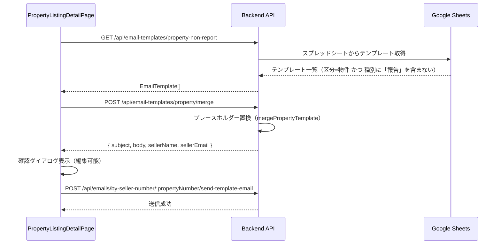

# 設計ドキュメント：物件詳細画面 Email送信機能

## 概要

物件リストの物件詳細画面（`PropertyListingDetailPage`）に、Email送信機能を追加する。
売主リストの通話モードページ（`CallModePage`）に実装済みの仕組みを流用し、物件詳細画面でも同様のEmail送信ができるようにする。

テンプレートはGoogle Spreadsheet（ID: `1sIBMhrarUSMcVWlTVVyaNNKaDxmfrxyHJLWv6U-MZxE`）のシート「テンプレート」から取得する。フィルタ条件は以下の通り：
- C列「区分」が「物件」であるもの
- D列「種別」に「報告」という文字列を含まないもの

---

## アーキテクチャ



---

## コンポーネントとインターフェース

### バックエンド

#### EmailTemplateService（拡張）

**ファイル**: `backend/src/services/EmailTemplateService.ts`

新メソッドを追加する：

```typescript
/**
 * 物件用テンプレートのうち、種別に「報告」を含まないものを取得
 */
async getPropertyNonReportTemplates(): Promise<EmailTemplate[]>
```

フィルタロジック：
- `category === '物件'`（C列）
- `!type.includes('報告')`（D列）

既存の `getPropertyTemplates()` との違いは「報告」を除外する点のみ。

#### emailTemplates ルート（拡張）

**ファイル**: `backend/src/routes/emailTemplates.ts`

新エンドポイントを追加する：

```
GET /api/email-templates/property-non-report
```

レスポンス形式：`EmailTemplate[]`（既存の `/property` エンドポイントと同形式）

既存の `POST /api/email-templates/property/merge` エンドポイントはそのまま流用する（変更不要）。

### フロントエンド

#### PropertyListingDetailPage（拡張）

**ファイル**: `frontend/frontend/src/pages/PropertyListingDetailPage.tsx`

追加する状態：

```typescript
// テンプレート関連
const [propertyEmailTemplates, setPropertyEmailTemplates] = useState<Array<{id: string; name: string; subject: string; body: string}>>([]);
const [propertyEmailTemplatesLoading, setPropertyEmailTemplatesLoading] = useState(false);

// 確認ダイアログ
const [propertyEmailConfirmDialog, setPropertyEmailConfirmDialog] = useState<{
  open: boolean;
  templateId: string | null;
}>({ open: false, templateId: null });

// メール編集用（既存の emailDialog 状態を流用）
// editableEmailRecipient, editableEmailSubject, editableEmailBody は既存のものを流用
```

追加する関数：

```typescript
// ページマウント時にテンプレートを取得
const fetchPropertyEmailTemplates = async () => { ... }

// テンプレート選択時にプレースホルダー置換してダイアログを開く
const handleSelectPropertyEmailTemplate = async (templateId: string) => { ... }

// メール送信（既存の handleSendEmail を流用）
```

#### 再利用する既存コンポーネント

| コンポーネント | 用途 |
|---|---|
| `RichTextEmailEditor` | 本文の編集（既に `PropertyListingDetailPage` でインポート済み） |
| `SenderAddressSelector` | 送信元アドレス選択（既に `PropertyListingDetailPage` でインポート済み） |
| `getSenderAddress` / `saveSenderAddress` | 送信元アドレスの永続化（既に `PropertyListingDetailPage` でインポート済み） |

---

## データモデル

### EmailTemplate（既存型を流用）

```typescript
interface EmailTemplate {
  id: string;       // 例: "property_sheet_5"
  name: string;     // D列「種別」の値（例: "内覧案内"）
  description: string;
  subject: string;  // E列「件名」
  body: string;     // F列「本文」
  placeholders: string[];
}
```

### テンプレートマージリクエスト（既存エンドポイントを流用）

```typescript
// POST /api/email-templates/property/merge
{
  propertyNumber: string;  // 物件番号
  templateId: string;      // テンプレートID
}

// レスポンス
{
  subject: string;
  body: string;
  sellerName: string;
  sellerEmail: string;
}
```

### メール送信リクエスト（既存エンドポイントを流用）

```typescript
// POST /api/emails/by-seller-number/:propertyNumber/send-template-email
{
  templateId: 'custom';
  to: string;          // 送信先（seller_email）
  subject: string;
  content: string;
  htmlBody: string;
  from: string;        // 送信元アドレス
}
```

---

## 正確性プロパティ

*プロパティとは、システムの全ての有効な実行において成立すべき特性や振る舞いのことです。プロパティは人間が読める仕様と機械で検証可能な正確性保証の橋渡しをします。*

### Property 1: 非報告テンプレートのフィルタリング

*For any* テンプレートスプレッドシートのデータセットに対して、`getPropertyNonReportTemplates()` が返すテンプレートは全て、C列「区分」が「物件」であり、かつD列「種別」に「報告」という文字列を含まない。

**Validates: Requirements 1.1, 1.2**

### Property 2: seller_email が空の場合のボタン無効化

*For any* `PropertyListingDetailPage` の状態において、`seller_email` が空文字列または未設定の場合、Email送信ドロップダウンボタンは常に `disabled` 状態である。

**Validates: Requirements 2.2**

### Property 3: テンプレート取得失敗時のボタン無効化

*For any* `GET /api/email-templates/property-non-report` へのリクエストが失敗した場合、Email送信ボタンは非活性状態のまま維持され、エラーはコンソールに記録される。

**Validates: Requirements 5.2**

### Property 4: 送信元アドレスのラウンドトリップ

*For any* 有効な送信元アドレス文字列に対して、`saveSenderAddress(addr)` を呼び出した後に `getSenderAddress()` を呼び出すと、同じアドレスが返される。

**Validates: Requirements 4.1, 4.2**

---

## エラーハンドリング

### バックエンド

| シナリオ | HTTPステータス | レスポンス |
|---|---|---|
| Google Sheets API 接続失敗 | 500 | `{ error: 'Failed to fetch property non-report templates', message: ... }` |
| テンプレートが見つからない | 404 | `{ error: 'Template not found' }` |
| 物件が見つからない | 404 | `{ error: 'Property not found' }` |
| バリデーションエラー | 400 | `{ error: { code: 'VALIDATION_ERROR', ... } }` |

### フロントエンド

| シナリオ | ユーザーへの通知 |
|---|---|
| テンプレート取得失敗 | コンソールにエラーを記録、ボタンを非活性のまま維持 |
| プレースホルダー置換失敗 | スナックバーでエラーメッセージを表示 |
| メール送信失敗 | スナックバーでエラーメッセージを表示 |
| メール送信成功 | スナックバーで成功メッセージを表示、ダイアログを閉じる |

---

## テスト戦略

### ユニットテスト

- `EmailTemplateService.getPropertyNonReportTemplates()` のフィルタリングロジック
  - 区分が「物件」かつ種別に「報告」を含まない行のみ返すこと
  - 区分が「物件」でも種別に「報告」を含む行は除外されること
  - 区分が「物件」以外の行は除外されること
- `GET /api/email-templates/property-non-report` エンドポイント
  - 正常系: テンプレート一覧を返すこと
  - 異常系: Google Sheets API 失敗時に 500 を返すこと

### プロパティベーステスト

プロパティベーステストには **fast-check**（TypeScript/JavaScript 向け）を使用する。各テストは最低 100 回のイテレーションを実行する。

#### テスト 1: 非報告テンプレートのフィルタリング

```typescript
// Feature: property-detail-email-send, Property 1: 非報告テンプレートのフィルタリング
it('getPropertyNonReportTemplates は区分=物件かつ種別に報告を含まない行のみ返す', async () => {
  await fc.assert(
    fc.asyncProperty(
      fc.array(
        fc.record({
          category: fc.oneof(fc.constant('物件'), fc.constant('買主'), fc.constant('売主')),
          type: fc.string(),
          subject: fc.string(),
          body: fc.string(),
        })
      ),
      async (rows) => {
        // モックデータでサービスを呼び出す
        const result = filterPropertyNonReport(rows);
        // 全結果が条件を満たすことを検証
        return result.every(r => r.category === '物件' && !r.type.includes('報告'));
      }
    ),
    { numRuns: 100 }
  );
});
```

#### テスト 2: seller_email が空の場合のボタン無効化

```typescript
// Feature: property-detail-email-send, Property 2: seller_email が空の場合のボタン無効化
it('seller_email が空または未設定の場合、Email送信ボタンは disabled', () => {
  fc.assert(
    fc.property(
      fc.oneof(fc.constant(''), fc.constant(undefined), fc.constant(null)),
      (sellerEmail) => {
        const { getByRole } = render(<PropertyListingDetailPage ... />);
        const button = getByRole('button', { name: /Email送信/ });
        expect(button).toBeDisabled();
      }
    ),
    { numRuns: 100 }
  );
});
```

#### テスト 3: 送信元アドレスのラウンドトリップ

```typescript
// Feature: property-detail-email-send, Property 4: 送信元アドレスのラウンドトリップ
it('saveSenderAddress → getSenderAddress は同じアドレスを返す', () => {
  fc.assert(
    fc.property(
      fc.emailAddress(),
      (address) => {
        saveSenderAddress(address);
        expect(getSenderAddress()).toBe(address);
      }
    ),
    { numRuns: 100 }
  );
});
```

### 統合テスト（手動確認）

- 物件詳細画面を開いた際にテンプレートが事前取得されること
- `seller_email` が設定されている物件でEmail送信ボタンが活性化されること
- テンプレートを選択するとプレースホルダーが置換された状態でダイアログが開くこと
- 送信元アドレスが前回の選択を記憶していること
- メール送信後にダイアログが閉じ、成功スナックバーが表示されること
