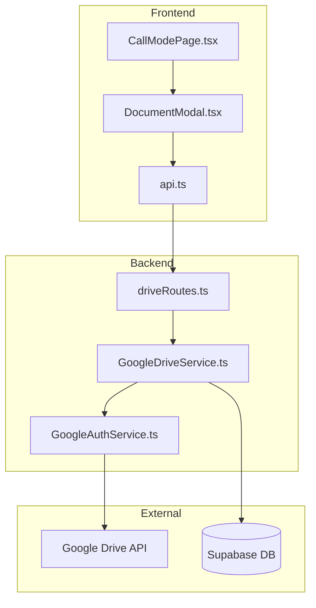

# Design Document: Property Documents Drive Integration

## Overview

本機能は、通話モードページのヘッダーに「画像」ボタンを追加し、Google Driveの「業務依頼」フォルダと連携して売主関連ドキュメント（ゼンリン地図、謄本等のPDF）を管理する機能を提供する。

### 主要機能
- 通話モードヘッダーへの「画像」ボタン追加
- Google Drive「業務依頼」フォルダ直下に売主番号フォルダを自動作成
- PDFファイルのアップロード・閲覧・削除
- Google Driveへの直接アクセスリンク

## Architecture



### フォルダ構造

```
Google Drive
└── 業務依頼/                    # 親フォルダ（環境変数で設定）
    ├── AA12345/                 # 売主番号フォルダ
    │   ├── ゼンリン.pdf
    │   └── 謄本.pdf
    ├── AA12346/
    │   └── 地図.pdf
    └── ...
```

## Components and Interfaces

### Frontend Components

#### 1. DocumentButton (新規)
通話モードヘッダーに配置する「画像」ボタン

```typescript
interface DocumentButtonProps {
  sellerId: string;
  sellerNumber: string;
  onClick: () => void;
}
```

#### 2. DocumentModal (新規)
ドキュメント管理モーダル

```typescript
interface DocumentModalProps {
  open: boolean;
  onClose: () => void;
  sellerId: string;
  sellerNumber: string;
}

interface DriveFile {
  id: string;
  name: string;
  mimeType: string;
  size: number;
  modifiedTime: string;
  webViewLink: string;
  webContentLink: string;
}
```

### Backend Services

#### 1. GoogleDriveService (新規)

```typescript
class GoogleDriveService {
  // フォルダ操作
  async getOrCreateSellerFolder(sellerNumber: string): Promise<string>;
  async findFolderByName(parentId: string, name: string): Promise<string | null>;
  async createFolder(parentId: string, name: string): Promise<string>;
  
  // ファイル操作
  async listFiles(folderId: string): Promise<DriveFile[]>;
  async uploadFile(folderId: string, file: Buffer, fileName: string, mimeType: string): Promise<DriveFile>;
  async deleteFile(fileId: string): Promise<void>;
  async getFileDownloadUrl(fileId: string): Promise<string>;
}
```

#### 2. GoogleAuthService (拡張)

既存のGoogleAuthServiceにDrive APIスコープを追加

```typescript
// 追加するスコープ
private readonly DRIVE_SCOPES = [
  'https://www.googleapis.com/auth/drive.file',  // アプリが作成したファイルのみアクセス
];
```

### API Endpoints

#### GET /api/drive/folders/:sellerNumber
売主フォルダの情報を取得（存在しない場合は作成）

```typescript
// Response
{
  folderId: string;
  folderUrl: string;
  files: DriveFile[];
}
```

#### POST /api/drive/folders/:sellerNumber/files
ファイルをアップロード

```typescript
// Request: multipart/form-data
// - file: File

// Response
{
  file: DriveFile;
}
```

#### DELETE /api/drive/files/:fileId
ファイルを削除

```typescript
// Response
{
  success: boolean;
}
```

## Data Models

### Database Schema

```sql
-- 売主とGoogle Driveフォルダの関連を保存
CREATE TABLE seller_drive_folders (
  id UUID PRIMARY KEY DEFAULT gen_random_uuid(),
  seller_id UUID NOT NULL REFERENCES sellers(id) ON DELETE CASCADE,
  seller_number VARCHAR(20) NOT NULL,
  drive_folder_id VARCHAR(100) NOT NULL,
  created_at TIMESTAMP WITH TIME ZONE DEFAULT NOW(),
  updated_at TIMESTAMP WITH TIME ZONE DEFAULT NOW(),
  UNIQUE(seller_id),
  UNIQUE(seller_number)
);

CREATE INDEX idx_seller_drive_folders_seller_number ON seller_drive_folders(seller_number);
```

### Environment Variables

```env
# Google Drive API設定
GOOGLE_DRIVE_PARENT_FOLDER_ID=<業務依頼フォルダのID>
```


## Correctness Properties

*A property is a characteristic or behavior that should hold true across all valid executions of a system-essentially, a formal statement about what the system should do. Properties serve as the bridge between human-readable specifications and machine-verifiable correctness guarantees.*

### Property 1: ファイル一覧表示の完全性
*For any* ファイルリスト, 表示される各ファイルには名前、サイズ、更新日時が含まれる
**Validates: Requirements 1.4**

### Property 2: フォルダ作成の冪等性
*For any* 売主番号, 同じ売主番号で複数回フォルダ取得を実行しても、常に同一のフォルダIDが返される
**Validates: Requirements 2.1, 2.4**

### Property 3: フォルダID永続化
*For any* 新規作成されたフォルダ, 作成後にデータベースを参照すると、そのフォルダIDが保存されている
**Validates: Requirements 2.2**

### Property 4: アップロード後のファイル存在確認
*For any* アップロードされたPDFファイル, アップロード完了後にファイル一覧を取得すると、そのファイルが含まれている
**Validates: Requirements 3.2, 3.4**

### Property 5: プレビューURL生成の正確性
*For any* Google Driveファイル, 生成されるプレビューURLはGoogle Driveの有効なプレビューURLフォーマットに従う
**Validates: Requirements 4.1**

### Property 6: ダウンロードURL生成の正確性
*For any* Google Driveファイル, 生成されるダウンロードURLはGoogle Driveの有効なダウンロードURLフォーマットに従う
**Validates: Requirements 4.2**

### Property 7: 削除後のファイル不在確認
*For any* 削除されたファイル, 削除後にファイル一覧を取得すると、そのファイルは含まれていない
**Validates: Requirements 4.4**

### Property 8: トークン自動更新
*For any* 期限切れトークン, API呼び出し時にリフレッシュトークンを使用して新しいアクセストークンが取得される
**Validates: Requirements 5.3**

### Property 9: フォルダURL生成の正確性
*For any* 売主フォルダ, 生成されるGoogle DriveフォルダURLは有効なフォルダURLフォーマットに従う
**Validates: Requirements 6.2**

## Error Handling

### エラーカテゴリ

| エラー種別 | HTTPステータス | ユーザーメッセージ | 対処方法 |
|-----------|---------------|-------------------|---------|
| 認証エラー | 401 | Google認証が必要です | 再認証を促す |
| スコープ不足 | 403 | 追加の権限が必要です | スコープ承認を要求 |
| フォルダ作成失敗 | 500 | フォルダの作成に失敗しました | 再試行オプション表示 |
| アップロード失敗 | 500 | ファイルのアップロードに失敗しました | 再試行オプション表示 |
| ファイル削除失敗 | 500 | ファイルの削除に失敗しました | 再試行オプション表示 |
| ファイルサイズ超過 | 413 | ファイルサイズが大きすぎます | 10MB以下のファイルを選択 |

### リトライ戦略

```typescript
const retryConfig = {
  maxRetries: 3,
  initialDelay: 1000,  // 1秒
  maxDelay: 10000,     // 10秒
  backoffMultiplier: 2,
};
```

## Testing Strategy

### Unit Tests

1. **GoogleDriveService**
   - フォルダ検索ロジック
   - フォルダ作成ロジック
   - ファイル一覧取得
   - URL生成ロジック

2. **API Routes**
   - 正常系レスポンス
   - エラーハンドリング
   - 認証チェック

### Property-Based Tests

Property-Based Testingには **fast-check** ライブラリを使用する。

1. **Property 2: フォルダ作成の冪等性**
   - 任意の売主番号に対して、複数回のフォルダ取得が同一結果を返すことを検証

2. **Property 5, 6, 9: URL生成の正確性**
   - 任意のファイルID/フォルダIDに対して、生成されるURLが正しいフォーマットであることを検証

### Integration Tests

1. **Google Drive API連携**
   - 実際のGoogle Drive APIとの通信テスト（テスト用フォルダ使用）

2. **End-to-End**
   - フロントエンドからバックエンドを経由したファイル操作の一連のフロー

### テスト設定

```typescript
// Property-based test configuration
const PBT_CONFIG = {
  numRuns: 100,  // 最低100回の実行
};
```
