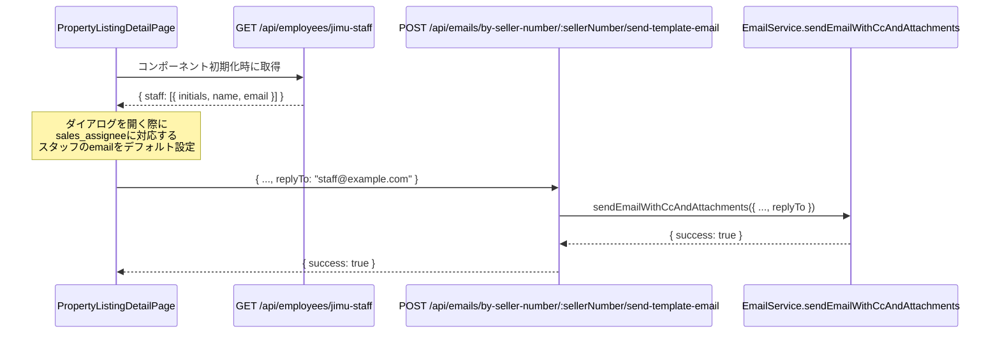

# 設計ドキュメント: 物件リスト詳細画面 Email送信ボタンへの送信元選択機能追加

## Overview

物件リスト詳細画面（`PropertyListingDetailPage`）のメール送信ダイアログに、返信先（Reply-To）アドレスを選択できる機能を追加する。

現在の実装では、メール送信ダイアログに送信元（From）アドレスを選択する `SenderAddressSelector` コンポーネントは存在するが、Reply-To ヘッダーを設定する機能がない。本機能により、物件担当者のアドレスをデフォルトの返信先として設定し、売主からの返信が適切な担当者に届くようになる。

参考実装として `PropertyReportPage` の Gmail 送信ボタンが同様の返信先選択 UI を実装済みであり、同じパターンを踏襲する。

## Architecture



変更範囲は以下の2ファイルに限定される：

- **フロントエンド**: `frontend/frontend/src/pages/PropertyListingDetailPage.tsx`
- **バックエンド**: `backend/src/routes/emails.ts`（`by-seller-number/:sellerNumber/send-template-email` エンドポイント）

`EmailService.sendEmailWithCcAndAttachments` は既に `replyTo` パラメータをサポートしているため変更不要。

## Components and Interfaces

### フロントエンド変更

#### 新規状態変数

```typescript
// 事務ありスタッフ一覧（返信先選択肢用）
const [jimuStaff, setJimuStaff] = useState<Array<{ initials: string; name: string; email?: string }>>([]);

// 返信先（Reply-To）選択状態
const [replyTo, setReplyTo] = useState<string>('');
```

#### jimu-staff 取得関数

```typescript
const fetchJimuStaff = async () => {
  try {
    const response = await api.get('/api/employees/jimu-staff');
    setJimuStaff(response.data.staff || []);
  } catch (error) {
    console.error('Failed to fetch jimu staff:', error);
  }
};
```

#### ダイアログオープン時のデフォルト設定

`handleOpenEmailDialog` および `handleSelectPropertyEmailTemplate` の両関数で、ダイアログを開く際に `data.sales_assignee` に対応するスタッフのメールアドレスをデフォルト設定する：

```typescript
const matchedStaff = jimuStaff.find((s) => s.initials === data?.sales_assignee);
setReplyTo(matchedStaff?.email || '');
```

#### ダイアログクローズ時のリセット

ダイアログを閉じる際（キャンセル・送信完了）に `replyTo` をリセット：

```typescript
setReplyTo('');
```

#### メール送信ペイロードへの追加

`handleSendEmail` 内で `replyTo` が設定されている場合のみペイロードに含める：

```typescript
const payload: any = {
  templateId: 'custom',
  to: editableEmailRecipient,
  subject: editableEmailSubject,
  content: editableEmailBody,
  htmlBody: editableEmailBody,
  from: senderAddress,
  ...(replyTo ? { replyTo } : {}),
};
```

#### ダイアログ内 UI（返信先選択フィールド）

`SenderAddressSelector` の直下に追加：

```tsx
<FormControl size="small" fullWidth>
  <InputLabel id="reply-to-label">返信先（Reply-To）</InputLabel>
  <Select
    labelId="reply-to-label"
    label="返信先（Reply-To）"
    value={replyTo}
    onChange={(e) => setReplyTo(e.target.value)}
    displayEmpty
  >
    <MenuItem value="">
      <em>選択なし（送信元と同じ）</em>
    </MenuItem>
    {jimuStaff
      .filter((s) => s.email)
      .map((s) => (
        <MenuItem key={s.initials} value={s.email}>
          {s.name} &lt;{s.email}&gt;
        </MenuItem>
      ))}
  </Select>
</FormControl>
```

### バックエンド変更

#### `by-seller-number/:sellerNumber/send-template-email` エンドポイント

**変更点1**: バリデーションに `replyTo` を追加：

```typescript
body('replyTo').optional().isEmail().withMessage('Invalid replyTo email address'),
```

**変更点2**: リクエストボディから `replyTo` を取得：

```typescript
const { templateId, to, subject, content, htmlBody, from, attachments, replyTo } = req.body;
```

**変更点3**: 添付ファイルありの場合、`sendEmailWithCcAndAttachments` に `replyTo` を渡す：

```typescript
result = await emailService.sendEmailWithCcAndAttachments({
  to: recipientEmail,
  subject,
  body: htmlBody || content || '',
  from: senderEmail,
  attachments: emailAttachments,
  isHtml: !!htmlBody,
  replyTo: replyTo || undefined,  // 追加
});
```

**変更点4**: 添付ファイルなしの場合、`replyTo` が指定されていれば `sendEmailWithCcAndAttachments` を使用：

```typescript
if (replyTo) {
  // replyTo が指定されている場合は sendEmailWithCcAndAttachments を使用
  result = await emailService.sendEmailWithCcAndAttachments({
    to: recipientEmail,
    subject,
    body: htmlBody || content || '',
    from: senderEmail,
    attachments: [],
    isHtml: !!htmlBody,
    replyTo,
  });
} else {
  // 既存フロー（変更なし）
  result = await emailService.sendTemplateEmail(
    sellerWithEmail,
    subject,
    content || '',
    senderEmail,
    req.employee?.id || 'system',
    htmlBody,
    senderEmail
  );
}
```

## Data Models

新規データモデルの追加はなし。既存の型・インターフェースを活用する。

### jimu-staff API レスポンス（既存）

```typescript
interface JimuStaff {
  initials: string;  // イニシャル（例: "AB"）
  name: string;      // 氏名（例: "山田 太郎"）
  email?: string;    // メールアドレス（空欄の場合あり）
}
```

### メール送信リクエストボディ（拡張）

```typescript
interface SendTemplateEmailRequest {
  templateId: string;
  to?: string;
  subject: string;
  content?: string;
  htmlBody?: string;
  from?: string;
  attachments?: any[];
  replyTo?: string;  // 新規追加
}
```

## Correctness Properties

*A property is a characteristic or behavior that should hold true across all valid executions of a system-essentially, a formal statement about what the system should do. Properties serve as the bridge between human-readable specifications and machine-verifiable correctness guarantees.*

### Property 1: メールアドレスを持つスタッフのみが選択肢に表示される

*For any* スタッフリスト（メールアドレスあり・なし混在）に対して、返信先の選択肢として表示されるのはメールアドレスを持つスタッフのみであること

**Validates: Requirements 1.2, 4.3**

### Property 2: sales_assignee に対応するスタッフのメールがデフォルト選択される

*For any* イニシャルとスタッフリストの組み合わせに対して、ダイアログを開いたときに `sales_assignee` のイニシャルに対応するスタッフのメールアドレスがデフォルト選択されること（対応するスタッフが存在しない場合は空文字列）

**Validates: Requirements 1.3, 1.4**

### Property 3: ダイアログクローズ時に返信先がリセットされる

*For any* replyTo 値が設定された状態でダイアログを閉じると、replyTo が空文字列にリセットされること

**Validates: Requirements 1.7**

### Property 4: 選択肢の表示形式に氏名とメールアドレスが含まれる

*For any* スタッフ（氏名・メールアドレス）に対して、選択肢の表示文字列に氏名とメールアドレスの両方が含まれること

**Validates: Requirements 2.2**

### Property 5: replyTo が送信ペイロードに正しく含まれる

*For any* メールアドレス文字列を replyTo として設定した場合、メール送信リクエストのペイロードにその値が含まれること。replyTo が空の場合はペイロードに含まれないこと

**Validates: Requirements 3.1, 1.6**

## Error Handling

### フロントエンド

- `GET /api/employees/jimu-staff` が失敗した場合: エラーをコンソールに記録し、`jimuStaff` を空配列のままにする。返信先選択フィールドは表示されるが選択肢が空になる（ユーザーへのエラー表示は不要）
- `replyTo` が設定されていない状態でのメール送信: 既存の動作を維持（Reply-To ヘッダーなし）

### バックエンド

- `replyTo` のバリデーション失敗（不正なメールアドレス形式）: 400 VALIDATION_ERROR を返す
- `replyTo` が空または未指定: 既存の動作を維持（Reply-To ヘッダーなし）
- `sendEmailWithCcAndAttachments` の失敗: 既存のエラーハンドリングを維持（502 EMAIL_SEND_ERROR）

## Testing Strategy

### ユニットテスト

- `jimuStaff` フィルタリングロジック: メールアドレスを持つスタッフのみが選択肢に含まれることを確認
- デフォルト選択ロジック: `sales_assignee` に対応するスタッフのメールがデフォルト設定されることを確認
- ダイアログクローズ時のリセット: `replyTo` が空にリセットされることを確認
- 送信ペイロード: `replyTo` が正しくペイロードに含まれる/含まれないことを確認

### プロパティベーステスト

プロパティベーステストには [fast-check](https://github.com/dubzzz/fast-check)（TypeScript/JavaScript 向け）を使用する。各プロパティテストは最低 100 回のイテレーションで実行する。

#### Property 1: メールアドレスを持つスタッフのみが選択肢に表示される

```typescript
// Feature: property-email-sender-selection, Property 1: メールアドレスを持つスタッフのみが選択肢に表示される
fc.assert(fc.property(
  fc.array(fc.record({
    initials: fc.string({ minLength: 1, maxLength: 3 }),
    name: fc.string({ minLength: 1 }),
    email: fc.option(fc.emailAddress(), { nil: undefined }),
  })),
  (staffList) => {
    const filtered = staffList.filter((s) => s.email);
    // 表示される選択肢はメールアドレスを持つスタッフのみ
    expect(filtered.every((s) => s.email)).toBe(true);
    expect(filtered.length).toBeLessThanOrEqual(staffList.length);
  }
), { numRuns: 100 });
```

#### Property 2: sales_assignee に対応するスタッフのメールがデフォルト選択される

```typescript
// Feature: property-email-sender-selection, Property 2: sales_assignee に対応するスタッフのメールがデフォルト選択される
fc.assert(fc.property(
  fc.array(fc.record({
    initials: fc.string({ minLength: 1, maxLength: 3 }),
    name: fc.string({ minLength: 1 }),
    email: fc.option(fc.emailAddress(), { nil: undefined }),
  })),
  fc.string({ minLength: 0, maxLength: 3 }),
  (staffList, salesAssignee) => {
    const matchedStaff = staffList.find((s) => s.initials === salesAssignee);
    const defaultReplyTo = matchedStaff?.email || '';
    // 対応するスタッフが存在する場合はそのメール、存在しない場合は空文字列
    if (matchedStaff?.email) {
      expect(defaultReplyTo).toBe(matchedStaff.email);
    } else {
      expect(defaultReplyTo).toBe('');
    }
  }
), { numRuns: 100 });
```

#### Property 3: ダイアログクローズ時に返信先がリセットされる

```typescript
// Feature: property-email-sender-selection, Property 3: ダイアログクローズ時に返信先がリセットされる
fc.assert(fc.property(
  fc.emailAddress(),
  (replyToValue) => {
    // 任意のreplyTo値が設定された状態でダイアログを閉じると空にリセットされる
    let replyTo = replyToValue;
    // ダイアログクローズ処理
    replyTo = '';
    expect(replyTo).toBe('');
  }
), { numRuns: 100 });
```

#### Property 4: 選択肢の表示形式に氏名とメールアドレスが含まれる

```typescript
// Feature: property-email-sender-selection, Property 4: 選択肢の表示形式に氏名とメールアドレスが含まれる
fc.assert(fc.property(
  fc.record({
    initials: fc.string({ minLength: 1, maxLength: 3 }),
    name: fc.string({ minLength: 1 }),
    email: fc.emailAddress(),
  }),
  (staff) => {
    const displayText = `${staff.name} <${staff.email}>`;
    expect(displayText).toContain(staff.name);
    expect(displayText).toContain(staff.email);
  }
), { numRuns: 100 });
```

#### Property 5: replyTo が送信ペイロードに正しく含まれる

```typescript
// Feature: property-email-sender-selection, Property 5: replyTo が送信ペイロードに正しく含まれる
fc.assert(fc.property(
  fc.option(fc.emailAddress(), { nil: '' }),
  (replyToValue) => {
    const payload: any = {
      templateId: 'custom',
      subject: 'test',
      ...(replyToValue ? { replyTo: replyToValue } : {}),
    };
    if (replyToValue) {
      expect(payload.replyTo).toBe(replyToValue);
    } else {
      expect(payload.replyTo).toBeUndefined();
    }
  }
), { numRuns: 100 });
```

### インテグレーションテスト

- `GET /api/employees/jimu-staff` エンドポイントが `initials`・`name`・`email` を含むレスポンスを返すことを確認（既存実装のスモークテスト）
- `POST /api/emails/by-seller-number/:sellerNumber/send-template-email` に `replyTo` を含むリクエストを送信し、メールが正常に送信されることを確認（1〜2例）
