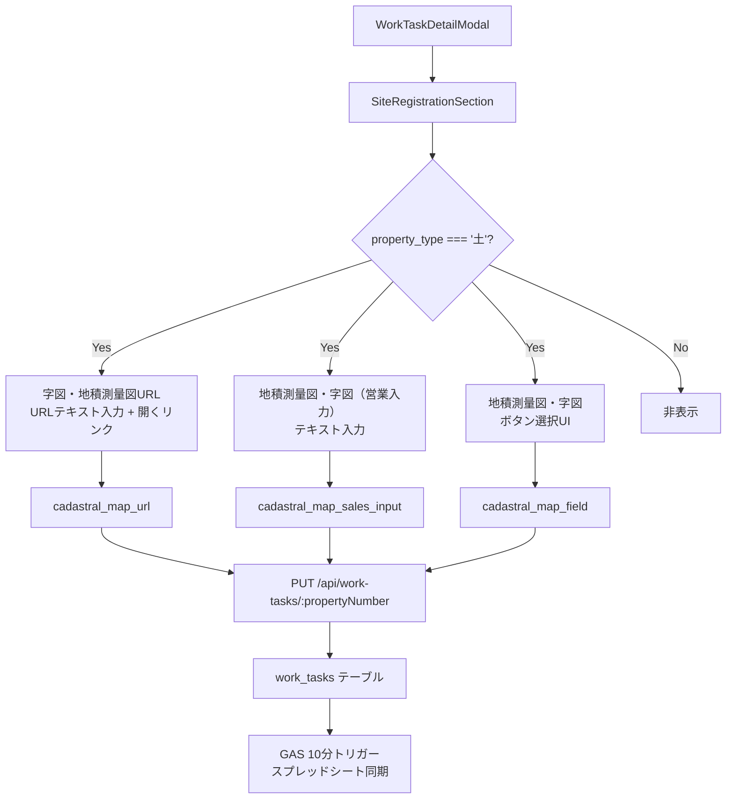

# 設計書：種別=土の場合のみ表示するフィールド追加

## Overview

業務詳細画面（WorkTaskDetailModal）のサイト登録タブに、種別（`property_type`）が「土」の場合のみ表示する3つのフィールドを追加する。

### 現状の問題点

コードベース調査により以下が判明している：

1. **`cadastral_map_url`の実装が要件と異なる**  
   現在 `EditableButtonSelect` として `['URL入力済み', '未']` のボタン選択UIで実装されているが、要件はURLテキスト入力フィールド（`開く`リンク付き）である。

2. **`cadastral_map_sales_input` と `cadastral_map_field` は条件分岐済み**  
   `property_type === '土'` の条件分岐は既に実装されているが、`cadastral_map_url` の条件分岐が欠けている。

3. **表示順序が要件と異なる**  
   現在の実装では `cadastral_map_url` が `cadastral_map_sales_input` / `cadastral_map_field` より後に配置されており、要件の順序（URL → 営業入力 → ボタン選択）と異なる。

4. **DBカラムは既に存在する**  
   `backend/migrations/040_add_work_tasks.sql` で3カラム全て定義済み。Supabaseマイグレーションは不要。

5. **カラムマッピングは既に定義済み**  
   `work-task-column-mapping.json` の `spreadsheetToDatabase`（`cadastral_map_url`）と `spreadsheetToDatabase3`（`cadastral_map_sales_input`、`cadastral_map_field`）に定義済み。

### 変更スコープ

- **フロントエンド**: `frontend/frontend/src/components/WorkTaskDetailModal.tsx` のみ
- **バックエンド**: 変更不要（DBカラム・カラムマッピング・APIは既存のまま）
- **スプレッドシート同期**: 変更不要（GASの10分トリガーで既に対応済み）

---

## Architecture



### 同期アーキテクチャ

- **DB → スプレッドシート**: GASの10分トリガー（`GyomuWorkTaskSync.gs`）が `work_tasks` テーブルを読み取りスプレッドシートに反映
- **スプレッドシート → DB**: GASの10分トリガーがスプレッドシートを読み取り `work_tasks` テーブルに upsert
- **フロントエンド → DB**: `PUT /api/work-tasks/:propertyNumber` で即時保存

---

## Components and Interfaces

### フロントエンド変更箇所

**ファイル**: `frontend/frontend/src/components/WorkTaskDetailModal.tsx`

#### 変更1: `SiteRegistrationSection` コンポーネントの修正

`SiteRegistrationSection` 内の以下の部分を変更する：

**変更前（現在の実装）**:
```tsx
<EditableField label="サイト備考" field="site_notes" />
{getValue('property_type') === '土' && (
  <>
    <EditableField label="地籍測量図・字図（営業入力）" field="cadastral_map_sales_input" />
    <EditableButtonSelect label="地積測量図、字図" field="cadastral_map_field" options={['格納済み＆スプシに「有、無」を入力済み', '未', '不要']} />
  </>
)}
<EditableButtonSelect label="字図、地積測量図URL*" field="cadastral_map_url" options={['URL入力済み', '未']} />
```

**変更後（要件に合わせた実装）**:
```tsx
<EditableField label="サイト備考" field="site_notes" />
{getValue('property_type') === '土' && (
  <>
    <EditableField label="字図、地積測量図URL*" field="cadastral_map_url" type="url" />
    <EditableField label="地積測量図・字図（営業入力）" field="cadastral_map_sales_input" />
    <CadastralMapFieldSelect />
  </>
)}
```

#### 変更2: `CadastralMapFieldSelect` コンポーネントの追加

`button-select-layout-rule.md` のレイアウトルールに従い、ラベルとボタンを横並び・均等幅で実装する：

```tsx
const CadastralMapFieldSelect = () => {
  const options = ['格納済み＆スプシに「有、無」を入力済み', '未', '不要'];
  return (
    <Grid item xs={12}>
      <Box sx={{ display: 'flex', alignItems: 'center', gap: 1 }}>
        <Typography variant="body2" color="text.secondary" sx={{ whiteSpace: 'nowrap', flexShrink: 0, fontWeight: 500 }}>
          地積測量図、字図
        </Typography>
        <Box sx={{ display: 'flex', gap: 0.5, flex: 1 }}>
          {options.map((opt) => (
            <Button
              key={opt}
              size="small"
              variant={getValue('cadastral_map_field') === opt ? 'contained' : 'outlined'}
              color="primary"
              onClick={() => handleFieldChange('cadastral_map_field', opt)}
              sx={{ flex: 1, py: 0.5, fontWeight: getValue('cadastral_map_field') === opt ? 'bold' : 'normal', borderRadius: 1 }}
            >
              {opt}
            </Button>
          ))}
        </Box>
      </Box>
    </Grid>
  );
};
```

> **注意**: 既存の `EditableButtonSelect` は `ButtonGroup` を使用しており `flex: 1` が付与されていない。`button-select-layout-rule.md` のルールに従い、新しいコンポーネントとして実装する。

### 既存コンポーネントの活用

- **`EditableField` with `type="url"`**: 既に実装済み。URLテキスト入力 + `開く`リンクを表示する。`cadastral_map_url` に適用する。
- **`EditableField` with `type="text"`**: `cadastral_map_sales_input` に適用する（既存のまま）。

---

## Data Models

### `work_tasks` テーブル（変更なし）

3カラムは `backend/migrations/040_add_work_tasks.sql` で既に定義済み：

| カラム名 | 型 | 説明 |
|---------|-----|------|
| `cadastral_map_url` | TEXT | 字図・地積測量図のURL |
| `cadastral_map_sales_input` | TEXT | 地積測量図・字図（営業入力） |
| `cadastral_map_field` | TEXT | 地積測量図・字図の選択状態 |

### `work-task-column-mapping.json`（変更なし）

3カラムは既に定義済み：

| スプレッドシートカラム名 | DBカラム名 | マッピングセクション |
|----------------------|-----------|------------------|
| `字図、地積測量図URL` | `cadastral_map_url` | `spreadsheetToDatabase` |
| `地籍測量図・字図（営業入力）` | `cadastral_map_sales_input` | `spreadsheetToDatabase3` |
| `地積測量図、字図` | `cadastral_map_field` | `spreadsheetToDatabase3` |

### `WorkTaskData` インターフェース（変更なし）

`WorkTaskDetailModal.tsx` の `WorkTaskData` インターフェースには既に3フィールドが定義済み：

```typescript
interface WorkTaskData {
  // ...
  cadastral_map_sales_input: string;
  cadastral_map_field: string;
  cadastral_map_url: string;
  // ...
}
```

---

## Correctness Properties

*A property is a characteristic or behavior that should hold true across all valid executions of a system-essentially, a formal statement about what the system should do. Properties serve as the bridge between human-readable specifications and machine-verifiable correctness guarantees.*


### Property 1: 種別=土の場合のみ3フィールドが表示される

preworkの分析より、要件1.2、1.3、2.1、2.2、3.1、3.2は全て「property_type='土'の場合のみ3フィールドが表示される」という同一のプロパティに統合できる。

*For any* `property_type` の値に対して、`WorkTaskDetailModal` のサイト登録タブをレンダリングした場合、`cadastral_map_url`・`cadastral_map_sales_input`・`cadastral_map_field` の3フィールドは `property_type === '土'` の場合のみ表示され、それ以外の値（「戸」「マ」等、空文字含む）では非表示になる。

**Validates: Requirements 1.2, 1.3, 2.1, 2.2, 3.1, 3.2**

### Property 2: URLフィールドに値がある場合「開く」リンクが表示される

preworkの分析より、要件1.5は任意のURL文字列に対して成立するプロパティ。

*For any* 非空の文字列を `cadastral_map_url` に設定した場合、`EditableField` コンポーネントは「開く」リンクを表示し、空文字または未設定の場合はリンクを表示しない。

**Validates: Requirements 1.5**

### Property 3: 3フィールドの値がDBに正しく保存される（ラウンドトリップ）

preworkの分析より、要件1.4、2.3、3.5、5.1は「任意の値を保存するとDBに正しく保存される」という同一のラウンドトリッププロパティに統合できる。

*For any* `cadastral_map_url`・`cadastral_map_sales_input`・`cadastral_map_field` の値の組み合わせに対して、`PUT /api/work-tasks/:propertyNumber` で保存した後に `GET /api/work-tasks/:propertyNumber` で取得した場合、保存した値と同一の値が返される。

**Validates: Requirements 1.4, 2.3, 3.5, 5.1**

---

## Error Handling

### フロントエンド

- `property_type` が `null` または `undefined` の場合、`getValue('property_type') === '土'` は `false` となり、3フィールドは非表示になる（安全なデフォルト）。
- `cadastral_map_url` に無効なURL文字列が入力された場合でも、バリデーションは行わない（スプレッドシートとの互換性を維持するため）。「開く」リンクはURLが存在する場合に表示するが、URLの有効性は検証しない。
- 保存失敗時は既存の `Snackbar` エラー表示を使用する（変更なし）。

### バックエンド

- `PUT /api/work-tasks/:propertyNumber` は既存の実装をそのまま使用する。3フィールドは `TEXT` 型のため、任意の文字列値を受け付ける。
- `property_type` が「土」以外の場合でも、APIは3フィールドの値を受け付けて保存する（フロントエンドで非表示にするだけで、バックエンドは値を拒否しない）。

---

## Testing Strategy

### ユニットテスト（具体例・エッジケース）

**対象**: `WorkTaskDetailModal` の `SiteRegistrationSection`

1. **表示制御の例**
   - `property_type = '土'` の場合、3フィールドが全て表示されること
   - `property_type = '戸'` の場合、3フィールドが全て非表示であること
   - `property_type = 'マ'` の場合、3フィールドが全て非表示であること
   - `property_type = ''`（空文字）の場合、3フィールドが全て非表示であること

2. **「開く」リンクの例**
   - `cadastral_map_url = 'https://example.com'` の場合、「開く」リンクが表示されること
   - `cadastral_map_url = ''` の場合、「開く」リンクが表示されないこと

3. **ボタン選択UIの選択肢の例**（要件3.3）
   - `cadastral_map_field` のボタン選択UIに「格納済み＆スプシに「有、無」を入力済み」「未」「不要」の3つが存在すること

4. **表示順序の例**（要件4.1）
   - `property_type = '土'` の場合、「サイト備考」の直後に「字図、地積測量図URL」→「地積測量図・字図（営業入力）」→「地積測量図、字図」の順で表示されること

5. **DBカラム存在確認の例**（要件5.2〜5.4）
   - `backend/migrations/040_add_work_tasks.sql` に `cadastral_map_url`・`cadastral_map_sales_input`・`cadastral_map_field` の3カラムが定義されていること

6. **カラムマッピング定義の例**（要件6.3）
   - `work-task-column-mapping.json` に3カラムのマッピングが定義されていること

### プロパティベーステスト（普遍的プロパティ）

プロパティベーステストには **fast-check**（TypeScript/JavaScript用）を使用する。各テストは最低100回実行する。

**Property 1: 種別=土の場合のみ3フィールドが表示される**

```typescript
// Feature: property-land-documents-fields, Property 1: 種別=土の場合のみ3フィールドが表示される
it.prop([fc.string()])(
  'property_typeが土の場合のみ3フィールドが表示される',
  (propertyType) => {
    const { queryByLabelText } = render(
      <SiteRegistrationSection data={{ property_type: propertyType }} />
    );
    const shouldShow = propertyType === '土';
    expect(!!queryByLabelText('字図、地積測量図URL')).toBe(shouldShow);
    expect(!!queryByLabelText('地積測量図・字図（営業入力）')).toBe(shouldShow);
    expect(!!queryByText('地積測量図、字図')).toBe(shouldShow);
  }
);
```

**Property 2: URLフィールドに値がある場合「開く」リンクが表示される**

```typescript
// Feature: property-land-documents-fields, Property 2: URLフィールドに値がある場合「開く」リンクが表示される
it.prop([fc.string()])(
  'cadastral_map_urlが非空の場合「開く」リンクが表示される',
  (url) => {
    const { queryByText } = render(
      <EditableField label="字図、地積測量図URL*" field="cadastral_map_url" type="url" />,
      { value: url }
    );
    const hasLink = !!queryByText('開く');
    expect(hasLink).toBe(url.length > 0);
  }
);
```

**Property 3: 3フィールドの値がDBに正しく保存される（ラウンドトリップ）**

```typescript
// Feature: property-land-documents-fields, Property 3: 3フィールドの値がDBに正しく保存される
it.prop([fc.string(), fc.string(), fc.constantFrom('格納済み＆スプシに「有、無」を入力済み', '未', '不要', '')])(
  '保存した値がGETで同一の値として返される',
  async (url, salesInput, field) => {
    const propertyNumber = 'TEST001';
    await request(app)
      .put(`/api/work-tasks/${propertyNumber}`)
      .send({ cadastral_map_url: url, cadastral_map_sales_input: salesInput, cadastral_map_field: field });
    const res = await request(app).get(`/api/work-tasks/${propertyNumber}`);
    expect(res.body.cadastral_map_url).toBe(url || null);
    expect(res.body.cadastral_map_sales_input).toBe(salesInput || null);
    expect(res.body.cadastral_map_field).toBe(field || null);
  }
);
```

### テスト設定

- **ライブラリ**: fast-check（`@fast-check/vitest` または `@fast-check/jest`）
- **最低実行回数**: 各プロパティテストにつき100回
- **タグ形式**: `Feature: property-land-documents-fields, Property {番号}: {プロパティ内容}`
- **各プロパティは1つのプロパティベーステストで実装する**
