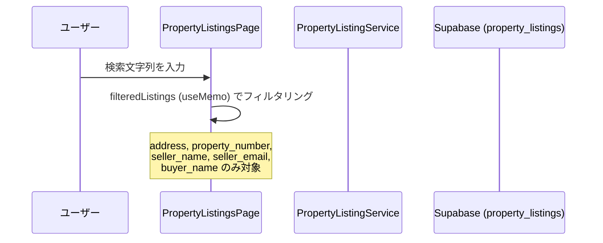
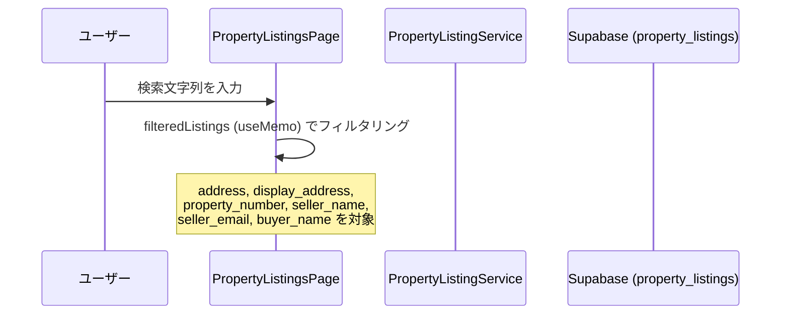
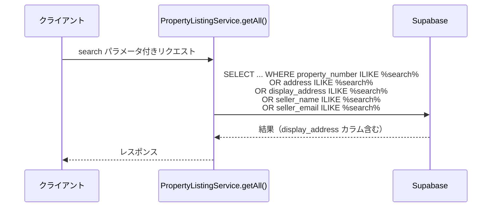

# 設計ドキュメント

## 概要

物件一覧ページ（PropertyListingsPage）の検索バーで、現在は「所在地」（`address`フィールド）のみが検索対象となっているが、「住居表示」（`display_address`フィールド）も検索対象に追加する。

変更箇所は以下の2点：

1. **フロントエンド**: `PropertyListingsPage.tsx` のフィルタリングロジックに `display_address` を追加
2. **バックエンド**: `PropertyListingService.ts` の `getAll()` メソッドのSELECT句と検索クエリに `display_address` を追加

## アーキテクチャ

### 現在の検索フロー



### 変更後の検索フロー



### バックエンドAPIの検索フロー（変更後）



## コンポーネントとインターフェース

### フロントエンド: PropertyListingsPage.tsx

**変更対象**: `filteredListings` の `useMemo` 内の検索フィルタリングロジック

**変更前**:
```typescript
listings = listings.filter(l =>
  (l.property_number ? normalizeText(l.property_number) : '').includes(query) ||
  (l.address ? normalizeText(l.address) : '').includes(query) ||
  (l.seller_name ? normalizeText(l.seller_name) : '').includes(query) ||
  (l.seller_email ? normalizeText(l.seller_email) : '').includes(query) ||
  (l.buyer_name ? normalizeText(l.buyer_name) : '').includes(query)
);
```

**変更後**:
```typescript
listings = listings.filter(l =>
  (l.property_number ? normalizeText(l.property_number) : '').includes(query) ||
  (l.address ? normalizeText(l.address) : '').includes(query) ||
  (l.display_address ? normalizeText(l.display_address) : '').includes(query) ||
  (l.seller_name ? normalizeText(l.seller_name) : '').includes(query) ||
  (l.seller_email ? normalizeText(l.seller_email) : '').includes(query) ||
  (l.buyer_name ? normalizeText(l.buyer_name) : '').includes(query)
);
```

**変更点**: `display_address` フィールドへの `normalizeText` 適用と null/undefined ガードを追加。

### バックエンド: PropertyListingService.ts

**変更対象1**: `getAll()` メソッドの SELECT 句

`display_address` カラムを SELECT 句に追加する。

**変更対象2**: `getAll()` メソッドの検索クエリ

**変更前**:
```typescript
query = query.or(`property_number.ilike.%${search}%,address.ilike.%${search}%,seller_name.ilike.%${search}%,seller_email.ilike.%${search}%`);
```

**変更後**:
```typescript
query = query.or(`property_number.ilike.%${search}%,address.ilike.%${search}%,display_address.ilike.%${search}%,seller_name.ilike.%${search}%,seller_email.ilike.%${search}%`);
```

## データモデル

### property_listings テーブル（既存）

| カラム名 | 型 | 説明 |
|---------|-----|------|
| `address` | text | 所在地（既存の検索対象） |
| `display_address` | text \| null | 住居表示（今回追加する検索対象） |

`display_address` カラムはすでにデータベースに存在しており、`PropertyListing` インターフェースにも定義済み（`display_address?: string`）。スキーマ変更は不要。

### PropertyListing インターフェース（フロントエンド）

```typescript
interface PropertyListing {
  id: string;
  property_number?: string;
  address?: string;
  display_address?: string;  // 既存フィールド（今回検索対象に追加）
  // ...その他フィールド
}
```

## 正確性プロパティ

*プロパティとは、システムの全ての有効な実行において成立すべき特性や振る舞いのことです。プロパティは人間が読める仕様と機械で検証可能な正確性保証の橋渡しをします。*

### プロパティ1: display_address による検索一致

*任意の* 物件リストと検索文字列に対して、`display_address` フィールドに検索文字列を含む物件は、フィルタリング結果に必ず含まれる

**Validates: Requirements 1.1, 1.2**

### プロパティ2: address と display_address の OR 条件

*任意の* 検索文字列に対して、`address` のみ一致する物件・`display_address` のみ一致する物件・両方一致する物件はすべてフィルタリング結果に含まれ、どちらにも一致しない物件は含まれない

**Validates: Requirements 1.2, 3.1**

### プロパティ3: display_address への normalizeText 適用

*任意の* 全角文字を含む検索文字列に対して、対応する半角文字を `display_address` に持つ物件はフィルタリング結果に含まれる（全角・半角の違いを吸収する）

**Validates: Requirements 1.3**

## エラーハンドリング

### display_address が null/undefined の場合

フロントエンドのフィルタリングロジックでは、`display_address` が `null` または `undefined` の場合に空文字として扱う。

```typescript
(l.display_address ? normalizeText(l.display_address) : '').includes(query)
```

この実装により：
- `display_address` が `null` → 空文字 `''` として扱われ、検索文字列が空でない限り一致しない
- `display_address` が `undefined` → 同上
- エラーは発生しない（要件 1.4 を満たす）

### バックエンドの ilike クエリ

Supabase の `ilike` フィルタは、対象カラムが `null` の場合は自動的に一致しないとして扱われるため、追加のエラーハンドリングは不要。

## テスト戦略

### ユニットテスト（フロントエンド）

フロントエンドのフィルタリングロジックは純粋関数的な処理であるため、プロパティベーステストが適用可能。

**使用ライブラリ**: `fast-check`（TypeScript/JavaScript 向けプロパティベーステストライブラリ）

**テスト設定**: 各プロパティテストは最低100回のイテレーションを実行する。

#### プロパティテスト1: display_address による検索一致

```typescript
// Feature: property-list-address-search-enhancement, Property 1: display_address による検索一致
it('display_addressに検索文字列を含む物件はフィルタリング結果に含まれる', () => {
  fc.assert(
    fc.property(
      fc.string({ minLength: 1 }),  // 検索文字列
      fc.string({ minLength: 1 }),  // display_address の値
      (searchQuery, displayAddress) => {
        const listing = createMockListing({ display_address: displayAddress });
        const result = filterListings([listing], searchQuery);
        // display_address に検索文字列が含まれる場合は結果に含まれる
        const normalized = normalizeText(displayAddress);
        const normalizedQuery = normalizeText(searchQuery);
        if (normalized.includes(normalizedQuery)) {
          expect(result).toContain(listing);
        }
      }
    ),
    { numRuns: 100 }
  );
});
```

#### プロパティテスト2: address と display_address の OR 条件

```typescript
// Feature: property-list-address-search-enhancement, Property 2: address と display_address の OR 条件
it('addressまたはdisplay_addressのいずれかに一致する物件のみが結果に含まれる', () => {
  fc.assert(
    fc.property(
      fc.string({ minLength: 1 }),
      fc.record({
        address: fc.option(fc.string()),
        display_address: fc.option(fc.string()),
      }),
      (searchQuery, fields) => {
        const listing = createMockListing(fields);
        const result = filterListings([listing], searchQuery);
        const query = normalizeText(searchQuery);
        const addressMatch = fields.address ? normalizeText(fields.address).includes(query) : false;
        const displayMatch = fields.display_address ? normalizeText(fields.display_address).includes(query) : false;
        if (addressMatch || displayMatch) {
          expect(result).toContain(listing);
        } else {
          // 他のフィールド（property_number等）も一致しない場合は含まれない
        }
      }
    ),
    { numRuns: 100 }
  );
});
```

#### プロパティテスト3: normalizeText の適用（全角・半角）

```typescript
// Feature: property-list-address-search-enhancement, Property 3: display_address への normalizeText 適用
it('全角文字の検索文字列が半角のdisplay_addressに一致する', () => {
  fc.assert(
    fc.property(
      fc.string({ minLength: 1 }).map(s => s.normalize('NFKC')),
      (halfWidthAddress) => {
        // 半角文字を全角に変換した検索文字列でも一致する
        const listing = createMockListing({ display_address: halfWidthAddress });
        const fullWidthQuery = toFullWidth(halfWidthAddress);
        const result = filterListings([listing], fullWidthQuery);
        expect(result).toContain(listing);
      }
    ),
    { numRuns: 100 }
  );
});
```

### ユニットテスト（エッジケース）

```typescript
describe('display_address が null/undefined の場合', () => {
  it('display_address が null の物件でエラーが発生しない', () => {
    const listing = createMockListing({ display_address: null });
    expect(() => filterListings([listing], '検索文字列')).not.toThrow();
  });

  it('display_address が undefined の物件でエラーが発生しない', () => {
    const listing = createMockListing({ display_address: undefined });
    expect(() => filterListings([listing], '検索文字列')).not.toThrow();
  });
});
```

### 統合テスト（バックエンド）

バックエンドの検索クエリは Supabase への実際のクエリを伴うため、統合テストで検証する。

```typescript
describe('PropertyListingService.getAll() - display_address 検索', () => {
  it('display_address に一致する物件が返される', async () => {
    // テストデータ: display_address に「大阪市北区」を含む物件
    const result = await service.getAll({ search: '大阪市北区' });
    expect(result.data.some(l => l.display_address?.includes('大阪市北区'))).toBe(true);
  });

  it('レスポンスに display_address フィールドが含まれる', async () => {
    const result = await service.getAll({ limit: 1 });
    expect(result.data[0]).toHaveProperty('display_address');
  });
});
```
