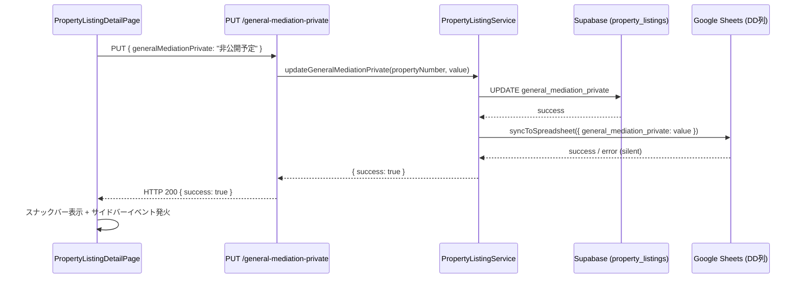
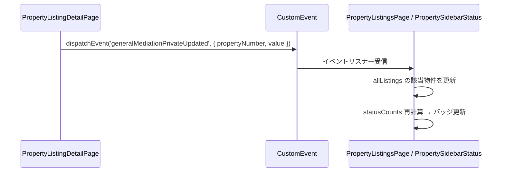

# 設計書：物件リスト詳細画面「一般媒介非公開（仮）」フィールド追加

## 概要

`PropertyListingDetailPage` に「一般媒介非公開（仮）」フィールドを追加する。`atbb_status` に「一般」が含まれる物件のみ表示し、「非公開予定」と「不要」の2択ボタンUIで操作できる。バックエンドには専用の `PUT` エンドポイントを追加し、更新時にスプレッドシートのDD列へ自動同期する。また、サイドバーに「非公開予定（確認後）」カテゴリーを追加し、`general_mediation_private` が「非公開予定」の物件をリアルタイムで表示する。

`general_mediation_private` フィールドはDBとスプレッドシートのカラムマッピングに既に存在しているため、本機能はUI追加と専用APIエンドポイント追加が主な実装範囲となる。

## アーキテクチャ



### リアルタイムサイドバー更新フロー



## コンポーネントと インターフェース

### フロントエンド

#### 1. `PropertyListingDetailPage.tsx` への変更

**追加する状態変数:**
```typescript
const [generalMediationPrivate, setGeneralMediationPrivate] = useState<string | null>(null);
const [generalMediationPrivateUpdating, setGeneralMediationPrivateUpdating] = useState(false);
```

**表示条件判定ヘルパー関数:**
```typescript
// atbb_statusに「一般」が含まれる場合のみ表示
const shouldShowGeneralMediationPrivate = (atbbStatus: string | null | undefined): boolean => {
  return typeof atbbStatus === 'string' && atbbStatus.includes('一般');
};
```

**更新ハンドラー:**
```typescript
const handleUpdateGeneralMediationPrivate = async (value: '非公開予定' | '不要') => {
  setGeneralMediationPrivateUpdating(true);
  try {
    await api.put(`/api/property-listings/${propertyNumber}/general-mediation-private`, {
      generalMediationPrivate: value,
    });
    setGeneralMediationPrivate(value);
    setSnackbar({ open: true, message: `一般媒介非公開（仮）を「${value}」に更新しました`, severity: 'success' });
    // サイドバーへのリアルタイム通知
    window.dispatchEvent(new CustomEvent('generalMediationPrivateUpdated', {
      detail: { propertyNumber, value },
    }));
  } catch (error: any) {
    setSnackbar({ open: true, message: error.response?.data?.error || '一般媒介非公開（仮）の更新に失敗しました', severity: 'error' });
  } finally {
    setGeneralMediationPrivateUpdating(false);
  }
};
```

**JSX（ATBB状況フィールドの右隣に配置）:**
```tsx
{shouldShowGeneralMediationPrivate(data.atbb_status) && (
  <Grid item xs={6} sm={4} md={true} sx={{ minWidth: 140, flex: '1 1 0' }}>
    <Typography variant="caption" color="text.secondary" fontWeight="bold" sx={{ fontSize: '0.75rem', lineHeight: 1.2 }}>
      一般媒介非公開（仮）
    </Typography>
    <Box sx={{ mt: 0.5 }}>
      <ButtonGroup size="small" disabled={generalMediationPrivateUpdating}>
        <Button
          variant={generalMediationPrivate === '非公開予定' ? 'contained' : 'outlined'}
          color={generalMediationPrivate === '非公開予定' ? 'error' : 'inherit'}
          onClick={() => handleUpdateGeneralMediationPrivate('非公開予定')}
          aria-label="一般媒介非公開（仮）を非公開予定に設定"
          aria-pressed={generalMediationPrivate === '非公開予定'}
        >
          非公開予定
        </Button>
        <Button
          variant="outlined"
          onClick={() => handleUpdateGeneralMediationPrivate('不要')}
          aria-label="一般媒介非公開（仮）を不要に設定"
          aria-pressed={generalMediationPrivate === '不要'}
        >
          不要
        </Button>
      </ButtonGroup>
    </Box>
  </Grid>
)}
```

#### 2. `PropertySidebarStatus.tsx` への変更

**`statusCounts` の `useMemo` に追加:**
```typescript
// 「非公開予定（確認後）」カテゴリー: general_mediation_private === '非公開予定' の物件をカウント
const generalMediationPrivateCount = listings.filter(
  l => l.general_mediation_private === '非公開予定'
).length;
if (generalMediationPrivateCount > 0) {
  counts['非公開予定（確認後）'] = generalMediationPrivateCount;
}
```

**`STATUS_PRIORITY` は既に `'非公開予定（確認後）': 11` が定義済みのため変更不要。**

#### 3. `PropertyListingsPage.tsx` への変更

**サイドバーフィルタリングに追加:**
```typescript
} else if (sidebarStatus === '非公開予定（確認後）') {
  // 「非公開予定（確認後）」: general_mediation_private === '非公開予定' の物件をフィルタリング
  listings = listings.filter(l => l.general_mediation_private === '非公開予定');
}
```

**リアルタイム更新のイベントリスナー:**
```typescript
useEffect(() => {
  const handleGeneralMediationPrivateUpdated = (event: CustomEvent) => {
    const { propertyNumber, value } = event.detail;
    setAllListings(prev => prev.map(l =>
      l.property_number === propertyNumber
        ? { ...l, general_mediation_private: value }
        : l
    ));
  };
  window.addEventListener('generalMediationPrivateUpdated', handleGeneralMediationPrivateUpdated as EventListener);
  return () => {
    window.removeEventListener('generalMediationPrivateUpdated', handleGeneralMediationPrivateUpdated as EventListener);
  };
}, []);
```

### バックエンド

#### 1. `backend/src/routes/propertyListings.ts` への追加

```typescript
// 一般媒介非公開（仮）フィールドを更新
// PUT /api/property-listings/:propertyNumber/general-mediation-private
router.put('/:propertyNumber/general-mediation-private', async (req: Request, res: Response): Promise<void> => {
  try {
    const { propertyNumber } = req.params;
    const { generalMediationPrivate } = req.body;

    // バリデーション
    if (!generalMediationPrivate || !['非公開予定', '不要'].includes(generalMediationPrivate)) {
      res.status(400).json({
        error: '一般媒介非公開（仮）フィールドは「非公開予定」または「不要」のみ有効です',
        code: 'INVALID_GENERAL_MEDIATION_PRIVATE_VALUE',
      });
      return;
    }

    await propertyListingService.updateGeneralMediationPrivate(propertyNumber, generalMediationPrivate);

    res.json({ success: true });
  } catch (error: any) {
    console.error('[general-mediation-private] Error:', error);
    res.status(500).json({
      error: error.message || '一般媒介非公開（仮）の更新に失敗しました',
      code: 'INTERNAL_ERROR',
    });
  }
});
```

#### 2. `backend/src/services/PropertyListingService.ts` への追加

```typescript
/**
 * 一般媒介非公開（仮）フィールドを更新
 */
async updateGeneralMediationPrivate(
  propertyNumber: string,
  value: '非公開予定' | '不要'
): Promise<void> {
  if (!['非公開予定', '不要'].includes(value)) {
    throw new Error('一般媒介非公開（仮）フィールドは「非公開予定」または「不要」のみ有効です');
  }

  console.log(`[PropertyListingService] Updating general_mediation_private for ${propertyNumber} to ${value}`);

  // DBを更新
  const { error } = await this.supabase
    .from('property_listings')
    .update({
      general_mediation_private: value,
      updated_at: new Date().toISOString(),
    })
    .eq('property_number', propertyNumber);

  if (error) {
    console.error(`[PropertyListingService] Failed to update general_mediation_private for ${propertyNumber}:`, error);
    throw new Error('一般媒介非公開（仮）の更新に失敗しました');
  }

  console.log(`[PropertyListingService] Successfully updated general_mediation_private for ${propertyNumber}`);

  // スプレッドシートへ同期（失敗はサイレント処理）
  try {
    await this.syncToSpreadsheet(propertyNumber, { general_mediation_private: value });
    console.log(`[PropertyListingService] Successfully synced general_mediation_private to spreadsheet for ${propertyNumber}`);
  } catch (syncError: any) {
    console.error(`[PropertyListingService] Failed to sync general_mediation_private to spreadsheet for ${propertyNumber}:`, syncError);
    // 同期エラーでもDB更新は成功しているため、エラーをスローしない
  }
}
```

## データモデル

### 既存DBカラム（変更なし）

`property_listings` テーブルの `general_mediation_private` カラムは既に存在する。

| カラム名 | 型 | 値 |
|---|---|---|
| `general_mediation_private` | `text` | `'非公開予定'` / `'不要'` / `null` / `''` |

### 既存スプレッドシートマッピング（変更なし）

`PropertyListingService.ts` の `syncToSpreadsheet` メソッドには既に以下のマッピングが存在する：

```typescript
'一般媒介非公開（仮）': current.general_mediation_private ?? null,
```

### フロントエンドの `PropertyListing` インターフェース

`PropertyListingDetailPage.tsx` の `PropertyListing` インターフェースに `general_mediation_private` フィールドを追加する：

```typescript
interface PropertyListing {
  // ... 既存フィールド
  general_mediation_private?: string;
}
```

`PropertySidebarStatus.tsx` の `PropertyListing` インターフェースにも追加する：

```typescript
interface PropertyListing {
  id: string;
  property_number?: string;
  sidebar_status?: string;
  general_mediation_private?: string; // 追加
  [key: string]: any;
}
```

## 正確性プロパティ

*プロパティとは、システムの全ての有効な実行において真であるべき特性や振る舞いのことです。プロパティは人間が読める仕様と機械で検証可能な正確性保証の橋渡しをします。*

### プロパティ1: 表示条件の普遍性

*任意の* `atbb_status` 文字列に対して、`shouldShowGeneralMediationPrivate` 関数は「一般」を含む場合のみ `true` を返し、含まない場合（null・空文字・「専任」系・「他社物件」等）は `false` を返す。

**Validates: Requirements 1.1, 1.2, 1.3**

### プロパティ2: ボタンバリアントの正確性

*任意の* `general_mediation_private` 値（「非公開予定」「不要」「」null）に対して、「非公開予定」ボタンのバリアントは値が「非公開予定」の場合のみ `contained` かつ `color="error"` となり、それ以外の場合は `outlined` となる。

**Validates: Requirements 2.2, 2.3**

### プロパティ3: 無効値に対するAPIバリデーション

*任意の* 「非公開予定」でも「不要」でもない文字列（空文字・null・その他の文字列）を `generalMediationPrivate` として送信した場合、APIは HTTP 400 を返す。

**Validates: Requirements 3.3**

### プロパティ4: サイドバーカウントの正確性

*任意の* 物件リストに対して、`PropertySidebarStatus` が表示する「非公開予定（確認後）」カテゴリーのバッジ件数は、リスト内の `general_mediation_private === '非公開予定'` の物件数と常に一致する。

**Validates: Requirements 6.1, 6.5**

### プロパティ5: サイドバーフィルタリングの完全性

*任意の* 物件リストに対して、「非公開予定（確認後）」カテゴリーでフィルタリングした結果は、全ての物件の `general_mediation_private` が「非公開予定」であり、かつ元のリストで `general_mediation_private === '非公開予定'` の物件が全て含まれる（漏れなし・余分なし）。

**Validates: Requirements 6.2, 6.3, 6.4**

## エラーハンドリング

| シナリオ | 処理 |
|---|---|
| 無効な `generalMediationPrivate` 値 | HTTP 400 + エラーコード `INVALID_GENERAL_MEDIATION_PRIVATE_VALUE` |
| DB更新失敗 | HTTP 500 + エラーメッセージ |
| スプレッドシート同期失敗 | エラーログのみ、DB更新の成功レスポンスには影響しない |
| APIリクエスト処理中の二重送信 | ボタンを `disabled` にして防止 |
| フロントエンドAPIエラー | エラースナックバーを表示 |

## テスト戦略

### ユニットテスト（例ベース）

**フロントエンド:**
- `shouldShowGeneralMediationPrivate` 関数の境界値テスト（「一般・公開中」「一般・公開前」「専任・公開中」「」null）
- ボタンクリック時に正しいAPIエンドポイントへリクエストが送信されること
- 処理中（updating=true）にボタンが `disabled` になること
- 成功時にスナックバーが表示されること
- 失敗時にエラースナックバーが表示されること

**バックエンド:**
- 有効な値（「非公開予定」「不要」）でDB更新が成功すること
- スプレッドシート同期失敗時でも HTTP 200 が返ること
- DB更新失敗時に HTTP 500 が返ること

### プロパティベーステスト（fast-check を使用）

プロパティベーステストには [fast-check](https://github.com/dubzzz/fast-check) を使用する。各テストは最低100回のイテレーションを実行する。

**プロパティ1: 表示条件の普遍性**
```typescript
// Feature: property-list-general-media-non-public-field, Property 1: 表示条件の普遍性
fc.assert(fc.property(
  fc.oneof(fc.string(), fc.constant(null), fc.constant(undefined)),
  (atbbStatus) => {
    const result = shouldShowGeneralMediationPrivate(atbbStatus);
    const expected = typeof atbbStatus === 'string' && atbbStatus.includes('一般');
    return result === expected;
  }
), { numRuns: 100 });
```

**プロパティ2: ボタンバリアントの正確性**
```typescript
// Feature: property-list-general-media-non-public-field, Property 2: ボタンバリアントの正確性
fc.assert(fc.property(
  fc.oneof(
    fc.constant('非公開予定'),
    fc.constant('不要'),
    fc.constant(''),
    fc.constant(null),
    fc.string()
  ),
  (value) => {
    const variant = getButtonVariant(value);
    if (value === '非公開予定') {
      return variant.hikoukai === 'contained' && variant.hikoukai_color === 'error' && variant.fuyo === 'outlined';
    } else {
      return variant.hikoukai === 'outlined' && variant.fuyo === 'outlined';
    }
  }
), { numRuns: 100 });
```

**プロパティ3: 無効値に対するAPIバリデーション**
```typescript
// Feature: property-list-general-media-non-public-field, Property 3: 無効値に対するAPIバリデーション
fc.assert(fc.property(
  fc.string().filter(s => s !== '非公開予定' && s !== '不要'),
  async (invalidValue) => {
    const response = await request(app)
      .put('/api/property-listings/TEST001/general-mediation-private')
      .send({ generalMediationPrivate: invalidValue });
    return response.status === 400;
  }
), { numRuns: 100 });
```

**プロパティ4: サイドバーカウントの正確性**
```typescript
// Feature: property-list-general-media-non-public-field, Property 4: サイドバーカウントの正確性
fc.assert(fc.property(
  fc.array(fc.record({
    id: fc.string(),
    property_number: fc.string(),
    general_mediation_private: fc.oneof(
      fc.constant('非公開予定'),
      fc.constant('不要'),
      fc.constant(''),
      fc.constant(null)
    ),
    sidebar_status: fc.string(),
  })),
  (listings) => {
    const expectedCount = listings.filter(l => l.general_mediation_private === '非公開予定').length;
    const counts = computeStatusCounts(listings);
    return (counts['非公開予定（確認後）'] || 0) === expectedCount;
  }
), { numRuns: 100 });
```

**プロパティ5: サイドバーフィルタリングの完全性**
```typescript
// Feature: property-list-general-media-non-public-field, Property 5: サイドバーフィルタリングの完全性
fc.assert(fc.property(
  fc.array(fc.record({
    id: fc.string(),
    property_number: fc.string(),
    general_mediation_private: fc.oneof(
      fc.constant('非公開予定'),
      fc.constant('不要'),
      fc.constant(''),
      fc.constant(null)
    ),
  })),
  (listings) => {
    const filtered = filterBySidebarStatus(listings, '非公開予定（確認後）');
    // 全ての結果が「非公開予定」であること
    const allCorrect = filtered.every(l => l.general_mediation_private === '非公開予定');
    // 元のリストの「非公開予定」物件が全て含まれること
    const originalCount = listings.filter(l => l.general_mediation_private === '非公開予定').length;
    return allCorrect && filtered.length === originalCount;
  }
), { numRuns: 100 });
```

### 統合テスト

- スプレッドシートクライアントをモックして、`general_mediation_private` 更新時にDD列への書き込みが呼ばれることを確認（1-2例）
- スプレッドシート同期失敗時でもAPIが HTTP 200 を返すことを確認（1例）
