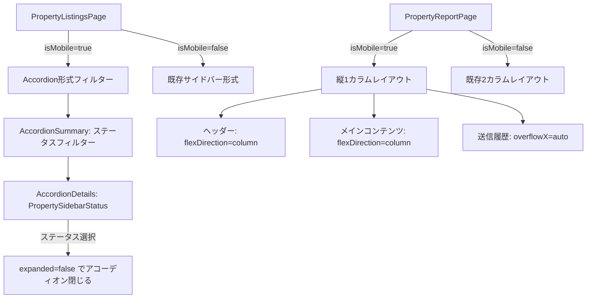

# 設計ドキュメント

## 概要

物件リストページ（PropertyListingsPage.tsx）および報告ページ（PropertyReportPage.tsx）のスマホ対応を改善する。
買主リスト（BuyersPage.tsx）で既に実装されているスマホ向けUIパターンを物件リスト系ページに適用し、スマホユーザーの操作性を統一する。

対象変更は以下の3点：
1. PropertyListingsPage のスマホ版ステータスフィルターを Accordion 形式に変更
2. スマホ版で「未報告」系ステータス選択中に物件カードをタップした際の報告ページ遷移の動作確認・保証
3. PropertyReportPage へのスマホ用レイアウト追加

変更はフロントエンドのみ（バックエンド変更なし）。

---

## アーキテクチャ

### 変更対象ファイル

| ファイル | 変更内容 |
|---------|---------|
| `frontend/frontend/src/pages/PropertyListingsPage.tsx` | スマホ版ステータスフィルターをAccordion形式に変更 |
| `frontend/frontend/src/pages/PropertyReportPage.tsx` | スマホ用レイアウト追加（isMobile分岐） |

### 参考実装

`frontend/frontend/src/pages/BuyersPage.tsx` のスマホ対応パターンを踏襲する。



---

## コンポーネントとインターフェース

### PropertyListingsPage の変更点

#### 削除するもの

- `mobileStatusOpen` state（`useState(false)`）
- ヘッダー内の「ステータス ▼」ボタン（`Button` コンポーネント）
- `mobileStatusOpen` による条件分岐レンダリング

#### 追加するもの

- `mobileAccordionExpanded` state（`useState(false)`）
- MUI インポートへの追加: `Accordion`, `AccordionSummary`, `AccordionDetails`
- MUI アイコンインポートへの追加: `ExpandMore as ExpandMoreIcon`

#### Accordion の実装パターン（BuyersPage.tsx 準拠）

```tsx
{/* モバイル：ステータスサイドバーをアコーディオンで表示 */}
{isMobile && (
  <Accordion
    expanded={mobileAccordionExpanded}
    onChange={(_, expanded) => setMobileAccordionExpanded(expanded)}
    sx={{ mb: 1 }}
  >
    <AccordionSummary
      expandIcon={<ExpandMoreIcon />}
      sx={
        sidebarStatus && sidebarStatus !== 'all'
          ? { bgcolor: `${SECTION_COLORS.property.main}15` }
          : {}
      }
    >
      <Typography variant="body1" fontWeight="bold">
        ステータスフィルター
        {sidebarStatus && sidebarStatus !== 'all' && (
          <Typography
            component="span"
            variant="caption"
            sx={{ ml: 1, color: SECTION_COLORS.property.main }}
          >
            ({sidebarStatus})
          </Typography>
        )}
      </Typography>
    </AccordionSummary>
    <AccordionDetails sx={{ p: 1 }}>
      <PropertySidebarStatus
        listings={allListings}
        selectedStatus={sidebarStatus}
        onStatusChange={(status) => {
          setSidebarStatus(status);
          setSearchQuery('');
          setLastFilter('sidebar');
          setPage(0);
          setMobileAccordionExpanded(false); // 選択後に閉じる
        }}
      />
    </AccordionDetails>
  </Accordion>
)}
```

#### デスクトップ版サイドバー（変更なし）

```tsx
{!isMobile && (
  <Box sx={{ display: 'flex', flexDirection: 'column', gap: 2 }}>
    <PropertySidebarStatus
      listings={allListings}
      selectedStatus={sidebarStatus}
      onStatusChange={(status) => {
        setSidebarStatus(status);
        setSearchQuery('');
        setLastFilter('sidebar');
        setPage(0);
      }}
    />
  </Box>
)}
```

#### handleRowClick（変更なし・確認のみ）

既存の `handleRowClick` は `sidebarStatus.startsWith('未報告')` で報告ページへの遷移を実装済み。
スマホのカードクリックも同じ `handleRowClick` を呼び出しているため、追加変更は不要。

```tsx
// 既存実装（変更なし）
const handleRowClick = (propertyNumber: string) => {
  if (sidebarStatus && sidebarStatus.startsWith('未報告')) {
    navigate(`/property-listings/${propertyNumber}/report`);
    return;
  }
  // ...通常の詳細ページ遷移
  navigate(`/property-listings/${propertyNumber}`);
};

// スマホカードのクリック（変更なし・確認済み）
<Card onClick={() => listing.property_number && handleRowClick(listing.property_number)}>
```

---

### PropertyReportPage の変更点

#### 追加するインポート

```tsx
import { useTheme, useMediaQuery } from '@mui/material';
// ※ useTheme と useMediaQuery は既存インポートの MUI から追加
```

#### isMobile の取得

```tsx
const theme = useTheme();
const isMobile = useMediaQuery(theme.breakpoints.down('sm'));
```

#### ヘッダーのレイアウト変更

```tsx
{/* 変更前 */}
<Box sx={{ display: 'flex', alignItems: 'center', justifyContent: 'space-between', gap: 2, mb: 3 }}>

{/* 変更後 */}
<Box sx={{
  display: 'flex',
  flexDirection: isMobile ? 'column' : 'row',
  alignItems: isMobile ? 'flex-start' : 'center',
  justifyContent: 'space-between',
  gap: 2,
  mb: 3,
}}>
```

#### 2カラムレイアウトの変更

```tsx
{/* 変更前 */}
<Box sx={{ display: 'flex', gap: 3, alignItems: 'flex-start' }}>

{/* 変更後 */}
<Box sx={{
  display: 'flex',
  flexDirection: isMobile ? 'column' : 'row',
  gap: 3,
  alignItems: 'flex-start',
}}>
```

#### 左カラムの変更

```tsx
{/* 変更前 */}
<Box sx={{ flex: '0 0 380px', minWidth: 0 }}>

{/* 変更後 */}
<Box sx={isMobile ? { width: '100%' } : { flex: '0 0 380px', minWidth: 0 }}>
```

#### 送信履歴テーブルの変更

```tsx
{/* 変更前 */}
<TableContainer sx={{ maxHeight: 220, overflow: 'auto' }}>

{/* 変更後 */}
<TableContainer sx={{ maxHeight: isMobile ? 'none' : 220, overflow: 'auto', overflowX: 'auto' }}>
```

---

## データモデル

### PropertyListingsPage の state 変更

| state | 変更前 | 変更後 |
|-------|--------|--------|
| `mobileStatusOpen` | `boolean`（削除） | 削除 |
| `mobileAccordionExpanded` | なし | `boolean`（追加） |

### PropertyReportPage の state 変更

追加 state なし。`isMobile` は `useMediaQuery` フックから取得するため state 不要。

---

## 正確性プロパティ

*プロパティとは、システムの全ての有効な実行において成立すべき特性や振る舞いのことです。プロパティは人間が読める仕様と機械で検証可能な正確性保証の橋渡しをします。*

### プロパティ1: ステータス選択後のアコーディオン自動クローズ

*任意の* ステータス値に対して、スマホ版の `PropertySidebarStatus` でそのステータスを選択したとき、アコーディオンの `expanded` 状態が `false` になる

**Validates: Requirements 1.4**

### プロパティ2: handleRowClick のナビゲーション先

*任意の* `sidebarStatus` 文字列と *任意の* 物件番号に対して、`handleRowClick` を呼び出したとき：
- `sidebarStatus` が `'未報告'` で始まる場合は `/property-listings/${propertyNumber}/report` に遷移する
- `sidebarStatus` が `'未報告'` で始まらない場合は `/property-listings/${propertyNumber}` に遷移する

**Validates: Requirements 2.2, 2.4**

---

## エラーハンドリング

### PropertyListingsPage

- アコーディオンの開閉は純粋な UI state 操作のため、エラーは発生しない
- `PropertySidebarStatus` の `onStatusChange` コールバックは既存の実装を踏襲するため、エラーハンドリングの変更なし

### PropertyReportPage

- `useMediaQuery` は MUI の標準フックであり、エラーは発生しない
- `isMobile` の値に基づくレイアウト切り替えは純粋な条件分岐のため、エラーハンドリングの変更なし
- スマホ時の送信履歴テーブルは `overflowX: 'auto'` で横スクロールを許容するため、コンテンツが切れることはない

---

## テスト戦略

### ユニットテスト

以下の具体的な例・エッジケースをユニットテストで検証する：

**PropertyListingsPage**
- スマホ表示時（`isMobile=true`）に `Accordion` コンポーネントが存在すること
- デスクトップ表示時（`isMobile=false`）に `Accordion` コンポーネントが存在しないこと
- `AccordionSummary` に「ステータスフィルター」テキストが含まれること
- ステータス未選択時と選択時で `AccordionSummary` のスタイルが異なること
- スマホ・デスクトップ両方のクリックハンドラーが同一の `handleRowClick` を参照していること

**PropertyReportPage**
- スマホ表示時にヘッダーの `flexDirection` が `'column'` であること
- デスクトップ表示時にヘッダーの `flexDirection` が `'row'` であること
- スマホ表示時にメインコンテナの `flexDirection` が `'column'` であること
- スマホ表示時に左カラムの `width` が `'100%'` であること
- `useTheme` と `useMediaQuery` が MUI からインポートされていること

### プロパティベーステスト

プロパティベーステストは [fast-check](https://github.com/dubzzz/fast-check) を使用する。
各テストは最低100回のランダム入力で検証する。

#### プロパティ1のテスト実装方針

```typescript
// Feature: property-list-mobile-improvement, Property 1: ステータス選択後のアコーディオン自動クローズ
it('任意のステータス選択後にアコーディオンが閉じる', () => {
  fc.assert(
    fc.property(
      fc.string(), // 任意のステータス文字列
      (status) => {
        // アコーディオンを開いた状態でステータスを選択
        // expanded が false になることを確認
      }
    ),
    { numRuns: 100 }
  );
});
```

#### プロパティ2のテスト実装方針

```typescript
// Feature: property-list-mobile-improvement, Property 2: handleRowClick のナビゲーション先
it('sidebarStatusに応じて正しいURLに遷移する', () => {
  fc.assert(
    fc.property(
      fc.oneof(
        fc.constant('未報告'),
        fc.constant('未報告（Y）'),
        fc.constant('未報告（I）'),
        fc.string().filter(s => !s.startsWith('未報告')),
      ),
      fc.string().filter(s => s.length > 0), // 任意の物件番号
      (status, propertyNumber) => {
        const expectedPath = status.startsWith('未報告')
          ? `/property-listings/${propertyNumber}/report`
          : `/property-listings/${propertyNumber}`;
        // handleRowClick を呼び出して navigate の引数を確認
      }
    ),
    { numRuns: 100 }
  );
});
```

### 手動テスト

以下はブラウザでの手動確認が必要な項目：

- スマホ実機（または DevTools のスマホエミュレーション）でアコーディオンの開閉アニメーションが正常に動作すること
- ステータス選択後にアコーディオンが閉じ、物件カードリストが見やすくなること
- 「未報告」系ステータス選択中に物件カードをタップして報告ページに遷移すること
- PropertyReportPage のスマホ表示で横スクロールが発生しないこと
- PropertyReportPage のスマホ表示で保存ボタンが見切れないこと
