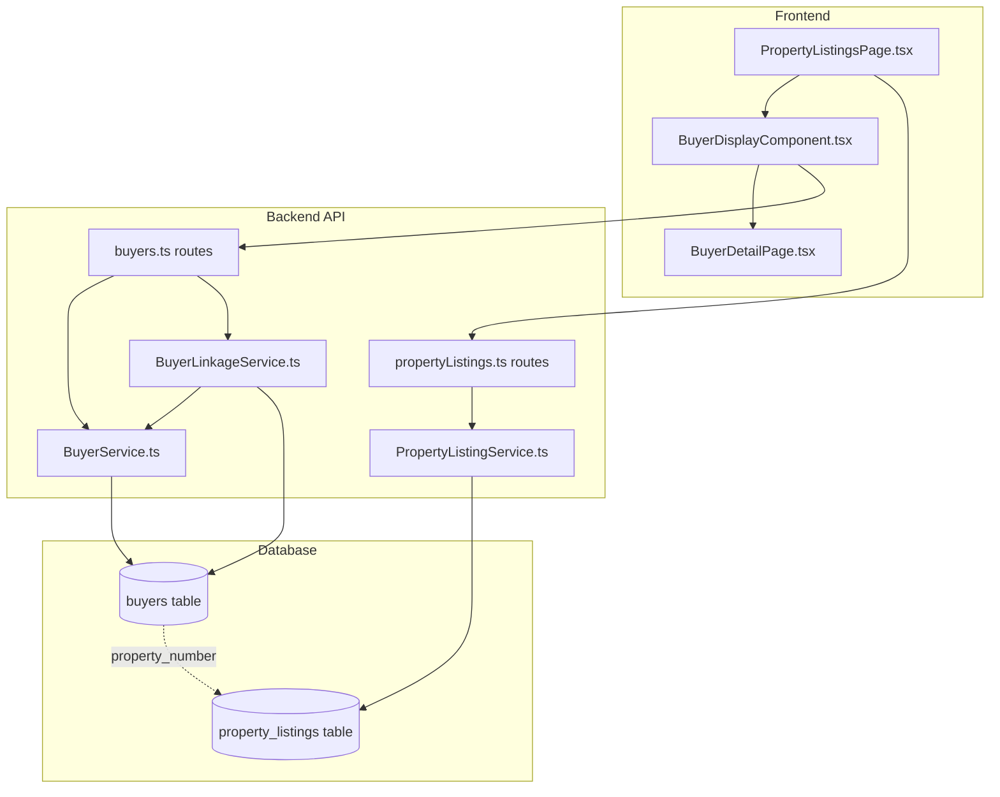

# Design Document: Property Listing Buyer Display

## Overview

物件リスト買主表示機能は、物件リストページ内で各物件に紐づく買主リストを表示する機能を提供する。既存のPropertyListingServiceとBuyerServiceを活用し、物件番号（property_number）をキーとして買主データを取得・表示する。UIは展開可能なインジケーター方式を採用し、パフォーマンスを考慮したバッチクエリとキャッシング戦略を実装する。

## Architecture



## Components and Interfaces

### 1. BuyerLinkageService (Backend)

物件番号に基づいて買主データを効率的に取得するサービス。

```typescript
interface BuyerLinkageService {
  // 複数物件の買主カウントを一括取得
  getBuyerCountsForProperties(propertyNumbers: string[]): Promise<Map<string, number>>;
  
  // 特定物件の買主リストを取得
  getBuyersForProperty(propertyNumber: string, options?: BuyerListOptions): Promise<BuyerSummary[]>;
  
  // 高確度買主を持つ物件番号リストを取得
  getPropertiesWithHighConfidenceBuyers(): Promise<string[]>;
}

interface BuyerListOptions {
  sortBy?: 'reception_date' | 'inquiry_confidence' | 'latest_viewing_date';
  sortOrder?: 'asc' | 'desc';
  limit?: number;
}

interface BuyerSummary {
  id: string;
  buyer_number: string;
  name: string;
  phone_number: string;
  email: string;
  latest_status: string;
  inquiry_confidence: string;
  reception_date: string;
  latest_viewing_date: string | null;
  next_call_date: string | null;
}
```

### 2. BuyerDisplayComponent (Frontend)

物件リスト内で買主情報を表示するUIコンポーネント。

```typescript
interface BuyerDisplayComponentProps {
  propertyNumber: string;
  buyerCount?: number;
  onExpand?: () => void;
}

interface BuyerDisplayComponentState {
  expanded: boolean;
  buyers: BuyerSummary[];
  loading: boolean;
}
```

### 3. API Routes

```typescript
// GET /api/property-listings/buyer-counts - 複数物件の買主カウント取得
// Query params: propertyNumbers (comma-separated)
// Response: { [propertyNumber: string]: number }

// GET /api/property-listings/:propertyNumber/buyers - 特定物件の買主リスト取得
// Query params: sortBy, sortOrder, limit
// Response: BuyerSummary[]

// GET /api/property-listings/high-confidence-buyers - 高確度買主を持つ物件リスト
// Response: string[] (property numbers)
```

### 4. Enhanced PropertyListingService

既存のPropertyListingServiceに買主関連メソッドを追加。

```typescript
interface PropertyListingService {
  // 既存メソッド...
  
  // 買主カウント付きで物件リストを取得
  getAllWithBuyerCounts(options: QueryOptions): Promise<{
    data: PropertyListingWithBuyerCount[];
    total: number;
  }>;
}

interface PropertyListingWithBuyerCount extends PropertyListing {
  buyer_count: number;
  has_high_confidence_buyers: boolean;
}
```

## Data Models

### Buyer-Property Linkage

買主と物件の紐づけは `buyers.property_number` カラムを使用。

```sql
-- 買主テーブル（既存）
CREATE TABLE buyers (
  id UUID PRIMARY KEY,
  buyer_number VARCHAR(50) UNIQUE NOT NULL,
  property_number VARCHAR(50),  -- 物件番号（カンマ区切りで複数可）
  name TEXT,
  phone_number TEXT,
  email TEXT,
  latest_status TEXT,
  inquiry_confidence VARCHAR(50),
  reception_date DATE,
  latest_viewing_date DATE,
  next_call_date DATE,
  -- その他181カラム...
);

-- 物件リストテーブル（既存）
CREATE TABLE property_listings (
  id UUID PRIMARY KEY,
  property_number VARCHAR(50) UNIQUE,
  -- その他126カラム...
);

-- 買主カウント取得用のインデックス（既存）
CREATE INDEX idx_buyers_property_number ON buyers(property_number);
```

### Query Patterns

```sql
-- 1. 特定物件の買主カウント
SELECT COUNT(*) 
FROM buyers 
WHERE property_number LIKE '%AA12345%';

-- 2. 複数物件の買主カウント（バッチクエリ）
SELECT 
  TRIM(UNNEST(STRING_TO_ARRAY(property_number, ','))) as prop_num,
  COUNT(*) as buyer_count
FROM buyers
WHERE property_number IS NOT NULL
GROUP BY prop_num
HAVING TRIM(UNNEST(STRING_TO_ARRAY(property_number, ','))) IN ('AA12345', 'AA12346', ...);

-- 3. 特定物件の買主リスト
SELECT 
  id, buyer_number, name, phone_number, email,
  latest_status, inquiry_confidence, reception_date,
  latest_viewing_date, next_call_date
FROM buyers
WHERE property_number LIKE '%AA12345%'
ORDER BY reception_date DESC;

-- 4. 高確度買主を持つ物件
SELECT DISTINCT 
  TRIM(UNNEST(STRING_TO_ARRAY(property_number, ','))) as prop_num
FROM buyers
WHERE inquiry_confidence IN ('A', 'S', 'A+', 'S+')
  AND property_number IS NOT NULL;
```

## Correctness Properties

*A property is a characteristic or behavior that should hold true across all valid executions of a system-essentially, a formal statement about what the system should do. Properties serve as the bridge between human-readable specifications and machine-verifiable correctness guarantees.*

### Property 1: Buyer Count Accuracy
*For any* property_number, the buyer count returned SHALL equal the number of buyer records where property_number contains that value.
**Validates: Requirements 1.1, 1.2**

### Property 2: Buyer List Completeness
*For any* property_number, the buyer list returned SHALL include all buyers where property_number contains that value.
**Validates: Requirements 2.1, 2.2**

### Property 3: Buyer List Sorting
*For any* buyer list sorted by reception_date descending, each buyer's reception_date SHALL be >= the next buyer's reception_date.
**Validates: Requirements 2.3**

### Property 4: Navigation Consistency
*For any* buyer clicked in the expanded list, the navigation SHALL direct to the buyer detail page with the correct buyer_id.
**Validates: Requirements 3.1, 3.2**

### Property 5: Confidence Indicator Correctness
*For any* buyer with inquiry_confidence in ['A', 'S', 'A+', 'S+'], the visual indicator SHALL be highlighted.
**Validates: Requirements 4.1, 4.2**

### Property 6: Batch Query Efficiency
*For any* set of N property numbers, getBuyerCountsForProperties SHALL execute at most 1 database query.
**Validates: Requirements 5.1**

### Property 7: Cache Consistency
*For any* cached buyer data, if the cache age is < 5 minutes, the cached data SHALL be returned without a database query.
**Validates: Requirements 5.3**

### Property 8: Filter Correctness - Has Buyers
*For any* property in the filtered list when "has buyers" filter is applied, the buyer count SHALL be > 0.
**Validates: Requirements 6.1**

### Property 9: Filter Correctness - High Confidence
*For any* property in the filtered list when "high confidence buyers" filter is applied, at least one linked buyer SHALL have inquiry_confidence in ['A', 'S', 'A+', 'S+'].
**Validates: Requirements 6.2**

### Property 10: Contact Link Format
*For any* phone_number displayed, the link href SHALL start with "tel:" followed by the phone number.
**Validates: Requirements 7.2**

### Property 11: Email Link Format
*For any* email displayed, the link href SHALL start with "mailto:" followed by the email address.
**Validates: Requirements 7.3**

### Property 12: Timeline Sorting
*For any* buyer list, buyers SHALL be sorted by reception_date in descending order (most recent first).
**Validates: Requirements 8.1, 8.3**

## Error Handling

### API Errors
- **Property Not Found**: 存在しない物件番号へのアクセス時、空の買主リストを返却
- **Invalid Property Number**: 不正な物件番号形式時、400エラーを返却
- **Database Connection Error**: データベース接続エラー時、503エラーとリトライ可能メッセージを返却
- **Timeout Error**: クエリタイムアウト時、504エラーを返却

### Frontend Errors
- **Load Failure**: 買主データ取得失敗時、エラーメッセージを表示し再試行ボタンを提供
- **Empty State**: 買主が存在しない場合、「この物件への問い合わせはまだありません」と表示
- **Network Error**: ネットワークエラー時、オフライン表示とリトライボタンを提供

## Performance Optimization

### Caching Strategy

```typescript
// Redis cache key format
const CACHE_KEY_BUYER_COUNT = 'buyer_count:{propertyNumber}';
const CACHE_KEY_BUYER_LIST = 'buyer_list:{propertyNumber}';
const CACHE_TTL = 300; // 5 minutes

// Cache implementation
class BuyerLinkageCache {
  async getBuyerCount(propertyNumber: string): Promise<number | null> {
    const cached = await redis.get(CACHE_KEY_BUYER_COUNT.replace('{propertyNumber}', propertyNumber));
    return cached ? parseInt(cached) : null;
  }
  
  async setBuyerCount(propertyNumber: string, count: number): Promise<void> {
    await redis.setex(
      CACHE_KEY_BUYER_COUNT.replace('{propertyNumber}', propertyNumber),
      CACHE_TTL,
      count.toString()
    );
  }
  
  async getBuyerList(propertyNumber: string): Promise<BuyerSummary[] | null> {
    const cached = await redis.get(CACHE_KEY_BUYER_LIST.replace('{propertyNumber}', propertyNumber));
    return cached ? JSON.parse(cached) : null;
  }
  
  async setBuyerList(propertyNumber: string, buyers: BuyerSummary[]): Promise<void> {
    await redis.setex(
      CACHE_KEY_BUYER_LIST.replace('{propertyNumber}', propertyNumber),
      CACHE_TTL,
      JSON.stringify(buyers)
    );
  }
  
  async invalidate(propertyNumber: string): Promise<void> {
    await redis.del(
      CACHE_KEY_BUYER_COUNT.replace('{propertyNumber}', propertyNumber),
      CACHE_KEY_BUYER_LIST.replace('{propertyNumber}', propertyNumber)
    );
  }
}
```

### Batch Query Optimization

```typescript
// 複数物件の買主カウントを一括取得
async getBuyerCountsForProperties(propertyNumbers: string[]): Promise<Map<string, number>> {
  // キャッシュチェック
  const counts = new Map<string, number>();
  const uncachedNumbers: string[] = [];
  
  for (const propNum of propertyNumbers) {
    const cached = await cache.getBuyerCount(propNum);
    if (cached !== null) {
      counts.set(propNum, cached);
    } else {
      uncachedNumbers.push(propNum);
    }
  }
  
  // 未キャッシュのものをバッチクエリ
  if (uncachedNumbers.length > 0) {
    const result = await db.query(`
      SELECT 
        TRIM(UNNEST(STRING_TO_ARRAY(property_number, ','))) as prop_num,
        COUNT(*) as buyer_count
      FROM buyers
      WHERE property_number IS NOT NULL
        AND property_number ~ ANY($1)
      GROUP BY prop_num
    `, [uncachedNumbers.map(n => `(^|,)\\s*${n}\\s*(,|$)`)]);
    
    for (const row of result.rows) {
      counts.set(row.prop_num, parseInt(row.buyer_count));
      await cache.setBuyerCount(row.prop_num, parseInt(row.buyer_count));
    }
    
    // カウント0の物件もキャッシュ
    for (const propNum of uncachedNumbers) {
      if (!counts.has(propNum)) {
        counts.set(propNum, 0);
        await cache.setBuyerCount(propNum, 0);
      }
    }
  }
  
  return counts;
}
```

### Pagination Strategy

物件リストのページネーション時、現在表示中の物件のみ買主カウントを取得。

```typescript
// PropertyListingsPage.tsx
useEffect(() => {
  const fetchBuyerCounts = async () => {
    const propertyNumbers = paginatedListings
      .map(l => l.property_number)
      .filter(Boolean) as string[];
    
    if (propertyNumbers.length > 0) {
      const counts = await api.get('/api/property-listings/buyer-counts', {
        params: { propertyNumbers: propertyNumbers.join(',') }
      });
      setBuyerCounts(counts.data);
    }
  };
  
  fetchBuyerCounts();
}, [paginatedListings]);
```

## UI/UX Design

### Buyer Indicator Component

```typescript
// BuyerIndicator.tsx
interface BuyerIndicatorProps {
  propertyNumber: string;
  buyerCount: number;
  hasHighConfidence: boolean;
}

const BuyerIndicator: React.FC<BuyerIndicatorProps> = ({
  propertyNumber,
  buyerCount,
  hasHighConfidence
}) => {
  const [expanded, setExpanded] = useState(false);
  const [buyers, setBuyers] = useState<BuyerSummary[]>([]);
  const [loading, setLoading] = useState(false);
  
  const handleExpand = async (e: React.MouseEvent) => {
    e.stopPropagation();
    
    if (!expanded) {
      setLoading(true);
      try {
        const response = await api.get(`/api/property-listings/${propertyNumber}/buyers`);
        setBuyers(response.data);
      } catch (error) {
        console.error('Failed to fetch buyers:', error);
      } finally {
        setLoading(false);
      }
    }
    
    setExpanded(!expanded);
  };
  
  return (
    <Box>
      <Chip
        icon={<PersonIcon />}
        label={buyerCount}
        size="small"
        color={hasHighConfidence ? 'error' : 'default'}
        onClick={handleExpand}
        sx={{ cursor: 'pointer' }}
      />
      
      {expanded && (
        <Popover
          open={expanded}
          anchorEl={anchorEl}
          onClose={() => setExpanded(false)}
        >
          <BuyerList buyers={buyers} loading={loading} />
        </Popover>
      )}
    </Box>
  );
};
```

### Buyer List Display

```typescript
// BuyerList.tsx
const BuyerList: React.FC<{ buyers: BuyerSummary[]; loading: boolean }> = ({
  buyers,
  loading
}) => {
  const navigate = useNavigate();
  
  if (loading) {
    return <CircularProgress />;
  }
  
  if (buyers.length === 0) {
    return <Typography>この物件への問い合わせはまだありません</Typography>;
  }
  
  return (
    <List sx={{ width: 400, maxHeight: 500, overflow: 'auto' }}>
      {buyers.map(buyer => (
        <ListItem
          key={buyer.id}
          button
          onClick={() => navigate(`/buyers/${buyer.id}`)}
          sx={{
            borderLeft: buyer.inquiry_confidence in ['A', 'S', 'A+', 'S+']
              ? '4px solid #f44336'
              : 'none'
          }}
        >
          <ListItemText
            primary={
              <Box sx={{ display: 'flex', alignItems: 'center', gap: 1 }}>
                <Typography variant="body2" fontWeight="bold">
                  {buyer.name || '名前未登録'}
                </Typography>
                <Chip
                  label={buyer.inquiry_confidence || '-'}
                  size="small"
                  color={buyer.inquiry_confidence in ['A', 'S'] ? 'error' : 'default'}
                />
              </Box>
            }
            secondary={
              <Box>
                <Typography variant="caption" display="block">
                  {buyer.buyer_number} | {formatDate(buyer.reception_date)}
                </Typography>
                <Typography variant="caption" display="block">
                  {buyer.latest_status || '-'}
                </Typography>
                <Box sx={{ display: 'flex', gap: 1, mt: 0.5 }}>
                  {buyer.phone_number && (
                    <Link href={`tel:${buyer.phone_number}`} onClick={(e) => e.stopPropagation()}>
                      <PhoneIcon fontSize="small" />
                    </Link>
                  )}
                  {buyer.email && (
                    <Link href={`mailto:${buyer.email}`} onClick={(e) => e.stopPropagation()}>
                      <EmailIcon fontSize="small" />
                    </Link>
                  )}
                </Box>
              </Box>
            }
          />
        </ListItem>
      ))}
    </List>
  );
};
```

## Testing Strategy

### Unit Testing
- BuyerLinkageService: 買主カウント取得、買主リスト取得のテスト
- BuyerIndicator: 展開/折りたたみ動作のテスト
- BuyerList: 買主リスト表示、ソート、リンク生成のテスト

### Property-Based Testing
Property-based testing library: **fast-check** (TypeScript)

各正確性プロパティに対してプロパティベーステストを実装:
- 最低100イテレーションで実行
- テストコメントに対応するプロパティ番号を明記

### Integration Testing
- API エンドポイントのE2Eテスト
- キャッシュ動作の検証
- バッチクエリのパフォーマンステスト

### Manual Testing
- 物件リストページで買主インジケーターの表示確認
- 買主リストの展開/折りたたみ動作確認
- 高確度買主のハイライト表示確認
- 買主詳細ページへの遷移確認
- フィルタリング機能の動作確認
