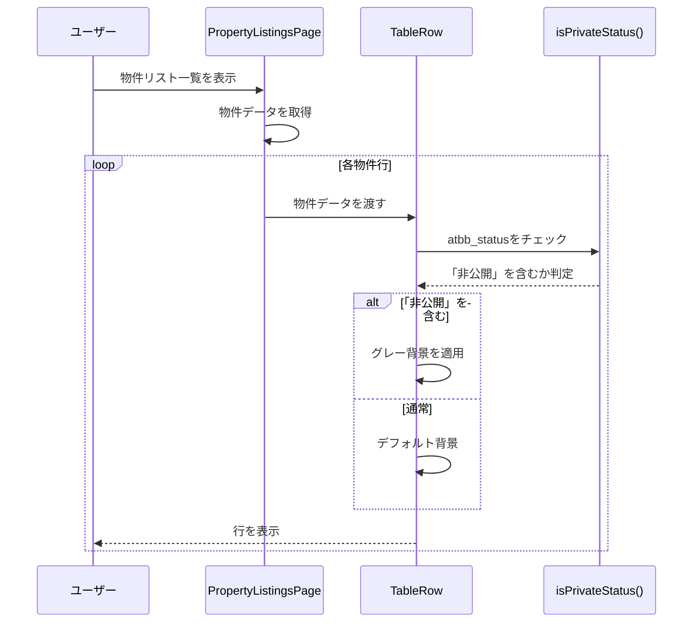

# 設計ドキュメント: 物件リスト一覧「非公開」行ハイライト機能

## 概要

物件リスト一覧表示において、`atbb_status`フィールドに「非公開」という文字が含まれる場合、その行（テーブル行）にグレーの背景色を付けて視覚的に区別する機能を実装します。

## 主要アルゴリズム/ワークフロー



## コアインターフェース/型定義

```typescript
interface PropertyListing {
  id: string;
  property_number?: string;
  atbb_status?: string;  // 「専任・非公開」「一般・非公開」などを含む
  // ... その他のフィールド
}

// ユーティリティ関数
function isPrivateStatus(atbbStatus: string | undefined): boolean
```

## 主要関数の形式仕様

### 関数1: isPrivateStatus()

```typescript
function isPrivateStatus(atbbStatus: string | undefined): boolean
```

**事前条件:**
- `atbbStatus`は文字列またはundefined

**事後条件:**
- `atbbStatus`に「非公開」が含まれる場合は`true`を返す
- それ以外の場合は`false`を返す
- `atbbStatus`がundefinedまたは空文字の場合は`false`を返す

**ループ不変条件:** N/A（ループなし）

## アルゴリズム疑似コード

### メインアルゴリズム

```pascal
ALGORITHM renderPropertyListingRow(listing)
INPUT: listing of type PropertyListing
OUTPUT: TableRow with conditional background color

BEGIN
  // ステップ1: 非公開ステータスをチェック
  isPrivate ← isPrivateStatus(listing.atbb_status)
  
  // ステップ2: 背景色を決定
  IF isPrivate THEN
    backgroundColor ← 'rgba(0, 0, 0, 0.04)'  // グレー背景
  ELSE
    backgroundColor ← 'inherit'  // デフォルト背景
  END IF
  
  // ステップ3: 行を描画
  RETURN TableRow with sx={{ bgcolor: backgroundColor }}
END
```

**事前条件:**
- `listing`は有効なPropertyListingオブジェクト
- `listing.atbb_status`は文字列またはundefined

**事後条件:**
- 「非公開」を含む場合、グレー背景のTableRowが返される
- それ以外の場合、デフォルト背景のTableRowが返される

**ループ不変条件:** N/A

### 判定アルゴリズム

```pascal
ALGORITHM isPrivateStatus(atbbStatus)
INPUT: atbbStatus of type string | undefined
OUTPUT: isPrivate of type boolean

BEGIN
  // ステップ1: 入力チェック
  IF atbbStatus = undefined OR atbbStatus = '' THEN
    RETURN false
  END IF
  
  // ステップ2: 「非公開」を含むかチェック
  IF atbbStatus contains '非公開' THEN
    RETURN true
  ELSE
    RETURN false
  END IF
END
```

**事前条件:**
- `atbbStatus`は文字列またはundefined

**事後条件:**
- 「非公開」を含む場合は`true`
- それ以外は`false`

**ループ不変条件:** N/A

## 使用例

```typescript
// 例1: 非公開ステータスの判定
const status1 = '専任・非公開';
const isPrivate1 = isPrivateStatus(status1);  // true

const status2 = '一般・公開中';
const isPrivate2 = isPrivateStatus(status2);  // false

const status3 = undefined;
const isPrivate3 = isPrivateStatus(status3);  // false

// 例2: TableRowでの使用
<TableRow
  sx={{
    bgcolor: isPrivateStatus(listing.atbb_status) 
      ? 'rgba(0, 0, 0, 0.04)' 
      : 'inherit',
    cursor: 'pointer'
  }}
>
  {/* セル内容 */}
</TableRow>

// 例3: モバイルカード表示での使用
<Card
  sx={{
    bgcolor: isPrivateStatus(listing.atbb_status) 
      ? 'rgba(0, 0, 0, 0.04)' 
      : 'inherit',
    mb: 1
  }}
>
  {/* カード内容 */}
</Card>
```

## 正確性プロパティ

*プロパティとは、システムの全ての有効な実行において真であるべき特性や動作のことです。プロパティは、人間が読める仕様と機械で検証可能な正確性保証の橋渡しとなります。*

### プロパティ1: 非公開ステータスの正確な判定

*任意の* atbb_status文字列に対して、isPrivateStatus関数は「非公開」を含む場合に限りtrueを返す

**検証要件: 要件2.1, 要件2.2, 要件2.3**

```typescript
// ∀ atbbStatus: string | undefined,
//   isPrivateStatus(atbbStatus) = true 
//   ⟺ atbbStatus !== undefined ∧ atbbStatus.includes('非公開')

// テストケース
assert(isPrivateStatus('専任・非公開') === true);
assert(isPrivateStatus('一般・非公開') === true);
assert(isPrivateStatus('一般・公開中') === false);
assert(isPrivateStatus('専任・公開中') === false);
assert(isPrivateStatus(undefined) === false);
assert(isPrivateStatus('') === false);
```

### プロパティ2: 背景色の一貫性

*任意の* PropertyListingオブジェクトに対して、atbb_statusに「非公開」が含まれる場合、グレー背景が適用される

**検証要件: 要件1.1, 要件1.2**

```typescript
// ∀ listing: PropertyListing,
//   isPrivateStatus(listing.atbb_status) = true
//   ⟹ TableRow.sx.bgcolor = 'rgba(0, 0, 0, 0.04)'

// テストケース
const listing1 = { atbb_status: '専任・非公開' };
const bgcolor1 = isPrivateStatus(listing1.atbb_status) 
  ? 'rgba(0, 0, 0, 0.04)' 
  : 'inherit';
assert(bgcolor1 === 'rgba(0, 0, 0, 0.04)');

const listing2 = { atbb_status: '一般・公開中' };
const bgcolor2 = isPrivateStatus(listing2.atbb_status) 
  ? 'rgba(0, 0, 0, 0.04)' 
  : 'inherit';
assert(bgcolor2 === 'inherit');
```

### プロパティ3: レスポンシブ表示の一貫性

*任意の* 表示形式（デスクトップまたはモバイル）において、非公開物件は同じグレー背景で表示される

**検証要件: 要件3.1, 要件3.2, 要件3.3**

```typescript
// ∀ listing: PropertyListing, ∀ viewMode: 'desktop' | 'mobile',
//   isPrivateStatus(listing.atbb_status) = true
//   ⟹ backgroundColor = 'rgba(0, 0, 0, 0.04)'

// テストケース（デスクトップ）
const desktopRow = <TableRow sx={{ bgcolor: isPrivateStatus(listing.atbb_status) ? 'rgba(0, 0, 0, 0.04)' : 'inherit' }} />;

// テストケース（モバイル）
const mobileCard = <Card sx={{ bgcolor: isPrivateStatus(listing.atbb_status) ? 'rgba(0, 0, 0, 0.04)' : 'inherit' }} />;
```

### プロパティ4: 既存機能への影響なし

*任意の* PropertyListingに対して、背景色の変更は他の機能（クリック、選択、ホバー）に影響しない

**検証要件: 要件1.3, 要件4.1, 要件4.2, 要件4.3**

```typescript
// ∀ listing: PropertyListing,
//   背景色の変更は他の機能（クリック、選択、ホバー）に影響しない

// テストケース
// - 非公開行でもクリックで詳細ページに遷移できる
// - 非公開行でもチェックボックスで選択できる
// - 非公開行でもホバー効果が適用される
```

## エラーハンドリング

### エラーシナリオ1: atbb_statusがundefined

**条件**: `listing.atbb_status`がundefined
**対応**: `isPrivateStatus()`が`false`を返し、デフォルト背景を適用
**復旧**: エラーなし、正常動作

### エラーシナリオ2: atbb_statusが空文字

**条件**: `listing.atbb_status`が空文字（`''`）
**対応**: `isPrivateStatus()`が`false`を返し、デフォルト背景を適用
**復旧**: エラーなし、正常動作

### エラーシナリオ3: atbb_statusが予期しない値

**条件**: `listing.atbb_status`が「非公開」を含まない文字列
**対応**: `isPrivateStatus()`が`false`を返し、デフォルト背景を適用
**復旧**: エラーなし、正常動作

## テスト戦略

### ユニットテスト

```typescript
describe('isPrivateStatus', () => {
  it('「専任・非公開」の場合trueを返す', () => {
    expect(isPrivateStatus('専任・非公開')).toBe(true);
  });

  it('「一般・非公開」の場合trueを返す', () => {
    expect(isPrivateStatus('一般・非公開')).toBe(true);
  });

  it('「一般・公開中」の場合falseを返す', () => {
    expect(isPrivateStatus('一般・公開中')).toBe(false);
  });

  it('「専任・公開中」の場合falseを返す', () => {
    expect(isPrivateStatus('専任・公開中')).toBe(false);
  });

  it('undefinedの場合falseを返す', () => {
    expect(isPrivateStatus(undefined)).toBe(false);
  });

  it('空文字の場合falseを返す', () => {
    expect(isPrivateStatus('')).toBe(false);
  });
});
```

### プロパティベーステスト

**プロパティテストライブラリ**: fast-check（TypeScript/JavaScript用）

```typescript
import fc from 'fast-check';

describe('isPrivateStatus property-based tests', () => {
  it('「非公開」を含む文字列は常にtrueを返す', () => {
    fc.assert(
      fc.property(
        fc.string().filter(s => s.includes('非公開')),
        (status) => {
          expect(isPrivateStatus(status)).toBe(true);
        }
      )
    );
  });

  it('「非公開」を含まない文字列は常にfalseを返す', () => {
    fc.assert(
      fc.property(
        fc.string().filter(s => !s.includes('非公開')),
        (status) => {
          expect(isPrivateStatus(status)).toBe(false);
        }
      )
    );
  });
});
```

### 統合テスト

```typescript
describe('PropertyListingsPage 非公開行ハイライト', () => {
  it('非公開ステータスの行にグレー背景が適用される', async () => {
    const listings = [
      { id: '1', property_number: 'AA001', atbb_status: '専任・非公開' },
      { id: '2', property_number: 'AA002', atbb_status: '一般・公開中' },
    ];

    render(<PropertyListingsPage />);
    
    // AA001の行がグレー背景を持つことを確認
    const row1 = screen.getByText('AA001').closest('tr');
    expect(row1).toHaveStyle({ backgroundColor: 'rgba(0, 0, 0, 0.04)' });

    // AA002の行がデフォルト背景を持つことを確認
    const row2 = screen.getByText('AA002').closest('tr');
    expect(row2).toHaveStyle({ backgroundColor: 'inherit' });
  });

  it('非公開行でもクリックで詳細ページに遷移できる', async () => {
    const listings = [
      { id: '1', property_number: 'AA001', atbb_status: '専任・非公開' },
    ];

    render(<PropertyListingsPage />);
    
    const row = screen.getByText('AA001').closest('tr');
    fireEvent.click(row);

    // 詳細ページに遷移することを確認
    expect(mockNavigate).toHaveBeenCalledWith('/property-listings/AA001');
  });
});
```

## パフォーマンス考慮事項

### 計算量

- `isPrivateStatus()`の時間計算量: O(n)（nは文字列の長さ）
- 各行での判定: O(1)（文字列の長さは定数と見なせる）
- 全体の追加コスト: O(m)（mは表示される行数）

### 最適化

- `isPrivateStatus()`は純粋関数なので、必要に応じてメモ化可能
- ただし、文字列チェックは十分高速なため、メモ化は不要

### レンダリングパフォーマンス

- 背景色の変更はCSSプロパティのみなので、再レンダリングコストは最小限
- 既存のホバー効果やクリックイベントに影響なし

## セキュリティ考慮事項

### XSS対策

- `atbb_status`はデータベースから取得される信頼できるデータ
- 文字列比較のみで、HTMLレンダリングには使用しない
- XSSリスクなし

### データ漏洩対策

- 「非公開」ステータスは社内管理システムでのみ表示
- 公開物件サイトには影響なし

## 依存関係

### フロントエンド

- React 18.x
- Material-UI (MUI) 5.x
- TypeScript 5.x

### 既存コンポーネント

- `PropertyListingsPage.tsx` - メインの物件リスト一覧ページ
- `getDisplayStatus()` - atbb_statusの表示変換ユーティリティ（既存）

### 新規ユーティリティ

- `isPrivateStatus()` - 非公開ステータス判定関数（新規作成）

## 実装ファイル

### 修正対象ファイル

1. `frontend/frontend/src/pages/PropertyListingsPage.tsx`
   - デスクトップ版テーブル行に背景色を適用
   - モバイル版カード表示に背景色を適用

2. `frontend/frontend/src/utils/propertyListingStatusUtils.ts`（新規作成）
   - `isPrivateStatus()`関数を実装

### テストファイル

1. `frontend/frontend/src/utils/__tests__/propertyListingStatusUtils.test.ts`（新規作成）
   - ユニットテスト
   - プロパティベーステスト

2. `frontend/frontend/src/pages/__tests__/PropertyListingsPage.test.tsx`（既存に追加）
   - 統合テスト

## 実装の詳細

### ステップ1: ユーティリティ関数の作成

```typescript
// frontend/frontend/src/utils/propertyListingStatusUtils.ts

/**
 * atbb_statusに「非公開」が含まれるかチェック
 * @param atbbStatus - atbb_statusフィールドの値
 * @returns 「非公開」を含む場合true、それ以外false
 */
export function isPrivateStatus(atbbStatus: string | undefined): boolean {
  if (!atbbStatus || atbbStatus.trim() === '') {
    return false;
  }
  return atbbStatus.includes('非公開');
}
```

### ステップ2: PropertyListingsPageの修正

#### デスクトップ版テーブル行

```typescript
// 修正前
<TableRow
  key={listing.id}
  hover
  onClick={() => listing.property_number && handleRowClick(listing.property_number)}
  sx={{ cursor: 'pointer', bgcolor: isSelected ? 'action.selected' : 'inherit' }}
>

// 修正後
<TableRow
  key={listing.id}
  hover
  onClick={() => listing.property_number && handleRowClick(listing.property_number)}
  sx={{
    cursor: 'pointer',
    bgcolor: isSelected 
      ? 'action.selected' 
      : isPrivateStatus(listing.atbb_status) 
        ? 'rgba(0, 0, 0, 0.04)' 
        : 'inherit'
  }}
>
```

#### モバイル版カード表示

```typescript
// 修正前
<Card
  key={listing.id}
  onClick={() => listing.property_number && handleRowClick(listing.property_number)}
  sx={{
    mb: 1,
    cursor: 'pointer',
    minHeight: 44,
    '&:hover': { bgcolor: 'grey.50' },
  }}
>

// 修正後
<Card
  key={listing.id}
  onClick={() => listing.property_number && handleRowClick(listing.property_number)}
  sx={{
    mb: 1,
    cursor: 'pointer',
    minHeight: 44,
    bgcolor: isPrivateStatus(listing.atbb_status) 
      ? 'rgba(0, 0, 0, 0.04)' 
      : 'inherit',
    '&:hover': { bgcolor: 'grey.50' },
  }}
>
```

### ステップ3: インポートの追加

```typescript
// PropertyListingsPage.tsx の先頭に追加
import { isPrivateStatus } from '../utils/propertyListingStatusUtils';
```

## デプロイ手順

1. ユーティリティ関数を作成
2. ユニットテストを実行して動作確認
3. PropertyListingsPageを修正
4. ローカル環境で動作確認
5. Vercelにデプロイ
6. 本番環境で動作確認

## ロールバック計画

問題が発生した場合:
1. `isPrivateStatus()`の呼び出しを削除
2. `sx`プロパティを元の状態に戻す
3. 再デプロイ

## 今後の拡張性

### 拡張案1: 他のステータスのハイライト

```typescript
// 「成約済み」を青色でハイライト
function getStatusBackgroundColor(atbbStatus: string | undefined): string {
  if (isPrivateStatus(atbbStatus)) {
    return 'rgba(0, 0, 0, 0.04)';  // グレー
  }
  if (atbbStatus?.includes('成約済み')) {
    return 'rgba(33, 150, 243, 0.08)';  // 青
  }
  return 'inherit';
}
```

### 拡張案2: カスタマイズ可能な色設定

```typescript
// 設定ファイルで色を管理
const STATUS_COLORS = {
  private: 'rgba(0, 0, 0, 0.04)',
  contracted: 'rgba(33, 150, 243, 0.08)',
  default: 'inherit',
};
```

---

**最終更新日**: 2026年4月9日
**作成理由**: 物件リスト一覧で非公開物件を視覚的に区別するため
