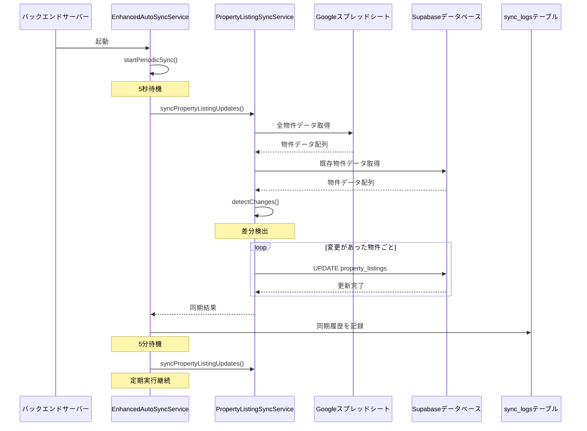

# 物件リスト更新同期修正 - 技術設計

## ステータス: 🎨 設計完了

## 概要

このドキュメントは、既存物件のフィールド更新（特にATBB状況）がスプレッドシートからデータベースに自動同期されない問題を修正するための技術設計を定義します。

## アーキテクチャ概要

### システム構成図

```
┌─────────────────────────────────────────────────────────────┐
│                    Googleスプレッドシート                      │
│                    (物件リストマスター)                        │
└────────────────────┬────────────────────────────────────────┘
                     │
                     │ Google Sheets API
                     │
┌────────────────────▼────────────────────────────────────────┐
│              EnhancedAutoSyncService                         │
│              (定期同期マネージャー)                           │
│                                                              │
│  ┌──────────────────────────────────────────────────────┐  │
│  │  起動時: 5秒後に初回同期実行                          │  │
│  │  定期実行: 5分間隔で自動同期                          │  │
│  └──────────────────────────────────────────────────────┘  │
└────────────────────┬────────────────────────────────────────┘
                     │
                     │ syncPropertyListingUpdates()
                     │
┌────────────────────▼────────────────────────────────────────┐
│         PropertyListingSyncService                           │
│         (物件リスト同期サービス)                              │
│                                                              │
│  ┌──────────────────────────────────────────────────────┐  │
│  │  1. スプレッドシートから全物件データ取得              │  │
│  │  2. データベースから既存物件データ取得                │  │
│  │  3. 差分検出（フィールド単位）                        │  │
│  │  4. 変更があった物件のみ更新                          │  │
│  └──────────────────────────────────────────────────────┘  │
└────────────────────┬────────────────────────────────────────┘
                     │
                     │ Supabase REST API
                     │
┌────────────────────▼────────────────────────────────────────┐
│                  Supabaseデータベース                         │
│                                                              │
│  ┌──────────────────┐  ┌──────────────────┐               │
│  │ property_listings│  │   sync_logs      │               │
│  │  (物件データ)    │  │  (同期履歴)      │               │
│  └──────────────────┘  └──────────────────┘               │
└─────────────────────────────────────────────────────────────┘
```

## コンポーネント設計

### 1. EnhancedAutoSyncService

**ファイル**: `backend/src/services/EnhancedAutoSyncService.ts`

**責務**:
- バックエンドサーバー起動時に自動起動
- 定期的に同期処理を実行
- 同期結果のログ記録

**主要メソッド**:

```typescript
class EnhancedAutoSyncService {
  // 初期化（サーバー起動時に自動実行）
  constructor() {
    this.startPeriodicSync();
  }

  // 定期同期の開始
  private startPeriodicSync(): void {
    // 5秒後に初回同期
    setTimeout(() => this.runSync(), 5000);
    
    // 5分間隔で定期同期
    setInterval(() => this.runSync(), 5 * 60 * 1000);
  }

  // 同期実行
  private async runSync(): Promise<void> {
    await this.syncPropertyListingUpdates();
  }

  // 物件リスト更新同期
  private async syncPropertyListingUpdates(): Promise<void> {
    const result = await propertyListingSyncService
      .syncUpdatedPropertyListings();
    
    // sync_logsに記録
    await this.logSyncResult(result);
  }
}
```


### 2. PropertyListingSyncService

**ファイル**: `backend/src/services/PropertyListingSyncService.ts`

**責務**:
- スプレッドシートとデータベースの差分検出
- 変更があった物件の更新処理
- エラーハンドリングとリトライ

**主要メソッド**:

```typescript
class PropertyListingSyncService {
  // 更新された物件の同期
  async syncUpdatedPropertyListings(): Promise<SyncResult> {
    const sheetData = await this.fetchFromSpreadsheet();
    const dbData = await this.fetchFromDatabase();
    
    const updates = this.detectChanges(sheetData, dbData);
    
    const results = {
      updated: 0,
      errors: [] as SyncError[]
    };
    
    for (const update of updates) {
      try {
        await this.updatePropertyListing(update);
        results.updated++;
      } catch (error) {
        results.errors.push({
          propertyNumber: update.propertyNumber,
          error: error.message
        });
      }
    }
    
    return results;
  }

  // 差分検出
  private detectChanges(
    sheetData: PropertyData[],
    dbData: PropertyData[]
  ): PropertyUpdate[] {
    const updates: PropertyUpdate[] = [];
    
    for (const sheetRow of sheetData) {
      const dbRow = dbData.find(
        d => d.property_number === sheetRow.property_number
      );
      
      if (!dbRow) continue; // 新規物件はスキップ
      
      const changedFields = this.compareFields(sheetRow, dbRow);
      
      if (changedFields.length > 0) {
        updates.push({
          propertyNumber: sheetRow.property_number,
          fields: changedFields
        });
      }
    }
    
    return updates;
  }

  // フィールド比較
  private compareFields(
    sheetRow: PropertyData,
    dbRow: PropertyData
  ): FieldChange[] {
    const changes: FieldChange[] = [];
    
    // 監視対象フィールド
    const fieldsToWatch = [
      'atbb_status',
      'price',
      'land_area',
      'building_area',
      'status',
      // ... 他のフィールド
    ];
    
    for (const field of fieldsToWatch) {
      if (sheetRow[field] !== dbRow[field]) {
        changes.push({
          field,
          oldValue: dbRow[field],
          newValue: sheetRow[field]
        });
      }
    }
    
    return changes;
  }

  // 物件更新
  private async updatePropertyListing(
    update: PropertyUpdate
  ): Promise<void> {
    const updateData = {};
    
    for (const change of update.fields) {
      updateData[change.field] = change.newValue;
    }
    
    await supabase
      .from('property_listings')
      .update(updateData)
      .eq('property_number', update.propertyNumber);
  }
}
```

## データフロー

### 同期処理のシーケンス図



### データ変換フロー

```
┌─────────────────────────────────────────────────────────────┐
│  Step 1: スプレッドシートからデータ取得                       │
├─────────────────────────────────────────────────────────────┤
│  GoogleSheetsClient.fetchPropertyListings()                 │
│  ↓                                                           │
│  生データ: [["AA4885", "公開中", "5000万円", ...], ...]     │
└────────────────────┬────────────────────────────────────────┘
                     │
                     ▼
┌─────────────────────────────────────────────────────────────┐
│  Step 2: カラムマッピング                                    │
├─────────────────────────────────────────────────────────────┤
│  PropertyListingColumnMapper.mapRowToPropertyListing()      │
│  ↓                                                           │
│  マップ済みデータ: {                                         │
│    property_number: "AA4885",                               │
│    atbb_status: "公開中",                                   │
│    price: 50000000,                                         │
│    ...                                                       │
│  }                                                           │
└────────────────────┬────────────────────────────────────────┘
                     │
                     ▼
┌─────────────────────────────────────────────────────────────┐
│  Step 3: データベースデータと比較                            │
├─────────────────────────────────────────────────────────────┤
│  compareFields(sheetRow, dbRow)                             │
│  ↓                                                           │
│  差分: [                                                     │
│    { field: "atbb_status",                                  │
│      oldValue: "非公開",                                    │
│      newValue: "公開中" }                                   │
│  ]                                                           │
└────────────────────┬────────────────────────────────────────┘
                     │
                     ▼
┌─────────────────────────────────────────────────────────────┐
│  Step 4: データベース更新                                    │
├─────────────────────────────────────────────────────────────┤
│  UPDATE property_listings                                   │
│  SET atbb_status = '公開中'                                 │
│  WHERE property_number = 'AA4885'                           │
└─────────────────────────────────────────────────────────────┘
```


## データモデル

### property_listingsテーブル

```sql
CREATE TABLE property_listings (
  id UUID PRIMARY KEY DEFAULT uuid_generate_v4(),
  property_number TEXT UNIQUE NOT NULL,
  
  -- ATBB関連
  atbb_status TEXT,
  atbb_public_folder TEXT,
  
  -- 基本情報
  price NUMERIC,
  land_area NUMERIC,
  building_area NUMERIC,
  status TEXT,
  
  -- メタデータ
  created_at TIMESTAMPTZ DEFAULT NOW(),
  updated_at TIMESTAMPTZ DEFAULT NOW(),
  last_synced_at TIMESTAMPTZ
);

-- インデックス
CREATE INDEX idx_property_listings_property_number 
  ON property_listings(property_number);
CREATE INDEX idx_property_listings_last_synced_at 
  ON property_listings(last_synced_at);
```

### sync_logsテーブル

```sql
CREATE TABLE sync_logs (
  id UUID PRIMARY KEY DEFAULT uuid_generate_v4(),
  sync_type TEXT NOT NULL,
  status TEXT NOT NULL,
  records_processed INTEGER,
  error_message TEXT,
  started_at TIMESTAMPTZ NOT NULL,
  completed_at TIMESTAMPTZ,
  duration_ms INTEGER
);

-- インデックス
CREATE INDEX idx_sync_logs_sync_type 
  ON sync_logs(sync_type);
CREATE INDEX idx_sync_logs_started_at 
  ON sync_logs(started_at DESC);
```

### TypeScript型定義

```typescript
// 物件データ
interface PropertyData {
  property_number: string;
  atbb_status?: string;
  atbb_public_folder?: string;
  price?: number;
  land_area?: number;
  building_area?: number;
  status?: string;
  last_synced_at?: Date;
}

// 同期結果
interface SyncResult {
  updated: number;
  errors: SyncError[];
}

// 同期エラー
interface SyncError {
  propertyNumber: string;
  error: string;
}

// フィールド変更
interface FieldChange {
  field: string;
  oldValue: any;
  newValue: any;
}

// 物件更新
interface PropertyUpdate {
  propertyNumber: string;
  fields: FieldChange[];
}

// 同期ログ
interface SyncLog {
  sync_type: 'property_listing_update';
  status: 'success' | 'error';
  records_processed: number;
  error_message?: string;
  started_at: Date;
  completed_at?: Date;
  duration_ms?: number;
}
```

## エラーハンドリング設計

### エラー分類

```typescript
enum SyncErrorType {
  // ネットワークエラー
  NETWORK_ERROR = 'NETWORK_ERROR',
  
  // API制限エラー
  RATE_LIMIT_ERROR = 'RATE_LIMIT_ERROR',
  
  // データ検証エラー
  VALIDATION_ERROR = 'VALIDATION_ERROR',
  
  // データベースエラー
  DATABASE_ERROR = 'DATABASE_ERROR',
  
  // 不明なエラー
  UNKNOWN_ERROR = 'UNKNOWN_ERROR'
}
```

### エラーハンドリングフロー

```
┌─────────────────────────────────────────────────────────────┐
│  同期処理開始                                                │
└────────────────────┬────────────────────────────────────────┘
                     │
                     ▼
┌─────────────────────────────────────────────────────────────┐
│  try {                                                       │
│    物件データ取得                                            │
│    差分検出                                                  │
│    データベース更新                                          │
│  }                                                           │
└────────────────────┬────────────────────────────────────────┘
                     │
                     ▼
              エラー発生？
                     │
        ┌────────────┴────────────┐
        │                         │
       YES                       NO
        │                         │
        ▼                         ▼
┌──────────────────┐    ┌──────────────────┐
│  エラー分類      │    │  成功ログ記録    │
│  ↓               │    │  ↓               │
│  リトライ判定    │    │  処理完了        │
│  ↓               │    └──────────────────┘
│  リトライ可能？  │
│  ↓               │
│  YES → 再実行    │
│  NO  → エラーログ│
└──────────────────┘
```

### リトライロジック

```typescript
class RetryHandler {
  private maxRetries = 3;
  private retryDelay = 1000; // 1秒

  async executeWithRetry<T>(
    operation: () => Promise<T>,
    errorType: SyncErrorType
  ): Promise<T> {
    let lastError: Error;
    
    for (let attempt = 1; attempt <= this.maxRetries; attempt++) {
      try {
        return await operation();
      } catch (error) {
        lastError = error;
        
        // リトライ不可能なエラー
        if (!this.isRetryable(errorType)) {
          throw error;
        }
        
        // 最後の試行
        if (attempt === this.maxRetries) {
          throw error;
        }
        
        // 待機してリトライ
        await this.delay(this.retryDelay * attempt);
      }
    }
    
    throw lastError;
  }

  private isRetryable(errorType: SyncErrorType): boolean {
    return [
      SyncErrorType.NETWORK_ERROR,
      SyncErrorType.RATE_LIMIT_ERROR
    ].includes(errorType);
  }

  private delay(ms: number): Promise<void> {
    return new Promise(resolve => setTimeout(resolve, ms));
  }
}
```


## パフォーマンス最適化

### 差分検出の最適化

**問題**: 全物件を毎回比較すると処理時間が長くなる

**解決策**: 
1. last_synced_atフィールドを活用
2. 変更があった可能性のある物件のみを比較
3. フィールド単位での比較

```typescript
class OptimizedSyncService {
  // 最適化された差分検出
  async detectChangesOptimized(): Promise<PropertyUpdate[]> {
    // 前回の同期時刻を取得
    const lastSyncTime = await this.getLastSyncTime();
    
    // スプレッドシートから全データ取得（必須）
    const sheetData = await this.fetchFromSpreadsheet();
    
    // データベースから前回同期以降に変更がない物件を除外
    const dbData = await this.fetchRecentlyUpdated(lastSyncTime);
    
    // 差分検出（対象物件が絞られている）
    return this.detectChanges(sheetData, dbData);
  }

  // 最近更新された物件のみ取得
  private async fetchRecentlyUpdated(
    since: Date
  ): Promise<PropertyData[]> {
    return await supabase
      .from('property_listings')
      .select('*')
      .or(`last_synced_at.is.null,last_synced_at.lt.${since.toISOString()}`);
  }
}
```

### バッチ更新の最適化

**問題**: 1件ずつ更新すると遅い

**解決策**: 可能な限りバッチ更新を使用

```typescript
class BatchUpdateService {
  // バッチ更新
  async updateInBatch(updates: PropertyUpdate[]): Promise<void> {
    const batchSize = 50;
    
    for (let i = 0; i < updates.length; i += batchSize) {
      const batch = updates.slice(i, i + batchSize);
      
      // 並列実行
      await Promise.all(
        batch.map(update => this.updatePropertyListing(update))
      );
    }
  }
}
```

### キャッシング戦略

```typescript
class CacheManager {
  private cache = new Map<string, PropertyData>();
  private cacheExpiry = 5 * 60 * 1000; // 5分

  // キャッシュから取得
  async getWithCache(propertyNumber: string): Promise<PropertyData> {
    const cached = this.cache.get(propertyNumber);
    
    if (cached && !this.isExpired(cached)) {
      return cached;
    }
    
    const fresh = await this.fetchFromDatabase(propertyNumber);
    this.cache.set(propertyNumber, fresh);
    
    return fresh;
  }

  // キャッシュクリア
  clearCache(): void {
    this.cache.clear();
  }
}
```

## 監視とログ設計

### ログレベル

```typescript
enum LogLevel {
  DEBUG = 'DEBUG',
  INFO = 'INFO',
  WARN = 'WARN',
  ERROR = 'ERROR'
}
```

### ログ出力例

```typescript
class SyncLogger {
  // 同期開始ログ
  logSyncStart(): void {
    console.log('🔄 [INFO] Starting property listing update sync...');
  }

  // 同期完了ログ
  logSyncComplete(result: SyncResult): void {
    console.log(
      `✅ [INFO] Property listing update sync completed: ` +
      `${result.updated} updated, ${result.errors.length} errors`
    );
  }

  // エラーログ
  logError(error: SyncError): void {
    console.error(
      `❌ [ERROR] Failed to update ${error.propertyNumber}: ` +
      `${error.error}`
    );
  }

  // 詳細ログ（デバッグ用）
  logDetail(propertyNumber: string, changes: FieldChange[]): void {
    console.log(
      `📝 [DEBUG] ${propertyNumber}: ` +
      `${changes.length} fields changed`
    );
    
    for (const change of changes) {
      console.log(
        `  - ${change.field}: ` +
        `"${change.oldValue}" → "${change.newValue}"`
      );
    }
  }
}
```

### メトリクス収集

```typescript
interface SyncMetrics {
  // 処理時間
  duration_ms: number;
  
  // 処理件数
  total_checked: number;
  total_updated: number;
  total_errors: number;
  
  // パフォーマンス
  avg_update_time_ms: number;
  
  // エラー率
  error_rate: number;
}

class MetricsCollector {
  async collectMetrics(result: SyncResult): Promise<SyncMetrics> {
    return {
      duration_ms: result.duration,
      total_checked: result.checked,
      total_updated: result.updated,
      total_errors: result.errors.length,
      avg_update_time_ms: result.duration / result.updated,
      error_rate: result.errors.length / result.checked
    };
  }
}
```

## セキュリティ設計

### 認証・認可

```typescript
class SecurityManager {
  // Google Sheets API認証
  async authenticateGoogleSheets(): Promise<void> {
    // サービスアカウント認証
    const auth = new google.auth.GoogleAuth({
      keyFile: process.env.GOOGLE_SERVICE_ACCOUNT_KEY,
      scopes: ['https://www.googleapis.com/auth/spreadsheets.readonly']
    });
    
    this.sheetsClient = google.sheets({ version: 'v4', auth });
  }

  // Supabase認証
  async authenticateSupabase(): Promise<void> {
    // サービスロールキーを使用
    this.supabase = createClient(
      process.env.SUPABASE_URL,
      process.env.SUPABASE_SERVICE_ROLE_KEY
    );
  }
}
```

### データ検証

```typescript
class DataValidator {
  // 物件番号の検証
  validatePropertyNumber(propertyNumber: string): boolean {
    // AA + 4桁の数字
    return /^AA\d{4,5}$/.test(propertyNumber);
  }

  // ATBB状況の検証
  validateAtbbStatus(status: string): boolean {
    const validStatuses = [
      '公開中',
      '非公開',
      '公開準備中',
      '公開停止'
    ];
    
    return validStatuses.includes(status);
  }

  // 価格の検証
  validatePrice(price: number): boolean {
    return price > 0 && price < 1000000000; // 10億円未満
  }
}
```


## テスト設計

### ユニットテスト

```typescript
describe('PropertyListingSyncService', () => {
  describe('detectChanges', () => {
    it('should detect ATBB status change', () => {
      const sheetData = [{
        property_number: 'AA4885',
        atbb_status: '公開中'
      }];
      
      const dbData = [{
        property_number: 'AA4885',
        atbb_status: '非公開'
      }];
      
      const changes = service.detectChanges(sheetData, dbData);
      
      expect(changes).toHaveLength(1);
      expect(changes[0].fields[0].field).toBe('atbb_status');
      expect(changes[0].fields[0].newValue).toBe('公開中');
    });

    it('should not detect changes when data is same', () => {
      const sheetData = [{
        property_number: 'AA4885',
        atbb_status: '公開中'
      }];
      
      const dbData = [{
        property_number: 'AA4885',
        atbb_status: '公開中'
      }];
      
      const changes = service.detectChanges(sheetData, dbData);
      
      expect(changes).toHaveLength(0);
    });

    it('should skip new properties', () => {
      const sheetData = [{
        property_number: 'AA9999',
        atbb_status: '公開中'
      }];
      
      const dbData = []; // 新規物件
      
      const changes = service.detectChanges(sheetData, dbData);
      
      expect(changes).toHaveLength(0);
    });
  });

  describe('compareFields', () => {
    it('should detect multiple field changes', () => {
      const sheetRow = {
        property_number: 'AA4885',
        atbb_status: '公開中',
        price: 50000000
      };
      
      const dbRow = {
        property_number: 'AA4885',
        atbb_status: '非公開',
        price: 48000000
      };
      
      const changes = service.compareFields(sheetRow, dbRow);
      
      expect(changes).toHaveLength(2);
      expect(changes.map(c => c.field)).toContain('atbb_status');
      expect(changes.map(c => c.field)).toContain('price');
    });
  });
});
```

### 統合テスト

```typescript
describe('Property Listing Update Sync Integration', () => {
  beforeEach(async () => {
    // テストデータのセットアップ
    await setupTestData();
  });

  afterEach(async () => {
    // テストデータのクリーンアップ
    await cleanupTestData();
  });

  it('should sync updated property from spreadsheet to database', async () => {
    // スプレッドシートでAA4885を更新
    await updateSpreadsheet('AA4885', {
      atbb_status: '公開中'
    });
    
    // 同期実行
    const result = await syncService.syncUpdatedPropertyListings();
    
    // 結果検証
    expect(result.updated).toBeGreaterThan(0);
    expect(result.errors).toHaveLength(0);
    
    // データベース確認
    const property = await fetchProperty('AA4885');
    expect(property.atbb_status).toBe('公開中');
  });

  it('should handle sync errors gracefully', async () => {
    // 無効なデータを設定
    await updateSpreadsheet('AA4885', {
      price: -1000 // 無効な価格
    });
    
    // 同期実行
    const result = await syncService.syncUpdatedPropertyListings();
    
    // エラーが記録されることを確認
    expect(result.errors.length).toBeGreaterThan(0);
    expect(result.errors[0].propertyNumber).toBe('AA4885');
  });
});
```

### E2Eテスト

```typescript
describe('End-to-End Sync Test', () => {
  it('should complete full sync cycle', async () => {
    // 1. バックエンドサーバー起動
    const server = await startServer();
    
    // 2. 5秒待機（初回同期）
    await delay(5000);
    
    // 3. sync_logsテーブル確認
    const logs = await fetchSyncLogs();
    expect(logs.length).toBeGreaterThan(0);
    
    // 4. スプレッドシート更新
    await updateSpreadsheet('AA4885', {
      atbb_status: '公開中'
    });
    
    // 5. 5分待機（定期同期）
    await delay(5 * 60 * 1000);
    
    // 6. 更新確認
    const property = await fetchProperty('AA4885');
    expect(property.atbb_status).toBe('公開中');
    
    // 7. サーバー停止
    await stopServer(server);
  });
});
```

## デプロイメント設計

### 環境変数

```bash
# Google Sheets API
GOOGLE_SERVICE_ACCOUNT_KEY=/path/to/service-account.json
SPREADSHEET_ID=your-spreadsheet-id

# Supabase
SUPABASE_URL=https://your-project.supabase.co
SUPABASE_SERVICE_ROLE_KEY=your-service-role-key

# 自動同期設定
AUTO_SYNC_ENABLED=true
SYNC_INTERVAL_MINUTES=5

# ログ設定
LOG_LEVEL=INFO
LOG_FILE=/path/to/sync.log
```

### デプロイメント手順

```bash
# 1. 環境変数の設定
cp backend/.env.example backend/.env
# .envファイルを編集

# 2. 依存関係のインストール
cd backend
npm install

# 3. マイグレーション実行
npx ts-node migrations/run-039-migration.ts

# 4. バックエンドサーバー起動
npm run dev

# 5. 起動確認
# ログで以下のメッセージを確認:
# ✅ EnhancedAutoSyncService initialized
# 📊 Enhanced periodic auto-sync enabled

# 6. 初回同期確認（5秒後）
# ログで同期実行を確認

# 7. 定期同期確認（5分後）
# ログで2回目の同期実行を確認
```

### ロールバック手順

```bash
# 1. バックエンドサーバー停止
# Ctrl+C または taskkill

# 2. 環境変数を無効化
# .envファイルで AUTO_SYNC_ENABLED=false

# 3. データベースのバックアップから復元（必要な場合）
# Supabaseダッシュボードから復元

# 4. サーバー再起動
npm run dev
```

## 運用設計

### 日次チェックリスト

```markdown
## 毎日の確認事項

- [ ] sync_logsテーブルで最新の同期時刻を確認
- [ ] エラーログがないか確認
- [ ] 同期処理の実行時間を確認（パフォーマンス監視）
- [ ] 主要物件（AA4885等）の更新状態を確認
```

### 週次チェックリスト

```markdown
## 毎週の確認事項

- [ ] sync_logsテーブルの肥大化チェック
- [ ] エラー発生率の分析
- [ ] パフォーマンスメトリクスの分析
- [ ] バックエンドサーバーのメモリ使用量確認
```

### アラート設定

```typescript
class AlertService {
  // エラー率が高い場合にアラート
  async checkErrorRate(): Promise<void> {
    const recentLogs = await this.fetchRecentLogs(24); // 24時間
    const errorRate = this.calculateErrorRate(recentLogs);
    
    if (errorRate > 0.1) { // 10%以上
      await this.sendAlert({
        level: 'WARNING',
        message: `High error rate detected: ${errorRate * 100}%`
      });
    }
  }

  // 同期が実行されていない場合にアラート
  async checkSyncFrequency(): Promise<void> {
    const lastSync = await this.getLastSyncTime();
    const timeSinceLastSync = Date.now() - lastSync.getTime();
    
    if (timeSinceLastSync > 10 * 60 * 1000) { // 10分以上
      await this.sendAlert({
        level: 'ERROR',
        message: 'Sync has not run for 10 minutes'
      });
    }
  }
}
```


## トラブルシューティング設計

### 問題診断フロー

```
同期が動作しない
    │
    ├─ バックエンドサーバーは起動している？
    │   NO → サーバーを起動
    │   YES ↓
    │
    ├─ 起動ログに「Enhanced periodic auto-sync enabled」がある？
    │   NO → 環境変数を確認（AUTO_SYNC_ENABLED=true）
    │   YES ↓
    │
    ├─ sync_logsテーブルに記録がある？
    │   NO → 初回同期が実行されていない
    │        → ログでエラーを確認
    │   YES ↓
    │
    ├─ 最新の同期時刻は5分以内？
    │   NO → 定期同期が停止している
    │        → サーバーを再起動
    │   YES ↓
    │
    └─ 更新が反映されない
        → スプレッドシートのデータを確認
        → データベースのデータを確認
        → 差分検出ロジックを確認
```

### よくある問題と解決方法

#### 問題1: 同期が一度も実行されない

**症状**:
- sync_logsテーブルに記録がない
- ログに同期実行のメッセージがない

**原因**:
- 環境変数が設定されていない
- 定期同期マネージャーが起動していない

**解決方法**:
```bash
# 1. 環境変数を確認
cat backend/.env | grep AUTO_SYNC

# 2. 環境変数を設定（必要な場合）
echo "AUTO_SYNC_ENABLED=true" >> backend/.env
echo "SYNC_INTERVAL_MINUTES=5" >> backend/.env

# 3. バックエンドサーバーを再起動
cd backend
npm run dev
```

#### 問題2: 更新が反映されない

**症状**:
- 同期は実行されている
- スプレッドシートで変更したが、データベースに反映されない

**原因**:
- 差分検出ロジックが正しく動作していない
- フィールドマッピングが間違っている

**解決方法**:
```bash
# 1. 手動同期スクリプトで確認
npx ts-node backend/sync-property-listings-updates.ts

# 2. 詳細ログを確認
# ログレベルをDEBUGに変更
export LOG_LEVEL=DEBUG

# 3. 特定の物件を診断
npx ts-node backend/diagnose-property-sync.ts AA4885
```

#### 問題3: エラーが頻発する

**症状**:
- sync_logsにエラーが多数記録される
- 一部の物件が更新されない

**原因**:
- データ検証エラー
- ネットワークエラー
- API制限エラー

**解決方法**:
```bash
# 1. エラーログを確認
npx ts-node backend/check-sync-errors.ts

# 2. エラーの種類を分析
# - VALIDATION_ERROR → データを修正
# - NETWORK_ERROR → ネットワークを確認
# - RATE_LIMIT_ERROR → 同期間隔を延長

# 3. 同期間隔を延長（必要な場合）
# .envファイルで SYNC_INTERVAL_MINUTES=10
```

#### 問題4: パフォーマンスが低下する

**症状**:
- 同期処理に時間がかかる
- サーバーのメモリ使用量が増加

**原因**:
- 物件数が増加
- 最適化が不十分

**解決方法**:
```bash
# 1. パフォーマンスメトリクスを確認
npx ts-node backend/check-sync-performance.ts

# 2. 最適化オプションを有効化
# .envファイルで SYNC_OPTIMIZATION=true

# 3. バッチサイズを調整
# .envファイルで SYNC_BATCH_SIZE=50
```

### 診断スクリプト

```typescript
// backend/diagnose-sync-status.ts
async function diagnoseSyncStatus() {
  console.log('🔍 同期状態診断開始...\n');

  // 1. 環境変数確認
  console.log('📋 環境変数:');
  console.log(`  AUTO_SYNC_ENABLED: ${process.env.AUTO_SYNC_ENABLED}`);
  console.log(`  SYNC_INTERVAL_MINUTES: ${process.env.SYNC_INTERVAL_MINUTES}\n`);

  // 2. sync_logsテーブル確認
  console.log('📊 sync_logsテーブル:');
  const logs = await fetchRecentSyncLogs(10);
  console.log(`  最新の同期: ${logs[0]?.started_at || 'なし'}`);
  console.log(`  記録件数: ${logs.length}\n`);

  // 3. 最新の同期結果
  if (logs.length > 0) {
    const latest = logs[0];
    console.log('✅ 最新の同期結果:');
    console.log(`  ステータス: ${latest.status}`);
    console.log(`  更新件数: ${latest.records_processed}`);
    console.log(`  実行時間: ${latest.duration_ms}ms\n`);
  }

  // 4. AA4885の状態確認
  console.log('🏠 AA4885の状態:');
  const property = await fetchProperty('AA4885');
  console.log(`  ATBB状況: ${property.atbb_status}`);
  console.log(`  最終同期: ${property.last_synced_at}\n`);

  // 5. 推奨アクション
  console.log('💡 推奨アクション:');
  if (logs.length === 0) {
    console.log('  ⚠️ 同期が一度も実行されていません');
    console.log('  → バックエンドサーバーを再起動してください');
  } else if (isOlderThan(logs[0].started_at, 10)) {
    console.log('  ⚠️ 最新の同期が10分以上前です');
    console.log('  → 定期同期が停止している可能性があります');
  } else {
    console.log('  ✅ 同期は正常に動作しています');
  }
}
```

## 将来の改善案

### Phase 2: リアルタイム同期

**概要**: スプレッドシートの変更を即座に検知して同期

**技術**:
- Google Sheets API Webhooks
- Server-Sent Events (SSE)
- WebSocket

**メリット**:
- 同期遅延の削減（5分 → 数秒）
- リソース使用量の削減

### Phase 3: 同期状態ダッシュボード

**概要**: 同期状態を可視化するWebダッシュボード

**機能**:
- リアルタイム同期状態表示
- 同期履歴のグラフ表示
- エラーログの検索・フィルタリング
- パフォーマンスメトリクスの可視化

### Phase 4: 自動アラート機能

**概要**: 問題発生時に自動的に通知

**通知方法**:
- メール通知
- Slack通知
- SMS通知（緊急時）

**アラート条件**:
- エラー率が10%を超える
- 同期が10分以上実行されない
- パフォーマンスが基準値を下回る

### Phase 5: 双方向同期

**概要**: データベースからスプレッドシートへの同期も実装

**ユースケース**:
- システム内で更新した情報をスプレッドシートに反映
- データの一元管理

**課題**:
- 競合解決の仕組みが必要
- データ整合性の保証

## まとめ

### 設計の要点

1. **シンプルな修正**: 既存の実装を活用し、バックエンドサーバーの再起動で解決
2. **堅牢なエラーハンドリング**: リトライ機能と詳細なログ記録
3. **パフォーマンス最適化**: 差分検出とバッチ更新
4. **運用しやすさ**: 診断スクリプトと詳細なドキュメント
5. **拡張性**: 将来の改善に対応できる設計

### 成功の鍵

- 環境変数の正しい設定
- 定期同期マネージャーの確実な起動
- 継続的な監視とメンテナンス
- 問題発生時の迅速な対応

---

**作成日**: 2025-01-11  
**最終更新**: 2025-01-11  
**ステータス**: 設計完了 → 実装開始可能

