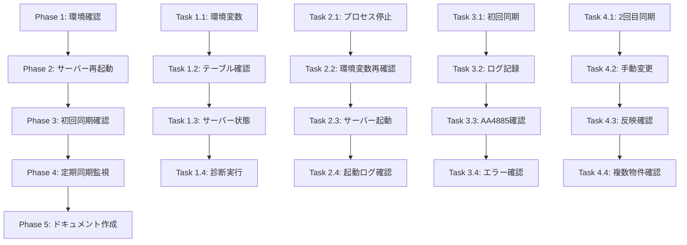

# 物件リスト更新同期修正 - タスク定義

## ステータス: 📋 タスク定義完了

## タスク概要

このspecは、既存物件のフィールド更新（特にATBB状況）がスプレッドシートからデータベースに自動同期されない問題を修正するための具体的なタスクを定義します。

## タスク構造

```
Phase 1: 環境確認と準備 (30分)
├── Task 1.1: 環境変数の確認
├── Task 1.2: sync_logsテーブルの確認
├── Task 1.3: バックエンドサーバーの状態確認
└── Task 1.4: 診断スクリプトの実行

Phase 2: バックエンドサーバーの再起動 (15分)
├── Task 2.1: 現在のプロセスの停止
├── Task 2.2: 環境変数の再確認
├── Task 2.3: サーバーの起動
└── Task 2.4: 起動ログの確認

Phase 3: 初回同期の確認 (10分)
├── Task 3.1: 初回同期実行の確認
├── Task 3.2: sync_logsテーブルの記録確認
├── Task 3.3: AA4885の更新確認
└── Task 3.4: エラーログの確認

Phase 4: 定期同期の監視 (30分)
├── Task 4.1: 2回目の同期確認
├── Task 4.2: 手動変更のテスト
├── Task 4.3: 変更の反映確認
└── Task 4.4: 複数物件での動作確認

Phase 5: ドキュメント作成 (30分)
├── Task 5.1: 修正サマリーの作成
├── Task 5.2: 運用手順書の作成
├── Task 5.3: トラブルシューティングガイドの作成
└── Task 5.4: 改善提案リストの作成
```

---

## Phase 1: 環境確認と準備

### Task 1.1: 環境変数の確認

**優先度**: 🔴 高  
**所要時間**: 5分  
**担当**: システム管理者

**目的**: 自動同期に必要な環境変数が正しく設定されているか確認する

**手順**:
1. `backend/.env`ファイルを開く
2. 以下の環境変数を確認:
   ```bash
   AUTO_SYNC_ENABLED=true
   SYNC_INTERVAL_MINUTES=5
   ```
3. 設定されていない場合は追加する

**成果物**:
- [ ] 環境変数の確認完了
- [ ] 必要に応じて`.env`ファイルを更新

**検証方法**:
```bash
# .envファイルの内容を確認
cat backend/.env | grep AUTO_SYNC
cat backend/.env | grep SYNC_INTERVAL
```

---

### Task 1.2: sync_logsテーブルの確認

**優先度**: 🔴 高  
**所要時間**: 5分  
**担当**: システム管理者

**目的**: sync_logsテーブルが存在し、正しく機能しているか確認する

**手順**:
1. 診断スクリプトを実行:
   ```bash
   npx ts-node backend/check-sync-tables.ts
   ```
2. テーブルの存在を確認
3. 現在の記録件数を確認

**成果物**:
- [ ] sync_logsテーブルの存在確認
- [ ] 現在の記録件数の把握

**期待される結果**:
- テーブルが存在する
- 記録件数が0件（または古い記録のみ）

---

### Task 1.3: バックエンドサーバーの状態確認

**優先度**: 🔴 高  
**所要時間**: 10分  
**担当**: システム管理者

**目的**: 現在のバックエンドサーバーの状態を確認する

**手順**:
1. プロセスの確認:
   ```bash
   # Windowsの場合
   tasklist | findstr node
   
   # プロセスの詳細確認
   wmic process where "name='node.exe'" get processid,commandline
   ```
2. 起動時刻の確認
3. ログファイルの確認:
   ```bash
   # 最新のログを確認
   tail -n 50 backend/logs/app.log
   ```

**成果物**:
- [ ] 現在のプロセスID
- [ ] 起動時刻
- [ ] 最新のログ内容

**確認ポイント**:
- 定期同期マネージャーの起動ログがあるか
- エラーログがないか
- 最後の同期実行時刻

---

### Task 1.4: 診断スクリプトの実行

**優先度**: 🟡 中  
**所要時間**: 10分  
**担当**: システム管理者

**目的**: 現在の同期状態を詳細に診断する

**手順**:
1. 最新の同期ログを確認:
   ```bash
   npx ts-node backend/check-recent-sync-logs.ts
   ```
2. AA4885の現在の状態を確認:
   ```bash
   npx ts-node backend/check-aa4885-atbb-status.ts
   ```
3. 自動同期サービスの状態を確認:
   ```bash
   npx ts-node backend/diagnose-auto-sync-service.ts
   ```

**成果物**:
- [ ] 診断結果レポート
- [ ] 問題点のリスト
- [ ] 修正が必要な箇所の特定

**期待される結果**:
- sync_logsに記録がない（または古い）
- AA4885のATBB状況が古い
- 自動同期サービスが起動していない

---

## Phase 2: バックエンドサーバーの再起動

### Task 2.1: 現在のプロセスの停止

**優先度**: 🔴 高  
**所要時間**: 3分  
**担当**: システム管理者

**目的**: 現在実行中のバックエンドサーバーを安全に停止する

**手順**:
1. 現在のプロセスIDを確認（Task 1.3で取得）
2. プロセスを停止:
   ```bash
   # Windowsの場合
   taskkill /PID <プロセスID> /F
   
   # または、start-dev.batを使用している場合
   # Ctrl+Cで停止
   ```
3. プロセスが完全に停止したことを確認:
   ```bash
   tasklist | findstr node
   ```

**成果物**:
- [ ] バックエンドサーバーの停止完了

**注意事項**:
- 業務時間外に実施することを推奨
- 停止前に現在の状態をバックアップ

---

### Task 2.2: 環境変数の再確認

**優先度**: 🔴 高  
**所要時間**: 2分  
**担当**: システム管理者

**目的**: 再起動前に環境変数が正しく設定されているか最終確認する

**手順**:
1. `backend/.env`ファイルを再確認
2. 以下の設定を確認:
   ```bash
   AUTO_SYNC_ENABLED=true
   SYNC_INTERVAL_MINUTES=5
   ```
3. 必要に応じて修正

**成果物**:
- [ ] 環境変数の最終確認完了

---

### Task 2.3: サーバーの起動

**優先度**: 🔴 高  
**所要時間**: 5分  
**担当**: システム管理者

**目的**: バックエンドサーバーを起動し、定期同期マネージャーが正常に起動することを確認する

**手順**:
1. バックエンドサーバーを起動:
   ```bash
   cd backend
   npm run dev
   
   # または
   start-dev.bat
   ```
2. 起動ログをリアルタイムで監視
3. エラーがないことを確認

**成果物**:
- [ ] バックエンドサーバーの起動完了
- [ ] 起動ログの保存

**期待されるログ**:
```
✅ EnhancedAutoSyncService initialized
📊 Enhanced periodic auto-sync enabled (interval: 5 minutes)
   Using full comparison mode - all missing sellers will be detected
🔄 Starting initial sync in 5 seconds...
```

---

### Task 2.4: 起動ログの確認

**優先度**: 🔴 高  
**所要時間**: 5分  
**担当**: システム管理者

**目的**: 定期同期マネージャーが正常に起動したことを確認する

**手順**:
1. 起動ログを確認
2. 以下のメッセージを探す:
   - `EnhancedAutoSyncService initialized`
   - `Enhanced periodic auto-sync enabled`
   - `Starting initial sync in 5 seconds`
3. エラーメッセージがないことを確認

**成果物**:
- [ ] 起動ログの確認完了
- [ ] 定期同期マネージャーの起動確認

**トラブルシューティング**:
- ログが表示されない場合 → 環境変数を再確認
- エラーが表示される場合 → エラーメッセージを記録し、調査

---

## Phase 3: 初回同期の確認

### Task 3.1: 初回同期実行の確認

**優先度**: 🔴 高  
**所要時間**: 2分  
**担当**: システム管理者

**目的**: 起動後5秒で初回同期が実行されることを確認する

**手順**:
1. サーバー起動後、5秒待つ
2. ログで初回同期の実行を確認
3. 同期処理の進行状況を監視

**成果物**:
- [ ] 初回同期の実行確認

**期待されるログ**:
```
🔄 Starting property listing update sync...
✅ Property listing update sync completed: X updated, Y errors
```

---

### Task 3.2: sync_logsテーブルの記録確認

**優先度**: 🔴 高  
**所要時間**: 3分  
**担当**: システム管理者

**目的**: sync_logsテーブルに同期履歴が記録されることを確認する

**手順**:
1. 診断スクリプトを実行:
   ```bash
   npx ts-node backend/check-recent-sync-logs.ts
   ```
2. 最新の記録を確認
3. 記録内容を検証:
   - sync_type: 'property_listing_update'
   - status: 'success' または 'error'
   - records_processed: 更新件数
   - started_at, completed_at: タイムスタンプ

**成果物**:
- [ ] sync_logsテーブルへの記録確認
- [ ] 記録内容の検証完了

---

### Task 3.3: AA4885の更新確認

**優先度**: 🔴 高  
**所要時間**: 3分  
**担当**: システム管理者

**目的**: AA4885のATBB状況が更新されることを確認する

**手順**:
1. 診断スクリプトを実行:
   ```bash
   npx ts-node backend/check-aa4885-atbb-status.ts
   ```
2. 更新前後の値を比較
3. 最終更新時刻を確認

**成果物**:
- [ ] AA4885の更新確認
- [ ] 更新前後の値の記録

**期待される結果**:
- ATBB状況が最新の値に更新されている
- 最終更新時刻が現在時刻に近い

---

### Task 3.4: エラーログの確認

**優先度**: 🟡 中  
**所要時間**: 2分  
**担当**: システム管理者

**目的**: 初回同期でエラーが発生していないか確認する

**手順**:
1. ログファイルを確認:
   ```bash
   tail -n 100 backend/logs/app.log | grep -i error
   ```
2. sync_logsテーブルのerror_messageを確認
3. エラーがある場合は詳細を記録

**成果物**:
- [ ] エラーログの確認完了
- [ ] エラーがある場合は詳細を記録

---

## Phase 4: 定期同期の監視

### Task 4.1: 2回目の同期確認

**優先度**: 🔴 高  
**所要時間**: 7分  
**担当**: システム管理者

**目的**: 5分後に2回目の同期が自動実行されることを確認する

**手順**:
1. 初回同期完了後、5分待つ
2. ログで2回目の同期実行を確認
3. sync_logsテーブルに新しい記録が追加されることを確認

**成果物**:
- [ ] 2回目の同期実行確認
- [ ] 定期実行の動作確認

**期待される結果**:
- 5分後に自動的に同期が実行される
- sync_logsテーブルに新しい記録が追加される

---

### Task 4.2: 手動変更のテスト

**優先度**: 🔴 高  
**所要時間**: 5分  
**担当**: システム管理者

**目的**: スプレッドシートでの手動変更が同期されることを確認する

**手順**:
1. スプレッドシートを開く
2. AA4885のATBB状況を別の値に変更
3. 変更を保存
4. 変更内容を記録

**成果物**:
- [ ] スプレッドシートでの変更完了
- [ ] 変更前後の値の記録

**変更例**:
- 変更前: "公開中"
- 変更後: "非公開"

---

### Task 4.3: 変更の反映確認

**優先度**: 🔴 高  
**所要時間**: 8分  
**担当**: システム管理者

**目的**: スプレッドシートでの変更が次の同期で反映されることを確認する

**手順**:
1. 次の同期実行を待つ（最大5分）
2. 同期完了後、AA4885の状態を確認:
   ```bash
   npx ts-node backend/check-aa4885-atbb-status.ts
   ```
3. 変更が反映されていることを確認
4. sync_logsテーブルで更新件数を確認

**成果物**:
- [ ] 変更の反映確認
- [ ] 同期処理の正常動作確認

**期待される結果**:
- AA4885のATBB状況がスプレッドシートの値と一致
- sync_logsに1件以上の更新記録

---

### Task 4.4: 複数物件での動作確認

**優先度**: 🟡 中  
**所要時間**: 10分  
**担当**: システム管理者

**目的**: 複数の物件で同期が正常に動作することを確認する

**手順**:
1. スプレッドシートで複数の物件を変更:
   - AA4885: ATBB状況を変更
   - 他の物件: 価格や面積を変更
2. 次の同期実行を待つ
3. 各物件の変更が反映されることを確認
4. sync_logsで更新件数を確認

**成果物**:
- [ ] 複数物件での動作確認
- [ ] 各物件の変更反映確認

**期待される結果**:
- すべての変更が正しく反映される
- エラーが発生しない

---

## Phase 5: ドキュメント作成

### Task 5.1: 修正サマリーの作成

**優先度**: 🟡 中  
**所要時間**: 10分  
**担当**: システム管理者

**目的**: 修正内容を簡潔にまとめたドキュメントを作成する

**手順**:
1. `IMPLEMENTATION_COMPLETE.md`を作成
2. 以下の内容を記載:
   - 問題の概要
   - 実施した修正内容
   - 修正結果
   - 検証結果
   - 今後の監視計画

**成果物**:
- [ ] `IMPLEMENTATION_COMPLETE.md`の作成

**テンプレート**:
```markdown
# 物件リスト更新同期修正 - 実装完了

## 問題の概要
[問題の説明]

## 実施した修正
[修正内容]

## 修正結果
[結果の説明]

## 検証結果
[検証内容と結果]

## 今後の監視計画
[監視方法]
```

---

### Task 5.2: 運用手順書の作成

**優先度**: 🟡 中  
**所要時間**: 10分  
**担当**: システム管理者

**目的**: 日常的な運用手順をまとめたドキュメントを作成する

**手順**:
1. `OPERATION_GUIDE.md`を作成
2. 以下の内容を記載:
   - 同期状態の確認方法
   - 手動同期の実行方法
   - エラー発生時の対応手順
   - バックエンドサーバーの再起動手順

**成果物**:
- [ ] `OPERATION_GUIDE.md`の作成

**含めるべき内容**:
- 日次チェックリスト
- 週次チェックリスト
- 緊急時の対応手順
- よくある質問（FAQ）

---

### Task 5.3: トラブルシューティングガイドの作成

**優先度**: 🟡 中  
**所要時間**: 5分  
**担当**: システム管理者

**目的**: 問題発生時の対応方法をまとめたドキュメントを作成する

**手順**:
1. `TROUBLESHOOTING.md`を作成
2. 以下の内容を記載:
   - よくある問題と解決方法
   - エラーメッセージの意味
   - 診断スクリプトの使い方
   - サポート連絡先

**成果物**:
- [ ] `TROUBLESHOOTING.md`の作成

**含めるべき問題**:
- 同期が実行されない
- 更新が反映されない
- エラーが頻発する
- パフォーマンスが低下する

---

### Task 5.4: 改善提案リストの作成

**優先度**: 🟢 低  
**所要時間**: 5分  
**担当**: システム管理者

**目的**: 今後の改善案をまとめたドキュメントを作成する

**手順**:
1. `FUTURE_IMPROVEMENTS.md`を作成
2. 以下の内容を記載:
   - パフォーマンス改善案
   - 機能追加案
   - 監視強化案
   - 自動化案

**成果物**:
- [ ] `FUTURE_IMPROVEMENTS.md`の作成

**改善案の例**:
- リアルタイム同期の実装
- 同期状態のダッシュボード
- 自動アラート機能
- 同期履歴の可視化

---

## タスクの依存関係



## チェックリスト

### Phase 1完了条件
- [ ] すべての環境変数が正しく設定されている
- [ ] sync_logsテーブルが存在する
- [ ] 現在のサーバー状態を把握している
- [ ] 診断結果を記録している

### Phase 2完了条件
- [ ] バックエンドサーバーが停止している
- [ ] 環境変数が正しく設定されている
- [ ] サーバーが正常に起動している
- [ ] 定期同期マネージャーが起動している

### Phase 3完了条件
- [ ] 初回同期が実行されている
- [ ] sync_logsに記録が追加されている
- [ ] AA4885が更新されている
- [ ] エラーが発生していない

### Phase 4完了条件
- [ ] 2回目の同期が自動実行されている
- [ ] 手動変更が反映されている
- [ ] 複数物件で正常に動作している
- [ ] エラーが発生していない

### Phase 5完了条件
- [ ] 修正サマリーが作成されている
- [ ] 運用手順書が作成されている
- [ ] トラブルシューティングガイドが作成されている
- [ ] 改善提案リストが作成されている

## 緊急時の対応

### 同期が失敗した場合
1. エラーログを確認
2. 手動同期スクリプトを実行
3. 問題が解決しない場合はサーバーを再起動

### データ不整合が発生した場合
1. 同期を一時停止
2. データベースとスプレッドシートを比較
3. 手動で修正
4. 同期を再開

### パフォーマンスが低下した場合
1. 同期間隔を延長（5分 → 10分）
2. 同期対象を絞り込む
3. データベースのインデックスを確認

## 次のステップ

1. **Phase 1の実行**
   - 環境確認と準備を開始
   - 診断結果を記録

2. **Phase 2の実行**
   - バックエンドサーバーを再起動
   - 起動ログを確認

3. **Phase 3-4の実行**
   - 同期動作を確認
   - 問題があれば修正

4. **Phase 5の実行**
   - ドキュメントを作成
   - 運用手順を確立

---

**作成日**: 2025-01-11  
**最終更新**: 2025-01-11  
**ステータス**: タスク定義完了 → 実装開始待ち
