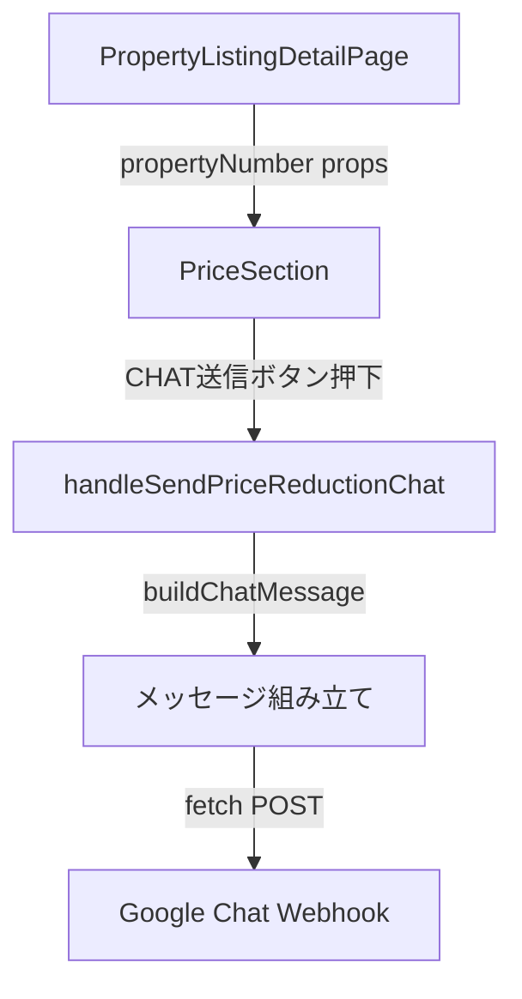

# 技術設計書：チャットメッセージへの物件番号表示

## 概要

`PriceSection` コンポーネントの「CHAT送信」ボタンから送信される Google Chat メッセージの先頭行に、物件番号を `物件番号：{propertyNumber}` の形式で追加する。

変更対象は `PriceSection.tsx` 内の `handleSendPriceReductionChat` 関数のメッセージ組み立て部分のみ。`PropertyListingDetailPage` はすでに `propertyNumber` を props として `PriceSection` に渡しているため、追加の props 変更は不要。

---

## アーキテクチャ



変更は `PriceSection.tsx` 内のメッセージ組み立てロジックのみに限定される。

---

## コンポーネントとインターフェース

### PriceSection（変更あり）

`handleSendPriceReductionChat` 内のメッセージ組み立て部分を修正する。

**変更前:**
```typescript
const message = {
  text: `【値下げ通知】\n${latestReduction}\n${address || ''}\n${propertyUrl}`
};
```

**変更後:**
```typescript
const propertyNumberLine = propertyNumber ? `物件番号：${propertyNumber}\n` : '';
const message = {
  text: `${propertyNumberLine}【値下げ通知】\n${latestReduction}\n${address || ''}\n${propertyUrl}`
};
```

確認ダイアログのプレビュー表示も同様に修正する。

**変更前（ダイアログ内）:**
```typescript
{`【値下げ通知】\n${getLatestPriceReduction() || ''}\n${address || ''}\n${window.location.origin}/property-listings/${propertyNumber}`}
```

**変更後（ダイアログ内）:**
```typescript
{`${propertyNumber ? `物件番号：${propertyNumber}\n` : ''}【値下げ通知】\n${getLatestPriceReduction() || ''}\n${address || ''}\n${window.location.origin}/property-listings/${propertyNumber}`}
```

### PropertyListingDetailPage（変更なし）

すでに `propertyNumber` を `PriceSection` に props として渡しているため変更不要。

```typescript
<PriceSection
  propertyNumber={propertyNumber || ''}
  // ... 他のprops
/>
```

---

## データモデル

新規のデータモデル変更はなし。

送信メッセージの構造（変更後）:

```
物件番号：AA1234
【値下げ通知】
K3/17 1380万→1280万
東京都渋谷区〇〇
https://example.com/property-listings/AA1234
```

物件番号が空の場合（フォールバック）:

```
【値下げ通知】
K3/17 1380万→1280万
東京都渋谷区〇〇
https://example.com/property-listings/
```

---

## 正確性プロパティ

*プロパティとは、システムの全ての有効な実行において成立すべき特性や振る舞いのことです。プロパティは人間が読める仕様と機械で検証可能な正確性保証の橋渡しをします。*

### Property 1: メッセージ先頭行の物件番号フォーマット

*For any* 有効な物件番号（空でない文字列）に対して、`buildChatMessage` が生成するメッセージの先頭行は `物件番号：{propertyNumber}` の形式でなければならない

**Validates: Requirements 1.1, 1.2**

### Property 2: 既存コンテンツの保持

*For any* 物件番号・値下げ履歴・住所・URL の組み合わせに対して、物件番号行を追加した後も既存のメッセージ本文（`【値下げ通知】`、値下げ履歴、住所、URL）がすべてメッセージ内に含まれなければならない

**Validates: Requirements 1.3, 3.1**

### Property 3: 物件番号なし時のフォールバック

*For any* 空文字列または未定義の物件番号に対して、生成されたメッセージに `物件番号：` という文字列が含まれてはならない

**Validates: Requirements 1.4**

---

## エラーハンドリング

既存のエラーハンドリングから変更なし。

- 値下げ履歴が存在しない場合: `onChatSendError('値下げ履歴が見つかりません')` を呼び出す
- Google Chat への送信失敗時: `onChatSendError('値下げ通知の送信に失敗しました')` を呼び出す
- 送信成功時: `onChatSendSuccess('値下げ通知を送信しました')` を呼び出す

物件番号の有無はエラーにならず、空の場合は物件番号行を省略するフォールバック動作をとる。

---

## テスト戦略

### ユニットテスト（例示テスト）

メッセージ組み立てロジックを純粋関数として抽出し、以下のケースをテストする:

- 物件番号あり: 先頭行が `物件番号：AA1234` になること
- 物件番号なし（空文字）: `物件番号：` が含まれないこと
- 既存コンテンツ（値下げ履歴・住所・URL）が保持されること
- `onChatSendSuccess` コールバックが送信成功後に呼ばれること
- `onChatSendError` コールバックが送信失敗後に呼ばれること

### プロパティテスト

プロパティテストライブラリ: **fast-check**（TypeScript/React プロジェクトの標準的な選択）

各プロパティテストは最低 100 回のイテレーションで実行する。

```typescript
// Property 1 & 2: メッセージ構造の検証
// Feature: property-price-change-chat-property-number, Property 1: メッセージ先頭行の物件番号フォーマット
fc.assert(fc.property(
  fc.string({ minLength: 1 }),  // 有効な物件番号
  fc.string({ minLength: 1 }),  // 値下げ履歴
  fc.string(),                   // 住所
  (propertyNumber, latestReduction, address) => {
    const message = buildChatMessage(propertyNumber, latestReduction, address, 'https://example.com');
    const lines = message.split('\n');
    return lines[0] === `物件番号：${propertyNumber}`;
  }
), { numRuns: 100 });

// Property 3: 物件番号なし時のフォールバック
// Feature: property-price-change-chat-property-number, Property 3: 物件番号なし時のフォールバック
fc.assert(fc.property(
  fc.constant(''),  // 空文字列
  fc.string({ minLength: 1 }),
  fc.string(),
  (propertyNumber, latestReduction, address) => {
    const message = buildChatMessage(propertyNumber, latestReduction, address, 'https://example.com');
    return !message.includes('物件番号：');
  }
), { numRuns: 100 });
```

### 手動確認

- 実際の物件詳細画面で「CHAT送信」ボタンを押し、Google Chat に届いたメッセージの先頭行に物件番号が表示されることを確認
- 確認ダイアログのプレビューにも物件番号が表示されることを確認
