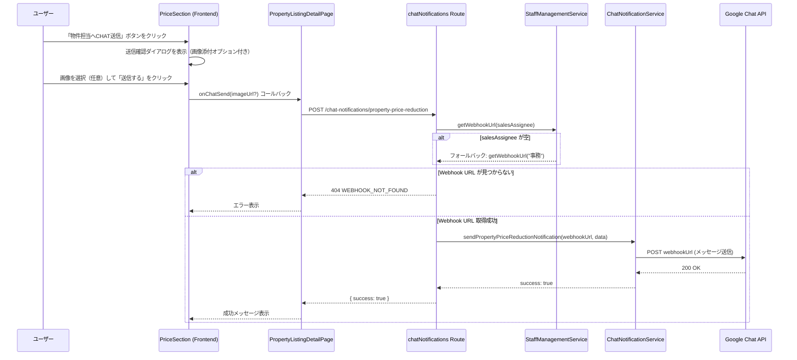
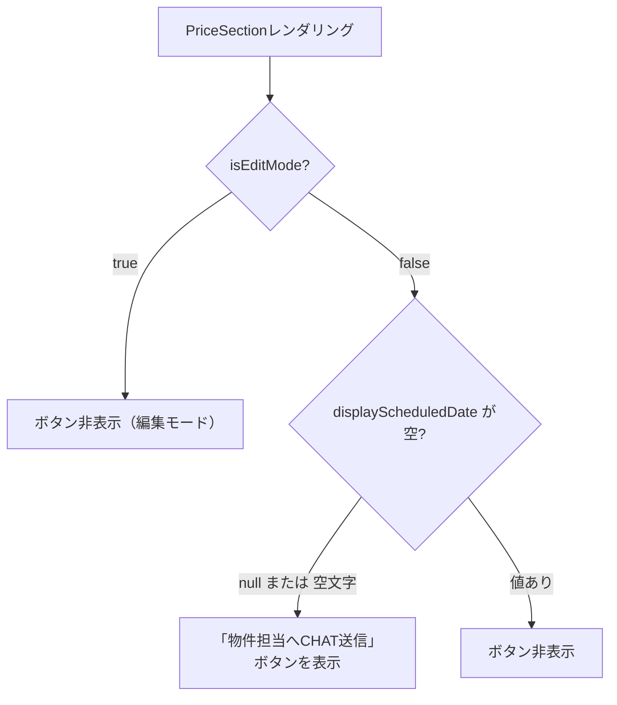

# 設計ドキュメント: property-price-reduction-chat-control

## 概要

本機能は、物件リスト詳細画面の価格情報セクション（`PriceSection`）において、「値下げ予約日」フィールドの入力状態に応じて「物件担当へCHAT送信」ボタンの表示/非表示を制御し、CHAT送信先をスタッフ管理スプレッドシートから動的に取得する機能です。

また、CHAT送信時に画像を添付できる機能を追加し、Webhook URLをバックエンドで一元管理することでセキュリティを向上させます。

### 主な変更点

1. `PriceSection.tsx` — ボタン表示制御ロジックの追加、画像添付UI、バックエンドAPI呼び出しへの変更
2. `chatNotifications.ts` — 新エンドポイント `POST /chat-notifications/property-price-reduction` の追加
3. `ChatNotificationService.ts` — 物件価格値下げ通知メソッドの追加
4. `StaffManagementService.ts` — 既存の `getWebhookUrl` メソッドを活用（変更なし）

---

## アーキテクチャ

### 全体フロー



### ボタン表示制御ロジック



---

## コンポーネントとインターフェース

### フロントエンド

#### PriceSection.tsx の変更

**追加するprops:**
```typescript
interface PriceSectionProps {
  // 既存props（変更なし）
  // ...
  onChatSend: (data: PropertyChatSendData) => Promise<void>;
}

interface PropertyChatSendData {
  imageUrl?: string;
}
```

**ボタン表示制御:**
```typescript
// 値下げ予約日が空の場合のみ表示（非編集モードのみ）
const showChatButton = !isEditMode && !displayScheduledDate;
```

**送信確認ダイアログの変更:**
- 既存の確認ダイアログに `ImageSelectorModal` を組み込む
- 画像選択は任意（オプション）
- 選択した画像の `previewUrl` または `url` を `imageUrl` として送信

#### PropertyListingDetailPage.tsx の変更

**新しいハンドラー:**
```typescript
const handlePropertyChatSend = async (data: PropertyChatSendData) => {
  await api.post('/api/chat-notifications/property-price-reduction', {
    salesAssignee: propertyData.sales_assignee || '',
    propertyNumber: propertyData.property_number,
    latestReduction: getLatestPriceReduction(propertyData.price_reduction_history),
    address: propertyData.address || '',
    imageUrl: data.imageUrl,
  });
};
```

### バックエンド

#### 新エンドポイント: POST /chat-notifications/property-price-reduction

**リクエストボディ:**
```typescript
interface PropertyPriceReductionRequest {
  salesAssignee: string;       // 担当者イニシャル（空文字可）
  propertyNumber: string;      // 物件番号
  latestReduction: string;     // 最新値下げ履歴（最初の行）
  address: string;             // 物件住所
  imageUrl?: string;           // 画像URL（任意）
}
```

**レスポンス:**
```typescript
interface PropertyPriceReductionResponse {
  success: boolean;
}
```

**エラーレスポンス:**
```typescript
// Webhook URLが見つからない場合
{
  error: {
    code: 'WEBHOOK_NOT_FOUND',
    message: '担当者のCHATアドレスが設定されていません',
    retryable: false,
  }
}
```

#### ChatNotificationService.ts の追加メソッド

```typescript
async sendPropertyPriceReductionNotification(
  webhookUrl: string,
  data: {
    propertyNumber: string;
    latestReduction: string;
    address: string;
    imageUrl?: string;
    propertyUrl: string;
  }
): Promise<boolean>
```

---

## データモデル

### リクエスト/レスポンスの型定義

```typescript
// frontend/frontend/src/types/chat.ts（新規作成）
export interface PropertyChatSendData {
  imageUrl?: string;
}

// backend/src/routes/chatNotifications.ts（既存ファイルに追加）
interface PropertyPriceReductionBody {
  salesAssignee: string;
  propertyNumber: string;
  latestReduction: string;
  address: string;
  imageUrl?: string;
}
```

### メッセージフォーマット

画像なしの場合:
```
物件番号：{propertyNumber}
【値下げ通知】
{latestReduction}
{address}
{propertyUrl}
```

画像ありの場合（テキスト形式）:
```
物件番号：{propertyNumber}
【値下げ通知】
{latestReduction}
{address}
{propertyUrl}
📷 {imageUrl}
```

---

## 正確性プロパティ

*プロパティとは、システムの全ての有効な実行において成立すべき特性や振る舞いのことです。プロパティは人間が読める仕様と機械で検証可能な正確性保証の橋渡しをします。*

### Property 1: ボタン表示と値下げ予約日の排他性

*For any* `price_reduction_scheduled_date` の値（null、空文字列、または任意の日付文字列）に対して、非編集モードにおいて「物件担当へCHAT送信」ボタンの表示状態は `!scheduledDate` と等しくなければならない（日付が空のときのみ表示）

**Validates: Requirements 1.1, 1.2, 1.3, 1.4**

### Property 2: メッセージ内容の完全性

*For any* 物件番号、値下げ履歴、住所の組み合わせに対して、`formatPropertyPriceReductionMessage` 関数が生成するメッセージは物件番号、値下げ履歴の最初の行、住所、物件詳細URLを全て含まなければならない

**Validates: Requirements 4.1, 4.2, 4.3, 4.4**

### Property 3: 画像URLのメッセージへの反映

*For any* 有効な画像URLを含む送信データに対して、生成されるCHATメッセージはその画像URLを含まなければならない

**Validates: Requirements 3.2, 3.4, 4.5**

### Property 4: リクエスト処理の完全性

*For any* 有効なリクエストボディ（salesAssignee、propertyNumber、latestReduction、addressを含む）に対して、`POST /chat-notifications/property-price-reduction` のレスポンスは必ず `success` フィールドを含まなければならない

**Validates: Requirements 5.2, 5.6**

---

## エラーハンドリング

### フロントエンド

| エラーケース | 表示メッセージ | 処理 |
|------------|--------------|------|
| Webhook URL未設定（404） | 「担当者のCHATアドレスが設定されていません」 | `onChatSendError` コールバック |
| ネットワークエラー | 「CHAT送信に失敗しました」 | `onChatSendError` コールバック |
| 送信成功 | 「物件担当へCHAT通知を送信しました」 | `onChatSendSuccess` コールバック |

### バックエンド

| エラーケース | HTTPステータス | エラーコード |
|------------|--------------|------------|
| Webhook URL未設定 | 404 | `WEBHOOK_NOT_FOUND` |
| バリデーションエラー | 400 | `VALIDATION_ERROR` |
| Google Chat送信失敗 | 500 | `NOTIFICATION_ERROR` |
| 認証エラー | 401 | — |

### フォールバックロジック

```
salesAssignee が空 or null
  → StaffManagementService.getWebhookUrl("事務") を呼び出す
  → 「事務」のWebhook URLが見つからない場合 → 404 WEBHOOK_NOT_FOUND
```

---

## テスト戦略

### ユニットテスト

**フロントエンド（Vitest + React Testing Library）:**

- `PriceSection` のボタン表示制御ロジック
  - `price_reduction_scheduled_date` が null/空文字のとき、非編集モードでボタンが表示される
  - `price_reduction_scheduled_date` に値があるとき、ボタンが非表示になる
  - 編集モードでは日付の有無に関わらずボタンが表示されない
- 送信確認ダイアログに画像添付オプションが含まれること
- 画像なしでも送信できること

**バックエンド（Jest）:**

- `ChatNotificationService.formatPropertyPriceReductionMessage` のメッセージフォーマット
- `chatNotifications` ルートのバリデーション
- `salesAssignee` が空のときのフォールバック動作
- Webhook URL未設定時の404レスポンス

### プロパティベーステスト（fast-check）

プロパティベーステストは、上記の正確性プロパティを検証するために使用します。各テストは最低100回のイテレーションで実行します。

**Property 1: ボタン表示と値下げ予約日の排他性**
```typescript
// Feature: property-price-reduction-chat-control, Property 1: ボタン表示と値下げ予約日の排他性
fc.property(
  fc.oneof(fc.constant(null), fc.constant(''), fc.string({ minLength: 1 })),
  (scheduledDate) => {
    const shouldShow = !scheduledDate;
    expect(shouldShowChatButton(scheduledDate)).toBe(shouldShow);
  }
)
```

**Property 2: メッセージ内容の完全性**
```typescript
// Feature: property-price-reduction-chat-control, Property 2: メッセージ内容の完全性
fc.property(
  fc.string({ minLength: 1 }), // propertyNumber
  fc.string({ minLength: 1 }), // latestReduction
  fc.string(),                  // address
  (propertyNumber, latestReduction, address) => {
    const message = formatPropertyPriceReductionMessage({
      propertyNumber, latestReduction, address,
      propertyUrl: `/property-listings/${propertyNumber}`,
    });
    expect(message).toContain(propertyNumber);
    expect(message).toContain(latestReduction);
    expect(message).toContain(address);
    expect(message).toContain(`/property-listings/${propertyNumber}`);
  }
)
```

**Property 3: 画像URLのメッセージへの反映**
```typescript
// Feature: property-price-reduction-chat-control, Property 3: 画像URLのメッセージへの反映
fc.property(
  fc.webUrl(),
  (imageUrl) => {
    const message = formatPropertyPriceReductionMessage({
      propertyNumber: 'TEST001',
      latestReduction: '1000万→900万',
      address: '東京都',
      propertyUrl: '/property-listings/TEST001',
      imageUrl,
    });
    expect(message).toContain(imageUrl);
  }
)
```

**Property 4: リクエスト処理の完全性**
```typescript
// Feature: property-price-reduction-chat-control, Property 4: リクエスト処理の完全性
fc.property(
  fc.record({
    salesAssignee: fc.string(),
    propertyNumber: fc.string({ minLength: 1 }),
    latestReduction: fc.string({ minLength: 1 }),
    address: fc.string(),
  }),
  async (body) => {
    const response = await request(app)
      .post('/chat-notifications/property-price-reduction')
      .set('Authorization', `Bearer ${validToken}`)
      .send(body);
    expect(response.body).toHaveProperty('success');
  }
)
```

### 統合テスト

- `StaffManagementService.getWebhookUrl` との連携（モック使用）
- Google Chat APIへの実際の送信（ステージング環境のみ）
