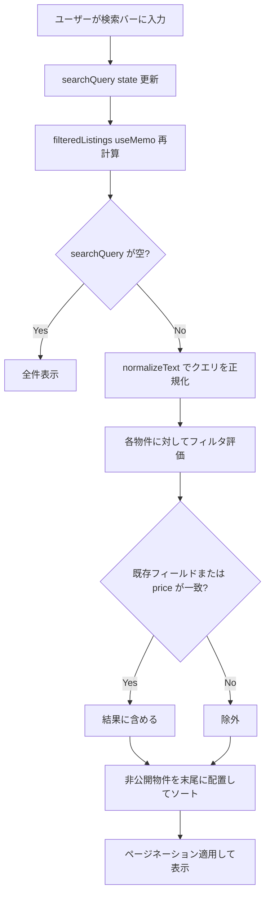

# 設計ドキュメント：物件リスト価格検索機能

## 概要

物件リストページ（`PropertyListingsPage`）の検索バーに、売買価格（`price`）フィールドを検索対象として追加する。

現状の検索フィルタは物件番号・所在地・表示用所在地・売主名・売主メール・売主電話番号・買主名を対象としており、`price` フィールドは対象外となっている。本機能では、ユーザーが `6500000` や `６５００００００`（全角）などの数値文字列を入力した際に、売買価格が一致する物件を検索結果に表示できるようにする。

変更は最小限であり、フロントエンドの `filteredListings` useMemo 内の検索フィルタに1行追加するだけで実現できる。バックエンドの変更はオプション対応とする。

---

## アーキテクチャ

本機能はクライアントサイドのフィルタリング処理のみを変更する。データ取得フローは変更しない。



### 変更対象

| レイヤー | ファイル | 変更内容 |
|---------|---------|---------|
| フロントエンド（必須） | `frontend/frontend/src/pages/PropertyListingsPage.tsx` | `filteredListings` useMemo 内の検索フィルタに `price` 条件を追加 |
| バックエンド（オプション） | `backend/src/services/PropertyListingService.ts` | `getAll` メソッドの `search` フィルタに `price` 条件を追加 |

---

## コンポーネントとインターフェース

### フロントエンド：filteredListings useMemo

**変更前（現状）:**

```typescript
if (searchQuery.trim()) {
  const query = normalizeText(searchQuery);
  listings = listings.filter(l =>
    (l.property_number ? normalizeText(l.property_number) : '').includes(query) ||
    (l.address ? normalizeText(l.address) : '').includes(query) ||
    (l.display_address ? normalizeText(l.display_address) : '').includes(query) ||
    (l.seller_name ? normalizeText(l.seller_name) : '').includes(query) ||
    (l.seller_email ? normalizeText(l.seller_email) : '').includes(query) ||
    (l.seller_phone ? normalizeText(l.seller_phone) : '').includes(query) ||
    (l.buyer_name ? normalizeText(l.buyer_name) : '').includes(query)
  );
}
```

**変更後:**

```typescript
if (searchQuery.trim()) {
  const query = normalizeText(searchQuery);
  listings = listings.filter(l =>
    (l.property_number ? normalizeText(l.property_number) : '').includes(query) ||
    (l.address ? normalizeText(l.address) : '').includes(query) ||
    (l.display_address ? normalizeText(l.display_address) : '').includes(query) ||
    (l.seller_name ? normalizeText(l.seller_name) : '').includes(query) ||
    (l.seller_email ? normalizeText(l.seller_email) : '').includes(query) ||
    (l.seller_phone ? normalizeText(l.seller_phone) : '').includes(query) ||
    (l.buyer_name ? normalizeText(l.buyer_name) : '').includes(query) ||
    (l.price != null ? normalizeText(String(l.price)) : '').includes(query)  // 追加
  );
}
```

**設計上の判断:**
- `l.price != null` で `null` と `undefined` の両方を除外する（`!= null` は `null` と `undefined` の両方に一致する）
- `String(l.price)` で数値を文字列に変換してから `normalizeText` を適用する
- `normalizeText` は NFKC 正規化（全角→半角変換）と小文字化を行うため、全角数字入力にも対応できる

### バックエンド（オプション）：PropertyListingService.getAll

**変更前（現状）:**

```typescript
if (search) {
  query = query.or(
    `property_number.ilike.%${search}%,address.ilike.%${search}%,display_address.ilike.%${search}%,seller_name.ilike.%${search}%,seller_email.ilike.%${search}%,seller_phone.ilike.%${search}%`
  );
}
```

**変更後:**

```typescript
if (search) {
  query = query.or(
    `property_number.ilike.%${search}%,address.ilike.%${search}%,display_address.ilike.%${search}%,seller_name.ilike.%${search}%,seller_email.ilike.%${search}%,seller_phone.ilike.%${search}%,price.eq.${Number(search)}`
  );
}
```

**設計上の判断:**
- Supabase の `.or()` フィルタでは `price::text ilike` のような型キャストが直接使えないため、`price.eq.{数値}` による完全一致を使用する
- 部分一致（例：`650` で `6500000` を検索）はフロントエンドのクライアントサイドフィルタで対応する
- バックエンドは現状フロントエンドから `search` パラメータを渡していないため、この変更は将来のサーバーサイド検索移行に備えたオプション対応

---

## データモデル

### PropertyListing インターフェース（変更なし）

`price` フィールドはすでに `PropertyListing` インターフェースに定義されている。

```typescript
interface PropertyListing {
  id: string;
  property_number?: string;
  // ... 他フィールド
  price?: number;  // 既存フィールド（単位：円）
  // ...
}
```

### normalizeText 関数（変更なし）

```typescript
const normalizeText = (text: string): string =>
  text.normalize('NFKC').toLowerCase();
```

- `NFKC` 正規化により全角数字（`６５００００００`）が半角数字（`6500000`）に変換される
- `toLowerCase()` は数字には影響しないが、既存の文字列フィールドとの一貫性のために適用する

---

## 正確性プロパティ

*プロパティとは、システムの全ての有効な実行において成り立つべき特性や振る舞いのことです。プロパティは人間が読める仕様と機械で検証可能な正確性保証の橋渡しをします。*

### Property 1: price フィールドによる部分一致検索

*任意の* 物件リストと任意の数値文字列クエリに対して、`price` フィールドの文字列表現にクエリが含まれる物件は全て検索結果に含まれなければならない。また、`price` が `null` または `undefined` の物件はエラーを発生させずに除外されなければならない。

**Validates: Requirements 1.1, 1.3, 1.4**

### Property 2: 既存フィールドの後方互換性

*任意の* 物件リストと任意の検索クエリに対して、既存の検索対象フィールド（`property_number`、`address`、`display_address`、`seller_name`、`seller_email`、`seller_phone`、`buyer_name`）のいずれかにクエリが含まれる物件は、`price` フィールドの追加後も引き続き検索結果に含まれなければならない。

**Validates: Requirements 1.2, 1.5**

### Property 3: 全角・半角数字の同値性

*任意の* 数値を持つ物件に対して、その数値の半角表現でのクエリと全角表現でのクエリは同じ検索結果を返さなければならない。

**Validates: Requirements 2.1, 2.2**

### Property 4: 非公開物件の後方配置の維持

*任意の* 物件リストに対して価格検索を実行した結果において、非公開ステータスの物件は公開ステータスの物件よりも後方に配置されなければならない。

**Validates: Requirements 3.1**

---

## エラーハンドリング

### price が null / undefined の場合

`l.price != null` チェックにより、`null` と `undefined` の両方を安全に処理する。条件が偽の場合は空文字列 `''` を返すため、`includes(query)` は常に `false` となり、エラーは発生しない。

```typescript
(l.price != null ? normalizeText(String(l.price)) : '').includes(query)
```

### price が 0 の場合

`l.price != null` は `0` を有効な値として扱う（`0 != null` は `true`）。`String(0)` は `'0'` となるため、`'0'` を含むクエリで検索できる。

### 非数値クエリの場合

ユーザーが文字列（例：「大阪」）を入力した場合、`price` フィールドの文字列表現（例：`'6500000'`）には通常含まれないため、`price` 条件は `false` となる。既存フィールドの検索は引き続き機能する。

---

## テスト戦略

### 単体テスト（例示テスト）

以下の具体的なケースを例示テストで確認する：

1. `price = 6500000` の物件が `'6500000'` クエリで検索できること
2. `price = 6500000` の物件が `'650'` クエリ（部分一致）で検索できること
3. `price = null` の物件に対して検索してもエラーが発生しないこと
4. `price = undefined` の物件に対して検索してもエラーが発生しないこと
5. 既存フィールド（`seller_name` 等）の検索が引き続き機能すること
6. 0件の場合に「物件データが見つかりませんでした」が表示されること

### プロパティベーステスト

プロパティベーステストには [fast-check](https://github.com/dubzzz/fast-check)（TypeScript/JavaScript 向け）を使用する。各テストは最低 100 回のイテレーションで実行する。

**Property 1: price フィールドによる部分一致検索**

```typescript
// Feature: property-price-search, Property 1: price フィールドによる部分一致検索
fc.assert(
  fc.property(
    fc.array(fc.record({
      price: fc.oneof(fc.integer({ min: 1, max: 999999999 }), fc.constant(null), fc.constant(undefined)),
      // 他フィールドは空文字列（price以外でマッチしないように）
      property_number: fc.constant(''),
      address: fc.constant(''),
      // ...
    })),
    fc.integer({ min: 1, max: 999999999 }),
    (listings, priceValue) => {
      const query = normalizeText(String(priceValue));
      const result = applySearchFilter(listings, query);
      // priceにクエリが含まれる物件は全て結果に含まれる
      const expected = listings.filter(l =>
        l.price != null && normalizeText(String(l.price)).includes(query)
      );
      return expected.every(l => result.includes(l));
    }
  ),
  { numRuns: 100 }
);
```

**Property 2: 既存フィールドの後方互換性**

```typescript
// Feature: property-price-search, Property 2: 既存フィールドの後方互換性
fc.assert(
  fc.property(
    fc.array(fc.record({
      seller_name: fc.string(),
      price: fc.constant(null), // priceはnullにしてprice以外でマッチさせる
      // ...
    })),
    fc.string({ minLength: 1 }),
    (listings, query) => {
      const normalizedQuery = normalizeText(query);
      const result = applySearchFilter(listings, normalizedQuery);
      const expectedBySeller = listings.filter(l =>
        l.seller_name && normalizeText(l.seller_name).includes(normalizedQuery)
      );
      return expectedBySeller.every(l => result.includes(l));
    }
  ),
  { numRuns: 100 }
);
```

**Property 3: 全角・半角数字の同値性**

```typescript
// Feature: property-price-search, Property 3: 全角・半角数字の同値性
fc.assert(
  fc.property(
    fc.integer({ min: 1, max: 999999999 }),
    (priceValue) => {
      const listing = { price: priceValue, property_number: '', address: '', /* ... */ };
      const halfWidthQuery = String(priceValue);
      const fullWidthQuery = toFullWidth(halfWidthQuery); // 半角→全角変換
      const resultHalf = applySearchFilter([listing], normalizeText(halfWidthQuery));
      const resultFull = applySearchFilter([listing], normalizeText(fullWidthQuery));
      return resultHalf.length === resultFull.length;
    }
  ),
  { numRuns: 100 }
);
```

**Property 4: 非公開物件の後方配置の維持**

```typescript
// Feature: property-price-search, Property 4: 非公開物件の後方配置の維持
fc.assert(
  fc.property(
    fc.array(fc.record({
      price: fc.integer({ min: 1, max: 999999999 }),
      atbb_status: fc.oneof(fc.constant('公開中'), fc.constant('非公開'), fc.constant('取引中')),
      // ...
    })),
    fc.integer({ min: 1, max: 999999999 }),
    (listings, priceValue) => {
      const query = normalizeText(String(priceValue));
      const result = applySearchFilter(listings, query);
      // 非公開物件が公開物件より後ろにあることを確認
      let foundPrivate = false;
      for (const listing of result) {
        if (isPrivateStatus(listing.atbb_status)) {
          foundPrivate = true;
        } else if (foundPrivate) {
          return false; // 公開物件が非公開物件の後に来てはいけない
        }
      }
      return true;
    }
  ),
  { numRuns: 100 }
);
```
