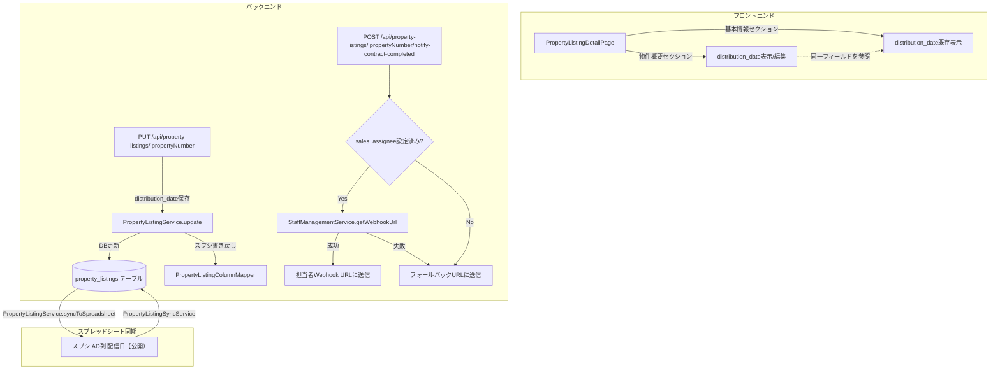

# デザインドキュメント

## 概要

本スペックは2つの独立した機能改善を実装します。

**機能1**: 物件詳細画面（`PropertyListingDetailPage`）の物件概要セクションに「公開日」フィールドを追加する。`distribution_date` は既に `property_listings` テーブルに存在し、基本情報セクションに「配信日（公開）」として表示済みであるため、物件概要セクションへの追加は既存フィールドの参照として実装する。

**機能2**: `notify-contract-completed` エンドポイントのフォールバックロジックを修正する。現在の実装では `sales_assignee` が未設定の場合のみ `DEFAULT_WEBHOOK_URL` を使用しているが、`sales_assignee` が設定されていても `StaffManagementService` のWebhook URL取得が失敗した場合にもフォールバックURLを使用するよう修正する。

---

## アーキテクチャ



---

## コンポーネントとインターフェース

### 機能1: 物件概要セクションへの「公開日」フィールド追加

#### 変更対象ファイル

**`frontend/frontend/src/pages/PropertyListingDetailPage.tsx`**

物件概要セクション（`isHeaderEditMode` で制御される `<Paper>` ブロック）に `distribution_date` フィールドを追加する。

- 表示モード: `data.distribution_date` を `YYYY/MM/DD` 形式でフォーマットして表示（値がない場合は `-`）
- 編集モード: `type="date"` の `<TextField>` を表示し、`handleFieldChange('distribution_date', ...)` で変更を追跡
- 保存: 既存の `handleSaveHeader` 関数が `editedData` を `PUT /api/property-listings/:propertyNumber` に送信するため、追加の変更不要

#### 日付フォーマット関数

既存の `formatDate` ユーティリティ関数（または同等のロジック）を使用して `YYYY-MM-DD` → `YYYY/MM/DD` に変換する。

```typescript
// 表示用フォーマット
const formatDisplayDate = (dateStr: string | null | undefined): string => {
  if (!dateStr) return '-';
  return dateStr.replace(/-/g, '/');
};
```

### 機能2: 売買契約完了通知のフォールバック修正

#### 変更対象ファイル

**`backend/src/routes/propertyListings.ts`**

`notify-contract-completed` エンドポイントのWebhook URL決定ロジックを修正する。

**現在の実装（問題あり）:**
```typescript
let webhookUrl = DEFAULT_WEBHOOK_URL;
if (property.sales_assignee) {
  const staffService = new StaffManagementService();
  const result = await staffService.getWebhookUrl(property.sales_assignee);
  if (result.success && result.webhookUrl) {
    webhookUrl = result.webhookUrl;
  }
  // ← result.success が false の場合、DEFAULT_WEBHOOK_URL が使われるが
  //   ログが出ないため問題の把握が困難
}
```

**修正後の実装:**
```typescript
let webhookUrl = DEFAULT_WEBHOOK_URL;
if (property.sales_assignee) {
  const staffService = new StaffManagementService();
  const result = await staffService.getWebhookUrl(property.sales_assignee);
  if (result.success && result.webhookUrl) {
    webhookUrl = result.webhookUrl;
    console.log(`[notify-contract-completed] Using assignee webhook for ${property.sales_assignee}`);
  } else {
    // Webhook URL取得失敗 → フォールバックURLを使用
    console.warn(`[notify-contract-completed] Failed to get webhook for ${property.sales_assignee}: ${result.error}. Using fallback URL.`);
    // webhookUrl は DEFAULT_WEBHOOK_URL のまま
  }
} else {
  console.log(`[notify-contract-completed] No sales_assignee set for ${propertyNumber}. Using fallback URL.`);
}
```

---

## データモデル

### `property_listings` テーブル（既存）

| カラム名 | 型 | 説明 |
|---------|-----|------|
| `distribution_date` | DATE | 配信日（公開）。スプシのAD列「配信日【公開）」に対応 |

`distribution_date` は既にテーブルに存在し、基本情報セクションで使用済み。新規カラム追加は不要。

### スプレッドシートマッピング（既存）

`backend/src/config/property-listing-column-mapping.json` に既にマッピング済み:

```json
{
  "spreadsheetToDatabase": {
    "配信日【公開）": "distribution_date"
  }
}
```

スプシ→DB同期は `PropertyListingSyncService` が担当し、既に機能している。

---

## 正確性プロパティ

*プロパティとは、システムの全ての有効な実行において成立すべき特性や振る舞いのことです。プロパティは人間が読める仕様と機械で検証可能な正確性保証の橋渡しをします。*

### Property 1: 日付フォーマット

*任意の* `null`、空文字列、または `undefined` の `distribution_date` 値について、表示フォーマット関数は `-` を返す。また、任意の有効な `YYYY-MM-DD` 形式の日付文字列について、フォーマット関数は `YYYY/MM/DD` 形式の文字列を返す。

**Validates: Requirements 1.2**

### Property 2: 公開日フィールドの保存ラウンドトリップ

*任意の* 有効な日付文字列（`YYYY-MM-DD` 形式）について、物件概要セクションで `distribution_date` を変更して保存した場合、その後に同じ物件を取得すると保存した値が返される。

**Validates: Requirements 1.4**

### Property 3: スプレッドシートカラムマッピング

*任意の* スプレッドシート行データについて、`配信日【公開）` カラムの値が `PropertyListingColumnMapper` を通じて `distribution_date` にマッピングされる。

**Validates: Requirements 1.5**

### Property 4: フォールバックURL使用条件

*任意の* 物件について、`sales_assignee` が未設定の場合、または `sales_assignee` が設定されていても `StaffManagementService` のWebhook URL取得が失敗した場合、`notify-contract-completed` エンドポイントはフォールバックURLにメッセージを送信する。

**Validates: Requirements 2.1, 2.2**

### Property 5: 担当者Webhook成功時の送信先

*任意の* `sales_assignee` が設定されており `StaffManagementService` がWebhook URLの取得に成功した物件について、`notify-contract-completed` を呼び出すと、担当者のWebhook URLにメッセージが送信される（フォールバックURLではない）。

**Validates: Requirements 2.3**

### Property 6: メッセージ形式の一貫性

*任意の* 物件番号と住所について、フォールバックURLへの送信時も担当者URLへの送信時も、メッセージ形式は `契約が完了しましたので、ネット非公開お願いします。{物件番号}　{住所}よろしくお願いいたします` と同一である。

**Validates: Requirements 2.4**

---

## エラーハンドリング

### 機能1: 公開日フィールド

| シナリオ | 対応 |
|---------|------|
| `distribution_date` の保存失敗 | 既存の `handleSaveHeader` のエラーハンドリングに委ねる（スナックバーでエラー表示） |
| 無効な日付形式 | `type="date"` の HTML バリデーションで防止 |
| スプシ書き戻し失敗 | `PropertyListingService.update` 内でログ記録のみ（DB更新は成功扱い） |

### 機能2: 契約完了通知

| シナリオ | 対応 |
|---------|------|
| `sales_assignee` 未設定 | フォールバックURLを使用、ログに記録 |
| `StaffManagementService` Webhook取得失敗 | フォールバックURLを使用、`console.warn` でログ記録 |
| Google Chat送信失敗（フォールバックURL含む） | HTTP 500 + エラーメッセージを返す（既存の `catch` ブロックで処理） |
| 物件が見つからない | HTTP 404 を返す（既存の処理） |

---

## テスト戦略

### ユニットテスト

- `notify-contract-completed` エンドポイントのWebhook URL決定ロジック
  - `sales_assignee` 未設定 → フォールバックURL使用
  - `sales_assignee` 設定済み + Webhook取得成功 → 担当者URL使用
  - `sales_assignee` 設定済み + Webhook取得失敗 → フォールバックURL使用
- 日付フォーマット関数（`YYYY-MM-DD` → `YYYY/MM/DD`、null/空文字 → `-`）

### プロパティベーステスト

プロパティベーステストには TypeScript 向けの `fast-check` ライブラリを使用する。各テストは最低100回のイテレーションを実行する。

**テスト1: 日付フォーマットプロパティ（Property 1）**

```typescript
// Feature: property-public-date-and-contract-notification, Property 1: 日付フォーマット
fc.assert(fc.property(
  fc.oneof(fc.constant(null), fc.constant(''), fc.constant(undefined)),
  (emptyDate) => {
    return formatDisplayDate(emptyDate) === '-';
  }
), { numRuns: 100 });

fc.assert(fc.property(
  fc.date({ min: new Date('2000-01-01'), max: new Date('2099-12-31') }),
  (date) => {
    const yyyy = date.getFullYear();
    const mm = String(date.getMonth() + 1).padStart(2, '0');
    const dd = String(date.getDate()).padStart(2, '0');
    const input = `${yyyy}-${mm}-${dd}`;
    const result = formatDisplayDate(input);
    return result === `${yyyy}/${mm}/${dd}`;
  }
), { numRuns: 100 });
```

**テスト2: フォールバックURL使用条件プロパティ（Property 4）**

```typescript
// Feature: property-public-date-and-contract-notification, Property 4: フォールバックURL使用条件
fc.assert(fc.asyncProperty(
  fc.oneof(fc.constant(null), fc.constant(''), fc.constant(undefined)),
  async (salesAssignee) => {
    // sales_assigneeが未設定の場合、フォールバックURLが使われることを検証
    const webhookUrl = await determineWebhookUrl(salesAssignee, mockStaffService, DEFAULT_WEBHOOK_URL);
    return webhookUrl === DEFAULT_WEBHOOK_URL;
  }
), { numRuns: 100 });

fc.assert(fc.asyncProperty(
  fc.string({ minLength: 1 }),  // 任意の担当者名
  async (salesAssignee) => {
    // Webhook取得失敗の場合、フォールバックURLが使われることを検証
    const failingStaffService = { getWebhookUrl: async () => ({ success: false, error: 'not found' }) };
    const webhookUrl = await determineWebhookUrl(salesAssignee, failingStaffService, DEFAULT_WEBHOOK_URL);
    return webhookUrl === DEFAULT_WEBHOOK_URL;
  }
), { numRuns: 100 });
```

**テスト3: メッセージ形式プロパティ（Property 6）**

```typescript
// Feature: property-public-date-and-contract-notification, Property 6: メッセージ形式の一貫性
fc.assert(fc.property(
  fc.string({ minLength: 1 }),  // propertyNumber
  fc.string(),                   // address
  (propertyNumber, address) => {
    const message = buildContractMessage(propertyNumber, address);
    return message.includes(propertyNumber) &&
           message.startsWith('契約が完了しましたので、ネット非公開お願いします。') &&
           message.endsWith('よろしくお願いいたします');
  }
), { numRuns: 100 });
```

### 統合テスト（手動確認）

- 物件概要セクションで公開日を編集・保存後、ページをリロードして値が保持されることを確認
- `sales_assignee` が未設定の物件で「契約完了」ボタンを押し、フォールバックURLのチャットスペースに通知が届くことを確認
- `sales_assignee` が設定されている物件で「契約完了」ボタンを押し、担当者のチャットに通知が届くことを確認
