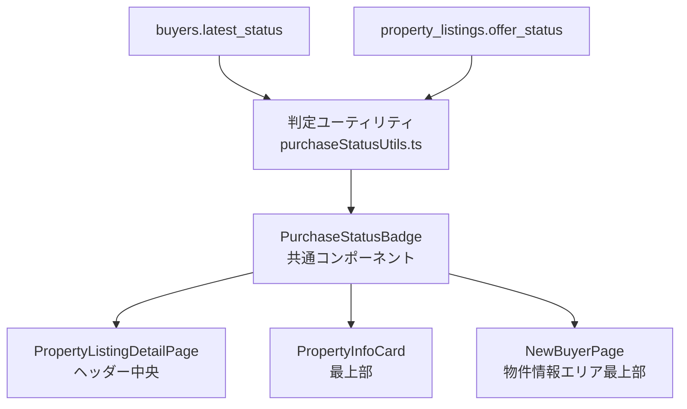

# 設計ドキュメント: 買付状況表示機能

## 概要

物件の買付状況を、関連する3つの画面の目立つ位置に赤字で表示する機能を実装する。担当者が物件詳細・買主詳細・買主新規登録の各画面を開いた際に、買付が入っている物件を一目で把握できるようにすることで、対応漏れや誤った案内を防ぐ。

### 表示条件

- **条件1（買主側）**: `buyers.latest_status` に「買」が含まれる → その値を表示
- **条件2（物件側）**: `property_listings.offer_status` に空でない値がある → その値を表示
- 両方成立時は条件1を優先

### 表示対象画面

1. `PropertyListingDetailPage.tsx` のヘッダー中央付近
2. `BuyerDetailPage.tsx` の `PropertyInfoCard.tsx` 最上部
3. `NewBuyerPage.tsx` の物件情報エリア最上部

---

## アーキテクチャ



### 設計方針

- **共通コンポーネント**: `PurchaseStatusBadge` を新規作成し、3箇所で再利用する
- **判定ロジック分離**: `purchaseStatusUtils.ts` にユーティリティ関数として切り出し、テスト可能にする
- **既存コンポーネントへの最小限の変更**: 各ページへの変更は `PurchaseStatusBadge` の挿入のみ
- **バックエンド変更なし**: `offer_status` は `property_listings` テーブルに既存フィールドとして存在する（`PropertyInfoCard.tsx` の `PropertyFullDetails` インターフェースに `offer_status?: string` が定義済み）

---

## コンポーネントとインターフェース

### 1. `purchaseStatusUtils.ts`（新規作成）

**パス**: `frontend/frontend/src/utils/purchaseStatusUtils.ts`

```typescript
/**
 * 買付状況テキストを返す。
 * 条件1（latest_statusに「買」を含む）が優先。
 * どちらも成立しない場合は null を返す。
 */
export function getPurchaseStatusText(
  latestStatus: string | null | undefined,
  offerStatus: string | null | undefined
): string | null

/**
 * 条件1の判定: latest_statusに「買」が含まれるか
 */
export function hasBuyerPurchaseStatus(
  latestStatus: string | null | undefined
): boolean

/**
 * 条件2の判定: offer_statusに空でない値があるか
 */
export function hasPropertyOfferStatus(
  offerStatus: string | null | undefined
): boolean
```

### 2. `PurchaseStatusBadge.tsx`（新規作成）

**パス**: `frontend/frontend/src/components/PurchaseStatusBadge.tsx`

```typescript
interface PurchaseStatusBadgeProps {
  /** 買付状況テキスト（nullの場合は何も表示しない） */
  statusText: string | null;
}
```

**表示仕様**:
- `statusText` が null または空文字の場合: 何も表示しない（`null` を返す）
- 表示時: 赤背景（`error.light`）、赤文字（`error.main`）、太字、`fontSize: '1.1rem'`、左右パディング付きのボックス

### 3. 既存コンポーネントへの変更

#### `PropertyListingDetailPage.tsx`

ヘッダーの `Box` 内（物件番号・コピーボタンの右隣）に `PurchaseStatusBadge` を追加。

```tsx
// 判定に使うデータ
// - data.offer_status（物件側）
// - buyers配列の中で latest_status に「買」を含む買主がいるか（買主側）
const purchaseStatusText = getPurchaseStatusText(
  buyers.find(b => hasBuyerPurchaseStatus(b.latest_status))?.latest_status,
  data.offer_status
);

// ヘッダー中央付近に挿入
<PurchaseStatusBadge statusText={purchaseStatusText} />
```

#### `PropertyInfoCard.tsx`

コンポーネントの `return` 内、最初の `Box` の直後（他のコンテンツより前）に追加。

```tsx
// buyer.latest_status（条件1のみ使用）
const purchaseStatusText = getPurchaseStatusText(buyer?.latest_status, null);

<PurchaseStatusBadge statusText={purchaseStatusText} />
```

#### `NewBuyerPage.tsx`

物件情報エリア（`<Paper>` 内）の先頭に追加。

```tsx
// latestStatus（フォームの状態）と propertyInfo.offer_status を使用
const purchaseStatusText = getPurchaseStatusText(latestStatus, propertyInfo?.offer_status);

<PurchaseStatusBadge statusText={purchaseStatusText} />
```

---

## データモデル

### 既存フィールドの確認

| テーブル/ソース | フィールド | 型 | 備考 |
|---|---|---|---|
| `buyers` | `latest_status` | `string \| null` | 買主の最新状況 |
| `property_listings` | `offer_status` | `string \| null` | 物件の買付フィールド（既存） |

`offer_status` は `property_listings` テーブルに既存フィールドとして存在することを確認済み（`PropertyInfoCard.tsx` の `PropertyFullDetails` インターフェース、`PropertyListingService.ts`、`propertyListingStatusUtils.ts` で参照されている）。**バックエンドへの変更は不要。**

### `PropertyListingDetailPage` での買主側データ取得

`PropertyListingDetailPage` は `/api/property-listings/:propertyNumber/buyers` エンドポイントで買主リストを取得している。このレスポンスに `latest_status` が含まれているかを確認し、含まれていない場合はAPIレスポンスの型定義を拡張する。

---

## 正確性プロパティ

*プロパティとは、システムの全ての有効な実行において成立すべき特性や振る舞いのことです。プロパティは人間が読める仕様と機械で検証可能な正確性保証の橋渡しをします。*

### Property 1: 判定ロジックの正確性（条件1）

*For any* `latest_status` の値について、「買」という文字を含む場合は `hasBuyerPurchaseStatus` が `true` を返し、null・空文字・「買」を含まない文字列の場合は `false` を返す。

**Validates: Requirements 1.1, 1.4**

### Property 2: 判定ロジックの正確性（条件2）

*For any* `offer_status` の値について、空でない文字列の場合は `hasPropertyOfferStatus` が `true` を返し、null・空文字の場合は `false` を返す。

**Validates: Requirements 1.2, 1.5**

### Property 3: 優先順位の正確性

*For any* `latest_status`（「買」を含む）と `offer_status`（空でない）の組み合わせについて、`getPurchaseStatusText` は常に `latest_status` の値を返す。

**Validates: Requirements 1.3**

### Property 4: 買付状況テキストの表示・非表示

*For any* `latest_status` と `offer_status` の組み合わせについて、`getPurchaseStatusText` が非null値を返す場合は `PurchaseStatusBadge` が要素を描画し、null を返す場合は何も描画しない。

**Validates: Requirements 2.1, 2.2, 3.1, 3.2, 4.1, 4.2**

### Property 5: スタイルの正確性

*For any* 非null の `statusText` について、`PurchaseStatusBadge` が描画する要素は `color: error`（赤）、`fontWeight: bold`、`fontSize: 1.1rem` 以上のスタイルを持つ。

**Validates: Requirements 2.3, 5.1, 5.2, 5.4**

### Property 6: latest_statusを使った条件1判定

*For any* `buyer` オブジェクトについて、`buyer.latest_status` に「買」が含まれる場合は `PurchaseStatusBadge` が `buyer.latest_status` の値を表示し、含まれない場合は何も表示しない。

**Validates: Requirements 3.4, 4.5**

### Property 7: offer_statusを使った条件2判定（NewBuyerPage）

*For any* `propertyInfo` オブジェクトについて、`propertyInfo.offer_status` が空でない場合（かつ条件1が不成立の場合）は `PurchaseStatusBadge` が `propertyInfo.offer_status` の値を表示する。

**Validates: Requirements 4.6**

---

## エラーハンドリング

| ケース | 対応 |
|---|---|
| 物件データ取得中（ローディング） | `data` が null のため `getPurchaseStatusText` に null が渡され、バッジは表示されない |
| 買主データ取得失敗 | `buyers` が空配列のため条件1は不成立。条件2のみで判定 |
| `offer_status` フィールドが存在しない | `undefined` は null と同様に扱われ、条件2は不成立 |
| `NewBuyerPage` で物件番号未入力 | `propertyInfo` が null のため条件2は不成立 |

---

## テスト戦略

### ユニットテスト（例・エッジケース）

`purchaseStatusUtils.ts` の各関数に対して：

- `hasBuyerPurchaseStatus(null)` → `false`
- `hasBuyerPurchaseStatus('')` → `false`
- `hasBuyerPurchaseStatus('買付済み')` → `true`
- `hasBuyerPurchaseStatus('商談中')` → `false`
- `hasPropertyOfferStatus(null)` → `false`
- `hasPropertyOfferStatus('')` → `false`
- `hasPropertyOfferStatus('買付申込み')` → `true`
- `getPurchaseStatusText('買付済み', '買付申込み')` → `'買付済み'`（条件1優先）
- `getPurchaseStatusText(null, '買付申込み')` → `'買付申込み'`
- `getPurchaseStatusText(null, null)` → `null`

### プロパティベーステスト

**ライブラリ**: `fast-check`（TypeScript/JavaScript向けプロパティベーステストライブラリ）

**設定**: 各プロパティテストは最低100回のランダム入力で実行する

**テストファイル**: `frontend/frontend/src/__tests__/purchaseStatus.property.test.ts`

各テストには以下のタグコメントを付与する：
`// Feature: property-purchase-status-display, Property {番号}: {プロパティテキスト}`

#### Property 1 のテスト実装例

```typescript
// Feature: property-purchase-status-display, Property 1: 判定ロジックの正確性（条件1）
it('「買」を含む文字列はtrueを返し、含まない文字列はfalseを返す', () => {
  fc.assert(
    fc.property(fc.string(), (s) => {
      const result = hasBuyerPurchaseStatus(s);
      return result === s.includes('買');
    }),
    { numRuns: 100 }
  );
});
```

#### Property 3 のテスト実装例

```typescript
// Feature: property-purchase-status-display, Property 3: 優先順位の正確性
it('条件1と条件2が両方成立する場合、常に条件1の値を返す', () => {
  fc.assert(
    fc.property(
      fc.string().filter(s => s.includes('買')),  // 条件1成立
      fc.string().filter(s => s.length > 0),       // 条件2成立
      (latestStatus, offerStatus) => {
        return getPurchaseStatusText(latestStatus, offerStatus) === latestStatus;
      }
    ),
    { numRuns: 100 }
  );
});
```

### 統合テスト（手動確認）

- `PropertyListingDetailPage`: 買付あり物件でヘッダーに赤バッジが表示されること
- `PropertyInfoCard`: `latest_status` に「買」を含む買主の詳細画面でバッジが最上部に表示されること
- `NewBuyerPage`: 買付あり物件番号を入力した際にバッジが表示されること
