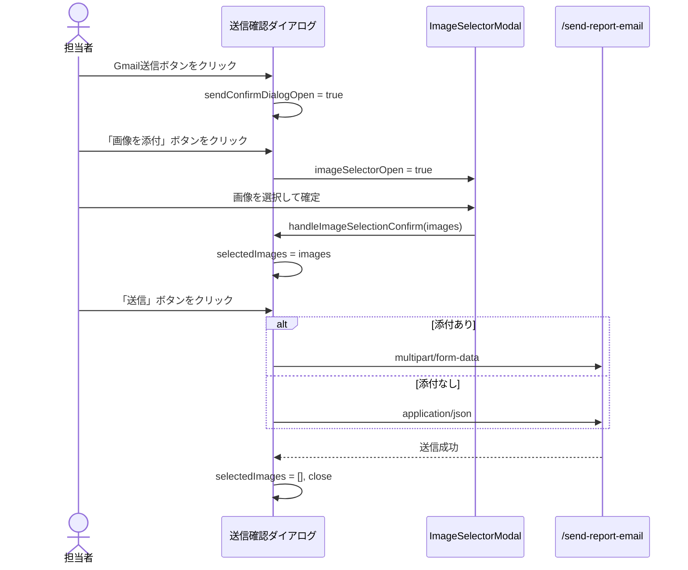

# 設計ドキュメント: property-report-gmail-attachment

## 概要

`PropertyReportPage.tsx` のGmail送信確認ダイアログに画像添付機能を追加する。
`CallModePage.tsx` で既に実装されている `ImageSelectorModal` を使った画像添付パターンをそのまま踏襲し、フロントエンドのみの変更で実現する。

バックエンドの `/api/property-listings/{propertyNumber}/send-report-email` エンドポイントは既に `multipart/form-data` に対応済みのため、変更不要。

## アーキテクチャ

変更対象は1ファイルのみ：

```
frontend/frontend/src/pages/PropertyReportPage.tsx
```

参照実装：

```
frontend/frontend/src/pages/CallModePage.tsx       （画像添付パターンの参照元）
frontend/frontend/src/components/ImageSelectorModal.tsx  （使用するコンポーネント）
```

### フロー図



## コンポーネントとインターフェース

### 追加するインポート

```typescript
import ImageSelectorModal from '../components/ImageSelectorModal';
import { Image as ImageIcon } from '@mui/icons-material';
```

### 追加するステート

```typescript
const [imageSelectorOpen, setImageSelectorOpen] = useState(false);
const [selectedImages, setSelectedImages] = useState<any[]>([]);
const [imageError, setImageError] = useState<string | null>(null);
```

### 追加するハンドラー関数

```typescript
const handleOpenImageSelector = () => {
  setImageSelectorOpen(true);
};

const handleImageSelectionConfirm = (images: any[]) => {
  setSelectedImages(images);
  setImageSelectorOpen(false);
  setImageError(null);
};

const handleImageSelectionCancel = () => {
  setImageSelectorOpen(false);
};
```

### handleSendCancel の変更

既存の `handleSendCancel` に `selectedImages` と `imageError` のリセットを追加：

```typescript
const handleSendCancel = () => {
  setSendConfirmDialogOpen(false);
  setPendingSendHistory(null);
  setSelectedImages([]);      // 追加
  setImageError(null);        // 追加
};
```

### handleSend の変更

`selectedImages` を `attachmentImages` に変換し、添付あり/なしで送信形式を切り替える：

```typescript
const handleSend = async () => {
  if (!pendingSendHistory) return;
  setSending(true);
  try {
    // selectedImages を attachmentImages に変換（CallModePage と同じロジック）
    const attachmentImages: any[] = [];
    if (Array.isArray(selectedImages) && selectedImages.length > 0) {
      for (const img of selectedImages) {
        if (img.source === 'drive') {
          attachmentImages.push({ id: img.driveFileId || img.id, name: img.name });
        } else if (img.source === 'local' && img.previewUrl) {
          const base64Match = (img.previewUrl as string).match(/^data:([^;]+);base64,(.+)$/);
          if (base64Match) {
            attachmentImages.push({
              id: img.id,
              name: img.name,
              base64Data: base64Match[2],
              mimeType: base64Match[1],
            });
          }
        } else if (img.source === 'url' && img.url) {
          attachmentImages.push({ id: img.id, name: img.name, url: img.url });
        }
      }
    }

    if (attachmentImages.length > 0) {
      // multipart/form-data で送信
      const formData = new FormData();
      formData.append('to', editTo);
      formData.append('subject', editSubject);
      formData.append('body', editBody);
      formData.append('template_name', pendingSendHistory.templateName);
      formData.append('report_date', reportData.report_date || '');
      formData.append('report_assignee', reportData.report_assignee || '');
      formData.append('report_completed', reportData.report_completed || 'N');

      const localAttachments = attachmentImages.filter(a => a.base64Data);
      const driveOrUrlAttachments = attachmentImages.filter(a => !a.base64Data);

      for (const att of localAttachments) {
        const byteString = atob(att.base64Data);
        const ab = new ArrayBuffer(byteString.length);
        const ia = new Uint8Array(ab);
        for (let i = 0; i < byteString.length; i++) ia[i] = byteString.charCodeAt(i);
        const blob = new Blob([ab], { type: att.mimeType });
        formData.append('attachments', blob, att.name);
      }

      if (driveOrUrlAttachments.length > 0) {
        formData.append('driveAttachments', JSON.stringify(driveOrUrlAttachments));
      }

      await api.post(
        `/api/property-listings/${propertyNumber}/send-report-email`,
        formData,
        { headers: { 'Content-Type': 'multipart/form-data' } }
      );
    } else {
      // 従来通り application/json で送信
      await api.post(`/api/property-listings/${propertyNumber}/send-report-email`, {
        to: editTo,
        subject: editSubject,
        body: editBody,
        template_name: pendingSendHistory.templateName,
        report_date: reportData.report_date || null,
        report_assignee: reportData.report_assignee || null,
        report_completed: reportData.report_completed || 'N',
      });
    }

    setSendConfirmDialogOpen(false);
    setPendingSendHistory(null);
    setSelectedImages([]);   // 送信成功後リセット
    fetchReportHistory();
    setSnackbar({ open: true, message: 'メールを送信しました', severity: 'success' });
  } catch (error: any) {
    const errMsg = error.response?.data?.error || 'メール送信に失敗しました';
    const errDetail = error.response?.data?.detail || '';
    const fullMsg = errDetail ? `${errMsg} / ${errDetail}` : errMsg;
    setSnackbar({ open: true, message: fullMsg, severity: 'error' });
  } finally {
    setSending(false);
  }
};
```

### 送信確認ダイアログへの追加UI

本文編集エリア（`TextField label="本文"`）の直下に追加：

```tsx
{/* 画像添付ボタン */}
<Box sx={{ mt: 1 }}>
  <Button
    variant="outlined"
    startIcon={<ImageIcon />}
    onClick={handleOpenImageSelector}
    fullWidth
  >
    画像を添付
  </Button>
  {selectedImages.length > 0 && (
    <Alert severity="success" sx={{ mt: 1 }}>
      {selectedImages.length}枚の画像が選択されました
    </Alert>
  )}
  {imageError && (
    <Alert severity="error" sx={{ mt: 1 }}>
      {imageError}
    </Alert>
  )}
</Box>
```

### ImageSelectorModal の追加

既存のダイアログ群の末尾に追加：

```tsx
<ImageSelectorModal
  open={imageSelectorOpen}
  onConfirm={handleImageSelectionConfirm}
  onCancel={handleImageSelectionCancel}
/>
```

## データモデル

### ImageFile 型（ImageSelectorModal から）

```typescript
interface ImageFile {
  id: string;
  name: string;
  source: 'drive' | 'local' | 'url';
  size: number;
  mimeType: string;
  thumbnailUrl?: string;
  previewUrl: string;
  driveFileId?: string;   // Google Drive用
  localFile?: File;       // ローカルファイル用
  url?: string;           // URL用
}
```

### attachmentImages 変換ルール

| source | 変換後の形式 | 送信先フィールド |
|--------|------------|----------------|
| `'drive'` | `{ id: driveFileId \| id, name }` | `driveAttachments` (JSON) |
| `'local'` | `{ id, name, base64Data, mimeType }` | `attachments` (Blob) |
| `'url'` | `{ id, name, url }` | `driveAttachments` (JSON) |

## 正確性プロパティ

*プロパティとは、システムの全ての有効な実行において成立すべき特性や振る舞いの形式的な記述です。プロパティは人間が読める仕様と機械で検証可能な正確性保証の橋渡しをします。*

### Property 1: 画像選択確定後のステート更新

*任意の* 画像配列を `handleImageSelectionConfirm` に渡したとき、`selectedImages` にその配列が保存され、`imageSelectorOpen` が false になり、`imageError` が null になる。

**Validates: Requirements 1.3**

### Property 2: 選択枚数の表示

*任意の* 1枚以上の画像が `selectedImages` に存在するとき、ダイアログ内に「{N}枚の画像が選択されました」というテキストが表示される（N は selectedImages の長さ）。

**Validates: Requirements 2.4**

### Property 3: 添付あり/なしによる送信形式の切り替え

*任意の* 画像配列に対して、1枚以上の画像が選択されている場合は `FormData` を使用し、0枚の場合は JSON オブジェクトを使用してリクエストが構築される。

**Validates: Requirements 4.2, 4.3**

### Property 4: attachmentImages 変換の正確性

*任意の* `ImageFile` 配列に対して、`source === 'drive'` の画像は `{ id, name }` 形式に、`source === 'local'` の画像は `{ id, name, base64Data, mimeType }` 形式に、`source === 'url'` の画像は `{ id, name, url }` 形式に変換される。

**Validates: Requirements 4.1**

### Property 5: FormData フィールドの完全性

*任意の* 添付あり送信において、`FormData` には `to`・`subject`・`body`・`template_name`・`report_date`・`report_assignee`・`report_completed` の全フィールドが含まれる。

**Validates: Requirements 4.4**

### Property 6: キャンセル時のリセット

*任意の* `selectedImages` と `imageError` の状態において、`handleSendCancel` を呼び出すと `selectedImages` が空配列に、`imageError` が null にリセットされる。

**Validates: Requirements 5.1, 5.2**

## エラーハンドリング

- メール送信失敗時：既存の `setSnackbar` でエラーメッセージを表示（変更なし）
- 画像選択モーダル内のエラー：`ImageSelectorModal` 内部で処理（変更なし）
- `imageError` ステート：将来の拡張用（現時点では `handleImageSelectionConfirm` で null にリセットするのみ）

## テスト戦略

### ユニットテスト（具体例・エッジケース）

- `handleImageSelectionConfirm` に空配列を渡したとき `selectedImages` が空配列になること
- `handleSendCancel` 呼び出し後に `selectedImages` が `[]`、`imageError` が `null` になること
- 送信成功後に `selectedImages` が `[]` にリセットされること
- `source === 'local'` で `previewUrl` が `data:` 形式でない場合、`attachmentImages` に含まれないこと（エッジケース）

### プロパティベーステスト（普遍的性質）

プロパティベーステストには **fast-check**（TypeScript/JavaScript 向け）を使用する。各テストは最低 100 回のランダム入力で実行する。

各テストには以下の形式でタグを付ける：
`// Feature: property-report-gmail-attachment, Property {N}: {property_text}`

**Property 1 のテスト例**:
```typescript
// Feature: property-report-gmail-attachment, Property 1: 画像選択確定後のステート更新
fc.assert(fc.property(
  fc.array(fc.record({ id: fc.string(), name: fc.string(), source: fc.constantFrom('drive', 'local', 'url') })),
  (images) => {
    // handleImageSelectionConfirm を呼び出す
    // selectedImages === images, imageSelectorOpen === false, imageError === null を検証
  }
), { numRuns: 100 });
```

**Property 4 のテスト例**:
```typescript
// Feature: property-report-gmail-attachment, Property 4: attachmentImages 変換の正確性
fc.assert(fc.property(
  fc.array(fc.oneof(
    fc.record({ source: fc.constant('drive'), id: fc.string(), name: fc.string(), driveFileId: fc.option(fc.string()) }),
    fc.record({ source: fc.constant('local'), id: fc.string(), name: fc.string(), previewUrl: fc.string().map(s => `data:image/png;base64,${btoa(s)}`) }),
    fc.record({ source: fc.constant('url'), id: fc.string(), name: fc.string(), url: fc.webUrl() }),
  )),
  (images) => {
    const result = convertToAttachmentImages(images);
    // drive → { id, name } のみ
    // local → { id, name, base64Data, mimeType } を含む
    // url → { id, name, url } を含む
    return result.every(a => isValidAttachmentFormat(a));
  }
), { numRuns: 100 });
```

### デュアルテストアプローチ

- **ユニットテスト**：具体的な例・エッジケース・エラー条件を検証
- **プロパティテスト**：全入力に対して普遍的な性質を検証
- 両者は補完的であり、どちらも必要
