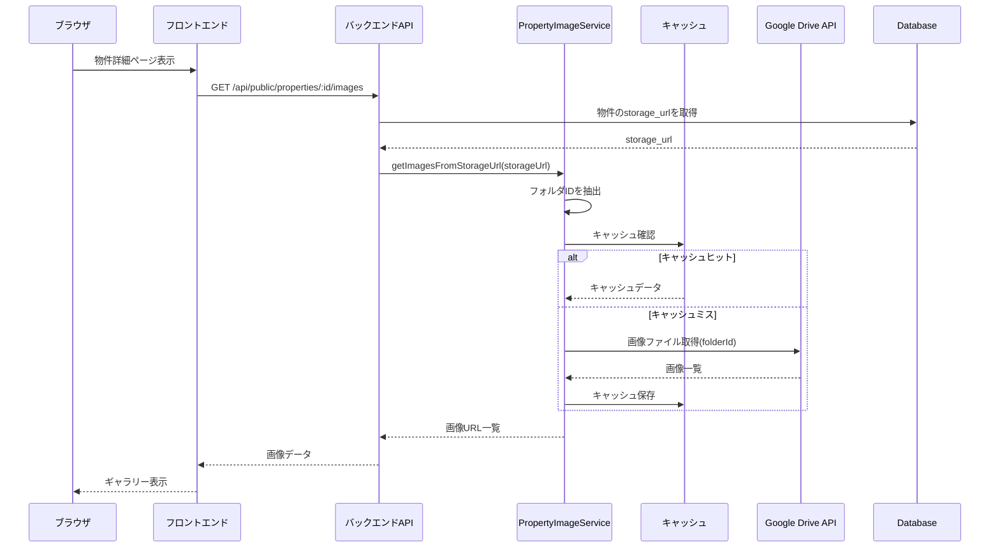

# Design Document: Public Property Drive Images

## Overview

物件公開サイトの物件詳細画面において、物件データの「格納先URL（storage_url）」フィールドからGoogleドライブフォルダIDを抽出し、そのフォルダ内の画像を取得・表示する機能を実装する。既存のGoogleDriveServiceを活用する。

## Architecture



## Components and Interfaces

### 1. PropertyImageService (Backend)

格納先URLからGoogleドライブの画像を取得するサービス。

```typescript
interface PropertyImage {
  id: string;
  name: string;
  thumbnailUrl: string;
  fullImageUrl: string;
  mimeType: string;
  size: number;
  modifiedTime: string;
}

interface PropertyImagesResult {
  images: PropertyImage[];
  folderId: string | null;
  folderName: string | null;
  cached: boolean;
}

class PropertyImageService {
  // 格納先URLから画像を取得
  async getImagesFromStorageUrl(storageUrl: string): Promise<PropertyImagesResult>;
  
  // GoogleドライブURLからフォルダIDを抽出
  extractFolderIdFromUrl(url: string): string | null;
  
  // キャッシュをクリア
  clearCache(folderId: string): void;
}
```

### 2. API Endpoint

```typescript
// GET /api/public/properties/:id/images
// Response: PropertyImagesResult
```

### 3. Frontend Components

```typescript
// PropertyImageGallery - 画像ギャラリーコンポーネント
interface PropertyImageGalleryProps {
  propertyId: string;
}

// ImageLightbox - 画像拡大表示モーダル
interface ImageLightboxProps {
  images: PropertyImage[];
  currentIndex: number;
  onClose: () => void;
  onNavigate: (index: number) => void;
}
```

### 4. React Query Hook

```typescript
// usePropertyImages - 物件画像取得フック
const usePropertyImages = (propertyId: string) => {
  return useQuery({
    queryKey: ['propertyImages', propertyId],
    queryFn: () => fetchPropertyImages(propertyId),
    staleTime: 60 * 60 * 1000, // 1時間
  });
};
```

## Data Models

### PropertyImage

| Field | Type | Description |
|-------|------|-------------|
| id | string | Google DriveのファイルID |
| name | string | ファイル名 |
| thumbnailUrl | string | サムネイル画像URL（プロキシ経由） |
| fullImageUrl | string | 元画像URL（プロキシ経由） |
| mimeType | string | MIMEタイプ (image/jpeg等) |
| size | number | ファイルサイズ (bytes) |
| modifiedTime | string | 更新日時 (ISO 8601) |

### キャッシュ構造

```typescript
interface ImageCache {
  folderId: string;
  images: PropertyImage[];
  cachedAt: number; // timestamp
  expiresAt: number; // timestamp
}
```

## URL Parsing

格納先URLの形式例:
- `https://drive.google.com/drive/folders/FOLDER_ID`
- `https://drive.google.com/drive/u/0/folders/FOLDER_ID`
- `https://drive.google.com/drive/folders/FOLDER_ID?usp=sharing`

フォルダID抽出の正規表現:
```typescript
const folderIdRegex = /\/folders\/([a-zA-Z0-9_-]+)/;
```

## Correctness Properties

*A property is a characteristic or behavior that should hold true across all valid executions of a system-essentially, a formal statement about what the system should do. Properties serve as the bridge between human-readable specifications and machine-verifiable correctness guarantees.*

### Property 1: フォルダ検索結果のソート順

*For any* 物件番号で検索して複数のフォルダが見つかった場合、返却されるフォルダリストは更新日時の降順（新しい順）でソートされている

**Validates: Requirements 1.4**

### Property 2: 画像ファイルのフィルタリング

*For any* フォルダ内のファイルリストに対して、返却される画像リストにはJPEG、PNG、GIF形式のファイルのみが含まれる

**Validates: Requirements 2.1**

### Property 3: 画像データの構造完全性

*For any* 返却される画像データには、id、thumbnailUrl、fullImageUrlの全てのフィールドが含まれる

**Validates: Requirements 2.2**

### Property 4: 画像リストのソート順

*For any* 画像リストは更新日時の降順（新しい順）でソートされている

**Validates: Requirements 2.3**

### Property 5: キャッシュの動作

*For any* 同じ物件番号に対する2回目以降のリクエストで、キャッシュ有効期限内であれば、cachedフラグがtrueで返却される

**Validates: Requirements 4.1**

### Property 6: エラー時の安全な返却

*For any* Google Drive APIエラーが発生した場合、例外をスローせず空の画像リストを返却する

**Validates: Requirements 5.1**

## Error Handling

### エラーケース

| エラー | 対応 | ユーザー表示 |
|--------|------|-------------|
| Google Drive認証エラー | ログ記録、管理者通知 | 「画像を読み込めませんでした」 |
| フォルダ未発見 | 空配列を返却 | 画像なしプレースホルダー |
| ネットワークエラー | リトライ後、空配列 | 「画像を読み込めませんでした」 |
| タイムアウト | 空配列を返却 | 「画像を読み込めませんでした」 |

### エラーログ形式

```typescript
{
  level: 'error',
  service: 'PropertyImageService',
  method: 'getPropertyImages',
  propertyNumber: string,
  error: {
    message: string,
    code: string,
    stack?: string
  },
  timestamp: string
}
```

## Testing Strategy

### Unit Tests

- PropertyImageServiceのフォルダ検索ロジック
- 画像フィルタリングロジック
- キャッシュの有効期限判定
- エラーハンドリング

### Property-Based Tests

- フォルダソート順の検証
- 画像フィルタリングの検証
- キャッシュ動作の検証
- エラー時の安全な返却の検証

### Integration Tests

- Google Drive APIとの連携
- エンドツーエンドの画像取得フロー

### テストフレームワーク

- Backend: Jest + fast-check (property-based testing)
- Frontend: Jest + React Testing Library
