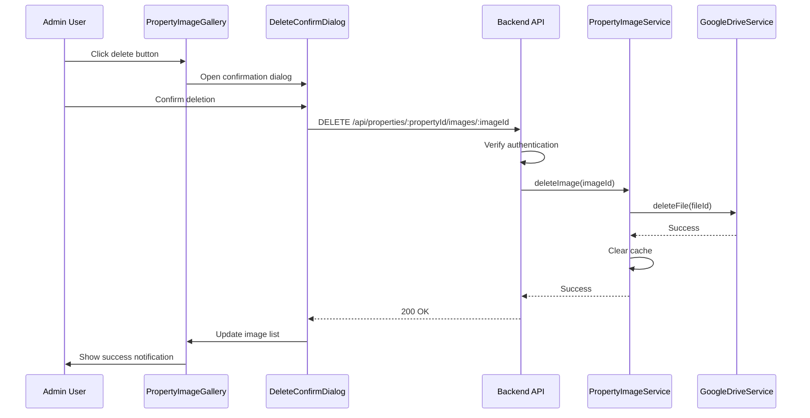

# Design Document

## Overview

公開物件詳細ページの画像ギャラリーに画像削除機能を追加する。認証済み管理者のみが削除ボタンを表示・操作でき、Google Driveから画像ファイルを直接削除する。既存のPropertyImageServiceとGoogleDriveServiceを活用し、新しい削除エンドポイントを追加する。

## Architecture



## Components and Interfaces

### Frontend Components

#### 1. PropertyImageGallery (修正)
既存のコンポーネントを拡張して削除機能を追加。

```typescript
interface PropertyImageGalleryProps {
  propertyId: string;
  canDelete?: boolean; // 認証状態に基づいて設定
}
```

#### 2. ImageDeleteButton (新規)
画像削除ボタンコンポーネント。

```typescript
interface ImageDeleteButtonProps {
  imageId: string;
  imageName: string;
  onDelete: (imageId: string) => void;
}
```

#### 3. DeleteConfirmDialog (新規)
削除確認ダイアログコンポーネント。

```typescript
interface DeleteConfirmDialogProps {
  open: boolean;
  imageUrl: string;
  imageName: string;
  onConfirm: () => void;
  onCancel: () => void;
  isDeleting: boolean;
}
```

### Backend API

#### DELETE /api/properties/:propertyId/images/:imageId
認証済みユーザーのみがアクセス可能な画像削除エンドポイント。

**Request:**
- Headers: `Authorization: Bearer <token>`
- Path Parameters:
  - `propertyId`: 物件ID (UUID)
  - `imageId`: Google DriveファイルID

**Response:**
- 200 OK: `{ success: true, message: "画像を削除しました" }`
- 401 Unauthorized: `{ error: "認証が必要です" }`
- 404 Not Found: `{ error: "画像が見つかりません" }`
- 500 Internal Server Error: `{ error: "削除に失敗しました" }`

### Service Layer

#### PropertyImageService (拡張)
```typescript
class PropertyImageService {
  // 既存メソッド...
  
  async deleteImage(fileId: string): Promise<void>;
  async validateImageBelongsToProperty(propertyId: string, fileId: string): Promise<boolean>;
}
```

## Data Models

### Deletion Log (新規テーブル: property_image_deletion_logs)
```sql
CREATE TABLE property_image_deletion_logs (
  id UUID PRIMARY KEY DEFAULT gen_random_uuid(),
  property_id UUID NOT NULL,
  image_file_id VARCHAR(255) NOT NULL,
  image_name VARCHAR(500),
  deleted_by UUID NOT NULL,
  deleted_at TIMESTAMP WITH TIME ZONE DEFAULT NOW(),
  ip_address VARCHAR(45)
);
```

## Correctness Properties

*A property is a characteristic or behavior that should hold true across all valid executions of a system-essentially, a formal statement about what the system should do. Properties serve as the bridge between human-readable specifications and machine-verifiable correctness guarantees.*

### Property 1: Delete button visibility based on authentication
*For any* authentication state and image gallery, delete buttons are displayed if and only if the user is authenticated as an admin.
**Validates: Requirements 1.1, 1.2**

### Property 2: Confirmation dialog behavior
*For any* delete button click, a confirmation dialog is displayed showing the target image, and clicking cancel closes the dialog without making any API calls.
**Validates: Requirements 2.1, 2.2, 2.5**

### Property 3: Successful deletion updates UI
*For any* successful image deletion, the image is immediately removed from the gallery and a success notification is displayed.
**Validates: Requirements 3.2, 3.3**

### Property 4: Failed deletion shows error
*For any* failed deletion attempt, an error message is displayed to the user with the failure reason.
**Validates: Requirements 3.4**

### Property 5: Cache invalidation on deletion
*For any* successful image deletion, the image cache for that property is cleared.
**Validates: Requirements 3.5**

### Property 6: Authentication requirement
*For any* unauthenticated delete request, the system returns a 401 Unauthorized response.
**Validates: Requirements 4.1, 4.2**

### Property 7: Deletion logging
*For any* deletion attempt (successful or failed), a log entry is created with user information and timestamp.
**Validates: Requirements 4.3**

### Property 8: Lightbox delete button visibility
*For any* authenticated admin viewing an image in the lightbox, a delete button is displayed.
**Validates: Requirements 5.1**

### Property 9: Lightbox navigation after deletion
*For any* image deleted from the lightbox, the system navigates to the next image, or closes the lightbox if no images remain.
**Validates: Requirements 5.3**

## Error Handling

| Error Scenario | HTTP Status | User Message |
|----------------|-------------|--------------|
| Not authenticated | 401 | 認証が必要です。ログインしてください。 |
| Image not found | 404 | 画像が見つかりません。 |
| Google Drive API error | 500 | 画像の削除に失敗しました。しばらく時間をおいて再度お試しください。 |
| Network error | - | ネットワークエラーが発生しました。接続を確認してください。 |

## Testing Strategy

### Unit Tests
- DeleteConfirmDialog: ダイアログの表示/非表示、ボタンクリック動作
- ImageDeleteButton: ボタンレンダリング、クリックイベント
- PropertyImageService.deleteImage: 正常系・異常系

### Property-Based Tests
- Property 1: 認証状態と削除ボタン表示の関係
- Property 6: 認証なしリクエストの401レスポンス
- Property 7: 削除ログの作成

### Integration Tests
- 画像削除フロー全体（UI → API → Google Drive）
- キャッシュ無効化の確認
