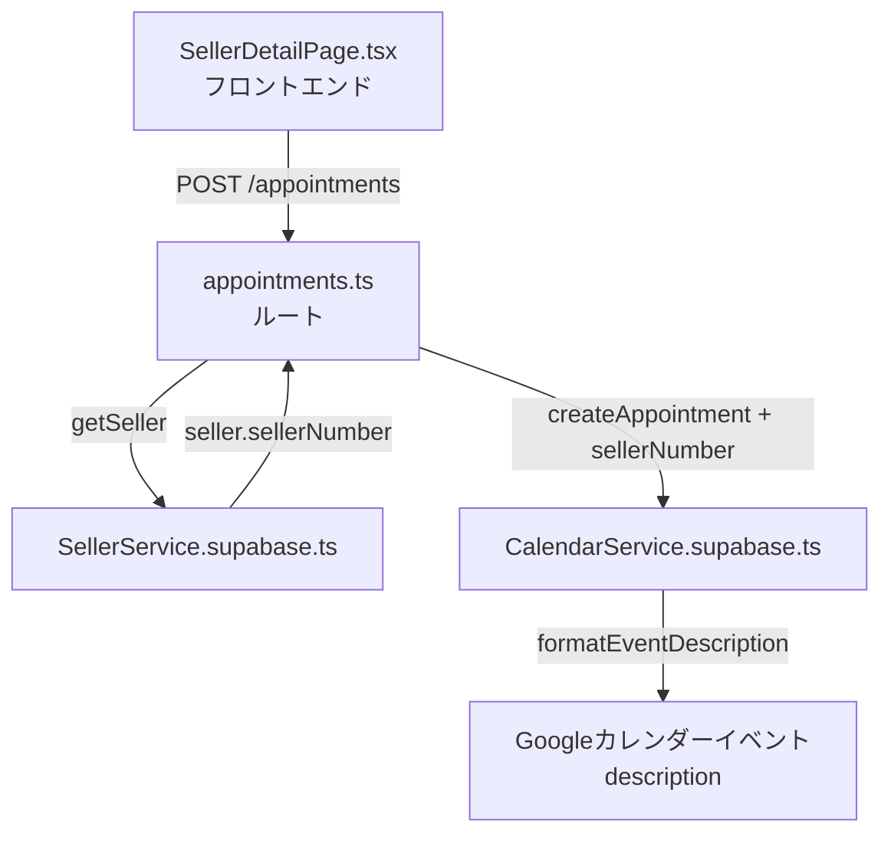
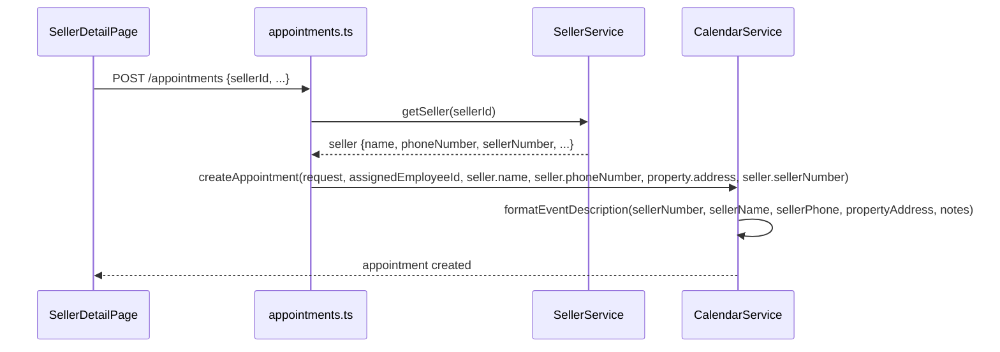

# 設計ドキュメント: seller-calendar-memo-seller-number

## 概要

売主リストの訪問予約でカレンダー送信するとき、Googleカレンダーイベントのメモ（description）の一番上に売主番号を表示する機能。

現在のメモ構造：
```
売主: {売主名}
電話: {電話番号}
物件住所: {物件住所}

備考: {コメント}（任意）
```

変更後のメモ構造：
```
売主番号: {売主番号}
売主: {売主名}
電話: {電話番号}
物件住所: {物件住所}

備考: {コメント}（任意）
```

## アーキテクチャ



## シーケンス図



## 変更対象ファイル

### 1. `backend/src/services/CalendarService.supabase.ts`

#### formatEventDescription メソッド

**現在の実装**:
```typescript
private formatEventDescription(
  sellerName: string,
  sellerPhone: string,
  propertyAddress: string,
  notes?: string
): string {
  let description = `売主: ${sellerName}\n`;
  description += `電話: ${sellerPhone}\n`;
  description += `物件住所: ${propertyAddress}`;
  
  if (notes) {
    description += `\n\n備考: ${notes}`;
  }
  
  return description;
}
```

**変更後の実装**:
```typescript
private formatEventDescription(
  sellerName: string,
  sellerPhone: string,
  propertyAddress: string,
  notes?: string,
  sellerNumber?: string
): string {
  let description = '';
  
  // 売主番号を一番上に表示（存在する場合）
  if (sellerNumber) {
    description += `売主番号: ${sellerNumber}\n`;
  }
  
  description += `売主: ${sellerName}\n`;
  description += `電話: ${sellerPhone}\n`;
  description += `物件住所: ${propertyAddress}`;
  
  if (notes) {
    description += `\n\n備考: ${notes}`;
  }
  
  return description;
}
```

#### createAppointment メソッドのシグネチャ変更

**現在**:
```typescript
async createAppointment(
  request: AppointmentRequest,
  assignedEmployeeId: string,
  sellerName: string,
  sellerPhone: string,
  propertyAddress: string
): Promise<Appointment>
```

**変更後**:
```typescript
async createAppointment(
  request: AppointmentRequest,
  assignedEmployeeId: string,
  sellerName: string,
  sellerPhone: string,
  propertyAddress: string,
  sellerNumber?: string
): Promise<Appointment>
```

#### createAppointment 内の formatEventDescription 呼び出し変更

**現在**:
```typescript
description: this.formatEventDescription(
  sellerName,
  sellerPhone,
  propertyAddress,
  request.notes
),
```

**変更後**:
```typescript
description: this.formatEventDescription(
  sellerName,
  sellerPhone,
  propertyAddress,
  request.notes,
  sellerNumber
),
```

---

### 2. `backend/src/routes/appointments.ts`

#### createAppointment 呼び出し変更

**現在**:
```typescript
const appointment = await calendarService.createAppointment(
  appointmentRequest,
  assignedEmployee.id,
  seller.name,
  seller.phoneNumber,
  property.address
);
```

**変更後**:
```typescript
const appointment = await calendarService.createAppointment(
  appointmentRequest,
  assignedEmployee.id,
  seller.name,
  seller.phoneNumber,
  property.address,
  seller.sellerNumber  // 売主番号を追加
);
```

## コンポーネントとインターフェース

### CalendarService.supabase.ts

| メソッド | 変更内容 |
|---------|---------|
| `formatEventDescription` | 引数に `sellerNumber?: string` を追加。メモの先頭に `売主番号: {sellerNumber}` を追加 |
| `createAppointment` | 引数に `sellerNumber?: string` を追加。`formatEventDescription` に渡す |

### appointments.ts ルート

| 変更箇所 | 変更内容 |
|---------|---------|
| `calendarService.createAppointment` 呼び出し | `seller.sellerNumber` を第6引数として追加 |

## データモデル

変更なし。`seller.sellerNumber` は既に `SellerService.getSeller()` で取得・返却されている（`decryptSeller` メソッド内で `sellerNumber: seller.seller_number` としてマッピング済み）。

## エラーハンドリング

- `sellerNumber` はオプション引数（`?`）のため、売主番号が未設定の場合でも既存の動作に影響しない
- `seller.sellerNumber` が `undefined` または `null` の場合、売主番号行は表示されない

## テスト戦略

### ユニットテスト

`formatEventDescription` メソッドのテストケース：

1. 売主番号あり・備考なし → 売主番号が先頭に表示される
2. 売主番号あり・備考あり → 売主番号が先頭、備考が末尾に表示される
3. 売主番号なし（undefined）→ 売主番号行が表示されない（既存動作と同じ）
4. 売主番号なし（空文字）→ 売主番号行が表示されない

### 手動テスト

1. 売主詳細ページから訪問予約を作成
2. 担当者のGoogleカレンダーでイベントのメモを確認
3. 「売主番号: AA1234」が一番上に表示されることを確認

## 依存関係

変更なし。既存の依存関係のみ使用。

## Correctness Properties

*プロパティとは、システムの全ての有効な実行において成立すべき特性・振る舞いのこと。形式的な正しさの保証と人間が読める仕様の橋渡しとなる。*

### Property 1: 売主番号が先頭に表示される

`sellerNumber` が存在する任意の文字列に対して、`formatEventDescription` の出力の先頭行は `売主番号: {sellerNumber}` でなければならない。

**Validates: Requirements 1.1**

### Property 2: 売主番号なしの場合は既存構造を維持する

`sellerNumber` が `undefined` の場合、`formatEventDescription` の出力に `売主番号:` という文字列が含まれてはならず、出力の先頭行は `売主: {sellerName}` でなければならない。

**Validates: Requirements 1.2**

### Property 3: メモのフォーマット順序が正しい

任意の入力値（sellerNumber あり・なし、notes あり・なし）に対して、`formatEventDescription` の出力は設計で定めた順序（売主番号 → 売主名 → 電話 → 物件住所 → 備考）を維持しなければならない。

**Validates: Requirements 1.3, 1.4**
