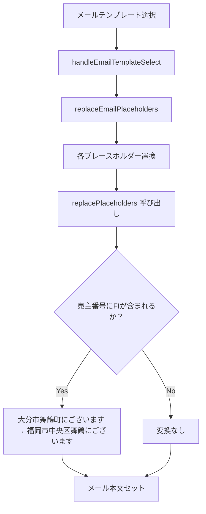

# 設計書: 売主番号FI含む場合のメールテンプレート文言変換

## 概要

売主管理システムの通話モードページ（CallModePage）では、メールテンプレートを使って売主へメールを送信する機能がある。現在、メールテンプレート本文には「大分市舞鶴町にございます」という文言がハードコードされているが、売主番号（`sellerNumber`）に「FI」が含まれる場合（福岡支店の案件）は「福岡市中央区舞鶴にございます」に変換する必要がある。

既存の `replacePlaceholders` 関数（`smsTemplateGenerators.ts`）は `<<当社住所>>` プレースホルダーに対してFI判定ロジックを持っているが、メールテンプレート本文中にハードコードされた「大分市舞鶴町にございます」という文言には対応していない。本設計はこのギャップを埋めるための最小限の変更を定義する。

## アーキテクチャ

### 変換フロー



### 変更対象ファイル

| ファイル | 変更内容 |
|---------|---------|
| `frontend/frontend/src/utils/smsTemplateGenerators.ts` | `replacePlaceholders` 関数に文言変換ロジックを追加 |
| `frontend/frontend/src/utils/__tests__/smsTemplateGenerators.test.ts` | 新しい変換ロジックのテストを追加 |

**変更しないファイル**:
- `frontend/frontend/src/pages/CallModePage.tsx` — `replaceEmailPlaceholders` は既に `replacePlaceholders` を呼び出しているため変更不要
- `frontend/frontend/src/utils/emailTemplates.ts` — テンプレート定義は変更しない
- `backend/` 配下の全ファイル — フロントエンドのみの変更

## コンポーネントとインターフェース

### replacePlaceholders 関数（変更後）

```typescript
// frontend/frontend/src/utils/smsTemplateGenerators.ts

export const replacePlaceholders = (
  message: string,
  seller: Seller
): string => {
  // ... 既存のロジック（変更なし） ...

  // 新規追加: FI番号の場合、ハードコードされた「大分市舞鶴町にございます」を変換
  if (hasFI) {
    result = result.replace(/大分市舞鶴町にございます/g, '福岡市中央区舞鶴にございます');
  }

  return result;
};
```

### 変換ロジックの位置

既存の `<<当社住所>>` 置換の直後に追加する。これにより、`hasFI` フラグの計算を再利用でき、コードの重複を避けられる。

```typescript
// <<当社住所>>の置換（既存）
if (hasFI) {
  result = result.replace(/<<当社住所>>/g, '福岡市中央区舞鶴３丁目１－１０');
} else {
  result = result.replace(/<<当社住所>>/g, '大分市舞鶴町1-3-30STビル１F');
}

// <<売買実績ｖ>>の置換（既存）
// ...

// 新規追加: ハードコードされた「大分市舞鶴町にございます」の変換
if (hasFI) {
  result = result.replace(/大分市舞鶴町にございます/g, '福岡市中央区舞鶴にございます');
}
```

## データモデル

本機能は新しいデータモデルを導入しない。既存の `Seller` 型の `sellerNumber` フィールドを使用する。

```typescript
// 既存の Seller 型（変更なし）
interface Seller {
  sellerNumber?: string | null;
  // ...
}
```

### 変換対象文字列

| 変換前 | 変換後 | 条件 |
|--------|--------|------|
| `大分市舞鶴町にございます` | `福岡市中央区舞鶴にございます` | `sellerNumber` に `FI`（大文字・小文字不問）が含まれる場合 |

**注意**: 変換対象は「大分市舞鶴町にございます」という完全な文字列のみ。「大分市舞鶴町1丁目3-30」などの住所表記は変換しない。

## 正確性プロパティ

*プロパティとは、システムの全ての有効な実行において成立すべき特性や振る舞いのことであり、人間が読める仕様と機械で検証可能な正確性保証の橋渡しをする形式的な記述である。*

### プロパティ1: FI番号の場合、文言が変換される

*任意の* FI番号を持つ売主と、「大分市舞鶴町にございます」を含む任意のメッセージ文字列に対して、`replacePlaceholders` 関数の出力には「大分市舞鶴町にございます」が含まれず、「福岡市中央区舞鶴にございます」が含まれること

**Validates: Requirements 1.2, 1.5**

### プロパティ2: 非FI番号の場合、文言が変換されない

*任意の* FI番号を持たない売主と、「大分市舞鶴町にございます」を含む任意のメッセージ文字列に対して、`replacePlaceholders` 関数の出力には「大分市舞鶴町にございます」がそのまま保持されること

**Validates: Requirements 1.3**

### プロパティ3: 既存プレースホルダー置換との共存

*任意の* 売主番号と、`<<当社住所>>`・`<<売買実績ｖ>>`・「大分市舞鶴町にございます」を全て含む任意のメッセージ文字列に対して、`replacePlaceholders` 関数は全ての変換を正しく適用すること（既存の置換と新規の文言変換が共存する）

**Validates: Requirements 2.2, 2.3**

### プロパティ4: 変換の選択性（誤変換防止）

*任意の* FI番号を持つ売主と、「大分市舞鶴町にございます」を含まないが「大分市舞鶴町」を含む任意のメッセージ文字列（例：「大分市舞鶴町1丁目3-30」）に対して、`replacePlaceholders` 関数はその文字列を変換しないこと

**Validates: Requirements 3.1, 3.2**

### プロパティ5: 変換の冪等性

*任意の* 売主番号と、「大分市舞鶴町にございます」を含まない任意のメッセージ文字列に対して、`replacePlaceholders` 関数を適用しても出力に「大分市舞鶴町にございます」が含まれないこと（変換が存在しない文字列に対して誤って変換が発生しない）

**Validates: Requirements 4.3**

## エラーハンドリング

本機能は既存の `replacePlaceholders` 関数のエラーハンドリングに依存する。

| ケース | 動作 |
|--------|------|
| `seller` が `null` | 既存の `replaceWithDefaults` が呼ばれ、文言変換は行われない |
| `sellerNumber` が `null`/`undefined`/空文字列 | 既存の `replaceWithDefaults` が呼ばれ、文言変換は行われない |
| `message` に「大分市舞鶴町にございます」が含まれない | 変換は行われず、メッセージはそのまま返される |
| 例外発生時 | 既存の `catch` ブロックが元のメッセージを返す |

## テスト戦略

### 単体テスト（例ベース）

既存の `smsTemplateGenerators.test.ts` に以下のテストケースを追加する：

**FI番号の場合の変換テスト**:
- FI番号の売主に対して「大分市舞鶴町にございます」が「福岡市中央区舞鶴にございます」に変換される
- 大文字・小文字を区別しない（fi, Fi, fI）
- 複数箇所の変換（全ての箇所が変換される）
- 「大分市舞鶴町1丁目3-30」などの住所表記は変換されない

**非FI番号の場合の非変換テスト**:
- 非FI番号の売主に対して「大分市舞鶴町にございます」が変換されない
- null/undefined/空文字列の売主番号に対して変換されない

**既存機能との共存テスト**:
- `<<当社住所>>` 置換と文言変換が同時に正しく動作する

### プロパティベーステスト（fast-check）

`smsTemplateGenerators.test.ts` に fast-check を使ったプロパティテストを追加する。

**設定**: 各プロパティテストは最低100回実行する。

**プロパティ1のテスト実装方針**:
```typescript
// Feature: seller-call-mode-fi-email-template-conversion, Property 1: FI番号の場合、文言が変換される
fc.assert(fc.property(
  fc.string(), // プレフィックス
  fc.string(), // サフィックス
  fc.constantFrom('FI', 'fi', 'Fi', 'fI').chain(fi => 
    fc.string().map(s => fi + s) // FIを含む売主番号
  ),
  (prefix, suffix, sellerNumber) => {
    const message = `${prefix}大分市舞鶴町にございます${suffix}`;
    const seller = { sellerNumber } as Seller;
    const result = replacePlaceholders(message, seller);
    return !result.includes('大分市舞鶴町にございます') 
      && result.includes('福岡市中央区舞鶴にございます');
  }
));
```

**プロパティ2のテスト実装方針**:
```typescript
// Feature: seller-call-mode-fi-email-template-conversion, Property 2: 非FI番号の場合、文言が変換されない
fc.assert(fc.property(
  fc.string(), // プレフィックス
  fc.string(), // サフィックス
  fc.string().filter(s => !s.toUpperCase().includes('FI')), // FIを含まない売主番号
  (prefix, suffix, sellerNumber) => {
    const message = `${prefix}大分市舞鶴町にございます${suffix}`;
    const seller = { sellerNumber } as Seller;
    const result = replacePlaceholders(message, seller);
    return result.includes('大分市舞鶴町にございます');
  }
));
```

### リグレッションテスト

既存の `smsTemplateGenerators.test.ts` の全テストが引き続きパスすることを確認する。これにより、既存の `<<当社住所>>` および `<<売買実績ｖ>>` 置換ロジックが変更されていないことを保証する。
