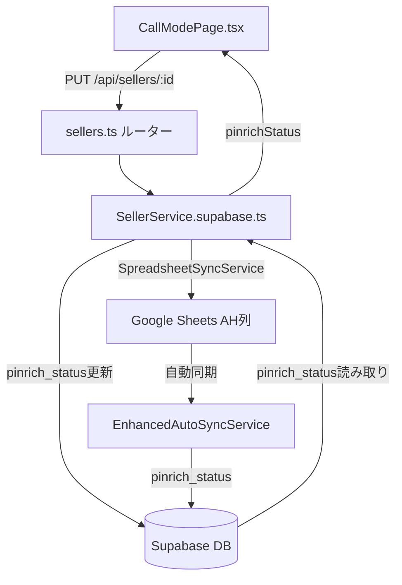

# 設計ドキュメント: 売主通話モードページ Pinrichフィールド追加

## 概要

売主リストの通話モードページ（`/sellers/:id/call`）のステータスセクションに「Pinrich」フィールドを追加する。除外日フィールドの右側に配置し、スプレッドシートのAH列（カラム名「Pinrich」）と同期する。

### 背景

Pinrichは不動産会社向けのメール配信サービスであり、売主のPinrich登録状況を通話モードページで確認・更新できるようにすることで、電話対応中の業務効率を向上させる。

### 実装スコープ

コードベース調査の結果、以下が既に実装済みであることを確認した：

- `sellers`テーブルに`pinrich_status`カラムが存在する
- `backend/src/config/column-mapping.json`にPinrichマッピングが存在する
- `EnhancedAutoSyncService`に`pinrich_status`同期処理が存在する
- `frontend/src/utils/sellerStatusFilters.ts`に`isPinrichEmpty()`関数が存在する
- `backend/src/services/SellerService.supabase.ts`の`decryptSeller`メソッドに`pinrichStatus: seller.pinrich_status`が含まれる
- `backend/src/types/index.ts`の`Seller`インターフェースに`pinrichStatus?: string`が定義されている

**主な作業: CallModePageのUI追加のみ**

---

## アーキテクチャ



### データフロー

1. **表示**: `GET /api/sellers/:id` → `SellerService.decryptSeller()` → `pinrichStatus` → CallModePage UI
2. **更新**: CallModePage UI → `PUT /api/sellers/:id` → `SellerService.updateSeller()` → `pinrich_status` カラム更新
3. **スプレッドシート同期**: `EnhancedAutoSyncService` がAH列（Pinrich）を`pinrich_status`に同期（既実装）

---

## コンポーネントとインターフェース

### フロントエンド: CallModePage.tsx

#### 変更箇所

**1. 状態変数の追加**

```typescript
// ステータスセクション内のPinrich状態
const [editedPinrichStatus, setEditedPinrichStatus] = useState<string>('');
```

**2. データ読み込み時の初期化（`loadAllData`内）**

```typescript
// Pinrichステータスの初期化
setEditedPinrichStatus(sellerData.pinrichStatus || '');
```

**3. `handleUpdateStatus`関数への追加**

```typescript
await api.put(`/api/sellers/${id}`, {
  status: editedStatus,
  confidence: editedConfidence,
  // ... 既存フィールド
  pinrichStatus: editedPinrichStatus || null,  // 追加
});
```

**4. UIの追加（除外日フィールドの右側）**

除外日フィールドは`<Grid item xs={6}>`で実装されている。Pinrichフィールドを同じ`xs={6}`で右側に追加する。

```tsx
{/* 除外日（既存） */}
<Grid item xs={6}>
  <Box sx={{ border: '1px solid', borderColor: 'divider', borderRadius: 1, p: 1, minHeight: 40 }}>
    <Typography variant="caption" color="text.secondary" sx={{ display: 'block', mb: 0.25 }}>
      除外日
    </Typography>
    <Typography variant="body2" sx={{ fontWeight: 'medium' }}>
      {exclusionDate || '－'}
    </Typography>
  </Box>
</Grid>

{/* Pinrich（新規追加） */}
<Grid item xs={6}>
  <Box sx={{ border: '1px solid', borderColor: 'divider', borderRadius: 1, p: 1, minHeight: 40 }}>
    <Typography variant="caption" color="text.secondary" sx={{ display: 'block', mb: 0.25 }}>
      Pinrich
    </Typography>
    <TextField
      size="small"
      fullWidth
      variant="standard"
      value={editedPinrichStatus}
      onChange={(e) => {
        setEditedPinrichStatus(e.target.value);
        setStatusChanged(true);
      }}
      placeholder="－"
      InputProps={{ disableUnderline: true }}
      sx={{ mt: 0 }}
    />
  </Box>
</Grid>
```

### バックエンド: SellerService.supabase.ts

#### `updateSeller`メソッドへの追加

```typescript
// Pinrichステータスフィールド
if ((data as any).pinrichStatus !== undefined) {
  updates.pinrich_status = (data as any).pinrichStatus;
}
```

---

## データモデル

### データベース（既存）

```sql
-- sellersテーブル（既存カラム）
pinrich_status TEXT  -- Pinrichステータス（AH列）
```

### フロントエンド型定義（既存）

```typescript
// backend/src/types/index.ts の Seller インターフェース（既存）
interface Seller {
  // ...
  pinrichStatus?: string;  // 既に定義済み
  // ...
}
```

### スプレッドシートマッピング（既存）

```json
// backend/src/config/column-mapping.json（既存）
{
  "spreadsheetToDatabase": {
    "Pinrich": "pinrich_status"
  },
  "databaseToSpreadsheet": {
    "pinrich_status": "Pinrich"
  }
}
```

---

## 正確性プロパティ

*プロパティとは、システムの全ての有効な実行において成立すべき特性や振る舞いのことです。プロパティは人間が読める仕様と機械で検証可能な正確性保証の橋渡しをします。*

### Property 1: Pinrich値の表示ラウンドトリップ

*For any* 有効なpinrichStatus文字列を持つ売主データに対して、CallModePageのPinrichフィールドにその値が表示されること

**Validates: Requirements 1.2, 3.3**

### Property 2: 空のPinrich値は「－」を表示する

*For any* null、undefined、空文字列、空白のみの文字列など「空」と見なされるpinrichStatus値に対して、Pinrichフィールドに「－」が表示されること

**Validates: Requirements 1.3**

### Property 3: Pinrich変更でstatusChangedがtrueになる

*For any* 文字列をPinrichフィールドに入力した場合、statusChangedフラグがtrueに設定されること

**Validates: Requirements 2.2**

### Property 4: isPinrichEmptyの一貫性

*For any* 売主データに対して、`isPinrichEmpty(seller)`がtrueを返す場合かつその場合に限り、その売主は「Pinrich空欄」カテゴリに分類されること

**Validates: Requirements 5.1, 5.2, 5.3**

---

## エラーハンドリング

### フロントエンド

| シナリオ | 対応 |
|---------|------|
| API保存失敗 | 既存の`setError()`でエラーメッセージを表示（`handleUpdateStatus`の既存エラーハンドリングを流用） |
| 値の読み込み失敗 | `sellerData.pinrichStatus || ''`でフォールバック（空文字列） |

### バックエンド

| シナリオ | 対応 |
|---------|------|
| `pinrichStatus`がundefined | `if ((data as any).pinrichStatus !== undefined)`でスキップ |
| `pinrichStatus`がnull | `pinrich_status = null`としてDBに保存（空欄扱い） |

---

## テスト戦略

### PBT適用性の評価

このフィーチャーは主にUIの追加とバックエンドの軽微な変更であるが、以下の点でPBTが適用可能：

- `isPinrichEmpty()`関数は純粋関数であり、入力の変化によって出力が変わる
- Pinrich値の表示ロジックは任意の文字列入力に対して一貫した動作が期待される

### ユニットテスト

**`isPinrichEmpty`関数のテスト（`sellerStatusFilters.test.ts`）**

```typescript
describe('isPinrichEmpty', () => {
  // 当日TEL分の条件を満たす基本的な売主データ
  const baseTodayCallSeller = {
    status: '追客中',
    nextCallDate: '2020-01-01', // 過去の日付
    contactMethod: '',
    preferredContactTime: '',
    phoneContactPerson: '',
    visitAssignee: '',
  };

  it('pinrichStatusが空の場合はtrueを返す', () => {
    expect(isPinrichEmpty({ ...baseTodayCallSeller, pinrichStatus: '' })).toBe(true);
  });

  it('pinrichStatusがnullの場合はtrueを返す', () => {
    expect(isPinrichEmpty({ ...baseTodayCallSeller, pinrichStatus: null })).toBe(true);
  });

  it('pinrichStatusに値がある場合はfalseを返す', () => {
    expect(isPinrichEmpty({ ...baseTodayCallSeller, pinrichStatus: '登録済み' })).toBe(false);
  });

  it('当日TEL分の条件を満たさない場合はfalseを返す', () => {
    expect(isPinrichEmpty({ ...baseTodayCallSeller, visitAssignee: 'Y', pinrichStatus: '' })).toBe(false);
  });
});
```

### プロパティベーステスト

**Property 4: isPinrichEmptyの一貫性**

```typescript
// fast-check を使用
import * as fc from 'fast-check';

it('Property 4: isPinrichEmptyの一貫性', () => {
  // Feature: seller-call-mode-pinrich-field, Property 4: isPinrichEmpty consistency
  fc.assert(
    fc.property(
      fc.string(), // 任意のpinrichStatus値
      (pinrichStatus) => {
        const seller = {
          ...baseTodayCallSeller,
          pinrichStatus,
        };
        const isEmpty = isPinrichEmpty(seller);
        // pinrichStatusが空白のみまたは空の場合はtrue、それ以外はfalse
        const expectedEmpty = !pinrichStatus || pinrichStatus.trim() === '';
        return isEmpty === expectedEmpty;
      }
    ),
    { numRuns: 100 }
  );
});
```

### インテグレーションテスト

**スプレッドシート同期（1-2例）**

1. スプレッドシートのAH列（Pinrich）を更新 → DBの`pinrich_status`が同期されることを確認
2. DBの`pinrich_status`を更新 → スプレッドシートのAH列が同期されることを確認

### スモークテスト

**column-mapping.jsonの確認**

```typescript
it('column-mapping.jsonにPinrichマッピングが存在する', () => {
  const mapping = require('../config/column-mapping.json');
  expect(mapping.spreadsheetToDatabase['Pinrich']).toBe('pinrich_status');
  expect(mapping.databaseToSpreadsheet['pinrich_status']).toBe('Pinrich');
});
```

### 手動確認チェックリスト

- [ ] CallModePageのステータスセクションで除外日フィールドの右側にPinrichフィールドが表示される
- [ ] Pinrichフィールドに値が入力できる
- [ ] 値を変更すると「ステータスを更新」ボタンがオレンジ色になる
- [ ] 「ステータスを更新」ボタンをクリックするとPinrich値が保存される
- [ ] 保存後にページをリロードしても値が保持される
- [ ] スプレッドシートのAH列と値が同期される
- [ ] pinrichStatusが空の売主が「Pinrich空欄」サイドバーカテゴリに表示される
