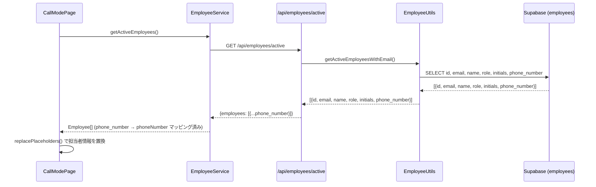

# 設計書: 売主通話モードページのメール署名に営業担当者情報を追加

## 概要

通話モードページ（`/sellers/:id/call`）の「訪問査定後御礼メール」テンプレートにおいて、署名部分の担当者情報プレースホルダー（`<<担当名（営業）名前>>`・`<<担当名（営業）電話番号>>`・`<<担当名（営業）メールアドレス>>`）を正しく置換する機能を実装する。

現状の問題:
1. `getActiveEmployeesWithEmail` のSELECTクエリに `phone_number` が含まれていないため、電話番号が空になる
2. フロントエンドの `Employee` 型（`employeeService.ts`）に `phoneNumber` フィールドが存在しない
3. `EmployeeService` で `phone_number` → `phoneNumber` のマッピングが行われていない

なお、CallModePage（`frontend/frontend/src/pages/CallModePage.tsx`）の担当者特定ロジック（`seller.assignedTo` でメールアドレス照合）は既に正しく実装されている。

## アーキテクチャ



変更対象ファイル（売主管理システム、ポート3000）:
- `backend/src/utils/employeeUtils.ts` — SELECTクエリと型定義に `phone_number` を追加
- `frontend/frontend/src/services/employeeService.ts` — `Employee` 型と `phone_number` → `phoneNumber` マッピングを追加

## コンポーネントとインターフェース

### バックエンド: EmployeeUtils.getActiveEmployeesWithEmail

変更前:
```typescript
async getActiveEmployeesWithEmail(): Promise<Array<{
  id: string; email: string; name: string; role: string; initials: string
}>>
```

変更後:
```typescript
async getActiveEmployeesWithEmail(): Promise<Array<{
  id: string; email: string; name: string; role: string; initials: string; phone_number: string | null
}>>
```

SELECTクエリ変更:
```typescript
// 変更前
.select('id, email, name, role, initials')

// 変更後
.select('id, email, name, role, initials, phone_number')
```

### フロントエンド: EmployeeService

`Employee` 型に `phoneNumber` を追加:
```typescript
export interface Employee {
  id: string;
  email: string;
  name: string;
  role: string;
  initials: string;
  phoneNumber: string | null; // 追加
}
```

`getActiveEmployees` 関数でマッピングを追加:
```typescript
const employees = response.data.employees.map((emp: any) => ({
  ...emp,
  phoneNumber: emp.phone_number ?? null,
}));
```

### フロントエンド: CallModePage（変更なし）

既存の置換ロジックは正しく実装済み:
```typescript
const assignedEmployee = employees.find(emp => emp.email === seller.assignedTo);
const employeeName = assignedEmployee?.name || employee?.name || '';
result = result.replace(/<<担当名（営業）名前>>/g, employeeName);
result = result.replace(/<<担当名（営業）電話番号>>/g, assignedEmployee?.phoneNumber || employee?.phoneNumber || '');
result = result.replace(/<<担当名（営業）メールアドレス>>/g, assignedEmployee?.email || employee?.email || '');
```

`seller.assignedTo`（担当者メールアドレス）で `employees` リストを検索し、一致する従業員の情報を使用する。見つからない場合はログインユーザー（`employee`）の情報でフォールバックし、それもない場合は空文字列になる。

## データモデル

### employeesテーブル（既存）

| カラム | 型 | 説明 |
|--------|-----|------|
| id | uuid | 主キー |
| email | text | メールアドレス |
| name | text | 氏名 |
| role | text | 役割 |
| initials | text | イニシャル |
| phone_number | text \| null | 携帯電話番号（今回追加対象） |
| is_active | boolean | 有効フラグ |

### APIレスポンス: /api/employees/active

```json
{
  "employees": [
    {
      "id": "uuid",
      "email": "example@ifoo-oita.com",
      "name": "田中 太郎",
      "role": "agent",
      "initials": "TT",
      "phone_number": "090-1234-5678"
    }
  ]
}
```

### フロントエンド Employee 型

```typescript
interface Employee {
  id: string;
  email: string;
  name: string;
  role: string;
  initials: string;
  phoneNumber: string | null; // phone_number からマッピング
}
```

## 正確性プロパティ

*プロパティとは、システムの全ての有効な実行において成立すべき特性や振る舞いのことです。プロパティは人間が読める仕様と機械で検証可能な正確性保証の橋渡しをします。*

### Property 1: EmployeeServiceのphone_numberマッピング

*任意の* `phone_number` 値（文字列またはnull）を持つAPIレスポンスに対して、`getActiveEmployees` が返す `Employee` オブジェクトの `phoneNumber` フィールドは元の `phone_number` 値と等しくなければならない。

**Validates: Requirements 2.2**

### Property 2: 担当者情報の全置換

*任意の* メールアドレスを持つ従業員リストと、その中の一つのメールアドレスを `assignedTo` に持つ売主データに対して、プレースホルダー置換後の文字列は `<<担当名（営業）名前>>`・`<<担当名（営業）電話番号>>`・`<<担当名（営業）メールアドレス>>` を含まず、それぞれ対応する従業員の `name`・`phoneNumber`・`email` の値に置換されていなければならない。

**Validates: Requirements 3.1, 3.2, 3.3**

### Property 3: 担当者未発見時のフォールバック

*任意の* 従業員リストに存在しないメールアドレスを `assignedTo` に持つ売主データに対して、プレースホルダー置換後の文字列はログインユーザー（`employee`）の情報で置換されなければならない。ログインユーザーも存在しない場合は空文字列で置換されエラーが発生してはならない。

**Validates: Requirements 3.4, 3.5**

## エラーハンドリング

| ケース | 対応 |
|--------|------|
| `employees.phone_number` が NULL | `null` または空文字列を返す（エラーにしない） |
| `seller.assignedTo` が未設定 | ログインユーザー情報でフォールバック |
| `seller.assignedTo` に一致する従業員なし | ログインユーザー情報でフォールバック |
| ログインユーザー情報もなし | 空文字列で置換（エラーにしない） |
| `/api/employees/active` APIエラー | 既存のエラーハンドリング（空配列を返す）を維持 |

キャッシュの考慮: `/api/employees/active` のレスポンスはバックエンド（5分TTL）とフロントエンド（localStorage、5分TTL）の両方でキャッシュされている。`phone_number` 追加後は既存のキャッシュが古いデータを返す可能性があるため、初回デプロイ後にキャッシュが自然に期限切れになるまで待つか、必要に応じてキャッシュをクリアする。

## テスト戦略

### ユニットテスト

- `EmployeeService.getActiveEmployees`: `phone_number` → `phoneNumber` マッピングが正しく行われることを確認
- `replacePlaceholders`（CallModePage内）: 担当者情報の置換ロジックを具体的な例でテスト
  - 担当者が見つかる場合
  - 担当者が見つからずフォールバックする場合
  - 全情報がない場合（空文字列）

### プロパティベーステスト

PBTライブラリ: `fast-check`（TypeScript/JavaScript向け）

各プロパティテストは最低100回のイテレーションで実行する。

**Property 1: EmployeeServiceのphone_numberマッピング**
```typescript
// Feature: seller-email-signature-employee-info, Property 1: phone_number mapping
fc.assert(fc.property(
  fc.array(fc.record({
    id: fc.uuid(),
    email: fc.emailAddress(),
    name: fc.string(),
    role: fc.string(),
    initials: fc.string(),
    phone_number: fc.option(fc.string(), { nil: null }),
  })),
  (rawEmployees) => {
    const mapped = mapEmployees(rawEmployees);
    return mapped.every((emp, i) => emp.phoneNumber === rawEmployees[i].phone_number);
  }
));
```

**Property 2: 担当者情報の全置換**
```typescript
// Feature: seller-email-signature-employee-info, Property 2: assignee placeholder replacement
fc.assert(fc.property(
  fc.array(fc.record({ email: fc.emailAddress(), name: fc.string(), phoneNumber: fc.option(fc.string(), { nil: null }) }), { minLength: 1 }),
  fc.nat(),
  (employees, idx) => {
    const target = employees[idx % employees.length];
    const template = '<<担当名（営業）名前>><<担当名（営業）電話番号>><<担当名（営業）メールアドレス>>';
    const result = replacePlaceholders(template, { assignedTo: target.email }, employees, null);
    return !result.includes('<<担当名（営業）') &&
           result.includes(target.name) &&
           result.includes(target.email);
  }
));
```

**Property 3: 担当者未発見時のフォールバック**
```typescript
// Feature: seller-email-signature-employee-info, Property 3: fallback when assignee not found
fc.assert(fc.property(
  fc.array(fc.record({ email: fc.emailAddress(), name: fc.string(), phoneNumber: fc.option(fc.string(), { nil: null }) })),
  fc.record({ name: fc.string(), email: fc.emailAddress(), phoneNumber: fc.option(fc.string(), { nil: null }) }),
  (employees, loginUser) => {
    const template = '<<担当名（営業）名前>><<担当名（営業）電話番号>><<担当名（営業）メールアドレス>>';
    const result = replacePlaceholders(template, { assignedTo: 'notfound@example.com' }, employees, loginUser);
    return !result.includes('<<担当名（営業）') &&
           result.includes(loginUser.name);
  }
));
```

### 統合テスト

- `/api/employees/active` エンドポイントが `phone_number` フィールドを含むレスポンスを返すことを確認（1〜2例）
