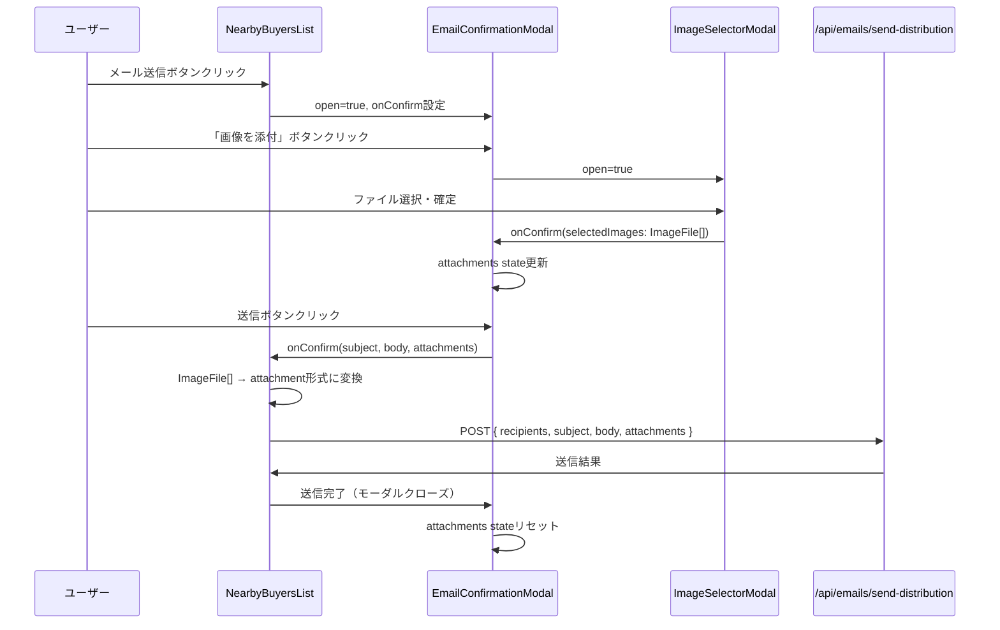

# 設計書: 近隣買主候補メール送信への添付機能追加

## 概要

売主リスト（SellerListPage）の近隣買主候補タブにある「メール送信」モーダル（`EmailConfirmationModal`）に、ファイル添付機能を追加する。

通話モードページ（CallModePage）で既に実装されている `ImageSelectorModal`（Google Drive・ローカルファイル・URL対応）を再利用し、バックエンドAPIの変更なしにフロントエンドのみの変更で実現する。

### 設計方針

- **最小変更原則**: バックエンドAPIは変更不要（`/api/emails/send-distribution` は `attachments` パラメータ対応済み）
- **既存コンポーネント再利用**: `ImageSelectorModal` をそのまま利用
- **添付ファイル変換ロジック再利用**: CallModePageで実装済みの `ImageFile → attachment` 変換ロジックを `NearbyBuyersList` に移植

---

## アーキテクチャ

### コンポーネント構成

```mermaid
graph TD
    A[NearbyBuyersList] -->|open/onConfirm| B[EmailConfirmationModal]
    B -->|open/onConfirm| C[ImageSelectorModal]
    A -->|POST /api/emails/send-distribution| D[Backend API]
    
    B -->|attachments: ImageFile[]| A
    C -->|selectedImages: ImageFile[]| B
```

### データフロー



---

## コンポーネントとインターフェース

### EmailConfirmationModal の変更

#### Props インターフェース変更

```typescript
// 変更前
interface EmailConfirmationModalProps {
  open: boolean;
  onClose: () => void;
  onConfirm: (subject: string, body: string) => Promise<void>;
  recipientCount: number;
  defaultSubject: string;
  defaultBody: string;
}

// 変更後
interface EmailConfirmationModalProps {
  open: boolean;
  onClose: () => void;
  onConfirm: (subject: string, body: string, attachments: ImageFile[]) => Promise<void>;
  recipientCount: number;
  defaultSubject: string;
  defaultBody: string;
}
```

#### 追加する内部 State

```typescript
const [attachments, setAttachments] = useState<ImageFile[]>([]);
const [imageSelectorOpen, setImageSelectorOpen] = useState(false);
```

#### モーダルリセット処理

`open` が `true` に変わったとき（`useEffect`）に `attachments` をリセットする。
キャンセル・送信完了時も `onClose` 呼び出し前にリセットする。

#### UI 追加箇所

本文エリア（`TextField`）の下に以下を追加：

1. 「画像を添付」ボタン（`AttachFile` アイコン付き）
2. 添付ファイル一覧（ファイル名 + 削除ボタン）
3. `ImageSelectorModal` コンポーネント

### NearbyBuyersList の変更

#### handleConfirmSendEmail の変更

```typescript
// 変更前
const handleConfirmSendEmail = async (subject: string, body: string) => { ... }

// 変更後
const handleConfirmSendEmail = async (subject: string, body: string, attachments: ImageFile[]) => {
  // ImageFile[] → attachment形式に変換（CallModePageと同じロジック）
  const attachmentImages = convertImageFilesToAttachments(attachments);
  
  // API呼び出し時にattachmentsを含める
  await api.post('/api/emails/send-distribution', {
    ...,
    ...(attachmentImages.length > 0 ? { attachments: attachmentImages } : {}),
  });
}
```

#### ImageFile 変換ロジック（純粋関数として抽出）

CallModePageの変換ロジックを純粋関数として `NearbyBuyersList` 内に実装する：

```typescript
// ImageFile[] をAPIのattachment形式に変換する純粋関数
const convertImageFilesToAttachments = (images: ImageFile[]): AttachmentPayload[] => {
  const result: AttachmentPayload[] = [];
  for (const img of images) {
    if (img.source === 'drive') {
      result.push({ id: img.driveFileId || img.id, name: img.name });
    } else if (img.source === 'local' && img.previewUrl) {
      const base64Match = img.previewUrl.match(/^data:([^;]+);base64,(.+)$/);
      if (base64Match) {
        result.push({ id: img.id, name: img.name, base64Data: base64Match[2], mimeType: base64Match[1] });
      }
    } else if (img.source === 'url' && img.url) {
      result.push({ id: img.id, name: img.name, url: img.url });
    }
  }
  return result;
};
```

---

## データモデル

### ImageFile 型（既存・変更なし）

`ImageSelectorModal.tsx` で定義されている型をそのまま利用する。
`EmailConfirmationModal.tsx` と `NearbyBuyersList.tsx` では import して使用する。

```typescript
// frontend/frontend/src/components/ImageSelectorModal.tsx からエクスポート
export interface ImageFile {
  id: string;
  name: string;
  source: 'drive' | 'local' | 'url';
  size: number;
  mimeType: string;
  thumbnailUrl?: string;
  previewUrl: string;
  driveFileId?: string;
  localFile?: File;
  url?: string;
}
```

> **注意**: 現在 `ImageFile` は `ImageSelectorModal.tsx` 内で `interface`（非export）として定義されている。
> `EmailConfirmationModal` から利用するため、`export interface ImageFile` に変更するか、
> 共通の型定義ファイル（例: `frontend/frontend/src/types/email.ts`）に移動する。
> 既存の `DistributionConfirmationModal.tsx` や `OtherCompanyDistributionPage.tsx` でも同じ型を独自定義しているため、
> 共通型ファイルへの移動が望ましい。

### AttachmentPayload 型（新規）

APIに送信する添付ファイルの形式：

```typescript
type AttachmentPayload =
  | { id: string; name: string }                                          // Google Drive
  | { id: string; name: string; base64Data: string; mimeType: string }   // ローカルファイル
  | { id: string; name: string; url: string };                           // URL
```

### サイズ制限定数

```typescript
const MAX_FILE_SIZE_BYTES = 5 * 1024 * 1024;   // 5MB per file
const MAX_TOTAL_SIZE_BYTES = 10 * 1024 * 1024; // 10MB total
```

---

## 正確性プロパティ

*プロパティとは、システムの全ての有効な実行において成立すべき特性や振る舞いのことです。プロパティは人間が読める仕様と機械で検証可能な正確性保証の橋渡しをします。*

### Property 1: 添付ファイル件数表示の正確性

*任意の* `ImageFile` の配列が `EmailConfirmationModal` に選択された場合、表示される件数はその配列の長さと一致する。

**Validates: Requirements 1.4**

### Property 2: 添付ファイル一覧表示の完全性

*任意の* `ImageFile` の配列が選択された場合、各ファイルの `name` が一覧に表示される。

**Validates: Requirements 1.5**

### Property 3: 添付ファイル削除後の排他性

*任意の* 添付ファイルリストから *任意の* ファイルを削除したとき、削除後のリストにそのファイルが含まれない。

**Validates: Requirements 1.6**

### Property 4: ImageFile → attachment 変換の正確性

*任意の* `source`（`'drive'` | `'local'` | `'url'`）を持つ `ImageFile` を変換したとき、対応する形式の `AttachmentPayload` が生成される：
- `source === 'drive'` → `{ id: driveFileId || id, name }` のみ（base64Data・urlなし）
- `source === 'local'` → `{ id, name, base64Data, mimeType }` を含む
- `source === 'url'` → `{ id, name, url }` を含む

**Validates: Requirements 2.2**

### Property 5: 単一ファイルサイズ制限

*任意の* サイズが `5MB` を超えるファイルを選択して確定しようとしたとき、確定が拒否されエラーメッセージが表示される。

**Validates: Requirements 4.1, 4.3**

### Property 6: 合計ファイルサイズ制限

*任意の* ファイルの組み合わせで合計サイズが `10MB` を超える場合、確定が拒否されエラーメッセージが表示される。

**Validates: Requirements 4.2, 4.3**

---

## エラーハンドリング

### サイズバリデーションエラー

`ImageSelectorModal` の確定ボタンクリック時に検証する：

1. **単一ファイルサイズ超過**: `{ファイル名} のサイズが5MBを超えています`
2. **合計サイズ超過**: `選択した画像の合計サイズが10MBを超えています`

エラー表示は `Alert` コンポーネント（severity="error"）を使用し、確定ボタンを無効化する。

> **注意**: `ImageSelectorModal` は既存コンポーネントであり、サイズ制限ロジックが未実装の場合は追加が必要。
> 既存の動作を壊さないよう、バリデーションは確定ボタンクリック時のみ実行する。

### メール送信エラー

既存の `NearbyBuyersList` のエラーハンドリング（`Snackbar`）をそのまま利用する。
添付ファイルに起因するエラーも同じ `Snackbar` で表示する。

---

## テスト戦略

### ユニットテスト（example-based）

以下の具体的なシナリオをテストする：

1. `EmailConfirmationModal` が `open=true` のとき「画像を添付」ボタンが表示される
2. 「画像を添付」ボタンクリックで `ImageSelectorModal` が開く
3. `ImageSelectorModal` に3つのタブ（GOOGLE DRIVE・ローカルファイル・URL）が表示される
4. 添付ファイルなしで送信したとき `attachments` フィールドが含まれない
5. 送信成功後に添付ファイルリストがリセットされる
6. モーダルキャンセル時に添付ファイルリストがリセットされる
7. モーダルを再度開いたとき前回の添付ファイルがリセットされる

### プロパティベーステスト（property-based）

ライブラリ: **fast-check**（TypeScript/JavaScript向けPBTライブラリ）

各プロパティテストは最低100回のイテレーションで実行する。

#### Property 1: 添付ファイル件数表示の正確性

```typescript
// Feature: seller-nearby-buyer-email-attachment, Property 1: 添付ファイル件数表示の正確性
fc.assert(fc.property(
  fc.array(arbitraryImageFile(), { minLength: 1, maxLength: 10 }),
  (images) => {
    // EmailConfirmationModalにimagesを設定し、表示件数がimages.lengthと一致することを確認
  }
), { numRuns: 100 });
```

#### Property 2: 添付ファイル一覧表示の完全性

```typescript
// Feature: seller-nearby-buyer-email-attachment, Property 2: 添付ファイル一覧表示の完全性
fc.assert(fc.property(
  fc.array(arbitraryImageFile(), { minLength: 1, maxLength: 10 }),
  (images) => {
    // 各images[i].nameが一覧に表示されることを確認
  }
), { numRuns: 100 });
```

#### Property 3: 添付ファイル削除後の排他性

```typescript
// Feature: seller-nearby-buyer-email-attachment, Property 3: 添付ファイル削除後の排他性
fc.assert(fc.property(
  fc.array(arbitraryImageFile(), { minLength: 1, maxLength: 10 }),
  fc.integer({ min: 0, max: 9 }),
  (images, indexToDelete) => {
    const idx = indexToDelete % images.length;
    const targetId = images[idx].id;
    // 削除後のリストにtargetIdが含まれないことを確認
  }
), { numRuns: 100 });
```

#### Property 4: ImageFile → attachment 変換の正確性

```typescript
// Feature: seller-nearby-buyer-email-attachment, Property 4: ImageFile → attachment 変換の正確性
fc.assert(fc.property(
  arbitraryImageFile(),
  (imageFile) => {
    const result = convertImageFilesToAttachments([imageFile]);
    if (imageFile.source === 'drive') {
      // idとnameのみ、base64Dataとurlはなしであることを確認
    } else if (imageFile.source === 'local') {
      // base64DataとmimeTypeが含まれることを確認
    } else if (imageFile.source === 'url') {
      // urlが含まれることを確認
    }
  }
), { numRuns: 100 });
```

#### Property 5: 単一ファイルサイズ制限

```typescript
// Feature: seller-nearby-buyer-email-attachment, Property 5: 単一ファイルサイズ制限
fc.assert(fc.property(
  fc.integer({ min: 5 * 1024 * 1024 + 1, max: 20 * 1024 * 1024 }),
  (fileSize) => {
    // sizeがfileSize（5MB超）のImageFileで確定を試みたとき、エラーが発生することを確認
  }
), { numRuns: 100 });
```

#### Property 6: 合計ファイルサイズ制限

```typescript
// Feature: seller-nearby-buyer-email-attachment, Property 6: 合計ファイルサイズ制限
fc.assert(fc.property(
  fc.array(
    fc.integer({ min: 1 * 1024 * 1024, max: 5 * 1024 * 1024 }),
    { minLength: 3, maxLength: 5 }
  ).filter(sizes => sizes.reduce((a, b) => a + b, 0) > 10 * 1024 * 1024),
  (fileSizes) => {
    // 合計サイズが10MB超のファイル群で確定を試みたとき、エラーが発生することを確認
  }
), { numRuns: 100 });
```

### 統合テスト

- `NearbyBuyersList` から `EmailConfirmationModal` を経由して `ImageSelectorModal` を開き、ファイルを選択して送信するE2Eフロー
- モックAPIを使用して `attachments` パラメータが正しく送信されることを確認
