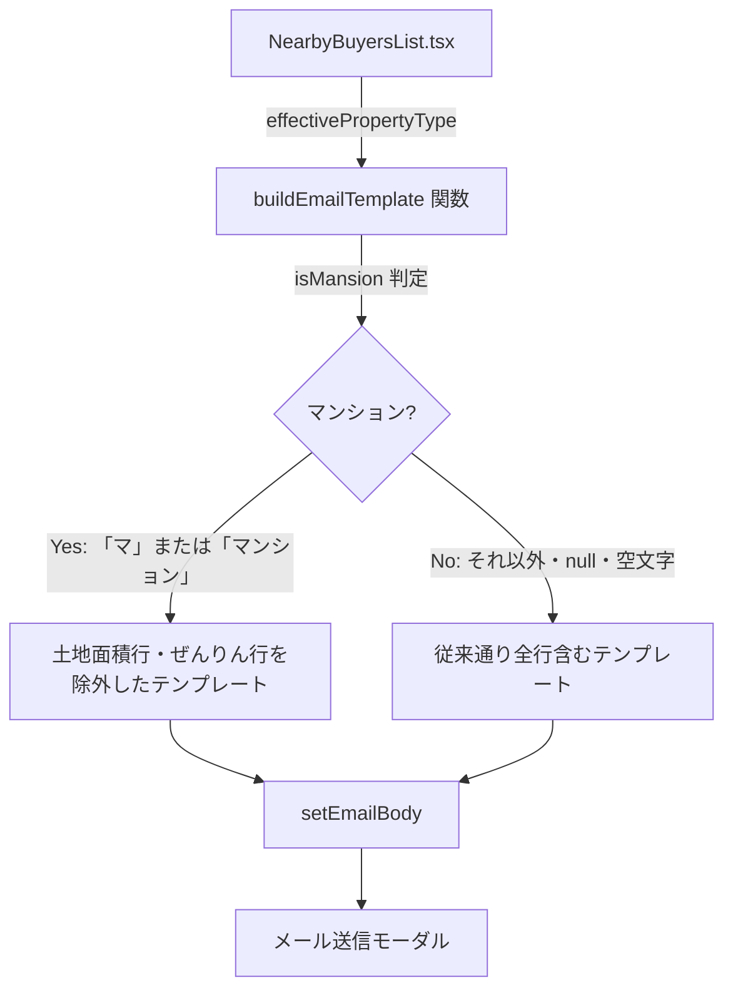

# 設計ドキュメント: マンション物件メール本文フィルター

## 概要

売主リストの近隣買主機能において、`buildEmailTemplate` 関数に `propertyType` パラメータを追加し、物件種別がマンション（「マ」または「マンション」）の場合にメール本文から「土地面積：㎡」行と「ぜんりんを添付しておりますのでご参考ください。」行を除外する。

### 変更の背景

マンション物件には土地面積の概念がなく、ぜんりん（住宅地図）も通常添付しない。
現在のテンプレートはこれらの行を常に含むため、担当者が毎回手動で削除する必要がある。
物件種別に応じて自動的に不要な行を除外することで、業務効率を向上させる。

---

## アーキテクチャ



### 変更対象ファイル

| ファイル | 変更内容 |
|---------|---------|
| `frontend/frontend/src/components/NearbyBuyersList.tsx` | `buildEmailTemplate` 関数に `propertyType` パラメータを追加し、マンション判定ロジックを実装。1名宛・複数名宛の両方の呼び出しで `effectivePropertyType` を渡す |

バックエンド変更は不要。

---

## コンポーネントとインターフェース

### `buildEmailTemplate` 関数シグネチャ変更

**変更前**:
```typescript
function buildEmailTemplate(params: {
  buyerName: string | null;
  address: string | null;
  landArea: number | null;
  buildingArea: number | null;
}): string
```

**変更後**:
```typescript
function buildEmailTemplate(params: {
  buyerName: string | null;
  address: string | null;
  landArea: number | null;
  buildingArea: number | null;
  propertyType: string | null | undefined;  // 追加
}): string
```

### マンション判定ロジック

```typescript
const isMansion = params.propertyType === 'マ' || params.propertyType === 'マンション';
```

### テンプレート生成ロジック

**マンション時（`isMansion === true`）**:
```
{氏名}様

お世話になります。不動産会社の株式会社いふうです。

下記を近々売りに出すことになりました！

物件住所：{物件住所}
建物面積：{建物面積}㎡

もしご興味がございましたら、このメールにご返信頂ければと思います。

よろしくお願いいたします。

×××××××××××××××
大分市舞鶴町1-3-30
株式会社いふう
TEL:097-533-2022
×××××××××××××××
```

**マンション以外・未設定時（`isMansion === false`）**:
```
{氏名}様

お世話になります。不動産会社の株式会社いふうです。

下記を近々売りに出すことになりました！

物件住所：{物件住所}
土地面積：{土地面積}㎡
建物面積：{建物面積}㎡

ぜんりんを添付しておりますのでご参考ください。
もしご興味がございましたら、このメールにご返信頂ければと思います。

よろしくお願いいたします。

×××××××××××××××
大分市舞鶴町1-3-30
株式会社いふう
TEL:097-533-2022
×××××××××××××××
```

### `buildEmailTemplate` 呼び出し箇所の変更

1名宛・複数名宛の両方で `effectivePropertyType` を渡す:

```typescript
// 1名宛
bodyTemplate = buildEmailTemplate({
  buyerName,
  address: propertyDetails?.address ?? null,
  landArea,
  buildingArea,
  propertyType: effectivePropertyType,  // 追加
});

// 複数名宛
bodyTemplate = buildEmailTemplate({
  buyerName: null,
  address: propertyDetails?.address ?? null,
  landArea,
  buildingArea,
  propertyType: effectivePropertyType,  // 追加
});
```

---

## データモデル

本変更はフロントエンドのみの変更であり、データモデルの変更はない。
`effectivePropertyType` は既存の `NearbyBuyersList` コンポーネントで以下のように定義されている:

```typescript
// props の propertyType を優先し、なければ API から取得した apiPropertyType を使用
const effectivePropertyType = propertyType || apiPropertyType;
```

---

## 正確性プロパティ

*プロパティとは、システムの全ての有効な実行において成り立つべき特性や動作のことです。プロパティは人間が読める仕様と機械で検証可能な正確性保証の橋渡しをします。*

### Property 1: マンション判定時の行除外

*任意の* buyerName・address・landArea・buildingArea の組み合わせに対して、`propertyType` が「マ」または「マンション」の場合、`buildEmailTemplate` が生成するテンプレートには「土地面積：」の行も「ぜんりんを添付しておりますのでご参考ください。」の行も含まれない。

**Validates: Requirements 1.2, 1.3**

### Property 2: 非マンション・未設定時の行保持

*任意の* buyerName・address・landArea・buildingArea の組み合わせに対して、`propertyType` が「マ」でも「マンション」でもない値（null・空文字・その他の文字列）の場合、`buildEmailTemplate` が生成するテンプレートには「土地面積：」の行と「ぜんりんを添付しておりますのでご参考ください。」の行の両方が含まれる。

**Validates: Requirements 2.1, 2.2, 2.3, 2.4**

---

## エラーハンドリング

| ケース | 対応 |
|-------|------|
| `propertyType` が null | マンション以外として扱い、従来通り全行を含める |
| `propertyType` が undefined | マンション以外として扱い、従来通り全行を含める |
| `propertyType` が空文字 | マンション以外として扱い、従来通り全行を含める |
| `propertyType` が「マ」または「マンション」 | 土地面積行・ぜんりん行を除外する |
| `propertyType` がその他の値（「戸」「土」「一」など） | マンション以外として扱い、従来通り全行を含める |

---

## テスト戦略

### ユニットテスト（例ベース）

`buildEmailTemplate` 関数に対して以下の具体例でテストする:

1. `propertyType='マ'` → 土地面積行・ぜんりん行が含まれない
2. `propertyType='マンション'` → 土地面積行・ぜんりん行が含まれない
3. `propertyType='戸建'` → 土地面積行・ぜんりん行が含まれる
4. `propertyType=null` → 土地面積行・ぜんりん行が含まれる
5. `propertyType=''` → 土地面積行・ぜんりん行が含まれる
6. `propertyType=undefined` → 土地面積行・ぜんりん行が含まれる

### プロパティベーステスト（fast-check 使用）

**ライブラリ**: `fast-check`

**最小イテレーション数**: 100回

**テストタグ形式**: `Feature: seller-nearby-buyer-email-mansion-filter, Property {番号}: {プロパティ内容}`

#### Property 1: マンション判定時の行除外

```typescript
// Feature: seller-nearby-buyer-email-mansion-filter, Property 1: マンション判定時の行除外
fc.assert(fc.property(
  fc.option(fc.string(), { nil: null }),  // buyerName
  fc.option(fc.string(), { nil: null }),  // address
  fc.option(fc.float({ min: 0.01, max: 9999.99, noNaN: true }), { nil: null }),  // landArea
  fc.option(fc.float({ min: 0.01, max: 9999.99, noNaN: true }), { nil: null }),  // buildingArea
  fc.constantFrom('マ', 'マンション'),  // propertyType
  (buyerName, address, landArea, buildingArea, propertyType) => {
    const result = buildEmailTemplate({ buyerName, address, landArea, buildingArea, propertyType });
    return !result.includes('土地面積：') && !result.includes('ぜんりんを添付しておりますのでご参考ください。');
  }
), { numRuns: 100 });
```

#### Property 2: 非マンション・未設定時の行保持

```typescript
// Feature: seller-nearby-buyer-email-mansion-filter, Property 2: 非マンション・未設定時の行保持
fc.assert(fc.property(
  fc.option(fc.string(), { nil: null }),  // buyerName
  fc.option(fc.string(), { nil: null }),  // address
  fc.option(fc.float({ min: 0.01, max: 9999.99, noNaN: true }), { nil: null }),  // landArea
  fc.option(fc.float({ min: 0.01, max: 9999.99, noNaN: true }), { nil: null }),  // buildingArea
  fc.oneof(
    fc.constant(null),
    fc.constant(undefined),
    fc.constant(''),
    fc.string().filter(s => s !== 'マ' && s !== 'マンション'),  // 非マンション文字列
  ),  // propertyType
  (buyerName, address, landArea, buildingArea, propertyType) => {
    const result = buildEmailTemplate({ buyerName, address, landArea, buildingArea, propertyType });
    return result.includes('土地面積：') && result.includes('ぜんりんを添付しておりますのでご参考ください。');
  }
), { numRuns: 100 });
```

### 手動確認

- マンション物件の売主詳細画面で「メール送信」ボタンを押下し、土地面積行・ぜんりん行が除外されていることを確認
- 戸建・土地物件の売主詳細画面で「メール送信」ボタンを押下し、土地面積行・ぜんりん行が含まれていることを確認
- 物件種別未設定の売主詳細画面で「メール送信」ボタンを押下し、土地面積行・ぜんりん行が含まれていることを確認
