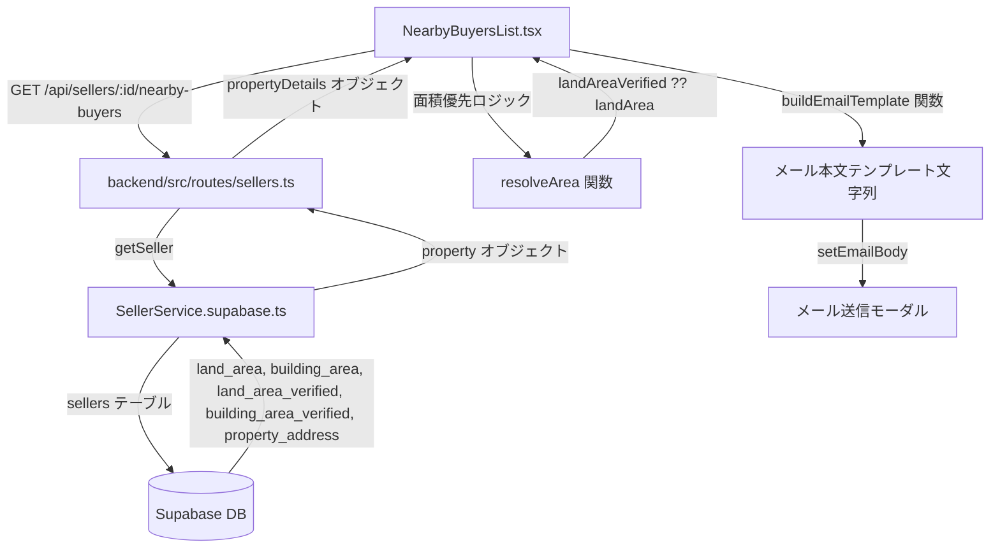

# 設計ドキュメント: 売主リスト近隣買主メール本文テンプレート変更

## 概要

売主リストの近隣買主機能において、「メール送信」ボタン押下後に表示されるメール本文テンプレートを変更する。
新テンプレートでは物件住所・土地面積・建物面積を本文中に直接埋め込む形式に変更し、面積フィールドは「当社調べ」値を優先するロジックを適用する。

### 変更の背景

現在のテンプレートは物件情報を `【物件情報】` セクションとして別途追記する形式になっている。
新テンプレートでは、物件住所・土地面積・建物面積を本文の主要部分に直接埋め込み、担当者が毎回手動で入力する手間を省く。

また、現在のバックエンドAPIは `propertyDetails` オブジェクトを返していないため、フロントエンドが面積情報を取得できない。
バックエンドAPIを拡張して `propertyDetails` を返すようにし、フロントエンドで面積優先ロジックを適用する。

---

## アーキテクチャ



### 変更対象ファイル

| ファイル | 変更内容 |
|---------|---------|
| `backend/src/routes/sellers.ts` | `GET /api/sellers/:id/nearby-buyers` のレスポンスに `propertyDetails` オブジェクトを追加 |
| `frontend/frontend/src/components/NearbyBuyersList.tsx` | `PropertyDetails` 型拡張、面積優先ロジック、テンプレート生成ロジック変更 |

---

## コンポーネントとインターフェース

### バックエンド: `GET /api/sellers/:id/nearby-buyers` レスポンス拡張

**変更前のレスポンス**:
```typescript
{
  buyers: NearbyBuyer[];
  matchedAreas: string[];
  propertyAddress: string | null;
  propertyType: string | null;
  salesPrice: number | null;
}
```

**変更後のレスポンス**:
```typescript
{
  buyers: NearbyBuyer[];
  matchedAreas: string[];
  propertyAddress: string | null;
  propertyType: string | null;
  salesPrice: number | null;
  propertyDetails: {
    address: string | null;
    landArea: number | null;
    buildingArea: number | null;
    landAreaVerified: number | null;
    buildingAreaVerified: number | null;
    buildYear: number | null;
    floorPlan: string | null;
  } | null;
}
```

`propertyDetails` は `seller.property` オブジェクトから取得する。
`seller.property` が存在しない場合は `null` を返す。

### フロントエンド: `PropertyDetails` インターフェース拡張

**変更前**:
```typescript
interface PropertyDetails {
  address: string | null;
  landArea: number | null;
  buildingArea: number | null;
  buildYear: number | null;
  floorPlan: string | null;
}
```

**変更後**:
```typescript
interface PropertyDetails {
  address: string | null;
  landArea: number | null;
  buildingArea: number | null;
  landAreaVerified: number | null;      // 追加: 土地面積（当社調べ）
  buildingAreaVerified: number | null;  // 追加: 建物面積（当社調べ）
  buildYear: number | null;
  floorPlan: string | null;
}
```

### フロントエンド: 面積優先ロジック関数

```typescript
/**
 * 面積優先ロジック: 「当社調べ」値を優先し、なければ通常値を使用する
 * @param verified 当社調べの面積値（landAreaVerified / buildingAreaVerified）
 * @param normal 通常の面積値（landArea / buildingArea）
 * @returns 優先された面積値（どちらもnullなら null）
 */
function resolveArea(verified: number | null | undefined, normal: number | null | undefined): number | null {
  if (verified != null) return verified;
  if (normal != null) return normal;
  return null;
}
```

### フロントエンド: テンプレート生成ロジック

**変更前のテンプレート形式**:
```
{氏名}様
お世話になります。不動産会社の株式会社いふうです。
{address}を近々売りに出すことになりました！

【物件情報】
住所: {address}
土地面積: {landArea}㎡
建物面積: {buildingArea}㎡
築年: {age}年
間取り: {floorPlan}
価格: 未定

もしご興味がございましたら、誰よりも早く内覧することが可能となっておりますので、このメールにご返信頂ければと思います。
{publicUrl}
{signature}
```

**変更後のテンプレート形式**:
```
{氏名}様

お世話になります。不動産会社の株式会社いふうです。

下記を近々売りに出すことになりました！

物件住所：{物件住所}
土地面積：{土地面積}㎡
建物面積：{建物面積}㎡

ぜんりんを添付しておりますのでご参考ください。
もしご興味がございましたら、このメールにご返信頂ければと思います。

よろしくお願いいたします。

×××××××××××××××
大分市舞鶴町1-3-30
株式会社いふう
TEL:097-533-2022
×××××××××××××××
```

**テンプレート生成関数のシグネチャ**:
```typescript
function buildEmailTemplate(params: {
  buyerName: string | null;  // null の場合は '{氏名}' プレースホルダーを使用
  address: string | null;
  landArea: number | null;
  buildingArea: number | null;
}): string
```

---

## データモデル

### Supabase `sellers` テーブル（既存カラム）

| カラム名 | 型 | 説明 |
|---------|-----|------|
| `property_address` | TEXT | 物件住所 |
| `land_area` | NUMERIC | 土地面積（㎡） |
| `building_area` | NUMERIC | 建物面積（㎡） |
| `land_area_verified` | NUMERIC | 土地面積（当社調べ）（㎡） |
| `building_area_verified` | NUMERIC | 建物面積（当社調べ）（㎡） |
| `build_year` | INTEGER | 築年 |
| `floor_plan` | TEXT | 間取り |

`land_area_verified` と `building_area_verified` は既にDBに存在し、`SellerService.supabase.ts` の `getSeller` メソッドが `seller.property.landAreaVerified` / `seller.property.buildingAreaVerified` として返している。

### フロントエンドの状態

`NearbyBuyersList` コンポーネントの `propertyDetails` ステートに `landAreaVerified` と `buildingAreaVerified` を追加する。

---

## 正確性プロパティ

*プロパティとは、システムの全ての有効な実行において成り立つべき特性や動作のことです。プロパティは人間が読める仕様と機械で検証可能な正確性保証の橋渡しをします。*

### Property 1: 物件住所のテンプレート埋め込み

*任意の* 物件住所文字列に対して、`buildEmailTemplate` 関数が生成するテンプレートにはその住所が含まれる。

**Validates: Requirements 1.2**

### Property 2: 土地面積のテンプレート埋め込み

*任意の* 土地面積値（null でない）に対して、`buildEmailTemplate` 関数が生成するテンプレートにはその面積値が含まれる。

**Validates: Requirements 1.3**

### Property 3: 建物面積のテンプレート埋め込み

*任意の* 建物面積値（null でない）に対して、`buildEmailTemplate` 関数が生成するテンプレートにはその面積値が含まれる。

**Validates: Requirements 1.4**

### Property 4: 1名宛の氏名置換

*任意の* 買主氏名に対して、1名宛のテンプレート生成では `{氏名}` プレースホルダーが当該氏名に置換される。

**Validates: Requirements 1.5**

### Property 5: 土地面積優先ロジック（当社調べ優先）

*任意の* `landAreaVerified`（null でない）と `landArea` の組み合わせに対して、`resolveArea` 関数は `landAreaVerified` を返す。

**Validates: Requirements 2.1**

### Property 6: 土地面積フォールバックロジック

*任意の* `landArea`（null でない）に対して、`landAreaVerified` が null の場合、`resolveArea` 関数は `landArea` を返す。

**Validates: Requirements 2.2**

### Property 7: 建物面積優先ロジック（当社調べ優先）

*任意の* `buildingAreaVerified`（null でない）と `buildingArea` の組み合わせに対して、`resolveArea` 関数は `buildingAreaVerified` を返す。

**Validates: Requirements 2.3**

### Property 8: 建物面積フォールバックロジック

*任意の* `buildingArea`（null でない）に対して、`buildingAreaVerified` が null の場合、`resolveArea` 関数は `buildingArea` を返す。

**Validates: Requirements 2.4**

**プロパティ反省（冗長性の排除）**:
- Property 5 と Property 7 は同じ `resolveArea` 関数の同一の性質（verified 優先）を土地・建物それぞれでテストしている。ただし、土地と建物は独立したフィールドであり、実装上も別々に扱われるため、両方のテストに価値がある。
- Property 6 と Property 8 も同様に独立した価値がある。
- Property 5〜8 は `resolveArea` 関数の単一の実装に対するテストであるため、1つの包括的なプロパティに統合できる。

**統合後**:

### Property 5（統合）: 面積優先ロジック

*任意の* `verified`（number | null）と `normal`（number | null）の組み合わせに対して、`resolveArea(verified, normal)` は以下を満たす:
- `verified` が null でない場合、`verified` を返す
- `verified` が null で `normal` が null でない場合、`normal` を返す
- 両方 null の場合、null を返す

**Validates: Requirements 2.1, 2.2, 2.3, 2.4**

---

## エラーハンドリング

### バックエンド

| ケース | 対応 |
|-------|------|
| `seller.property` が存在しない | `propertyDetails: null` を返す |
| `seller.property.landAreaVerified` が null | そのまま null を返す（フロントエンドでフォールバック） |
| `seller.property.buildingAreaVerified` が null | そのまま null を返す（フロントエンドでフォールバック） |

### フロントエンド

| ケース | 対応 |
|-------|------|
| `propertyDetails` が null | 面積フィールドを空文字列でテンプレートに埋め込む |
| `address` が null | 空文字列でテンプレートに埋め込む（要件 1.7） |
| `landArea` と `landAreaVerified` が両方 null | 空文字列でテンプレートに埋め込む（要件 1.8） |
| `buildingArea` と `buildingAreaVerified` が両方 null | 空文字列でテンプレートに埋め込む（要件 1.9） |

---

## テスト戦略

### ユニットテスト（例ベース）

1. **`resolveArea` 関数**:
   - `verified` あり・`normal` あり → `verified` を返す
   - `verified` なし・`normal` あり → `normal` を返す
   - 両方なし → null を返す

2. **`buildEmailTemplate` 関数**:
   - 1名宛: `{氏名}` が買主名に置換される
   - 複数宛: `{氏名}` プレースホルダーが残る
   - 住所 null: 空文字列に置換される
   - 面積 null: 空文字列に置換される

3. **バックエンド API レスポンス**:
   - `propertyDetails` オブジェクトが返される
   - `landAreaVerified`・`buildingAreaVerified` フィールドが含まれる

### プロパティベーステスト（fast-check 使用）

プロパティベーステストは `resolveArea` 関数と `buildEmailTemplate` 関数の純粋なロジックに適用する。

**ライブラリ**: `fast-check`（既存プロジェクトで使用済み）

**最小イテレーション数**: 100回

**テストタグ形式**: `Feature: seller-nearby-buyer-email-template, Property {番号}: {プロパティ内容}`

#### Property 1: 物件住所のテンプレート埋め込み
```typescript
// Feature: seller-nearby-buyer-email-template, Property 1: 物件住所のテンプレート埋め込み
fc.assert(fc.property(
  fc.string({ minLength: 1 }),
  (address) => {
    const result = buildEmailTemplate({ buyerName: 'テスト', address, landArea: null, buildingArea: null });
    return result.includes(address);
  }
));
```

#### Property 2 & 3: 面積のテンプレート埋め込み
```typescript
// Feature: seller-nearby-buyer-email-template, Property 2: 土地面積のテンプレート埋め込み
fc.assert(fc.property(
  fc.float({ min: 0.01, max: 9999.99, noNaN: true }),
  (landArea) => {
    const result = buildEmailTemplate({ buyerName: 'テスト', address: '大分市', landArea, buildingArea: null });
    return result.includes(String(landArea));
  }
));
```

#### Property 4: 1名宛の氏名置換
```typescript
// Feature: seller-nearby-buyer-email-template, Property 4: 1名宛の氏名置換
fc.assert(fc.property(
  fc.string({ minLength: 1 }),
  (name) => {
    const result = buildEmailTemplate({ buyerName: name, address: '大分市', landArea: null, buildingArea: null });
    return result.includes(`${name}様`) && !result.includes('{氏名}');
  }
));
```

#### Property 5（統合）: 面積優先ロジック
```typescript
// Feature: seller-nearby-buyer-email-template, Property 5: 面積優先ロジック
fc.assert(fc.property(
  fc.option(fc.float({ min: 0.01, max: 9999.99, noNaN: true }), { nil: null }),
  fc.option(fc.float({ min: 0.01, max: 9999.99, noNaN: true }), { nil: null }),
  (verified, normal) => {
    const result = resolveArea(verified, normal);
    if (verified != null) return result === verified;
    if (normal != null) return result === normal;
    return result === null;
  }
));
```

### インテグレーションテスト

- `GET /api/sellers/:id/nearby-buyers` のレスポンスに `propertyDetails` オブジェクトが含まれることを確認
- `propertyDetails` に `landAreaVerified`・`buildingAreaVerified`・`landArea`・`buildingArea`・`address` フィールドが含まれることを確認
