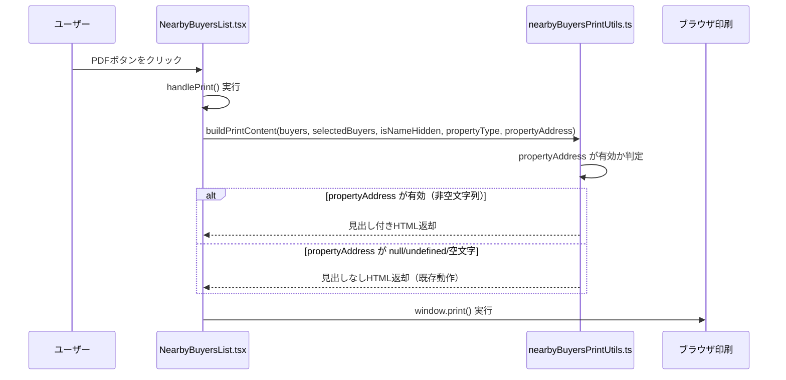

# デザイン設計書：売主リスト近隣買主PDFヘッダー表示

## 概要

売主リストの近隣買主セクションにある「PDF」ボタンを押した際、印刷プレビューのヘッダーに「{物件住所}の近隣にお問合せ合った買主様」という見出しを大きめのフォントで表示する機能を実装する。

変更対象は以下の2ファイルのみ：
- `frontend/frontend/src/components/nearbyBuyersPrintUtils.ts`
- `frontend/frontend/src/components/NearbyBuyersList.tsx`

バックエンド変更は不要。`propertyAddress` は既に `/api/sellers/:id/nearby-buyers` のレスポンスから取得・保持されている。

---

## アーキテクチャ



---

## コンポーネントとインターフェース

### nearbyBuyersPrintUtils.ts の変更

#### buildPrintContent 関数シグネチャ変更

```typescript
// 変更前
export const buildPrintContent = (
  buyers: NearbyBuyer[],
  selectedBuyerNumbers: Set<string>,
  isNameHidden: boolean,
  propertyType?: string | null
): string

// 変更後
export const buildPrintContent = (
  buyers: NearbyBuyer[],
  selectedBuyerNumbers: Set<string>,
  isNameHidden: boolean,
  propertyType?: string | null,
  propertyAddress?: string | null  // 追加（省略可能）
): string
```

`propertyAddress` は末尾に追加するため、既存の呼び出し元は変更不要（後方互換性を維持）。

### NearbyBuyersList.tsx の変更

#### handlePrint 関数の更新

```typescript
// 変更前
printRoot.innerHTML = buildPrintContent(buyers, selectedBuyers, isNameHidden, propertyType);

// 変更後
printRoot.innerHTML = buildPrintContent(buyers, selectedBuyers, isNameHidden, propertyType, propertyAddress);
```

---

## データモデル

新たなデータモデルの追加はなし。

`propertyAddress` は `NearbyBuyersList` コンポーネントの既存 state として保持されている：

```typescript
const [propertyAddress, setPropertyAddress] = useState<string | null>(null);
// APIレスポンスから取得済み: setPropertyAddress(response.data.propertyAddress)
```

---

## 正確性プロパティ

*プロパティとは、システムの全ての有効な実行において成立すべき特性や振る舞いのことです。プロパティは人間が読める仕様と機械で検証可能な正確性保証の橋渡しをします。*

### プロパティ1: 後方互換性の維持

*任意の* buyers リスト、selectedBuyerNumbers、isNameHidden、propertyType の組み合わせに対して、`propertyAddress` を渡さない場合と `undefined` を明示的に渡した場合で、`buildPrintContent` が同一の HTML を生成すること。

**Validates: Requirements 1.3, 4.5**

### プロパティ2: 有効な物件住所の見出し表示

*任意の* 非空文字列 `propertyAddress` を渡した場合、生成された HTML に「{propertyAddress}の近隣にお問合せ合った買主様」というテキストが含まれ、かつその見出し要素の `font-size` が 18px 以上であること。

**Validates: Requirements 2.1, 2.2**

### プロパティ3: 無効な物件住所での見出し非表示

*任意の* `null`、`undefined`、空文字、または空白のみの文字列を `propertyAddress` として渡した場合、生成された HTML に「の近隣にお問合せ合った買主様」というテキストが含まれないこと。

**Validates: Requirements 2.4, 1.2**

### プロパティ4: 既存テーブル列の維持

*任意の* buyers リストと選択状態に対して、生成された HTML に「買主番号」「名前」「受付日」「問合せ物件情報」「ヒアリング/内覧結果」「最新状況」の全ての列ヘッダーが含まれること。また、`isNameHidden=true` のとき名前が `visibility:hidden` スタイルで表示され、希望価格が設定された買主に対して「希望価格：」が含まれること。

**Validates: Requirements 4.1, 4.2, 4.3**

---

## エラーハンドリング

| ケース | 対応 |
|--------|------|
| `propertyAddress` が `null` | 見出し行を生成しない（既存動作と同等） |
| `propertyAddress` が `undefined` | 見出し行を生成しない（既存動作と同等） |
| `propertyAddress` が空文字 `""` | 見出し行を生成しない |
| `propertyAddress` が空白のみ `"   "` | `trim()` 後に空文字判定し、見出し行を生成しない |
| `propertyAddress` が有効な文字列 | 見出し行を生成する |

エラーハンドリングは `buildPrintContent` 内の条件分岐で完結する。例外は発生しない。

---

## テスト戦略

### 単体テスト（例示テスト）

`nearbyBuyersPrintUtils.ts` の `buildPrintContent` 関数に対して：

1. **見出し表示の確認**: `propertyAddress = "大分市舞鶴町1-3-30"` を渡したとき、生成 HTML に「大分市舞鶴町1-3-30の近隣にお問合せ合った買主様」が含まれること
2. **フォントサイズの確認**: 見出し要素に `font-size:18px` 以上のスタイルが設定されていること
3. **null 時の非表示**: `propertyAddress = null` のとき見出しが含まれないこと
4. **空文字時の非表示**: `propertyAddress = ""` のとき見出しが含まれないこと
5. **後方互換性**: `propertyAddress` を省略した呼び出しが正常に動作すること

### プロパティベーステスト

プロパティベーステストライブラリ（[fast-check](https://github.com/dubzzz/fast-check)）を使用し、最低100回のイテレーションで各プロパティを検証する。

#### プロパティ1のテスト実装方針

```typescript
// Feature: seller-nearby-buyer-pdf-header, Property 1: 後方互換性の維持
fc.assert(fc.property(
  fc.array(arbitraryNearbyBuyer()),
  fc.set(fc.string()),
  fc.boolean(),
  fc.option(fc.string()),
  (buyers, selectedNums, isNameHidden, propertyType) => {
    const selectedSet = new Set(selectedNums);
    const withoutArg = buildPrintContent(buyers, selectedSet, isNameHidden, propertyType);
    const withUndefined = buildPrintContent(buyers, selectedSet, isNameHidden, propertyType, undefined);
    return withoutArg === withUndefined;
  }
), { numRuns: 100 });
```

#### プロパティ2のテスト実装方針

```typescript
// Feature: seller-nearby-buyer-pdf-header, Property 2: 有効な物件住所の見出し表示
fc.assert(fc.property(
  fc.string({ minLength: 1 }).filter(s => s.trim().length > 0),
  (propertyAddress) => {
    const html = buildPrintContent([], new Set(), false, null, propertyAddress);
    return html.includes(`${propertyAddress}の近隣にお問合せ合った買主様`);
  }
), { numRuns: 100 });
```

#### プロパティ3のテスト実装方針

```typescript
// Feature: seller-nearby-buyer-pdf-header, Property 3: 無効な物件住所での見出し非表示
fc.assert(fc.property(
  fc.oneof(
    fc.constant(null),
    fc.constant(undefined),
    fc.constant(''),
    fc.string().map(s => s.replace(/\S/g, ' ')) // 空白のみの文字列
  ),
  (propertyAddress) => {
    const html = buildPrintContent([], new Set(), false, null, propertyAddress);
    return !html.includes('の近隣にお問合せ合った買主様');
  }
), { numRuns: 100 });
```

#### プロパティ4のテスト実装方針

```typescript
// Feature: seller-nearby-buyer-pdf-header, Property 4: 既存テーブル列の維持
fc.assert(fc.property(
  fc.array(arbitraryNearbyBuyer()),
  fc.boolean(),
  (buyers, isNameHidden) => {
    const selectedSet = new Set(buyers.map(b => b.buyer_number));
    const html = buildPrintContent(buyers, selectedSet, isNameHidden, null);
    const requiredHeaders = ['買主番号', '名前', '受付日', '問合せ物件情報', 'ヒアリング/内覧結果', '最新状況'];
    return requiredHeaders.every(h => html.includes(h));
  }
), { numRuns: 100 });
```

### 手動確認項目

- PDFボタンを押したとき、印刷プレビューのヘッダーに物件住所が表示されること
- 物件住所が取得できていない場合（null）、見出しが表示されないこと
- 既存の会社情報ブロック（株式会社いふう）が引き続き表示されること
- テーブルの全列が正常に表示されること
