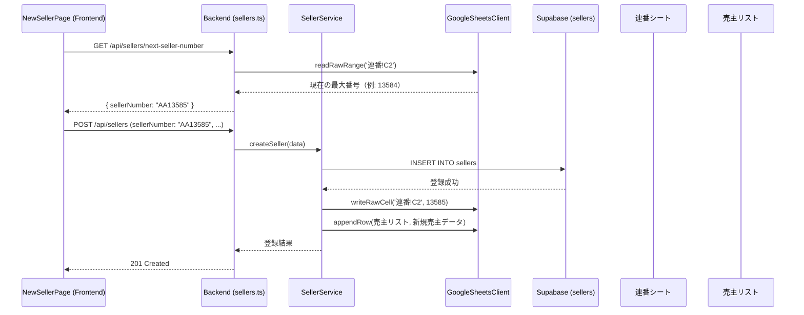

# デザインドキュメント：売主新規登録コピーフィールド

## 概要

売主新規登録画面（`NewSellerPage.tsx`）に以下の3つの機能を追加する：

1. **売主コピーフィールド** - 既存売主の情報を基本情報に自動入力するオートコンプリート
2. **買主コピーフィールド** - 既存買主の情報を基本情報に自動入力するオートコンプリート
3. **売主番号フィールド** - 連番シートから自動採番した売主番号を表示（読み取り専用）

また、新規売主登録時に以下のバックエンド処理を追加する：

- `GET /api/sellers/next-seller-number` エンドポイントの追加
- `POST /api/sellers` 成功後の連番シートC2セル更新
- `POST /api/sellers` 成功後の売主リストスプレッドシートへの行追加

---

## アーキテクチャ



### コンポーネント構成

```
frontend/frontend/src/pages/NewSellerPage.tsx
  ├── 売主コピー Autocomplete（新規追加）
  ├── 買主コピー Autocomplete（新規追加）
  ├── 売主番号 TextField（新規追加、readonly）
  └── 既存フィールド群

backend/src/routes/sellers.ts
  └── GET /api/sellers/next-seller-number（新規追加）

backend/src/services/SellerService.supabase.ts
  └── createSeller() の拡張
      ├── 連番シートC2更新
      └── 売主リスト最終行追加
```

---

## コンポーネントとインターフェース

### フロントエンド

#### 売主コピーフィールド

```typescript
// MUI Autocomplete を使用
// 入力値が変わるたびに GET /api/sellers/search?q={input} を呼び出す
// 候補の表示形式: "AA13585 - 山田太郎"
// 選択後: GET /api/sellers/by-number/{sellerNumber} で詳細取得
// 取得成功後: name, address, phoneNumber, email を自動入力
```

#### 買主コピーフィールド

```typescript
// MUI Autocomplete を使用
// 入力値が変わるたびに GET /api/buyers/search?q={input}&limit=20 を呼び出す
// 候補の表示形式: "4370 - 鈴木花子"
// 選択後: GET /api/buyers/{buyerNumber} で詳細取得
// 取得成功後: name, phone_number, email を自動入力
```

#### 売主番号フィールド

```typescript
// TextField (InputProps.readOnly: true)
// ページ表示時に GET /api/sellers/next-seller-number を呼び出す
// 取得した番号を表示
// 値が空の場合は登録ボタンを disabled にする
```

### バックエンド

#### GET /api/sellers/next-seller-number

```typescript
// 連番シート（ID: 19yAuVYQRm-_zhjYX7M7zjiGbnBibkG77Mpz93sN1xxs）の
// 「連番」シートのC2セルを読み取り、+1した番号を "AA{n}" 形式で返す
// レスポンス: { sellerNumber: "AA13585" }
// エラー時: 500 エラーレスポンス
```

#### POST /api/sellers の拡張

既存の `createSeller()` 呼び出し後に以下を追加：

1. 連番シートC2セルを `(現在値 + 1)` に更新
2. 売主リストスプレッドシートの最終行に新規売主データを追加

どちらもベストエフォート（失敗してもDB登録は成功扱い）。

---

## データモデル

### sellers テーブル（既存）

| カラム | 型 | 説明 |
|--------|-----|------|
| `seller_number` | TEXT (PK) | 売主番号（例: AA13585） |
| `name` | TEXT | 売主名（暗号化） |
| `address` | TEXT | 依頼者住所 |
| `phone_number` | TEXT | 電話番号（暗号化） |
| `email` | TEXT | メールアドレス（暗号化） |
| `property_address` | TEXT | 物件所在地 |

### 連番シート

| セル | 内容 |
|------|------|
| C2 | 現在の最大売主番号の数値部分（例: 13584） |

### 売主番号フォーマット

```
seller_number = "AA" + String(C2の値 + 1)
例: C2 = 13584 → "AA13585"
```

### API レスポンス型

```typescript
// GET /api/sellers/next-seller-number
interface NextSellerNumberResponse {
  sellerNumber: string; // "AA13585"
}

// GET /api/sellers/search?q=
interface SellerSearchResult {
  id: string;
  sellerNumber: string;
  name: string;
  propertyAddress?: string;
}

// GET /api/sellers/by-number/:sellerNumber（既存）
interface SellerByNumberResponse {
  id: string;
  sellerNumber: string;
  name: string;
  propertyAddress: string;
}
```

---

## 正確性プロパティ

*プロパティとは、システムの全ての有効な実行において成立すべき特性や振る舞いのことです。プロパティは人間が読める仕様と機械で検証可能な正確性保証の橋渡しをします。*

### Property 1: 売主コピー検索結果の整合性

*任意の* 検索クエリに対して、`GET /api/sellers/search?q={query}` が返す全ての候補は、`seller_number` または `name` にそのクエリ文字列を含む売主のみであること

**Validates: Requirements 1.2**

### Property 2: 売主コピーによるフィールド自動入力

*任意の* 売主データに対して、売主番号を選択して詳細取得が成功した場合、フォームの `name`・`address`・`phoneNumber`・`email` フィールドが取得した売主データの対応フィールドと一致すること

**Validates: Requirements 1.3, 1.4**

### Property 3: 買主コピーによるフィールド自動入力

*任意の* 買主データに対して、買主番号を選択して詳細取得が成功した場合、フォームの `name`・`phoneNumber`・`email` フィールドが取得した買主データの対応フィールドと一致すること

**Validates: Requirements 2.3, 2.4**

### Property 4: 売主番号フォーマットの正確性

*任意の* 正の整数 `n` に対して、連番シートのC2セルの値が `n` の場合、`GET /api/sellers/next-seller-number` は `"AA" + String(n + 1)` を返すこと

**Validates: Requirements 4.2, 4.3**

### Property 5: 売主番号のDB保存ラウンドトリップ

*任意の* 売主番号 `sellerNumber` を含む登録リクエストに対して、`POST /api/sellers` が成功した後に `GET /api/sellers/by-number/{sellerNumber}` を呼び出すと、同じ `sellerNumber` が返ること

**Validates: Requirements 4.6**

### Property 6: 売主リストへの正確な行追加

*任意の* 新規売主データに対して、`POST /api/sellers` が成功した後、売主リストスプレッドシートの最終行に追加されたデータが、カラムマッピング（`seller-spreadsheet-column-mapping.md`）に従って正しいカラムに書き込まれていること

**Validates: Requirements 6.1, 6.2**

---

## エラーハンドリング

### フロントエンド

| シナリオ | 対応 |
|---------|------|
| 売主検索API失敗 | Autocompleteの候補を空にする（エラー表示なし） |
| 売主詳細取得失敗 | エラーメッセージを表示、フィールドは変更しない |
| 買主検索API失敗 | Autocompleteの候補を空にする（エラー表示なし） |
| 買主詳細取得失敗 | エラーメッセージを表示、フィールドは変更しない |
| 次番号取得失敗 | エラーメッセージを表示、登録ボタンを無効化 |

### バックエンド

| シナリオ | 対応 |
|---------|------|
| 連番シートC2読み取り失敗 | 500エラーを返す |
| DB登録成功後の連番シートC2更新失敗 | エラーをログに記録、DB登録は成功として返す |
| DB登録成功後の売主リスト追加失敗 | エラーをログに記録、DB登録は成功として返す |
| `sellerNumber` が `POST /api/sellers` に含まれない場合 | 既存の動作（バリデーションエラー）に従う |

### 暗号化フィールドの注意

`sellers` テーブルの `name`・`phone_number`・`email` は暗号化されている。`GET /api/sellers/by-number/:sellerNumber` は既存の `SellerService.getSeller()` を経由して復号済みの値を返すため、フロントエンドはそのまま利用できる。

---

## テスト戦略

### ユニットテスト

- `GET /api/sellers/next-seller-number` のレスポンス形式（`AA{n}` フォーマット）
- 連番シートC2読み取り失敗時のエラーレスポンス
- `POST /api/sellers` 成功後のC2更新・行追加の呼び出し確認
- スプレッドシート操作失敗時にDB登録が成功として返ること

### プロパティベーステスト

プロパティベーステストには **fast-check**（TypeScript向け）を使用する。各テストは最低100回のランダム入力で実行する。

```typescript
// タグ形式: Feature: seller-new-registration-copy-fields, Property {番号}: {プロパティ名}
```

#### Property 1: 売主コピー検索結果の整合性
```typescript
// Feature: seller-new-registration-copy-fields, Property 1: 売主コピー検索結果の整合性
// fc.string() でランダムなクエリを生成し、返却された全候補が
// seller_number または name にクエリを含むことを検証
```

#### Property 2: 売主コピーによるフィールド自動入力
```typescript
// Feature: seller-new-registration-copy-fields, Property 2: 売主コピーによるフィールド自動入力
// ランダムな売主データを生成し、コピー後のフォームフィールドが
// 売主データの対応フィールドと一致することを検証
```

#### Property 3: 買主コピーによるフィールド自動入力
```typescript
// Feature: seller-new-registration-copy-fields, Property 3: 買主コピーによるフィールド自動入力
// ランダムな買主データを生成し、コピー後のフォームフィールドが
// 買主データの対応フィールドと一致することを検証
```

#### Property 4: 売主番号フォーマットの正確性
```typescript
// Feature: seller-new-registration-copy-fields, Property 4: 売主番号フォーマットの正確性
// fc.integer({ min: 1, max: 99999 }) でランダムな整数 n を生成し
// formatSellerNumber(n) === "AA" + String(n + 1) を検証
```

#### Property 5: 売主番号のDB保存ラウンドトリップ
```typescript
// Feature: seller-new-registration-copy-fields, Property 5: 売主番号のDB保存ラウンドトリップ
// ランダムな売主番号を生成し、登録後に by-number で取得した
// seller_number が一致することを検証（統合テスト）
```

#### Property 6: 売主リストへの正確な行追加
```typescript
// Feature: seller-new-registration-copy-fields, Property 6: 売主リストへの正確な行追加
// ランダムな売主データを生成し、appendRow で追加された行の各カラムが
// カラムマッピングに従って正しい位置に書き込まれることを検証
```

### 統合テスト

- 売主コピー → フィールド自動入力 → 登録の一連のフロー
- 買主コピー → フィールド自動入力 → 登録の一連のフロー
- 売主番号自動採番 → 登録 → 連番シートC2更新の一連のフロー
