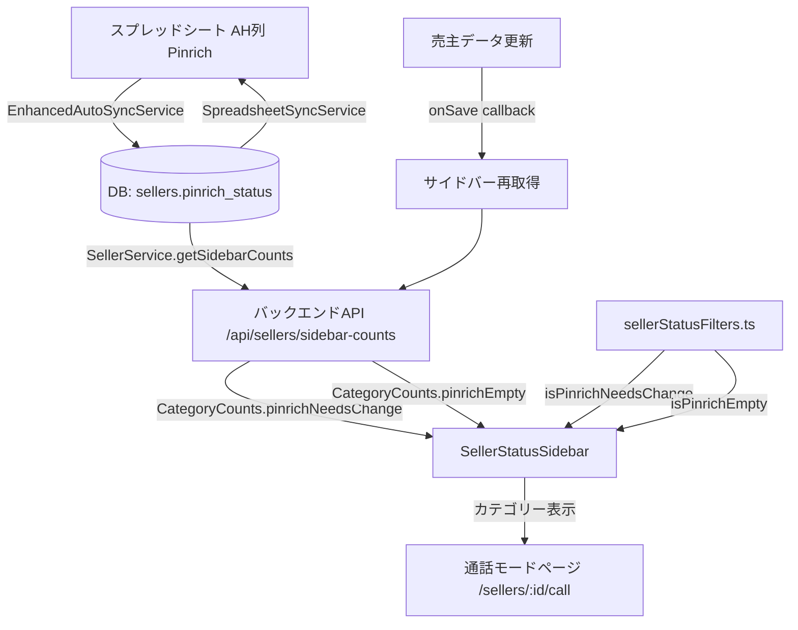

# 設計ドキュメント: seller-pinrich-sidebar-category

## 概要

売主リストの通話ノードページ（`/sellers/:id/call`）において、Pinrichフィールドの状態に基づく2つのサイドバーカテゴリーを実装する。

- **「Pinrich要変更」**: `pinrichStatus = '配信中'` かつ `visitAssignee` に値あり かつ `inquiryDate >= '2026-01-01'`
- **「Pinrich空欄」**: `pinrichStatus` が空欄 かつ 当日TEL分の条件 かつ `inquiryDate >= '2026-01-01'`

### 過去の失敗防止

過去の実装でサイドバーカテゴリーから表示が消えずにクリックするとデータなしとなる問題が発生した。本設計では**カテゴリー表示とフィルタリング結果の常時一致**を最重要設計原則とする。

---

## アーキテクチャ



### 既存アーキテクチャとの関係

本機能は既存の実装を**最小限の変更で拡張**する方針をとる。

| レイヤー | 既存ファイル | 変更内容 |
|---------|------------|---------|
| フロントエンド フィルター | `sellerStatusFilters.ts` | `isPinrichNeedsChange` 関数の条件修正（`inquiryDate` 条件追加）、`isPinrichEmpty` 関数の条件修正（`inquiryDate` 条件追加） |
| フロントエンド UI | `SellerStatusSidebar.tsx` | `pinrichChangeRequired` カテゴリーの `filterSellersByCategory` への追加（既にUI定義済み） |
| バックエンド | `SellerService.supabase.ts` | `getSidebarCountsFallback` の `pinrichNeedsChange` カウントロジック修正（`inquiryDate` 条件追加） |
| 同期設定 | `column-mapping.json` | 確認のみ（既にマッピング済み） |

---

## コンポーネントとインターフェース

### 1. フロントエンド: `sellerStatusFilters.ts`

#### `isPinrichNeedsChange(seller)` 関数（修正）

**現状の問題**: 既存の `isPinrichChangeRequired` は条件A〜Dの複合条件だが、要件定義では「配信中 + visitAssignee あり + inquiryDate >= 2026-01-01」のシンプルな条件に変更する。

```typescript
/**
 * Pinrich要変更カテゴリー判定（新条件）
 * 
 * 条件:
 * - pinrichStatus === '配信中'
 * - visitAssignee に有効な値がある（空・null・'外す' は除外）
 * - inquiryDate >= '2026-01-01'
 */
export const isPinrichNeedsChange = (seller: Seller | any): boolean => {
  const pinrichStatus = seller.pinrichStatus || seller.pinrich_status || '';
  if (pinrichStatus !== '配信中') return false;

  const visitAssignee = seller.visitAssigneeInitials || seller.visit_assignee || seller.visitAssignee || '';
  if (!visitAssignee || visitAssignee.trim() === '' || visitAssignee.trim() === '外す') return false;

  const inquiryDate = seller.inquiryDate || seller.inquiry_date || '';
  const normalized = normalizeDateString(inquiryDate);
  if (!normalized || normalized < '2026-01-01') return false;

  return true;
};
```

> **注意**: 既存の `isPinrichChangeRequired` は条件A〜Dの複合ロジックを持つ。要件定義の「Pinrich要変更」は新しいシンプルな条件に置き換える。既存の `isPinrichChangeRequired` は別途保持するか、要件確認後に削除する。

#### `isPinrichEmpty(seller)` 関数（修正）

**現状の問題**: 既存実装に `inquiryDate >= '2026-01-01'` の条件が欠けている。

```typescript
/**
 * Pinrich空欄カテゴリー判定（修正後）
 * 
 * 条件:
 * - isTodayCall(seller) が true（追客中 + 次電日今日以前 + コミュニケーション情報なし + 営担なし）
 * - pinrichStatus が空欄
 * - inquiryDate >= '2026-01-01'
 */
export const isPinrichEmpty = (seller: Seller | any): boolean => {
  if (!isTodayCall(seller)) return false;

  const pinrichStatus = seller.pinrichStatus || seller.pinrich_status || '';
  if (pinrichStatus && pinrichStatus.trim() !== '') return false;

  const inquiryDate = seller.inquiryDate || seller.inquiry_date || '';
  const normalized = normalizeDateString(inquiryDate);
  if (!normalized || normalized < '2026-01-01') return false;

  return true;
};
```

#### `filterSellersByCategory` への追加（`SellerStatusSidebar.tsx`）

```typescript
case 'pinrichChangeRequired':
  return sellers.filter(isPinrichNeedsChange);  // isPinrichChangeRequired → isPinrichNeedsChange に変更
```

### 2. バックエンド: `SellerService.supabase.ts`

#### `getSidebarCountsFallback` の `pinrichNeedsChange` カウント修正

**現状の問題**: 既存の `pinrichChangeRequiredCount` は条件A〜Dの複合ロジックを使用している。新条件（配信中 + visitAssignee あり + inquiryDate >= 2026-01-01）に変更する。

```typescript
// Pinrich要変更カテゴリー用クエリ（新条件）
this.table('sellers')
  .select('id')
  .is('deleted_at', null)
  .eq('pinrich_status', '配信中')
  .not('visit_assignee', 'is', null)
  .neq('visit_assignee', '')
  .neq('visit_assignee', '外す')
  .gte('inquiry_date', '2026-01-01'),
```

#### `pinrichEmpty` カウントの修正

```typescript
// Pinrich空欄カウント（inquiryDate条件追加）
const pinrichEmptyCount = filteredTodayCallSellers.filter(s => {
  const hasInfo = /* コミュニケーション情報チェック */;
  if (hasInfo) return false;
  const pinrich = (s as any).pinrich_status || '';
  if (pinrich && pinrich.trim() !== '') return false;
  const inquiryDate = (s as any).inquiry_date || '';
  return inquiryDate >= '2026-01-01';  // ← 追加
}).length;
```

### 3. スプレッドシート同期: `column-mapping.json`

既存のマッピングを確認済み（変更不要）:

```json
"spreadsheetToDatabase": {
  "Pinrich": "pinrich_status"
},
"databaseToSpreadsheet": {
  "pinrich_status": "Pinrich"
}
```

---

## データモデル

### `sellers` テーブル（既存カラム）

| カラム名 | 型 | 説明 |
|---------|-----|------|
| `pinrich_status` | TEXT | Pinrichステータス（例: '配信中', 'クローズ', NULL） |
| `visit_assignee` | TEXT | 営業担当イニシャル |
| `inquiry_date` | DATE | 反響日付 |

### フロントエンド型: `CategoryCounts`（既存、変更なし）

```typescript
export interface CategoryCounts {
  // ...既存フィールド...
  pinrichEmpty: number;
  pinrichChangeRequired: number;  // ← 既存フィールド（新条件で計算）
}
```

### フロントエンド型: `StatusCategory`（既存、変更なし）

```typescript
export type StatusCategory = 
  // ...既存値...
  | 'pinrichEmpty'
  | 'pinrichChangeRequired';  // ← 既存値
```

---

## 正確性プロパティ

*プロパティとは、システムの全ての有効な実行において成立すべき特性や振る舞いを表す形式的な記述です。プロパティは人間が読める仕様と機械で検証可能な正確性保証の橋渡しをします。*

### Property 1: isPinrichNeedsChange の正確な判定

*任意の* 売主データに対して、`pinrichStatus === '配信中'` かつ `visitAssignee` に有効な値があり かつ `inquiryDate >= '2026-01-01'` の場合に限り `isPinrichNeedsChange(seller)` が `true` を返す

**Validates: Requirements 1.1, 1.2, 1.3, 1.4, 1.5, 4.1, 4.2, 4.3, 4.4, 4.5**

### Property 2: isPinrichEmpty の正確な判定

*任意の* 売主データに対して、`isTodayCall(seller) === true` かつ `pinrichStatus` が空欄 かつ `inquiryDate >= '2026-01-01'` の場合に限り `isPinrichEmpty(seller)` が `true` を返す

**Validates: Requirements 3.1, 3.2, 3.4**

### Property 3: バックエンドとフロントエンドのカウント一致（モデルベーステスト）

*任意の* 売主データセットに対して、`SellerService.getSidebarCounts()` が返す `pinrichChangeRequired` カウントと、同じデータに対して `isPinrichNeedsChange()` でフィルタリングした結果の件数が一致する

**Validates: Requirements 5.2, 5.4**

### Property 4: カテゴリー表示とフィルタリング結果の常時一致（不変条件）

*任意の* 売主リストに対して、`pinrichChangeRequired` カテゴリーに表示される全売主が `isPinrichNeedsChange(seller) === true` を満たし、かつ `isPinrichNeedsChange(seller) === true` の全売主がカテゴリーに含まれる（双方向一致）

**Validates: Requirements 1.6, 1.7, 7.3, 7.5**

### Property 5: Pinrich空欄カテゴリーの双方向一致（不変条件）

*任意の* 売主リストに対して、`pinrichEmpty` カテゴリーに表示される全売主が `isPinrichEmpty(seller) === true` を満たし、かつ `isPinrichEmpty(seller) === true` の全売主がカテゴリーに含まれる（双方向一致）

**Validates: Requirements 3.3, 3.5, 7.4, 7.5**

---

## エラーハンドリング

### サイドバー再取得失敗時

要件2.4に対応。既存の `SellerStatusSidebar.tsx` のエラーハンドリングパターンに従う。

```typescript
// 再取得失敗時: 前回の表示状態を維持し、エラーを表示
try {
  const counts = await fetchSidebarCounts();
  setCategoryCounts(counts);
} catch (error) {
  console.error('サイドバーカウント取得失敗:', error);
  // 前回の categoryCounts を維持（setState を呼ばない）
  setError('カテゴリー情報の更新に失敗しました');
}
```

### `pinrich_status` の空欄処理

スプレッドシートのAH列が空欄の場合、`EnhancedAutoSyncService.syncSingleSeller` では既存の処理:

```typescript
pinrich_status: mappedData.pinrich_status || null,
```

これにより空欄は `null` として保存される（要件6.6を満たす）。

---

## テスト戦略

### 単体テスト（例ベース）

| テスト対象 | テスト内容 |
|-----------|-----------|
| `isPinrichNeedsChange` | pinrichStatus='配信中', visitAssignee='Y', inquiryDate='2026-01-15' → true |
| `isPinrichNeedsChange` | pinrichStatus='クローズ', visitAssignee='Y', inquiryDate='2026-01-15' → false |
| `isPinrichNeedsChange` | pinrichStatus='配信中', visitAssignee='', inquiryDate='2026-01-15' → false |
| `isPinrichNeedsChange` | pinrichStatus='配信中', visitAssignee='Y', inquiryDate='2025-12-31' → false |
| `isPinrichNeedsChange` | pinrichStatus='配信中', visitAssignee='外す', inquiryDate='2026-01-15' → false |
| `isPinrichEmpty` | isTodayCall=true, pinrichStatus='', inquiryDate='2026-01-15' → true |
| `isPinrichEmpty` | isTodayCall=true, pinrichStatus='配信中', inquiryDate='2026-01-15' → false |
| `isPinrichEmpty` | isTodayCall=true, pinrichStatus='', inquiryDate='2025-12-31' → false |
| `getSidebarCounts` | pinrichNeedsChange フィールドがレスポンスに含まれる |
| `getSidebarCounts` | pinrichEmpty フィールドがレスポンスに含まれる |

### プロパティベーステスト

プロパティベーステストには **fast-check**（TypeScript/JavaScript向け）を使用する。各テストは最低100回のランダム入力で実行する。

```typescript
// Property 1: isPinrichNeedsChange の正確な判定
// Feature: seller-pinrich-sidebar-category, Property 1: isPinrichNeedsChange の正確な判定
fc.assert(fc.property(
  fc.record({
    pinrichStatus: fc.oneof(fc.constant('配信中'), fc.string()),
    visitAssignee: fc.oneof(fc.constant(''), fc.constant('外す'), fc.string()),
    inquiryDate: fc.oneof(
      fc.date({ min: new Date('2025-01-01'), max: new Date('2025-12-31') }).map(d => d.toISOString().split('T')[0]),
      fc.date({ min: new Date('2026-01-01'), max: new Date('2027-12-31') }).map(d => d.toISOString().split('T')[0])
    ),
  }),
  (seller) => {
    const result = isPinrichNeedsChange(seller);
    const expected = seller.pinrichStatus === '配信中'
      && seller.visitAssignee !== '' && seller.visitAssignee !== '外す'
      && seller.inquiryDate >= '2026-01-01';
    return result === expected;
  }
), { numRuns: 100 });

// Property 3: バックエンドとフロントエンドのカウント一致
// Feature: seller-pinrich-sidebar-category, Property 3: バックエンドとフロントエンドのカウント一致
// ※ バックエンドのロジックをモック化してフロントエンドのフィルターと比較
```

### インテグレーションテスト

| テスト内容 | 検証方法 |
|-----------|---------|
| スプレッドシートAH列 → DB同期 | `EnhancedAutoSyncService.syncSingleSeller` 呼び出し後にDBを確認 |
| DB → スプレッドシートAH列同期 | `SpreadsheetSyncService` 呼び出し後にスプレッドシートを確認 |
| 保存後のサイドバー再取得 | 売主更新後に `onSave` コールバックが呼ばれることを確認 |

### 手動確認チェックリスト（過去の失敗防止）

- [ ] 「Pinrich要変更」カテゴリーをクリックして、表示される全売主が条件を満たすことを確認
- [ ] 「Pinrich空欄」カテゴリーをクリックして、表示される全売主が条件を満たすことを確認
- [ ] 売主のpinrichStatusを「配信中」→「クローズ」に変更して保存後、「Pinrich要変更」から即座に消えることを確認
- [ ] 売主のpinrichStatusに値を入力して保存後、「Pinrich空欄」から即座に消えることを確認
- [ ] カテゴリーの件数表示とクリック後の一覧件数が一致することを確認
