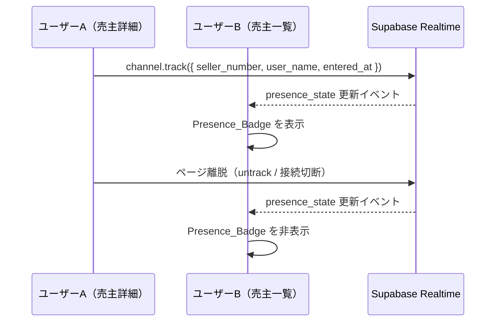

# デザインドキュメント: seller-presence

## 概要

売主一覧ページ（`SellersPage.tsx`）に「プレゼンス表示」機能を追加する。
Supabase Realtime Presence機能を使用して、他のユーザーが現在どの売主ページを開いているかをリアルタイムで表示する。

**目的**: 重複対応の防止とチームの作業状況の可視化

---

## アーキテクチャ

### Supabase Realtime Presence の仕組み



**Supabase Presence の特性**:
- 全ユーザーが同一チャンネル（`seller-presence`）に参加
- `track()` でプレゼンス情報を登録、`untrack()` または接続切断で自動削除
- DBテーブル不要（メモリ上で管理）
- Vercelサーバーレス環境でも動作（クライアントサイドのWebSocket接続）

### システム構成

```
フロントエンド（Vercel）
├── SellersPage.tsx          ← プレゼンスバッジ表示（購読側）
├── SellerDetailPage.tsx     ← プレゼンス登録（発信側）
├── CallModePage.tsx         ← プレゼンス登録（発信側）
└── hooks/useSellerPresence.ts ← プレゼンス管理カスタムフック

Supabase Realtime
└── channel: "seller-presence"
    └── presence key: seller_number
        └── { user_name, entered_at }
```

---

## コンポーネントと インターフェース

### `useSellerPresence` フック

**ファイル**: `frontend/frontend/src/hooks/useSellerPresence.ts`

```typescript
// プレゼンス情報の型
interface PresenceRecord {
  user_name: string;
  entered_at: string; // ISO 8601
}

// seller_number → PresenceRecord[] のマップ
type PresenceState = Record<string, PresenceRecord[]>;

// フックの戻り値（購読側: SellersPage用）
interface UseSellerPresenceSubscribeResult {
  presenceState: PresenceState;
  isConnected: boolean;
}

// フックの戻り値（発信側: SellerDetailPage / CallModePage用）
interface UseSellerPresenceTrackResult {
  isTracking: boolean;
}

// 購読専用（SellersPage）
function useSellerPresenceSubscribe(): UseSellerPresenceSubscribeResult;

// 発信専用（SellerDetailPage / CallModePage）
function useSellerPresenceTrack(sellerNumber: string | undefined): UseSellerPresenceTrackResult;
```

**実装方針**:
- `useSellerPresenceSubscribe`: チャンネルに参加し `presenceChange` イベントを購読
- `useSellerPresenceTrack`: チャンネルに参加し `track()` でプレゼンスを登録、アンマウント時に `untrack()`
- 両フックとも `useEffect` のクリーンアップでチャンネルを `removeChannel()`

### `SellersPage.tsx` の変更

- `useSellerPresenceSubscribe()` を呼び出して `presenceState` を取得
- テーブルの各行で `presenceState[seller.sellerNumber]` を参照
- プレゼンスがある場合、MUI `Chip` コンポーネントで表示

### `SellerDetailPage.tsx` / `CallModePage.tsx` の変更

- `useSellerPresenceTrack(seller.sellerNumber)` を呼び出す
- `seller.sellerNumber` が取得できた時点でトラッキング開始
- コンポーネントのアンマウント時に自動的にトラッキング停止

---

## データモデル

### Presence_Record（Supabase Realtime上のメモリデータ）

```typescript
interface PresenceRecord {
  user_name: string;    // employee.name（例: "林田"）
  entered_at: string;   // ISO 8601タイムスタンプ（例: "2026-03-21T10:00:00.000Z"）
}
```

**プレゼンスキー**: `seller_number`（例: `"AA13501"`）

**チャンネル名**: `"seller-presence"`

**Staleレコードの判定**:
- `entered_at` から30分以上経過したレコードはStaleとみなす
- クライアントサイドでフィルタリング（表示時に除外）

### Presence_Badge の表示ロジック

```typescript
// 単一ユーザー: "林田が入っています"
// 複数ユーザー: "林田、田中が入っています"
function formatPresenceLabel(records: PresenceRecord[]): string {
  const activeRecords = filterStaleRecords(records); // 30分以内のみ
  if (activeRecords.length === 0) return '';
  const names = activeRecords.map(r => r.user_name).join('、');
  return `${names}が入っています`;
}
```

---

## 実装詳細

### `useSellerPresence.ts`（新規作成）

```typescript
import { useEffect, useState, useRef } from 'react';
import { supabase } from '../config/supabase';
import { useAuthStore } from '../store/authStore';

const CHANNEL_NAME = 'seller-presence';
const STALE_THRESHOLD_MS = 30 * 60 * 1000; // 30分

// Staleレコードをフィルタリング
export function filterStaleRecords(records: PresenceRecord[]): PresenceRecord[] {
  const now = Date.now();
  return records.filter(r => {
    const enteredAt = new Date(r.entered_at).getTime();
    return now - enteredAt < STALE_THRESHOLD_MS;
  });
}

// PresenceBadgeのラベルを生成
export function formatPresenceLabel(records: PresenceRecord[]): string {
  const active = filterStaleRecords(records);
  if (active.length === 0) return '';
  const names = active.map(r => r.user_name).join('、');
  return `${names}が入っています`;
}

// 購読専用フック（SellersPage用）
export function useSellerPresenceSubscribe(): UseSellerPresenceSubscribeResult {
  const [presenceState, setPresenceState] = useState<PresenceState>({});
  const [isConnected, setIsConnected] = useState(false);

  useEffect(() => {
    const channel = supabase.channel(CHANNEL_NAME);

    channel
      .on('presence', { event: 'sync' }, () => {
        const state = channel.presenceState<PresenceRecord>();
        // presenceState を seller_number → PresenceRecord[] に変換
        const mapped: PresenceState = {};
        for (const [key, presences] of Object.entries(state)) {
          mapped[key] = presences as PresenceRecord[];
        }
        setPresenceState(mapped);
      })
      .subscribe((status) => {
        setIsConnected(status === 'SUBSCRIBED');
        if (status !== 'SUBSCRIBED') {
          console.error('[useSellerPresence] 接続失敗:', status);
        }
      });

    return () => {
      supabase.removeChannel(channel);
    };
  }, []);

  return { presenceState, isConnected };
}

// 発信専用フック（SellerDetailPage / CallModePage用）
export function useSellerPresenceTrack(
  sellerNumber: string | undefined
): UseSellerPresenceTrackResult {
  const { employee } = useAuthStore();
  const [isTracking, setIsTracking] = useState(false);

  useEffect(() => {
    if (!sellerNumber || !employee?.name) return;

    const channel = supabase.channel(CHANNEL_NAME);

    channel.subscribe(async (status) => {
      if (status === 'SUBSCRIBED') {
        await channel.track({
          user_name: employee.name,
          entered_at: new Date().toISOString(),
        });
        setIsTracking(true);
      }
    });

    return () => {
      channel.untrack().finally(() => {
        supabase.removeChannel(channel);
        setIsTracking(false);
      });
    };
  }, [sellerNumber, employee?.name]);

  return { isTracking };
}
```

### `SellersPage.tsx` の変更箇所

```typescript
// 追加: プレゼンスフックのインポートと使用
import { useSellerPresenceSubscribe, formatPresenceLabel } from '../hooks/useSellerPresence';

// コンポーネント内
const { presenceState } = useSellerPresenceSubscribe();

// テーブル行内（seller_number列の近く）
{presenceState[seller.sellerNumber] && formatPresenceLabel(presenceState[seller.sellerNumber]) && (
  <Chip
    label={formatPresenceLabel(presenceState[seller.sellerNumber])}
    color="warning"
    size="small"
    sx={{ ml: 1 }}
  />
)}
```

### `SellerDetailPage.tsx` / `CallModePage.tsx` の変更箇所

```typescript
// 追加: プレゼンストラッキングフックのインポートと使用
import { useSellerPresenceTrack } from '../hooks/useSellerPresence';

// コンポーネント内（seller.sellerNumber が取得できた後）
useSellerPresenceTrack(seller?.sellerNumber);
```

---

## 正確性プロパティ

*プロパティとは、システムの全ての有効な実行において成立すべき特性や振る舞いのことです。プロパティは人間が読める仕様と機械で検証可能な正確性保証の橋渡しをします。*

### Property 1: 入室でPresence_Recordが登録される

*任意の* `seller_number` と認証済みユーザーに対して、`useSellerPresenceTrack` を呼び出した後、Supabase Presenceのstateにそのユーザーの `Presence_Record` が含まれること

**Validates: Requirements 1.1, 6.1**

### Property 2: 退室でPresence_Recordが削除される（ラウンドトリップ）

*任意の* `seller_number` に対して、`track()` を呼び出した後に `untrack()` を呼び出すと、Presenceのstateからそのユーザーのレコードが削除されること

**Validates: Requirements 1.2, 6.2**

### Property 3: 複数ユーザーのラベル生成

*任意の* ユーザー名リスト（1件以上）に対して、`formatPresenceLabel` を呼び出すと、全ユーザー名を含む「〇〇が入っています」形式の文字列が返ること

**Validates: Requirements 3.2, 3.3**

### Property 4: Staleレコードのフィルタリング

*任意の* `PresenceRecord` リストに対して、`filterStaleRecords` を呼び出すと、`entered_at` から30分以上経過したレコードが除外されること

**Validates: Requirements 4.1, 4.2**

### Property 5: Presence_Recordにentered_atが含まれる

*任意の* `seller_number` と認証済みユーザーに対して、`track()` で登録されたPresence_Recordに `entered_at` フィールドが含まれること

**Validates: Requirements 4.1**

---

## エラーハンドリング

| シナリオ | 対応 |
|---------|------|
| Supabase Realtimeへの接続失敗 | `console.error` でログ記録、売主一覧の通常機能は継続 |
| 未認証ユーザーによるtrack呼び出し | `employee?.name` が存在しない場合は `useEffect` を早期リターン |
| `sellerNumber` が未取得の状態でのtrack | `sellerNumber` が `undefined` の場合は `useEffect` を早期リターン |
| チャンネルのクリーンアップ失敗 | `untrack().finally()` でチャンネルを確実に削除 |
| Staleレコードの表示 | 表示時に `filterStaleRecords` でクライアントサイドフィルタリング |

---

## テスト戦略

### デュアルテストアプローチ

ユニットテストとプロパティベーステストの両方を使用する。

**ユニットテスト（具体的な例・エッジケース）**:
- 未認証ユーザーの場合、`track()` が呼ばれないこと（要件1.4）
- `sellerNumber` が `undefined` の場合、`track()` が呼ばれないこと
- 接続失敗時にエラーがスローされないこと（要件5.2）
- アンマウント時に `removeChannel()` が呼ばれること（要件5.3）
- 自分自身のPresence_Recordが `presenceState` に含まれること（要件3.5）
- 通話モードページと売主詳細ページで同一の `seller_number` が使われること（要件6.3）

**プロパティベーステスト（普遍的なプロパティ）**:

使用ライブラリ: `fast-check`（TypeScript/JavaScript向けPBTライブラリ）

各プロパティテストは最低100回実行する。

```typescript
// Property 3: 複数ユーザーのラベル生成
// Feature: seller-presence, Property 3: 複数ユーザーのラベル生成
it('任意のユーザー名リストに対してformatPresenceLabelが正しい形式を返す', () => {
  fc.assert(
    fc.property(
      fc.array(fc.string({ minLength: 1 }), { minLength: 1 }),
      (userNames) => {
        const records = userNames.map(name => ({
          user_name: name,
          entered_at: new Date().toISOString(), // 現在時刻（Staleでない）
        }));
        const label = formatPresenceLabel(records);
        // 全ユーザー名が含まれる
        userNames.forEach(name => expect(label).toContain(name));
        // 「が入っています」で終わる
        expect(label).toMatch(/が入っています$/);
      }
    ),
    { numRuns: 100 }
  );
});

// Property 4: Staleレコードのフィルタリング
// Feature: seller-presence, Property 4: Staleレコードのフィルタリング
it('entered_atから30分以上経過したレコードがfilterStaleRecordsで除外される', () => {
  fc.assert(
    fc.property(
      fc.integer({ min: 31, max: 1440 }), // 31分〜24時間
      (minutesAgo) => {
        const staleTime = new Date(Date.now() - minutesAgo * 60 * 1000).toISOString();
        const records = [{ user_name: 'テストユーザー', entered_at: staleTime }];
        const result = filterStaleRecords(records);
        expect(result).toHaveLength(0);
      }
    ),
    { numRuns: 100 }
  );
});
```

### テスト対象ファイル

| ファイル | テスト種別 | 対象 |
|---------|-----------|------|
| `useSellerPresence.test.ts` | ユニット + プロパティ | `formatPresenceLabel`, `filterStaleRecords` |
| `useSellerPresence.integration.test.ts` | 統合 | Supabase Realtimeとの接続・切断 |
