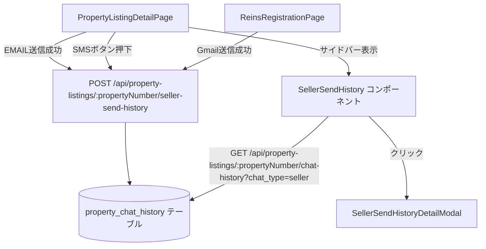

# 設計ドキュメント: seller-send-history（売主への送信履歴）

## 概要

物件リスト詳細画面（`PropertyListingDetailPage`）において、売主への各種送信操作（EMAIL送信・SMS・GMAIL送信）の履歴を記録し、詳細画面のサイドバーに「売主への送信履歴」セクションとして表示する機能を追加する。

既存の `property_chat_history` テーブルを拡張し、`chat_type` カラムに `seller_email`・`seller_sms`・`seller_gmail` を追加する。また、件名（`subject`）カラムを新規追加する。フロントエンドには `SellerSendHistory` コンポーネントを新規作成し、既存の `PropertyChatHistory` コンポーネントと同様のアーキテクチャを採用する。

---

## アーキテクチャ



### 設計方針

- **テーブル再利用**: 既存の `property_chat_history` テーブルに `subject` カラムを追加し、`chat_type` の CHECK 制約を拡張する
- **APIの拡張**: 既存の `GET /api/property-listings/:propertyNumber/chat-history` エンドポイントはそのまま利用し、新規 `POST` エンドポイントを追加する
- **コンポーネント設計**: `PropertyChatHistory` と同様のパターンで `SellerSendHistory` を新規作成する
- **非同期・非ブロッキング**: 履歴保存の失敗は送信操作の成功に影響を与えない

---

## コンポーネントとインターフェース

### バックエンド

#### 新規エンドポイント: `POST /api/property-listings/:propertyNumber/seller-send-history`

**リクエストボディ**:
```typescript
{
  chat_type: 'seller_email' | 'seller_sms' | 'seller_gmail';
  subject: string;    // EMAIL/GMAIL: 件名、SMS: 空文字
  message: string;    // EMAIL/GMAIL: 本文全文、SMS: 'SMS送信'
  sender_name: string;
}
```

**レスポンス（成功）**:
```typescript
{ success: true }
```

**レスポンス（バリデーションエラー）**:
```typescript
{ error: '無効な送信種別です', code: 'INVALID_CHAT_TYPE' }  // HTTP 400
```

#### 既存エンドポイント拡張: `GET /api/property-listings/:propertyNumber/chat-history`

`chat_type` パラメータに `seller_email`・`seller_sms`・`seller_gmail` を指定可能にする（既存の `office`・`assignee` は引き続き動作）。

パラメータなしの場合は全 `chat_type` を返す（既存動作を維持）。

**レスポンス**:
```typescript
{
  history: Array<{
    id: string;
    property_number: string;
    chat_type: string;
    subject: string | null;
    message: string;
    sender_name: string;
    sent_at: string;
    created_at: string;
  }>
}
```

### フロントエンド

#### 新規コンポーネント: `SellerSendHistory`

**ファイルパス**: `frontend/frontend/src/components/SellerSendHistory.tsx`

**Props**:
```typescript
interface SellerSendHistoryProps {
  propertyNumber: string;
  refreshTrigger?: number;
}
```

**責務**:
- `GET /api/property-listings/:propertyNumber/chat-history` を `chat_type` フィルタなしで呼び出し、`seller_email`・`seller_sms`・`seller_gmail` の履歴を取得
- 一覧表示: 件名・送信者名・送信日時（`YYYY/MM/DD HH:mm`）・送信種別ラベル（本文は非表示）
- 空状態: 「送信履歴はありません」を表示
- アイテムクリック時: `SellerSendHistoryDetailModal` を開く

#### 新規コンポーネント: `SellerSendHistoryDetailModal`

**ファイルパス**: `frontend/frontend/src/components/SellerSendHistoryDetailModal.tsx`

**Props**:
```typescript
interface SellerSendHistoryDetailModalProps {
  open: boolean;
  item: SellerSendHistoryItem | null;
  onClose: () => void;
}
```

**責務**:
- 件名・送信者名・送信日時・本文全文を表示
- 閉じるボタンでモーダルを閉じる

#### 送信種別ラベルの定義

```typescript
const CHAT_TYPE_LABELS: Record<string, { label: string; color: string }> = {
  seller_email: { label: 'EMAIL', color: '#1565c0' },  // 青系
  seller_sms:   { label: 'SMS',   color: '#2e7d32' },  // 緑系
  seller_gmail: { label: 'GMAIL', color: '#c62828' },  // 赤系
};
```

#### `PropertyListingDetailPage` への変更

1. `SellerSendHistory` コンポーネントをインポートし、サイドバーの `PropertyChatHistory` の下に配置する
2. `sellerSendHistoryRefreshTrigger` state を追加する
3. EMAIL送信成功後（`handleSendEmail`）に `sellerSendHistoryRefreshTrigger` をインクリメントし、履歴保存APIを呼び出す
4. SMSボタン押下時（`onClick`）に `sellerSendHistoryRefreshTrigger` をインクリメントし、履歴保存APIを呼び出す

#### `ReinsRegistrationPage` への変更

1. Gmail送信成功後（`handleSendEmail`）に履歴保存APIを呼び出す
2. 送信者名は `employee.name || employee.initials || '不明'` を使用する（`useAuthStore` から取得）

---

## データモデル

### `property_chat_history` テーブルの変更

#### マイグレーション1: `subject` カラムの追加

```sql
ALTER TABLE property_chat_history
  ADD COLUMN IF NOT EXISTS subject TEXT DEFAULT '';

COMMENT ON COLUMN property_chat_history.subject IS '送信履歴の件名（EMAIL/GMAIL: メール件名、SMS: 空文字）';
```

#### マイグレーション2: `chat_type` の CHECK 制約を拡張

```sql
-- 既存の CHECK 制約を削除して再作成
ALTER TABLE property_chat_history
  DROP CONSTRAINT IF EXISTS property_chat_history_chat_type_check;

ALTER TABLE property_chat_history
  ADD CONSTRAINT property_chat_history_chat_type_check
    CHECK (chat_type IN ('office', 'assignee', 'seller_email', 'seller_sms', 'seller_gmail'));
```

#### マイグレーション3: インデックスの追加

```sql
CREATE INDEX IF NOT EXISTS idx_property_chat_history_chat_type
  ON property_chat_history(chat_type);
```

### 完成後のテーブル定義

| カラム名 | 型 | 制約 | 説明 |
|---------|-----|------|------|
| `id` | UUID | PK | 一意識別子 |
| `property_number` | VARCHAR(50) | NOT NULL, FK | 物件番号 |
| `chat_type` | VARCHAR(20) | NOT NULL, CHECK | 送信種別 |
| `subject` | TEXT | DEFAULT '' | 件名（新規追加） |
| `message` | TEXT | NOT NULL | 本文 |
| `sender_name` | VARCHAR(255) | NOT NULL | 送信者名 |
| `sent_at` | TIMESTAMPTZ | NOT NULL | 送信日時 |
| `created_at` | TIMESTAMPTZ | DEFAULT NOW() | レコード作成日時 |

### `chat_type` の値

| 値 | 説明 | 既存/新規 |
|----|------|---------|
| `office` | 事務へCHAT | 既存 |
| `assignee` | 担当へCHAT | 既存 |
| `seller_email` | 売主へのEMAIL送信 | **新規** |
| `seller_sms` | 売主へのSMS送信 | **新規** |
| `seller_gmail` | 売主へのGMAIL送信 | **新規** |

---

## 正確性プロパティ

*プロパティとは、システムの全ての有効な実行において成立すべき特性や振る舞いのことです。プロパティは人間が読める仕様と機械で検証可能な正確性保証の橋渡しをします。*

### Property 1: 履歴レコードの必須フィールド保存

*For any* 有効な `chat_type`（`seller_email`・`seller_sms`・`seller_gmail`）、任意の `property_number`・`subject`・`message`・`sender_name` の組み合わせで `POST /api/property-listings/:propertyNumber/seller-send-history` を呼び出した場合、保存されたレコードには `property_number`・`chat_type`・`subject`・`message`・`sender_name`・`sent_at` の全フィールドが正しく保存されていること

**Validates: Requirements 1.2, 2.2, 3.2, 8.2**

### Property 2: 無効な chat_type のバリデーション

*For any* `seller_email`・`seller_sms`・`seller_gmail` 以外の任意の文字列を `chat_type` として送信した場合、APIは必ず 400 エラーを返すこと

**Validates: Requirements 8.3**

### Property 3: 履歴の降順ソート

*For any* 複数の送信履歴レコードが存在する場合、`GET /api/property-listings/:propertyNumber/chat-history` のレスポンスは常に `sent_at` の降順（新しい順）で返されること

**Validates: Requirements 4.3, 7.3**

### Property 4: 最大件数制限

*For any* 50件を超える履歴レコードが存在する場合でも、`GET /api/property-listings/:propertyNumber/chat-history` のレスポンスは最大50件以下であること

**Validates: Requirements 7.4**

### Property 5: 送信種別ラベルの対応

*For any* `chat_type` の値（`seller_email`・`seller_sms`・`seller_gmail`）を持つ履歴アイテムをレンダリングした場合、対応するラベル（「EMAIL」・「SMS」・「GMAIL」）が表示され、それぞれ異なる色が適用されること

**Validates: Requirements 5.1, 5.2, 5.3, 5.4**

### Property 6: 一覧表示の必須フィールド（本文非表示）

*For any* 履歴アイテムを一覧表示した場合、件名・送信者名・送信日時・送信種別ラベルが表示され、本文（`message`）は表示されないこと

**Validates: Requirements 4.4**

### Property 7: 詳細モーダルの必須フィールド

*For any* 履歴アイテムの詳細モーダルを表示した場合、件名・送信者名・送信日時・本文全文が全て含まれること

**Validates: Requirements 4b.2**

---

## エラーハンドリング

### バックエンド

| シナリオ | 処理 | レスポンス |
|---------|------|-----------|
| 無効な `chat_type` | バリデーションエラー | HTTP 400 + エラーメッセージ |
| `property_number` が存在しない | 外部キー制約エラー | HTTP 404 |
| DB接続エラー | エラーログ記録 | HTTP 500 |
| 履歴保存失敗（送信API内） | エラーログ記録のみ | 送信APIの成功レスポンスを返す |

### フロントエンド

| シナリオ | 処理 |
|---------|------|
| 履歴取得失敗 | エラーメッセージを表示（`PropertyChatHistory` と同様） |
| 履歴保存API失敗（EMAIL/SMS/Gmail送信後） | `console.error` でログ記録のみ（送信成功のスナックバーには影響しない） |
| 送信履歴が空 | 「送信履歴はありません」を表示 |

---

## テスト戦略

### ユニットテスト

- `SellerSendHistory` コンポーネントの空状態表示
- `SellerSendHistoryDetailModal` の開閉動作
- SMS送信時の固定値（subject=空文字、message=「SMS送信」）の確認
- 送信種別ラベルの色・テキストの確認

### プロパティベーステスト

プロパティベーステストには **fast-check** ライブラリを使用する。各テストは最低100回のイテレーションを実行する。

**テストファイル**: `frontend/frontend/src/__tests__/seller-send-history.property.test.ts`

```typescript
// タグ形式: Feature: seller-send-history, Property {番号}: {プロパティテキスト}

// Property 1: 履歴レコードの必須フィールド保存
// Feature: seller-send-history, Property 1: 履歴レコードの必須フィールド保存

// Property 2: 無効な chat_type のバリデーション
// Feature: seller-send-history, Property 2: 無効な chat_type のバリデーション

// Property 3: 履歴の降順ソート
// Feature: seller-send-history, Property 3: 履歴の降順ソート

// Property 4: 最大件数制限
// Feature: seller-send-history, Property 4: 最大件数制限

// Property 5: 送信種別ラベルの対応
// Feature: seller-send-history, Property 5: 送信種別ラベルの対応

// Property 6: 一覧表示の必須フィールド（本文非表示）
// Feature: seller-send-history, Property 6: 一覧表示の必須フィールド（本文非表示）

// Property 7: 詳細モーダルの必須フィールド
// Feature: seller-send-history, Property 7: 詳細モーダルの必須フィールド
```

### インテグレーションテスト

- `POST /api/property-listings/:propertyNumber/seller-send-history` エンドポイントの動作確認
- `GET /api/property-listings/:propertyNumber/chat-history` の新しい `chat_type` フィルタの動作確認
- EMAIL送信成功後の履歴自動保存の確認
- Gmail送信成功後の履歴自動保存の確認
- SMS送信後の履歴自動保存の確認
