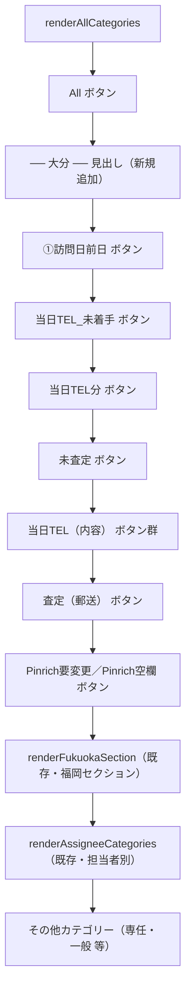

# 設計ドキュメント: seller-sidebar-oita-section

## Overview

売主リストページのサイドバー（`SellerStatusSidebar`）の「All」表示の直下、既存のトップレベルカテゴリ群（①訪問日前日・③当日TEL分・④当日TEL（内容）・⑤未査定・⑥査定（郵送）・⑦当日TEL_未着手・⑧Pinrich空欄・Pinrich要変更）の直前に「── 大分 ──」というセクション見出しラベルを追加する。

既存の「福岡」セクション（`renderFukuokaSection()`）と全く同じ見出しスタイルを使い、視覚的なグルーピングのみを行う。データの集計ロジック・件数計算・クリック時の展開動作・APIリクエストには一切変更を加えない。

### 変更対象ファイル

- `frontend/frontend/src/components/SellerStatusSidebar.tsx` — サイドバーUIコンポーネント本体（見出し要素の追加のみ）

### 変更しないファイル

- `frontend/frontend/src/pages/SellersPage.tsx` — `SellerStatusSidebar` の呼び出し方法・propsは変更不要
- `frontend/frontend/src/utils/sellerStatusFilters.ts` — フィルタリングロジック・`CategoryCounts`型は変更不要
- バックエンドAPI（件数集計エンドポイント）は変更不要

---

## Architecture



`renderAllCategories()` のJSX内で、既存のトップレベルカテゴリボタン群の直前（Allボタンの直後）に静的な `Typography` 見出し要素を1つ追加するだけの変更。`renderFukuokaSection()` を含む以降の要素の順序・実装は変更しない。

---

## Components and Interfaces

### 1. `renderOitaSectionHeader()` 関数の追加（新規）

`renderFukuokaSection()` と同じ見出しスタイルを使う、大分セクション見出し専用のレンダリング関数を追加する。福岡セクションと異なり、大分セクションには表示条件（0件なら非表示等）は設けない。「大分＝ほぼ全ての通常売主」という前提のため、既存のトップレベルカテゴリと同様に常に表示する（All自体が0件の特殊ケースでも見出し自体は表示して問題ない。カテゴリボタン側は既存の `count === 0` 判定でそれぞれ非表示になる）。

```tsx
// 大分セクション見出しをレンダリング
// 既存のトップレベルカテゴリ（実質的に大分／AA売主の件数）をグルーピングするための見出しラベル。
// 表示のみの変更であり、件数計算・フィルタリングロジックには影響しない。
const renderOitaSectionHeader = () => (
  <Typography
    variant="caption"
    sx={{ px: 1.5, py: 0.5, display: 'block', color: '#2e7d32', fontWeight: 'bold', fontSize: '0.75rem' }}
  >
    ── 大分 ──
  </Typography>
);
```

**スタイル方針**:
- `renderFukuokaSection()` 内の見出し（`Typography variant="caption"`、`fontWeight: 'bold'`、`fontSize: '0.75rem'`）と同一のタイポグラフィ設定を使用し、視覚的な一貫性を保つ
- 色は大分（AA売主）を表す色として `#2e7d32`（①訪問日前日のカテゴリ色として既に使われている緑）を使用し、福岡セクションの `#1a237e`（紺）と視覚的に区別する
- 福岡セクションのように背景色付きボックス（`bgcolor: '#e8eaf6'`）で囲む枠は設けない。理由: 大分セクションは「既存の主要カテゴリ群」であり、サイドバーの主役であるため、福岡のような差し込み的な枠で囲むと既存のUIの見た目が大きく変わってしまう。見出しラベルのみを追加し、既存のボタン群のレイアウト・余白は変更しない

### 2. `renderAllCategories()` の変更（既存関数の呼び出し追加のみ）

`renderAllCategories()` 内、Allボタンの直後・既存のトップレベルカテゴリボタン群（`renderCategoryButton('visitDayBefore', ...)` 以下）の直前に `renderOitaSectionHeader()` の呼び出しを1行追加する。

```tsx
// 変更前
<Box sx={{ display: 'flex', flexDirection: 'column', gap: 0.5 }}>
  {/* All */}
  <Button /* ... */ >
    {/* ... */}
  </Button>

  {/* 既存の固定カテゴリー */}
  {renderCategoryButton('visitDayBefore', '①訪問日前日', '#2e7d32')}
  {/* ... */}
```

```tsx
// 変更後
<Box sx={{ display: 'flex', flexDirection: 'column', gap: 0.5 }}>
  {/* All */}
  <Button /* ... */ >
    {/* ... */}
  </Button>

  {/* 大分セクション見出し（表示グルーピングのみ、データ構造は変更しない） */}
  {renderOitaSectionHeader()}

  {/* 既存の固定カテゴリー（実質的に大分＝AA売主の件数） */}
  {renderCategoryButton('visitDayBefore', '①訪問日前日', '#2e7d32')}
  {/* ... */}
```

**影響範囲**: `renderCategoryButton()`、`getCount()`、`filterSellersByCategory()`、`isActive()`、`handleCategoryClick()` など既存のロジック関数は一切変更しない。追加するのは見出し要素1つのみ。

### 3. `renderExpandedCategory()` への影響なし

カテゴリが展開されている状態（`expandedCategory` が非null）では `renderExpandedCategory()` が使われ、`renderAllCategories()` は呼ばれない。そのため展開表示中は大分見出しは表示されない（福岡セクションの各カテゴリも同様に、展開表示中は表示されないのが既存動作であり、これと一貫性を保つ）。

---

## Data Models

型・データ構造の変更はない。

- `StatusCategory` 型（`sellerStatusFilters.ts`）: 変更なし
- `CategoryCounts` インターフェース（`sellerStatusFilters.ts`）: 変更なし。新規フィールド（例: `aa_todayCall` 等）は追加しない
- `SellerStatusSidebarProps`（`SellerStatusSidebar.tsx`）: 変更なし

---

## Correctness Properties

*A property is a characteristic or behavior that should hold true across all valid executions of a system—essentially, a formal statement about what the system should do. Properties serve as the bridge between human-readable specifications and machine-verifiable correctness guarantees.*

### Property 1: トップレベルカテゴリの件数は見出し追加前後で不変

*For any* `categoryCounts` の値の組み合わせ（`todayCall`、`todayCallWithInfo`、`unvaluated`、`mailingPending`、`todayCallNotStarted`、`pinrichEmpty`、`pinrichChangeRequired` を含む）に対して、`renderOitaSectionHeader()` の追加後も、各トップレベルカテゴリボタンが表示する件数（`getCount(category)` の戻り値）は追加前と同一でなければならない。

**Validates: Requirements 2.1**

### Property 2: カテゴリクリック時の展開・選択状態は見出し追加前後で不変

*For any* トップレベルカテゴリのキー（`StatusCategory` 型の値）に対して、`handleCategoryClick(category)` を呼び出した後の `expandedCategory` の状態および（`isCallMode` が false の場合の）`onCategorySelect` 呼び出し引数は、大分見出し追加前と同一でなければならない。

**Validates: Requirements 2.2**

### Property 3: 福岡セクションの件数・表示条件は見出し追加前後で不変

*For any* `categoryCounts` の `fi_*` フィールドの値の組み合わせに対して、`renderFukuokaSection()` が返す出力（表示するボタンの集合とそれぞれの件数、および `fiTotal === 0` かつラベル別件数が空の場合に `null` を返す条件）は、大分見出し追加前と同一でなければならない。

**Validates: Requirements 3.1, 3.2**

---

## Error Handling

この変更は静的な見出しラベルの追加のみであり、非同期処理・外部入出力・条件分岐を新規に持たない。したがって新たなエラーハンドリングは不要。

- `categoryCounts` が `undefined` の場合: 既存の `getCount()` のフォールバック処理（`filterSellersByCategory(validSellers, category).length`）がそのまま機能するため、大分見出しの追加によって新たなエラー経路は発生しない
- `expandedCategory` が非nullの場合（カテゴリ展開中）: `renderAllCategories()` 自体が呼ばれないため、大分見出しは表示されない。これはエラーではなく既存の福岡セクションと同様の意図した挙動

---

## Testing Strategy

### ユニットテスト（example-based）

**対象**: `SellerStatusSidebar.tsx`

1. 全カテゴリ表示モード（`expandedCategory` が null）でサイドバーをレンダリングした場合、「── 大分 ──」の見出しテキストが表示されること
2. 「── 大分 ──」見出しが「All」ボタンの後、かつ「①訪問日前日」ボタンより前にDOM上で出現すること（表示順序の確認）
3. `categoryCounts` に `fi_*` フィールドが含まれる場合、「── 大分 ──」見出しが「── 福岡 ──」見出しより先にDOM上で出現すること
4. カテゴリが展開されている状態（`expandedCategory` が非null）では「── 大分 ──」見出しが表示されないこと
5. `isCallMode = true` の場合でも、カテゴリ未展開時には「── 大分 ──」見出しが表示されること（Requirement 4.2 の確認）
6. 福岡売主が0件（`fi_*` が全て0）の場合、「── 福岡 ──」セクションは非表示のままだが「── 大分 ──」見出しは表示されること

### プロパティベーステスト

**対象**: `SellerStatusSidebar.tsx` の `getCount`（内部関数のため、レンダリング結果を通じて検証） / `renderFukuokaSection` の出力

- **Property 1**: 任意の `categoryCounts` オブジェクトに対して、各トップレベルカテゴリボタンに表示される件数（Chipのlabel）が `categoryCounts[category]` の値と一致する
- **Property 2**: 任意のカテゴリキーに対して、クリックイベント発火後の `expandedCategory` state が期待通りに変化する（トグル動作：同じカテゴリを再クリックするとnullに戻る）
- **Property 3**: 任意の `fi_*` フィールドの値の組み合わせに対して、`fiTotal`（`fi_todayCall + fi_todayCallNotStarted + fi_todayCallWithInfo + fi_unvaluated + fi_mailingPending`）が0かつラベル別件数が空の場合にのみ福岡セクション全体が非表示になる

**ライブラリ**: `fast-check`（TypeScript/JavaScript 向け PBT ライブラリ）

**設定**: 各プロパティテストは最低100イテレーション実行

**タグ形式**: `Feature: seller-sidebar-oita-section, Property {N}: {property_text}`

### UIテスト（手動確認）

- 売主リストページのサイドバーで「All」の直下に緑色の「── 大分 ──」見出しが表示され、その下に既存のカテゴリボタン（①訪問日前日、当日TEL_未着手、当日TEL分 等）が続くこと
- 「── 大分 ──」見出しの下に既存の紺色の「── 福岡 ──」見出しとFI専用ボタン群が変わらず表示されること
- 通話モードページでサイドバーを開いた際、レイアウトが崩れていないこと
- 既存のカテゴリボタンをクリックした際の展開・件数表示の挙動が変更前と同一であること
