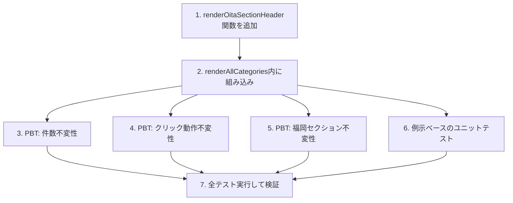

# Implementation Plan: seller-sidebar-oita-section

## Overview

売主リストページのサイドバー（`SellerStatusSidebar`）の「All」表示の直下に「── 大分 ──」というセクション見出しラベルを追加する。既存のトップレベルカテゴリの集計ロジック・件数計算・クリック動作・APIリクエストには一切変更を加えず、表示上のグルーピングのみを行う。

## Task Dependency Graph



```json
{
  "waves": [
    { "wave": 1, "tasks": ["1"] },
    { "wave": 2, "tasks": ["2"] },
    { "wave": 3, "tasks": ["3", "4", "5", "6"] },
    { "wave": 4, "tasks": ["7"] }
  ]
}
```

## Tasks

- [ ] 1. `renderOitaSectionHeader()` 関数を追加する
  - `frontend/frontend/src/components/SellerStatusSidebar.tsx` に、`renderFukuokaSection()` と同じ見出しスタイル（`Typography variant="caption"`、`fontWeight: 'bold'`、`fontSize: '0.75rem'`）で「── 大分 ──」というテキストを表示する `renderOitaSectionHeader()` 関数を追加する
  - 色は `#2e7d32`（緑）を使用し、福岡セクションの `#1a237e`（紺）と視覚的に区別する
  - 福岡セクションのような背景色付きボックスや枠は設けず、見出しラベルのみをレンダリングする
  - _Requirements: 1.1, 1.2_

- [ ] 2. `renderAllCategories()` 内に大分セクション見出しを組み込む
  - `renderAllCategories()` 内、「All」ボタンの直後・既存のトップレベルカテゴリボタン群（`renderCategoryButton('visitDayBefore', ...)` 以下）の直前に `renderOitaSectionHeader()` の呼び出しを追加する
  - `renderCategoryButton`、`getCount`、`filterSellersByCategory`、`isActive`、`handleCategoryClick` など既存のロジック関数・呼び出し順序は変更しない
  - `renderFukuokaSection()` の呼び出し位置・呼び出し方法は変更しない（大分セクションの後、担当者別カテゴリーの前に維持）
  - _Requirements: 1.1, 1.3, 2.1, 2.2, 2.3, 3.1, 3.2_

- [ ] 3. PBTタスク: トップレベルカテゴリの件数表示が不変であることのプロパティテストを作成する
  - `categoryCounts` オブジェクト（`todayCall`、`todayCallWithInfo`、`unvaluated`、`mailingPending`、`todayCallNotStarted`、`pinrichEmpty`、`pinrichChangeRequired` を含む）を `fast-check` でランダム生成し、`SellerStatusSidebar` をレンダリングした際に各トップレベルカテゴリボタンに表示される件数（Chipのlabel）が `categoryCounts[category]` の値と一致することを検証する
  - 最低100イテレーション実行する
  - タグ形式: `Feature: seller-sidebar-oita-section, Property 1: トップレベルカテゴリの件数は見出し追加前後で不変`
  - _Requirements: 2.1_

- [ ] 4. PBTタスク: カテゴリクリック時の展開・選択動作が不変であることのプロパティテストを作成する
  - `StatusCategory` 型の値（`visitDayBefore`、`todayCall`、`todayCallWithInfo`、`unvaluated`、`mailingPending`、`todayCallNotStarted`、`pinrichEmpty`、`pinrichChangeRequired` など）をランダムに選び、`handleCategoryClick` 相当のクリック操作をシミュレートし、クリック後の展開状態（トグル動作：同一カテゴリを再クリックするとnullに戻る）が期待通りであることを検証する
  - 最低100イテレーション実行する
  - タグ形式: `Feature: seller-sidebar-oita-section, Property 2: カテゴリクリック時の展開・選択状態は見出し追加前後で不変`
  - _Requirements: 2.2_

- [ ] 5. PBTタスク: 福岡セクションの件数・表示条件が不変であることのプロパティテストを作成する
  - `categoryCounts` の `fi_todayCall`、`fi_todayCallNotStarted`、`fi_todayCallWithInfo`、`fi_unvaluated`、`fi_mailingPending`、`fi_todayCallWithInfoLabelCounts` の値の組み合わせを `fast-check` でランダム生成し、`renderFukuokaSection()` が表示するボタン集合・件数が期待通りであること、および合計が0かつラベル別件数が空の場合にのみ福岡セクション全体が非表示（null）になることを検証する
  - 最低100イテレーション実行する
  - タグ形式: `Feature: seller-sidebar-oita-section, Property 3: 福岡セクションの件数・表示条件は見出し追加前後で不変`
  - _Requirements: 3.1, 3.2_

- [ ] 6. 例示ベースのユニットテストを作成する
  - 全カテゴリ表示モード（`expandedCategory` が null）でレンダリングした場合、「── 大分 ──」の見出しテキストが表示されることを確認するテストを作成する
  - 「── 大分 ──」見出しが「All」ボタンの後・「①訪問日前日」ボタンより前にDOM上で出現することを確認するテストを作成する
  - `categoryCounts` に `fi_*` フィールドが含まれる場合、「── 大分 ──」見出しが「── 福岡 ──」見出しより先にDOM上で出現することを確認するテストを作成する
  - カテゴリが展開されている状態（`expandedCategory` が非null）では「── 大分 ──」見出しが表示されないことを確認するテストを作成する
  - `isCallMode = true` の場合でも、カテゴリ未展開時には「── 大分 ──」見出しが表示されることを確認するテストを作成する（Requirement 4.2）
  - 福岡売主が0件（`fi_*` が全て0）の場合、「── 福岡 ──」セクションは非表示のままだが「── 大分 ──」見出しは表示されることを確認するテストを作成する
  - _Requirements: 1.1, 1.3, 4.1, 4.2_

- [ ] 7. 全テストを実行して検証する
  - 追加したユニットテスト・プロパティベーステストを実行し、全て成功することを確認する
  - 既存のテストスイート（`SellerStatusSidebar.tsx` 関連の既存テストがある場合）を実行し、回帰がないことを確認する
  - _Requirements: 2.1, 2.2, 2.3, 3.1, 3.2, 5.1, 5.2_

## Notes

- この機能はフロントエンドの表示グルーピングのみで実現される。バックエンドAPI・`CategoryCounts` 型・集計ロジックへの変更は一切行わない。
- `frontend/frontend` 配下に既存のテストフレームワークが導入されているか確認し、未導入の場合はタスク実行時に標準的な選択（React Testing Library + Jest/Vitest、PBTには `fast-check`）を導入する。
