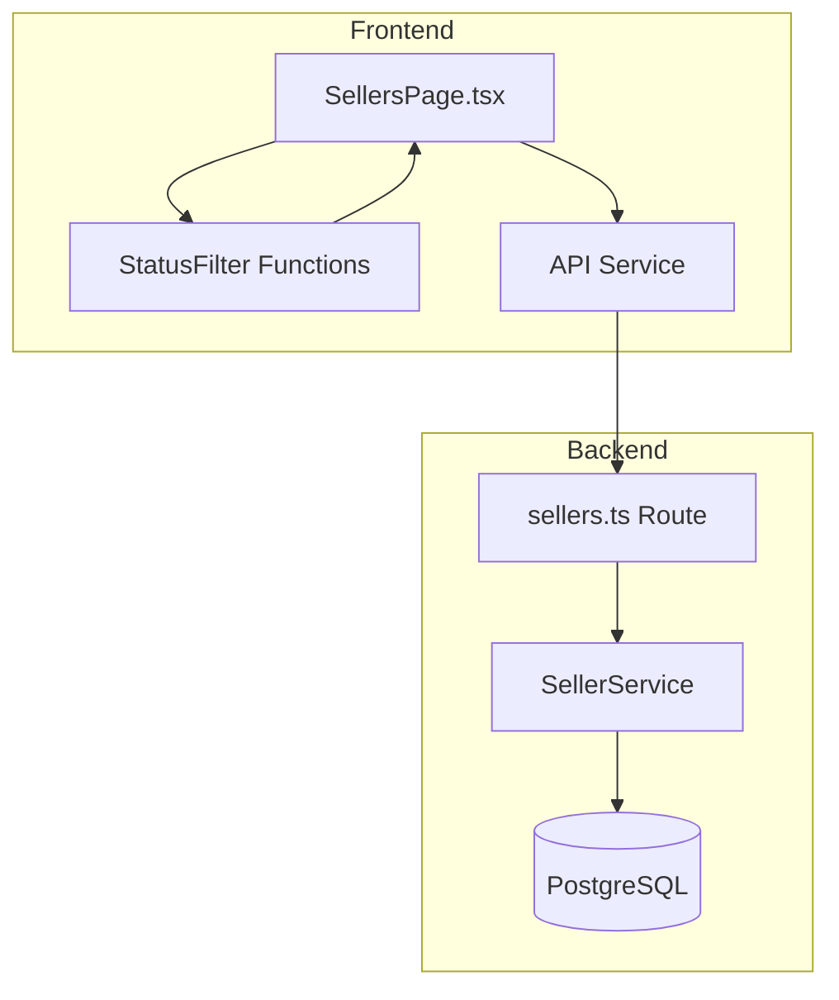

# Design Document: Seller Status Sidebar Enhancement

## Overview

売主リストページの左側サイドバーに、特定の条件に基づいたステータスフィルターを表示する機能を強化する。3つの新しいステータスカテゴリ（「当日TEL」「未査定」「査定（郵送）」）を追加し、ユーザーがワンクリックで該当する売主をフィルタリングできるようにする。

## Architecture



### アーキテクチャ方針

フロントエンドでのフィルタリングを採用する理由：
1. 既存の実装パターンとの一貫性（現在の「当日TEL」フィルターはフロントエンドで実装）
2. リアルタイムのカウント更新が可能
3. バックエンドAPIの変更が不要
4. ユーザー体験の向上（即座にフィルタリング結果を表示）

## Components and Interfaces

### Frontend Components

#### SellersPage.tsx の変更

```typescript
// ステータスカテゴリの型定義
type StatusCategory = 'all' | 'todayCall' | 'unvaluated' | 'mailingPending';

// フィルター関数のインターフェース
interface StatusFilterFunctions {
  isTodayCall: (seller: Seller) => boolean;
  isUnvaluated: (seller: Seller) => boolean;
  isMailingPending: (seller: Seller) => boolean;
}

// カテゴリカウントのインターフェース
interface CategoryCounts {
  all: number;
  todayCall: number;
  unvaluated: number;
  mailingPending: number;
}
```

### Filter Logic Functions

```typescript
// 当日TEL判定
// 条件: 次電日が当日 AND 状況が「追客中」 AND 営担が空欄
const isTodayCall = (seller: Seller): boolean => {
  const today = new Date();
  today.setHours(0, 0, 0, 0);
  
  if (!seller.nextCallDate) return false;
  
  const nextCallDate = new Date(seller.nextCallDate);
  nextCallDate.setHours(0, 0, 0, 0);
  
  const isToday = today.getTime() === nextCallDate.getTime();
  const isFollowingUp = seller.status === 'following_up' || 
                        seller.status === '追客中' ||
                        (seller.status && seller.status.includes('追客'));
  const hasNoAssignee = !seller.visitAssignee || seller.visitAssignee.trim() === '';
  
  return isToday && isFollowingUp && hasNoAssignee;
};

// 未査定判定
// 条件: 査定額1,2,3が全て空欄 AND 反響日付が2025/12/8以降
const isUnvaluated = (seller: Seller): boolean => {
  const cutoffDate = new Date('2025-12-08');
  cutoffDate.setHours(0, 0, 0, 0);
  
  const hasNoValuation = !seller.valuationAmount1 && 
                         !seller.valuationAmount2 && 
                         !seller.valuationAmount3;
  
  if (!seller.inquiryDate) return false;
  
  const inquiryDate = new Date(seller.inquiryDate);
  inquiryDate.setHours(0, 0, 0, 0);
  
  const isAfterCutoff = inquiryDate.getTime() >= cutoffDate.getTime();
  
  return hasNoValuation && isAfterCutoff;
};

// 査定（郵送）判定
// 条件: 郵送が「未」
const isMailingPending = (seller: Seller): boolean => {
  return seller.mailingStatus === '未';
};
```

## Data Models

### Seller Interface（既存フィールドの確認）

フィルタリングに使用するフィールド：

| フィールド名 | 型 | 説明 | 使用するフィルター |
|------------|-----|------|------------------|
| nextCallDate | Date/string | 次電日 | 当日TEL |
| status | string | 状況（当社） | 当日TEL |
| visitAssignee | string | 営担 | 当日TEL |
| valuationAmount1 | number | 査定額1 | 未査定 |
| valuationAmount2 | number | 査定額2 | 未査定 |
| valuationAmount3 | number | 査定額3 | 未査定 |
| inquiryDate | Date/string | 反響日付 | 未査定 |
| mailingStatus | string | 郵送ステータス | 査定（郵送） |

## Correctness Properties

*A property is a characteristic or behavior that should hold true across all valid executions of a system-essentially, a formal statement about what the system should do. Properties serve as the bridge between human-readable specifications and machine-verifiable correctness guarantees.*

### Property 1: 当日TEL Filter Correctness

*For any* set of sellers, the `isTodayCall` filter function SHALL return true only for sellers where:
- nextCallDate equals today's date (comparing date only, not time)
- status equals "following_up" OR contains "追客"
- visitAssignee is null, undefined, or empty string

**Validates: Requirements 1.2**

### Property 2: 未査定 Filter Correctness

*For any* set of sellers, the `isUnvaluated` filter function SHALL return true only for sellers where:
- valuationAmount1 is null, undefined, or 0
- valuationAmount2 is null, undefined, or 0
- valuationAmount3 is null, undefined, or 0
- inquiryDate is on or after 2025-12-08

**Validates: Requirements 2.2**

### Property 3: 査定（郵送） Filter Correctness

*For any* set of sellers, the `isMailingPending` filter function SHALL return true only for sellers where:
- mailingStatus equals "未"

**Validates: Requirements 3.2**

## Error Handling

### フロントエンドエラーハンドリング

1. **日付パースエラー**: 無効な日付形式の場合、フィルター条件を満たさないものとして扱う
2. **null/undefined値**: 各フィールドのnull/undefinedチェックを実施
3. **APIエラー**: 既存のエラーハンドリングパターンを継続使用

```typescript
// 安全な日付比較
const safeCompareDate = (dateStr: string | Date | undefined, targetDate: Date): boolean => {
  if (!dateStr) return false;
  try {
    const date = new Date(dateStr);
    if (isNaN(date.getTime())) return false;
    date.setHours(0, 0, 0, 0);
    return date.getTime() === targetDate.getTime();
  } catch {
    return false;
  }
};
```

## Testing Strategy

### Unit Tests

ユニットテストは各フィルター関数の基本的な動作を検証する：

1. `isTodayCall` 関数のテスト
   - 全条件を満たす売主でtrueを返す
   - 次電日が今日でない場合falseを返す
   - ステータスが追客中でない場合falseを返す
   - 営担が設定されている場合falseを返す

2. `isUnvaluated` 関数のテスト
   - 全条件を満たす売主でtrueを返す
   - 査定額が1つでも設定されている場合falseを返す
   - 反響日付が2025/12/8より前の場合falseを返す

3. `isMailingPending` 関数のテスト
   - mailingStatusが「未」の場合trueを返す
   - mailingStatusが「済」の場合falseを返す
   - mailingStatusがnullの場合falseを返す

### Property-Based Tests

プロパティベーステストには **fast-check** ライブラリを使用する。

各プロパティテストは最低100回のイテレーションで実行する。

テストファイル: `frontend/src/utils/__tests__/sellerStatusFilters.test.ts`

```typescript
// テストアノテーション形式
// **Feature: seller-status-sidebar-enhancement, Property 1: 当日TEL Filter Correctness**
// **Validates: Requirements 1.2**
```

### Integration Tests

統合テストはSellersPageコンポーネントの動作を検証：

1. サイドバーに全てのステータスボタンが表示される
2. 各ボタンクリックで正しくフィルタリングされる
3. カウントが正しく表示される
