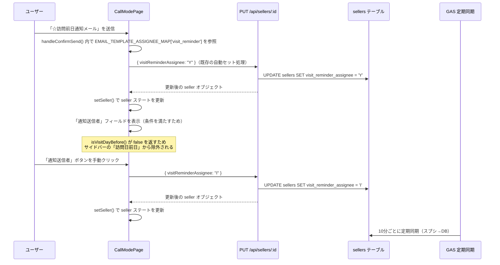

# 設計ドキュメント：売主通話モードページへの「通知送信者」フィールド追加

## 概要

売主リストの通話モードページ（`CallModePage`）に「通知送信者」フィールドを追加する。

「☆訪問前日通知メール」のGmail送信完了時にログイン中スタッフのイニシャルを `visitReminderAssignee`（DBカラム: `visit_reminder_assignee`）に自動保存し、メール/SMS履歴の下にボタン選択UIで表示する。

既存の `AssigneeSection` の `EMAIL_LABEL_TO_KEY` に `'☆訪問前日通知メール': 'visitReminderAssignee'` が定義済みであり、`isVisitDayBefore()` も `visitReminderAssignee` に値があれば `false` を返す実装済みのため、本機能の実装範囲は**CallModePageへのUIコンポーネント追加のみ**である。

---

## アーキテクチャ

### システム全体の構成

```
フロントエンド（CallModePage）
  ↓ PUT /api/sellers/:id
バックエンド（SellerService）
  ↓ UPDATE sellers SET visit_reminder_assignee = ?
Supabase（sellers テーブル）
  ↓ GAS 定期同期（10分ごと）
スプレッドシート（CV列：訪問事前通知メール担当）
```

### データフロー



---

## コンポーネントとインターフェース

### 変更対象ファイル

| ファイル | 変更内容 |
|---------|---------|
| `frontend/frontend/src/pages/CallModePage.tsx` | 「通知送信者」フィールドの追加（FollowUpLogHistoryTable の下） |

### 変更不要なファイル（既存実装を維持）

| ファイル | 理由 |
|---------|------|
| `frontend/frontend/src/components/AssigneeSection.tsx` | `EMAIL_LABEL_TO_KEY` に `'☆訪問前日通知メール': 'visitReminderAssignee'` が定義済み |
| `frontend/frontend/src/utils/sellerStatusFilters.ts` | `isVisitDayBefore()` が `visitReminderAssignee` に値があれば `false` を返す実装済み |
| `backend/src/services/SellerService.supabase.ts` | `decryptSeller` に `visitReminderAssignee: seller.visit_reminder_assignee` が定義済み |
| `backend/supabase/migrations/` | `visit_reminder_assignee` カラムが既に存在する |

### フロントエンド実装詳細

#### 表示条件の判定

```typescript
// 活動履歴に「☆訪問前日通知メール」の送信記録があるか
const hasVisitReminderEmailHistory = activities.some(
  (act) => act.type === 'email' && act.content?.includes('☆訪問前日通知メール')
);

// 表示条件: 活動履歴に記録がある OR visitReminderAssignee に値がある
const showVisitReminderSender =
  hasVisitReminderEmailHistory || !!(seller?.visitReminderAssignee);
```

#### 追加するコンポーネント（FollowUpLogHistoryTable の直下）

```tsx
{/* 通知送信者フィールド */}
{showVisitReminderSender && (
  <Box sx={{ width: 280, p: 2, borderBottom: 1, borderColor: 'divider' }}>
    <Box sx={{ display: 'flex', alignItems: 'center', gap: 1 }}>
      <Typography
        variant="caption"
        color="text.secondary"
        sx={{ whiteSpace: 'nowrap', flexShrink: 0 }}
      >
        通知送信者
      </Typography>
      <Box sx={{ display: 'flex', gap: 0.5, flex: 1 }}>
        {normalInitials.map((initial) => {
          const isSelected = seller?.visitReminderAssignee === initial;
          return (
            <Button
              key={initial}
              size="small"
              variant={isSelected ? 'contained' : 'outlined'}
              color="primary"
              onClick={async () => {
                const newValue = isSelected ? '' : initial;
                if (!seller?.id) return;
                try {
                  await api.put(`/api/sellers/${seller.id}`, {
                    visitReminderAssignee: newValue,
                  });
                  setSeller((prev) =>
                    prev ? { ...prev, visitReminderAssignee: newValue } : prev
                  );
                } catch (err) {
                  console.error('通知送信者保存エラー:', err);
                  setSnackbarMessage('通知送信者の保存に失敗しました');
                  setSnackbarOpen(true);
                }
              }}
              sx={{
                flex: 1,
                py: 0.5,
                fontWeight: isSelected ? 'bold' : 'normal',
                borderRadius: 1,
              }}
            >
              {initial}
            </Button>
          );
        })}
      </Box>
    </Box>
  </Box>
)}
```

#### Gmail送信完了時の自動保存

`handleConfirmSend()` 内の `EMAIL_TEMPLATE_ASSIGNEE_MAP` を使った既存の自動セット処理が `visit_reminder` テンプレートに対して `visitReminderAssignee` を自動保存する。この処理は**既に実装済み**であり、追加実装は不要。

```typescript
// 既存の処理（CallModePage.tsx の handleConfirmSend 内）
const assigneeKey = EMAIL_TEMPLATE_ASSIGNEE_MAP[template.id];
// template.id === 'visit_reminder' の場合、assigneeKey === 'visitReminderAssignee'
if (assigneeKey && myInitial && seller?.id) {
  await api.put(`/api/sellers/${seller.id}`, { [assigneeKey]: myInitial });
  setSeller((prev) => prev ? { ...prev, [assigneeKey as keyof Seller]: myInitial } : prev);
}
```

---

## データモデル

### sellers テーブル

| カラム名 | 型 | 説明 |
|---------|-----|------|
| `visit_reminder_assignee` | TEXT | 訪問事前通知メール担当（既存カラム） |

### フロントエンド型（Seller）

| フィールド名 | 型 | 説明 |
|------------|-----|------|
| `visitReminderAssignee` | `string \| undefined` | `visit_reminder_assignee` のキャメルケース（既存） |

### スプレッドシートとのマッピング

| 方向 | スプレッドシート列 | DBカラム | 定義場所 |
|------|-----------------|---------|---------|
| スプシ→DB | CV列「訪問事前通知メール担当」 | `visit_reminder_assignee` | `column-mapping.json`（既定義） |
| DB→スプシ | CV列「訪問事前通知メール担当」 | `visit_reminder_assignee` | `column-mapping.json`（既定義） |

---

## 正確性プロパティ

*プロパティとは、システムの全ての有効な実行において成立すべき特性や振る舞いのことである。プロパティは人間が読める仕様と機械で検証可能な正確性保証の橋渡しとなる。*

### プロパティ 1: 通知送信者の保存ラウンドトリップ

*任意の* 有効なイニシャル文字列を `visitReminderAssignee` として保存した場合、その後 `GET /api/sellers/:id` で取得した売主データの `visitReminderAssignee` フィールドが保存した値と一致すること。

**Validates: Requirements 3.1, 3.2, 3.5**

### プロパティ 2: 通知送信者入力済みの場合は訪問日前日判定が false

*任意の* 非空文字列を `visitReminderAssignee` として持つ売主に対して、`isVisitDayBefore()` 関数が `false` を返すこと（訪問日・`visitAssignee` の値に関わらず）。

**Validates: Requirements 4.1**

### プロパティ 3: 通知送信者空欄かつ訪問日前日条件を満たす場合は訪問日前日判定が true

*任意の* `visitReminderAssignee` が空欄（null または空文字）で、`visitAssignee` に値があり、今日が訪問日の前営業日（木曜訪問のみ2日前、それ以外は1日前）である売主に対して、`isVisitDayBefore()` 関数が `true` を返すこと。

**Validates: Requirements 4.2, 4.4**

---

## エラーハンドリング

### フロントエンド

| エラーケース | 対応 |
|------------|------|
| API 保存失敗 | `setSnackbarMessage` でエラーメッセージを表示し、`setSeller` を呼ばずに選択前の値を維持 |
| ネットワークエラー | 同上 |
| `normalInitials` 取得失敗 | ボタンを表示せず、フィールドは非表示のまま（`normalInitials.length === 0` の場合） |

---

## テスト戦略

### ユニットテスト（例示テスト）

以下の具体的なケースを確認する：

- `activities` に `☆訪問前日通知メール` の記録がある場合、「通知送信者」フィールドが表示されること
- `seller.visitReminderAssignee` に値がある場合、「通知送信者」フィールドが表示されること
- 両方が空の場合、「通知送信者」フィールドが表示されないこと
- 選択済みボタンを再クリックすると空文字が保存されること

### プロパティベーステスト

各プロパティに対して最低 100 回のランダム入力でテストを実施する。

**使用ライブラリ**: `fast-check`（既存プロジェクトで使用済み）

#### プロパティ 1 の実装方針

```typescript
// Feature: seller-visit-notification-sender, Property 1: 通知送信者の保存ラウンドトリップ
fc.assert(
  fc.asyncProperty(
    fc.string({ minLength: 1, maxLength: 5 }), // 任意のイニシャル文字列
    async (initial) => {
      await sellerApi.update(sellerId, { visitReminderAssignee: initial });
      const result = await sellerApi.get(sellerId);
      return result.visitReminderAssignee === initial;
    }
  ),
  { numRuns: 100 }
);
```

#### プロパティ 2 の実装方針

```typescript
// Feature: seller-visit-notification-sender, Property 2: 通知送信者入力済みの場合は訪問日前日判定が false
fc.assert(
  fc.property(
    fc.string({ minLength: 1 }), // 非空文字列
    fc.option(fc.string()),       // 任意の visitAssignee
    fc.option(fc.string()),       // 任意の visit_date
    (visitReminderAssignee, visitAssignee, visitDate) => {
      const seller = {
        visitReminderAssignee,
        visitAssigneeInitials: visitAssignee,
        visit_date: visitDate,
      };
      return isVisitDayBefore(seller) === false;
    }
  ),
  { numRuns: 100 }
);
```

#### プロパティ 3 の実装方針

```typescript
// Feature: seller-visit-notification-sender, Property 3: 通知送信者空欄かつ訪問日前日条件を満たす場合は訪問日前日判定が true
fc.assert(
  fc.property(
    fc.constantFrom(null, ''), // 空欄の visitReminderAssignee
    fc.string({ minLength: 1 }), // 非空の visitAssignee
    (visitReminderAssignee, visitAssignee) => {
      const tomorrowDate = getTomorrowDateString(); // 木曜日以外の翌日
      const seller = {
        visitReminderAssignee,
        visitAssigneeInitials: visitAssignee,
        visit_date: tomorrowDate,
      };
      return isVisitDayBefore(seller) === true;
    }
  ),
  { numRuns: 100 }
);
```

### デュアルテストアプローチ

- **ユニットテスト**: 具体的な例・エッジケース・エラー条件を検証
- **プロパティテスト**: 全入力に対して成立すべき普遍的な性質を検証
- 両者は補完的であり、どちらも必要
