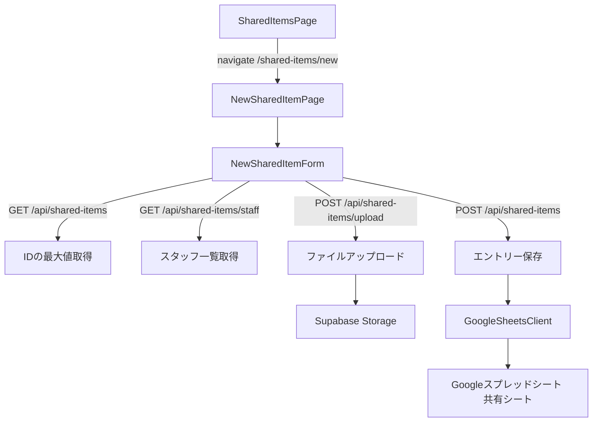

# 設計ドキュメント: 共有ページ新規作成フォーム（shared-page-new-entry）

## 概要

共有ページ（`/shared-items`）に新規エントリー作成機能を追加します。
「新規作成」ボタンをクリックすると `/shared-items/new` に遷移し、専用の入力フォームページが表示されます。
入力後に保存すると、Googleスプレッドシートの「共有」シートの最終行に追記されます。

### 設計方針

- 既存の `NewSellerPage.tsx` / `NewBuyerPage.tsx` と同じパターンで独立したページとして実装
- フォームロジックを `NewSharedItemForm.tsx` コンポーネントに分離し、ページは薄いラッパーとする
- ファイルアップロードはバックエンドに新規エンドポイントを追加し、Supabase Storageを使用
- 既存の `POST /api/shared-items` エンドポイントを保存に使用

---

## アーキテクチャ



### フロントエンド構成

```
frontend/frontend/src/
├── pages/
│   └── NewSharedItemPage.tsx        # 新規作成ページ（ルートコンポーネント）
├── components/
│   └── NewSharedItemForm.tsx        # フォームコンポーネント
```

### バックエンド構成

```
backend/src/
├── routes/
│   └── sharedItems.ts               # POST /upload エンドポイントを追加
├── services/
│   └── SharedItemsService.ts        # 既存（変更なし）
```

---

## コンポーネントとインターフェース

### NewSharedItemPage.tsx

`/shared-items/new` ルートに対応するページコンポーネント。
`NewSharedItemForm` をレンダリングし、保存完了後に `/shared-items` へナビゲートする。

```typescript
// Props なし（ルートコンポーネント）
export default function NewSharedItemPage(): JSX.Element
```

### NewSharedItemForm.tsx

フォームのロジックとUIを担当するコンポーネント。

```typescript
interface NewSharedItemFormProps {
  onSaved: () => void;    // 保存完了時のコールバック（一覧ページへ遷移）
  onCancel: () => void;   // キャンセル時のコールバック
}

export default function NewSharedItemForm(props: NewSharedItemFormProps): JSX.Element
```

### バックエンド: POST /api/shared-items/upload

ファイルをSupabase Storageにアップロードし、公開URLを返す。

```typescript
// Request: multipart/form-data
// - file: File（PDFまたは画像）
// - type: 'pdf' | 'image'

// Response
{
  url: string;  // Supabase StorageのパブリックURL
}
```

---

## データモデル

### フォームの状態（FormState）

```typescript
interface NewSharedItemFormState {
  // 自動入力（読み取り専用）
  id: string;           // 最大ID + 1
  date: string;         // 今日の日付（YYYY/MM/DD）
  inputBy: string;      // ログインユーザーのスタッフ名

  // 必須フィールド
  sharingLocation: string;   // 共有場（ドロップダウン）
  category: string;          // 項目（ドロップダウン）
  title: string;             // タイトル

  // 任意フィールド
  content: string;           // 内容
  sharingDate: string;       // 共有日（YYYY/MM/DD）
  staffNotShared: string[];  // 共有できていないスタッフ名の配列
  confirmationDate: string;  // 確認日（YYYY/MM/DD）
  pdfs: UploadedFile[];      // PDF（最大4件）
  images: UploadedFile[];    // 画像（最大4件）
  url: string;               // URL
  meetingContent: string;    // 打ち合わせ内容
}

interface UploadedFile {
  file: File;           // 選択されたFileオブジェクト
  name: string;         // ファイル名
  uploadedUrl?: string; // アップロード後のURL（保存時に使用）
}
```

### スプレッドシートへの送信データ

```typescript
// POST /api/shared-items のリクエストボディ
// GoogleSheetsClientのappendRowが受け取るSheetRow形式
{
  'ID': string;
  '日付': string;           // YYYY/MM/DD
  '入力者': string;
  '共有場': string;
  '項目': string;
  'タイトル': string;
  '内容': string;
  '共有日': string;
  '共有できていない': string; // カンマ区切り
  '確認日': string;
  'PDF1': string;
  'PDF2': string;
  'PDF3': string;
  'PDF4': string;
  '画像1': string;
  '画像2': string;
  '画像3': string;
  '画像4': string;
  'URL': string;
  '打ち合わせ内容': string;
}
```

### ドロップダウン選択肢

```typescript
const SHARING_LOCATIONS = [
  '朝礼', '売買会議', '契約率チーム', '物件数チーム', '事務会議', '営業会議'
] as const;

const CATEGORIES = [
  '契約関係', '訪問査定', '追客電話', '内覧関係', '決済関係',
  '専任媒介報告書', '税金関係', '境界、塀、ブロック、崖関係',
  '温泉関係', 'APPSHEET関係', '雛形関係', '他'
] as const;
```

---

## 正確性プロパティ

*プロパティとは、システムの全ての有効な実行において成立すべき特性や振る舞いのことです。プロパティは人間が読める仕様と機械で検証可能な正確性保証の橋渡しをします。*

### Property 1: ID採番の単調増加

*任意の* エントリーリストに対して、計算された次のIDは既存の最大IDより1大きい値でなければならない。

**Validates: Requirements 2.1**

### Property 2: スタッフ選択のトグル動作

*任意の* スタッフリストと任意のスタッフに対して、そのスタッフのボタンをクリックすると選択状態が反転し、再度クリックすると元の状態に戻る（ラウンドトリップ）。

**Validates: Requirements 7.2, 7.3**

### Property 3: 複数スタッフの独立した選択状態

*任意の* スタッフリストに対して、複数のスタッフを選択したとき、各スタッフの選択状態は互いに独立して維持される。

**Validates: Requirements 7.4**

### Property 4: URLバリデーションの網羅性

*任意の* URL形式でない文字列（`http://` または `https://` で始まらない文字列）を入力して保存しようとしたとき、バリデーションエラーが返される。

**Validates: Requirements 9.2**

---

## エラーハンドリング

### フロントエンドのバリデーション

保存ボタンクリック時に以下を検証する：

| フィールド | バリデーション | エラーメッセージ |
|-----------|--------------|----------------|
| 共有場 | 必須 | 「共有場を選択してください」 |
| 項目 | 必須 | 「項目を選択してください」 |
| タイトル | 必須 | 「タイトルを入力してください」 |
| URL | URL形式（入力がある場合のみ） | 「正しいURL形式で入力してください」 |
| 共有日 | 日付形式（入力がある場合のみ） | 「正しい日付形式で入力してください」 |
| 確認日 | 日付形式（入力がある場合のみ） | 「正しい日付形式で入力してください」 |

### APIエラーハンドリング

| エラー種別 | 対応 |
|-----------|------|
| ファイルアップロード失敗 | エラーメッセージを表示し、フォームを閉じない |
| スプレッドシート保存失敗 | エラーメッセージを表示し、フォームを閉じない |
| スタッフ一覧取得失敗 | エラーをコンソールに記録し、スタッフボタンを空で表示 |
| ID取得失敗 | エラーをコンソールに記録し、フォールバックIDを使用 |

### 二重送信防止

保存処理中（`loading === true`）は保存ボタンを `disabled` にする。
ファイルアップロード中も同様に保存ボタンを無効化する。

---

## テスト戦略

### ユニットテスト（例ベース）

以下の具体的なシナリオをテストする：

- フォームが展開されたとき、全フィールドが表示される（要件1.2）
- キャンセルボタンクリックでフォームが閉じる（要件1.3）
- 今日の日付がYYYY/MM/DD形式で自動入力される（要件2.2）
- 認証ストアのスタッフ名が入力者フィールドに表示される（要件2.3）
- ID・日付・入力者フィールドがreadOnlyである（要件2.4）
- 共有場ドロップダウンに6つの選択肢がある（要件3.1）
- 項目ドロップダウンに12の選択肢がある（要件4.1）
- 必須フィールド未入力で保存するとエラーが表示される（要件3.3, 4.3, 5.4）
- 保存完了後にフォームが閉じてリストが更新される（要件10.3）
- APIエラー時にエラーメッセージが表示されフォームが開いたままである（要件10.4）
- 保存処理中に保存ボタンがdisabledである（要件10.5）

### プロパティベーステスト（fast-check使用）

TypeScriptプロジェクトのため、`fast-check` ライブラリを使用する。
各プロパティテストは最低100回のイテレーションで実行する。

```typescript
// タグ形式: Feature: shared-page-new-entry, Property {番号}: {プロパティ名}

// Property 1: ID採番の単調増加
// Feature: shared-page-new-entry, Property 1: ID採番の単調増加
fc.assert(fc.property(
  fc.array(fc.record({ id: fc.integer({ min: 1, max: 9999 }) })),
  (entries) => {
    const nextId = calculateNextId(entries);
    const maxId = entries.length > 0 ? Math.max(...entries.map(e => e.id)) : 0;
    return nextId === maxId + 1;
  }
), { numRuns: 100 });

// Property 2: スタッフ選択のトグル動作（ラウンドトリップ）
// Feature: shared-page-new-entry, Property 2: スタッフ選択のトグル動作
fc.assert(fc.property(
  fc.array(fc.string(), { minLength: 1 }),
  fc.nat(),
  (staffList, index) => {
    const staff = staffList[index % staffList.length];
    const initial: string[] = [];
    const afterClick = toggleStaff(initial, staff);
    const afterDoubleClick = toggleStaff(afterClick, staff);
    return afterDoubleClick.length === 0 && !afterDoubleClick.includes(staff);
  }
), { numRuns: 100 });

// Property 3: 複数スタッフの独立した選択状態
// Feature: shared-page-new-entry, Property 3: 複数スタッフの独立した選択状態
fc.assert(fc.property(
  fc.uniqueArray(fc.string({ minLength: 1 }), { minLength: 2 }),
  (staffList) => {
    let selected: string[] = [];
    for (const staff of staffList) {
      selected = toggleStaff(selected, staff);
    }
    return staffList.every(s => selected.includes(s));
  }
), { numRuns: 100 });

// Property 4: URLバリデーションの網羅性
// Feature: shared-page-new-entry, Property 4: URLバリデーションの網羅性
fc.assert(fc.property(
  fc.string().filter(s => !s.startsWith('http://') && !s.startsWith('https://') && s.length > 0),
  (invalidUrl) => {
    const result = validateUrl(invalidUrl);
    return result.isValid === false;
  }
), { numRuns: 100 });
```

### 統合テスト

- `POST /api/shared-items` が正しいデータでスプレッドシートに追記されることを確認（1〜2件のサンプルデータ）
- `POST /api/shared-items/upload` がSupabase StorageにファイルをアップロードしURLを返すことを確認

### テスト実行

```bash
# フロントエンドのユニット・プロパティテスト（単発実行）
cd frontend/frontend && npx vitest --run

# バックエンドのテスト
cd backend && npx jest
```
