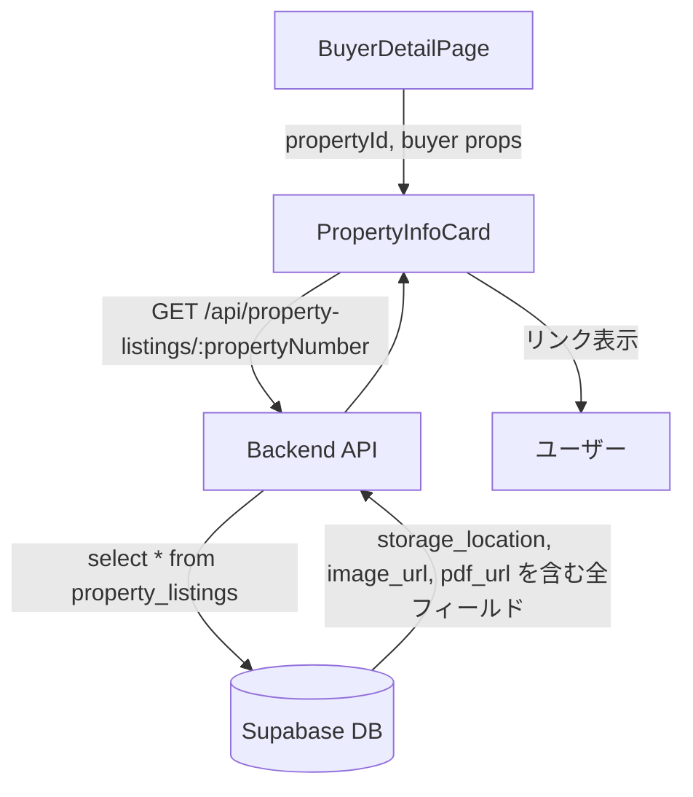

# デザイン設計書: URLリンク化機能

## 概要

本機能は、買主リスト詳細画面の物件詳細カード（`PropertyInfoCard`コンポーネント）に `storage_location`、`image_url`、`pdf_url` の3フィールドを追加し、クリック可能なリンクとして表示する。

現状の調査結果：
- `PropertyInfoCard`の `PropertyFullDetails` インターフェースに上記3フィールドが未定義
- バックエンドAPIは `select('*')` で全フィールドを返しているため、**バックエンドの変更は不要**
- `PropertyListingDetailPage` は全URLフィールドがすでにリンク化済みのため、**確認のみ**

変更対象ファイル：
- `frontend/frontend/src/components/PropertyInfoCard.tsx`（主要変更）
- `frontend/frontend/src/pages/BuyerDetailPage.tsx`（変更なし、確認のみ）
- `frontend/frontend/src/pages/PropertyListingDetailPage.tsx`（変更なし、確認のみ）

---

## アーキテクチャ



データフロー：
1. `BuyerDetailPage` が `PropertyInfoCard` に `propertyId` を渡す
2. `PropertyInfoCard` が `/api/property-listings/:propertyNumber` を呼び出す
3. バックエンドは `select('*')` で全フィールドを返す（`storage_location`、`image_url`、`pdf_url` を含む）
4. フロントエンドのインターフェース定義にフィールドを追加し、受け取ったデータをリンクとして表示する

---

## コンポーネントとインターフェース

### PropertyInfoCard の変更点

#### 1. `PropertyFullDetails` インターフェースへのフィールド追加

```typescript
interface PropertyFullDetails {
  // ... 既存フィールド ...
  suumo_url?: string;       // 既存（リンク化済み）
  google_map_url?: string;  // 既存（リンク化済み）
  storage_location?: string; // 追加
  image_url?: string;        // 追加
  pdf_url?: string;          // 追加
}
```

#### 2. URLリンク表示の追加

既存の `suumo_url` と `google_map_url` のリンク表示と同じパターンで実装する。
表示位置は既存のURLリンクグループ（価格・Suumo URL・Google Mapを含む `Grid item xs={12}` の `Box`）に追加する。

```tsx
{/* storage_location */}
{property.storage_location && (
  <Box sx={{ flex: '0 0 auto' }}>
    <Typography variant="caption" color="text.secondary">
      保存場所
    </Typography>
    <Box sx={{ mt: 0.5 }}>
      <Link
        href={property.storage_location}
        target="_blank"
        rel="noopener noreferrer"
        sx={{ display: 'flex', alignItems: 'center', gap: 0.5 }}
      >
        <Typography variant="body2">保存場所を開く</Typography>
        <LaunchIcon fontSize="small" />
      </Link>
    </Box>
  </Box>
)}

{/* image_url */}
{property.image_url && (
  <Box sx={{ flex: '0 0 auto' }}>
    <Typography variant="caption" color="text.secondary">
      画像
    </Typography>
    <Box sx={{ mt: 0.5 }}>
      <Link
        href={property.image_url}
        target="_blank"
        rel="noopener noreferrer"
        sx={{ display: 'flex', alignItems: 'center', gap: 0.5 }}
      >
        <Typography variant="body2">画像を開く</Typography>
        <LaunchIcon fontSize="small" />
      </Link>
    </Box>
  </Box>
)}

{/* pdf_url */}
{property.pdf_url && (
  <Box sx={{ flex: '0 0 auto' }}>
    <Typography variant="caption" color="text.secondary">
      PDF
    </Typography>
    <Box sx={{ mt: 0.5 }}>
      <Link
        href={property.pdf_url}
        target="_blank"
        rel="noopener noreferrer"
        sx={{ display: 'flex', alignItems: 'center', gap: 0.5 }}
      >
        <Typography variant="body2">PDFを開く</Typography>
        <LaunchIcon fontSize="small" />
      </Link>
    </Box>
  </Box>
)}
```

### PropertyListingDetailPage の確認結果

コードレビューにより、以下の全URLフィールドがリンク化済みであることを確認：

| フィールド | 実装方式 | 確認結果 |
|-----------|---------|---------|
| `google_map_url` | `EditableUrlField` コンポーネント | ✅ リンク化済み |
| `suumo_url` | `EditableUrlField` コンポーネント | ✅ リンク化済み |
| `storage_location` | `Link` コンポーネント（`target="_blank" rel="noopener noreferrer"`） | ✅ リンク化済み |
| `image_url` | `Button` コンポーネント（`href`, `target="_blank" rel="noopener noreferrer"`） | ✅ リンク化済み |
| `pdf_url` | `Button` コンポーネント（`href`, `target="_blank" rel="noopener noreferrer"`） | ✅ リンク化済み |

---

## データモデル

### フロントエンド型定義の変更

`PropertyInfoCard.tsx` 内の `PropertyFullDetails` インターフェースに3フィールドを追加する。

**変更前:**
```typescript
interface PropertyFullDetails {
  // ...
  suumo_url?: string;
  google_map_url?: string;
  // storage_location, image_url, pdf_url は未定義
}
```

**変更後:**
```typescript
interface PropertyFullDetails {
  // ...
  suumo_url?: string;
  google_map_url?: string;
  storage_location?: string; // 追加
  image_url?: string;        // 追加
  pdf_url?: string;          // 追加
}
```

### バックエンドの変更

**変更なし。**

`PropertyListingService.getByPropertyNumber()` は `select('*')` を使用しており、`storage_location`、`image_url`、`pdf_url` を含む全フィールドをすでに返している。

---

## 正確性プロパティ

本機能はUIレンダリングとインターフェース定義の変更が主体であり、純粋関数やデータ変換ロジックを含まない。

プロパティベーステスト（PBT）が適切でない理由：
- 変更内容はTypeScriptインターフェース定義の拡張とJSXのレンダリング条件の追加のみ
- テスト対象は「URLが存在する場合にリンクが表示される」「URLが存在しない場合に非表示」という固定パターン
- 入力のバリエーション（null、空文字、有効なURL）は有限かつ少数であり、例ベーステストで十分にカバーできる
- UIコンポーネントのレンダリングテストにはスナップショットテストや例ベーステストが適切

代替テスト戦略として、以下の例ベーステストを推奨する（テスト戦略セクション参照）。

---

## エラーハンドリング

### URLフィールドが null / undefined / 空文字の場合

条件付きレンダリング（`{property.storage_location && (...)}` パターン）により、フィールドが falsy な値の場合はリンク要素を表示しない。これは既存の `suumo_url` と `google_map_url` の実装と同じパターンであり、追加のエラーハンドリングは不要。

### 不正なURL形式の場合

`PropertyInfoCard` はリンクの表示のみを担当し、URLの検証は行わない。これは既存の `suumo_url` と `google_map_url` の実装と同じ方針。URLの検証は `PropertyListingDetailPage` の `EditableUrlField` コンポーネントで入力時に行われる。

---

## テスト戦略

### PBTの適用判断

本機能はUIレンダリングの変更のみであるため、**プロパティベーステストは適用しない**。

### 例ベーステスト（推奨）

以下のケースを手動またはコンポーネントテストで確認する：

**ケース1: URLが存在する場合のリンク表示**
- `storage_location` に有効なURLが設定されている場合、「保存場所を開く」リンクが表示される
- `image_url` に有効なURLが設定されている場合、「画像を開く」リンクが表示される
- `pdf_url` に有効なURLが設定されている場合、「PDFを開く」リンクが表示される

**ケース2: URLが存在しない場合の非表示**
- `storage_location` が `null` / `undefined` / 空文字の場合、リンクが表示されない
- `image_url` が `null` / `undefined` / 空文字の場合、リンクが表示されない
- `pdf_url` が `null` / `undefined` / 空文字の場合、リンクが表示されない

**ケース3: セキュリティ属性の確認**
- 全リンクに `target="_blank"` が設定されている
- 全リンクに `rel="noopener noreferrer"` が設定されている

### 統合確認（手動）

1. 買主詳細画面を開き、物件カードに `storage_location`、`image_url`、`pdf_url` が表示されることを確認
2. 各リンクをクリックし、新しいタブでURLが開くことを確認
3. フィールドが空の物件では該当リンクが表示されないことを確認
4. `PropertyListingDetailPage` で全URLフィールドが引き続きリンク化されていることを確認
