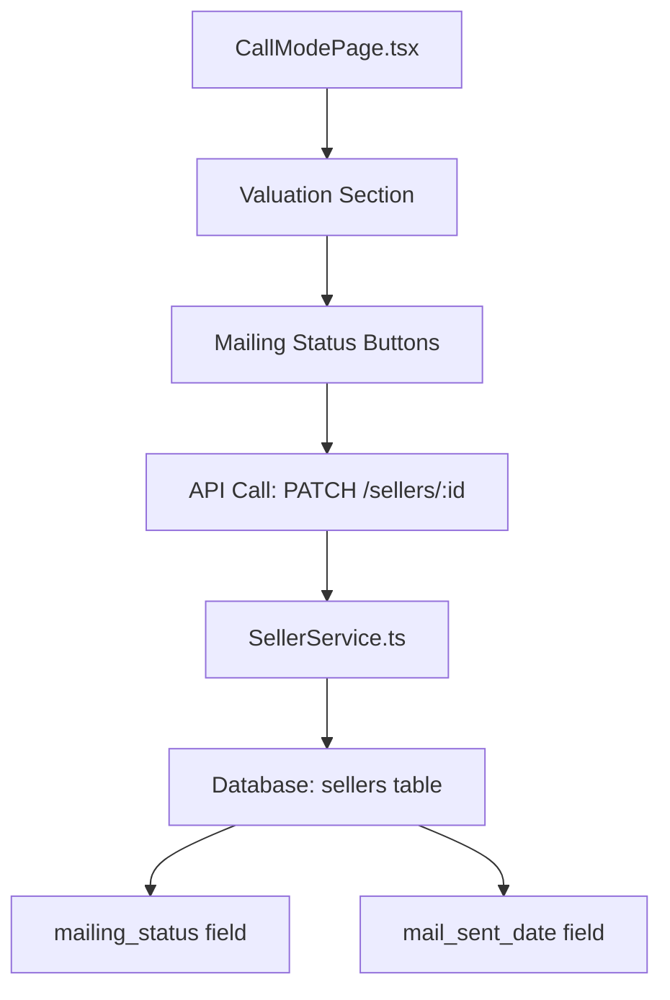

# Design Document: Valuation Mailing Buttons

## Overview

本機能は、通話モードページの査定計算セクションに「郵送」「済」「不要」ボタンを追加し、査定書の郵送ステータスを簡単に管理できるようにします。既存のデータベースフィールド（`mailing_status`、`mail_sent_date`）を活用し、フロントエンドのUIを拡張します。

**ワークフロー:**
1. 「郵送」ボタンをクリック → ステータスが「未」（郵送予定）になる
2. 郵送完了後、「済」ボタンをクリック → ステータスが「済」になり、郵送日が記録される
3. 郵送が不要な場合、「不要」ボタンをクリック → ステータスが「不要」になる

## Architecture



### 既存インフラストラクチャの活用

- **データベース**: `sellers`テーブルの既存フィールドを使用
  - `mailing_status`: VARCHAR(20) - 「未」「済」「不要」
  - `mail_sent_date`: DATE - 郵送日
- **API**: 既存の `PATCH /api/sellers/:id` エンドポイントを使用
- **サービス**: `SellerService.ts` の既存更新機能を使用

## Components and Interfaces

### フロントエンドコンポーネント

#### 状態管理（CallModePage.tsx への追加）

```typescript
// 新規状態
const [editedMailingStatus, setEditedMailingStatus] = useState<string>('');
const [editedMailSentDate, setEditedMailSentDate] = useState<string>('');
const [savingMailingStatus, setSavingMailingStatus] = useState(false);
```

### API インターフェース

既存の `PATCH /api/sellers/:id` を使用：

```typescript
// リクエストボディ
{
  mailingStatus: '未' | '済' | '不要',
  mailSentDate?: string  // ISO 8601 形式（「済」の場合のみ）
}
```

## Data Models

### Seller モデル（既存フィールド）

| フィールド | 型 | 説明 |
|-----------|------|------|
| mailing_status | VARCHAR(20) | 郵送ステータス（未、済、不要） |
| mail_sent_date | DATE | 郵送日 |

### フロントエンド型定義（既存）

```typescript
// frontend/src/types/index.ts
interface Seller {
  // ... 既存フィールド
  mailingStatus?: string;
  mailSentDate?: string;
}
```

## Correctness Properties

*A property is a characteristic or behavior that should hold true across all valid executions of a system-essentially, a formal statement about what the system should do. Properties serve as the bridge between human-readable specifications and machine-verifiable correctness guarantees.*

### Property 1: Mailing status button click updates status correctly
*For any* mailing status button click ("郵送", "済", or "不要"), the system should update the mailingStatus state to the corresponding value ("未" for "郵送", "済" for "済", "不要" for "不要")
**Validates: Requirements 1.1, 2.1, 3.1**

### Property 2: Mail sent date is set when status becomes "済"
*For any* status update to "済", the mailSentDate should be set to the current date in ISO format
**Validates: Requirements 2.2**

### Property 3: Visual state reflects mailing status
*For any* mailingStatus value, the button corresponding to that status should be displayed in a highlighted/contained variant, while other buttons should be displayed in an outlined variant
**Validates: Requirements 1.3, 2.4, 3.3, 4.1**

### Property 4: Mail sent date display when status is "済"
*For any* seller with mailingStatus "済" and a valid mailSentDate, the UI should display the formatted date
**Validates: Requirements 4.2**

### Property 5: Button availability based on status
*For any* mailingStatus value (including empty), all three buttons should remain clickable to allow status changes
**Validates: Requirements 4.3, 4.4**

### Property 6: Buttons visible regardless of edit mode
*For any* edit mode state (true or false), the mailing status buttons should be visible in the valuation section
**Validates: Requirements 5.2, 5.3**

## Error Handling

### API エラー

- ネットワークエラー: ユーザーにエラーメッセージを表示し、ボタンを再度有効化
- 認証エラー: ログインページへリダイレクト
- サーバーエラー: エラーメッセージを表示し、リトライを許可

### 楽観的更新

- ボタンクリック時に即座にUIを更新
- API呼び出し失敗時は元の状態に戻す

## Testing Strategy

### Unit Tests

- ボタンクリック時のコールバック呼び出しテスト
- 各ステータスに応じたボタンスタイルのテスト

### Property-Based Tests

Property-based testing library: **Jest** のパラメータ化テスト

各プロパティテストは最低100回のイテレーションで実行します。

### Integration Tests

- 実際のAPI呼び出しを含むE2Eテスト（手動テスト）
- 状態の永続化確認

## UI Design

### ボタン配置

```
┌─────────────────────────────────────────────────────────┐
│ 💰 査定計算                                    [編集]   │
├─────────────────────────────────────────────────────────┤
│                                                         │
│  1,500万円 ～ 1,800万円 ～ 2,000万円  [✍️ 手入力]      │
│                                                         │
│  査定担当: 山田太郎                                     │
│                                                         │
│  ┌─────────────────────────────────────────────────┐   │
│  │ 📮 郵送ステータス                               │   │
│  │                                                 │   │
│  │  [郵送]  [済 ✓]  [不要]    郵送日: 2025/12/10  │   │
│  │                                                 │   │
│  └─────────────────────────────────────────────────┘   │
│                                                         │
└─────────────────────────────────────────────────────────┘
```

### ボタンスタイル

| ステータス | 「郵送」ボタン | 「済」ボタン | 「不要」ボタン |
|-----------|---------------|-------------|---------------|
| 空 | outlined | outlined | outlined |
| 未 | contained (warning) | outlined | outlined |
| 済 | outlined | contained (success) | outlined |
| 不要 | outlined | outlined | contained (secondary) |
