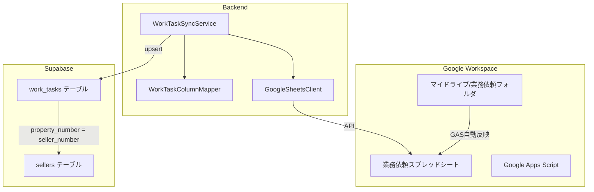

# Design Document: 業務依頼スプレッドシート同期

## Overview

業務依頼スプレッドシート（128カラム、約300行）をSupabaseの`work_tasks`テーブルに同期する機能を実装します。物件番号（property_number）をキーとして売主テーブル（sellers）と関連付け、媒介契約後の業務進捗を一元管理できるようにします。

## Architecture



## Components and Interfaces

### 1. WorkTaskColumnMapper

スプレッドシートのカラムとデータベースカラムのマッピングを管理します。

```typescript
interface WorkTaskColumnMapper {
  mapToDatabase(sheetRow: SheetRow): WorkTaskData;
  mapToSheet(workTaskData: WorkTaskData): SheetRow;
  getColumnType(columnName: string): 'string' | 'date' | 'number' | 'boolean';
}
```

### 2. WorkTaskSyncService

スプレッドシートとデータベース間の同期を実行します。

```typescript
interface WorkTaskSyncService {
  syncAll(): Promise<SyncResult>;
  syncByPropertyNumber(propertyNumber: string): Promise<WorkTaskData>;
  getByPropertyNumber(propertyNumber: string): Promise<WorkTaskData | null>;
}

interface SyncResult {
  totalRows: number;
  successCount: number;
  errorCount: number;
  errors: SyncError[];
  startTime: Date;
  endTime: Date;
}
```

### 3. WorkTaskService

業務依頼データのCRUD操作を提供します。

```typescript
interface WorkTaskService {
  getByPropertyNumber(propertyNumber: string): Promise<WorkTaskData | null>;
  getBySellerId(sellerId: string): Promise<WorkTaskData | null>;
  list(options: ListOptions): Promise<WorkTaskData[]>;
}
```

## Data Models

### work_tasks テーブル

128カラムをフラットに格納するテーブル設計（Option A）。

```sql
CREATE TABLE work_tasks (
  id UUID PRIMARY KEY DEFAULT gen_random_uuid(),
  property_number VARCHAR(20) UNIQUE NOT NULL,
  
  -- 物件基本情報
  property_address TEXT,
  seller_name TEXT,
  spreadsheet_url TEXT,
  sales_assignee TEXT,
  
  -- 媒介契約関連
  mediation_type TEXT,
  mediation_deadline DATE,
  mediation_completed TEXT,
  mediation_creator TEXT,
  mediation_notes TEXT,
  
  -- サイト登録関連
  site_registration_deadline DATE,
  site_registration_request_date DATE,
  site_registration_due_date DATE,
  site_registration_confirm_request_date DATE,
  site_registration_confirmed TEXT,
  site_registration_confirmer TEXT,
  email_distribution TEXT,
  pre_distribution_check TEXT,
  distribution_date DATE,
  distribution_assignee TEXT,
  pre_publish_check TEXT,
  publish_scheduled_date DATE,
  cadastral_map_url TEXT,
  floor_plan_no_notification TEXT,
  floor_plan TEXT,
  floor_plan_request_date DATE,
  floor_plan_due_date DATE,
  floor_plan_completed_date DATE,
  floor_plan_confirmer TEXT,
  floor_plan_revision_count INTEGER,
  contract_input_deadline DATE,
  panorama TEXT,
  panorama_completed TEXT,
  employee_contract_creation TEXT,
  attachment_completed TEXT,
  site_notes TEXT,
  
  -- 売買契約関連
  sales_contract_deadline DATE,
  sales_contract_assignee TEXT,
  sales_contract_confirmed TEXT,
  binding_scheduled_date DATE,
  binding_completed TEXT,
  sales_contract_notes TEXT,
  ledger_created TEXT,
  on_hold TEXT,
  attachment_printed TEXT,
  
  -- 決済関連
  settlement_date DATE,
  brokerage_fee_seller NUMERIC,
  brokerage_fee_buyer NUMERIC,
  seller_payment_method TEXT,
  buyer_payment_method TEXT,
  payment_confirmed_seller TEXT,
  payment_confirmed_buyer TEXT,
  standard_brokerage_fee_seller NUMERIC,
  standard_brokerage_fee_buyer NUMERIC,
  discount_reason TEXT,
  discount_reason_other TEXT,
  referral_flyer_given TEXT,
  review_registered TEXT,
  other_comments TEXT,
  sales_price NUMERIC,
  campaign TEXT,
  settlement_completed_chat TEXT,
  settlement_scheduled_month TEXT,
  property_assignee_chat TEXT,
  accounting_confirmed TEXT,
  contract_type TEXT,
  loan_approval_scheduled_date DATE,
  
  -- チャット・連絡関連
  kunihiro_chat TEXT,
  yamamoto_chat TEXT,
  ura_chat TEXT,
  kadoi_chat TEXT,
  
  -- 仲介業者・司法書士
  broker TEXT,
  broker_contact TEXT,
  judicial_scrivener TEXT,
  judicial_scrivener_contact TEXT,
  
  -- その他
  review_count_field TEXT,
  site_registration_requester TEXT,
  site_registration_requestor TEXT,
  hirose_request TEXT,
  property_list_row_added TEXT,
  property_file TEXT,
  site_registration_comment TEXT,
  sales_contract_comment TEXT,
  hirose_request_sales TEXT,
  cw_request_email_site TEXT,
  cw_request_email_floor_plan TEXT,
  floor_plan_comment TEXT,
  cw_request_email_2f_above TEXT,
  site_registration_ok_comment TEXT,
  floor_plan_ok_comment TEXT,
  site_registration_ok_sent TEXT,
  floor_plan_ok_sent TEXT,
  storage_url TEXT,
  cadastral_map_sales_input TEXT,
  road_dimensions TEXT,
  property_type TEXT,
  floor_plan_stored_email TEXT,
  attachment_prep_deadline DATE,
  sales_contract_admin TEXT,
  cw_inspection_site TEXT,
  cw_inspection_plan_300 TEXT,
  cw_inspection_plan_500 TEXT,
  site_registration_ok_hirose TEXT,
  registration_completed_chat_hirose TEXT,
  work_completed_chat_hirose TEXT,
  registration_completed_comment TEXT,
  work_completed_comment TEXT,
  cw_request_sales TEXT,
  hirose_completed_chat_sales TEXT,
  cw_completed_email_sales TEXT,
  hirose_floor_plan_stored_comment TEXT,
  completed_comment_sales TEXT,
  invoice_stamped TEXT,
  pre_publish_distributed TEXT,
  review_seller TEXT,
  review_buyer TEXT,
  review_count INTEGER,
  wall_core_area_input TEXT,
  general_mediation_no_distribution TEXT,
  cadastral_map_field TEXT,
  single_listing TEXT,
  single_listing_input_confirmed TEXT,
  direction_symbol TEXT,
  address_display_confirmed TEXT,
  work_content TEXT,
  sales_inspection TEXT,
  pre_request_check TEXT,
  cw_person TEXT,
  
  -- メタデータ
  created_at TIMESTAMPTZ DEFAULT NOW(),
  updated_at TIMESTAMPTZ DEFAULT NOW(),
  synced_at TIMESTAMPTZ DEFAULT NOW()
);

-- インデックス
CREATE INDEX idx_work_tasks_property_number ON work_tasks(property_number);
CREATE INDEX idx_work_tasks_settlement_date ON work_tasks(settlement_date);
CREATE INDEX idx_work_tasks_sales_contract_deadline ON work_tasks(sales_contract_deadline);
```

## Correctness Properties

*A property is a characteristic or behavior that should hold true across all valid executions of a system-essentially, a formal statement about what the system should do. Properties serve as the bridge between human-readable specifications and machine-verifiable correctness guarantees.*

### Property 1: カラムマッピング完全性
*For any* スプレッドシート行データ, マッピング処理後のデータベースオブジェクトは128カラムすべてに対応するフィールドを持つ
**Validates: Requirements 1.2**

### Property 2: 物件番号の一意性保持
*For any* 同じ物件番号を持つ2つの同期操作, 2回目の同期後もwork_tasksテーブルには1レコードのみ存在する（upsert）
**Validates: Requirements 1.4**

### Property 3: 日付型変換の正確性
*For any* 「締め日」「完了日」「予定日」「依頼日」を含むカラム名, そのカラムの値はdate型として正しくパースされる
**Validates: Requirements 2.2**

### Property 4: 数値型変換の正確性
*For any* 「仲介手数料」「売買価格」を含むカラム名, そのカラムの値はnumber型として正しくパースされる
**Validates: Requirements 2.3**

### Property 5: 空値のnull変換
*For any* 空文字列または未定義の値, データベースにはnullとして格納される
**Validates: Requirements 2.4**

### Property 6: カテゴリ分類の正確性
*For any* カラム名, 正しいカテゴリ（媒介契約、サイト登録、売買契約、決済、その他）に分類される
**Validates: Requirements 3.3**

## Error Handling

| エラー種別 | 対処方法 |
|-----------|---------|
| スプレッドシート接続エラー | リトライ（最大3回）後、エラーログ記録 |
| 物件番号が空 | 該当行をスキップし、警告ログ記録 |
| 日付パースエラー | nullとして格納し、警告ログ記録 |
| 数値パースエラー | nullとして格納し、警告ログ記録 |
| データベース書き込みエラー | トランザクションロールバック、エラーログ記録 |

## Testing Strategy

### Unit Tests
- カラムマッピング関数の個別テスト
- 日付・数値変換関数のテスト
- カテゴリ分類関数のテスト

### Property-Based Tests
- fast-checkライブラリを使用
- 各Correctness Propertyに対応するプロパティテストを実装
- 最低100イテレーション実行

### Integration Tests
- 実際のスプレッドシートからのデータ取得テスト
- Supabaseへのupsert処理テスト
- 売主テーブルとの関連付けテスト
