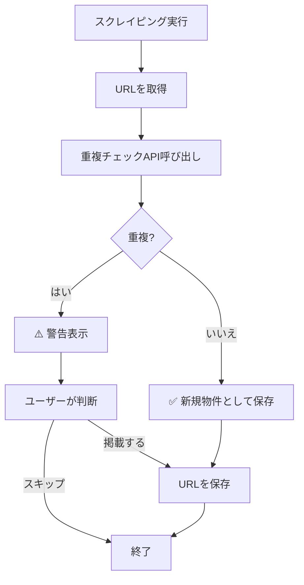
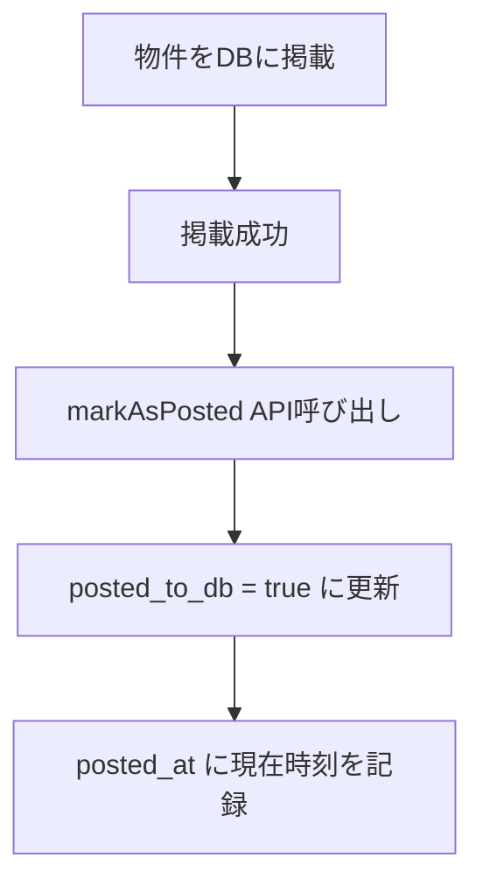

# スクレイピングURL重複チェック機能

## 概要

スクレイピングしたURLをデータベースに保存し、重複掲載を防ぐための機能です。

## 機能

### 1. 重複チェック

- **URLでチェック**: スクレイピングしたURLが既に保存されているか確認
- **物件番号でチェック**: athomeの物件番号で重複を確認

### 2. 重複時の警告

重複が検出された場合、以下の情報を表示します：

- ⚠️ 重複の可能性があります
- 前回スクレイピング日時
- 掲載状態（掲載済み / 未掲載）
- 掲載日時（掲載済みの場合）

### 3. 履歴管理

- スクレイピング履歴の保存
- 未掲載物件の一覧表示
- 掲載済みマーク機能

---

## データベース構造

### テーブル: `scraped_urls`

| カラム名 | 型 | 説明 |
|---------|---|------|
| `id` | UUID | 主キー |
| `url` | TEXT | 元のURL（重複チェックのキー） |
| `reference_url` | TEXT | 参照元URL（スクレイピング元のページURL） |
| `scraped_result_url` | TEXT | スクレイピング後のURL（公開物件サイトのURL） |
| `property_number` | TEXT | 物件番号（athomeの場合） |
| `source_site` | TEXT | スクレイピング元サイト（'athome', 'suumo'など） |
| `title` | TEXT | 物件タイトル |
| `price` | TEXT | 価格 |
| `address` | TEXT | 住所 |
| `scraped_at` | TIMESTAMP | スクレイピング日時 |
| `posted_to_db` | BOOLEAN | DBに掲載済みかどうか |
| `posted_at` | TIMESTAMP | 掲載日時 |
| `created_at` | TIMESTAMP | 作成日時 |
| `updated_at` | TIMESTAMP | 更新日時 |

---

## セットアップ

### 1. データベースマイグレーション

```bash
# Supabaseでテーブルを作成
psql -h <supabase-host> -U postgres -d postgres -f backend/add-scraped-urls-table.sql
```

または、Supabase Studioで`backend/add-scraped-urls-table.sql`の内容を実行してください。

### 2. バックエンドにルートを追加

`backend/src/index.ts`に以下を追加：

```typescript
import scrapedUrlsRouter from './routes/scraped-urls';

// ...

app.use('/api/scraped-urls', scrapedUrlsRouter);
```

### 3. フロントエンドで使用

```tsx
import { ScrapedUrlChecker } from '@/components/ScrapedUrlChecker';

function MyPage() {
  const handleCheckComplete = (result) => {
    if (result.isDuplicate) {
      console.log('重複が検出されました:', result.message);
    } else {
      console.log('新規物件です');
    }
  };

  return (
    <div>
      <ScrapedUrlChecker onCheckComplete={handleCheckComplete} />
    </div>
  );
}
```

---

## API エンドポイント

### 1. URLの重複チェック

**エンドポイント**: `POST /api/scraped-urls/check-duplicate`

**リクエストボディ**:
```json
{
  "url": "https://www.athome.co.jp/mansion/6990582043/"
}
```

**レスポンス**:
```json
{
  "success": true,
  "data": {
    "isDuplicate": true,
    "existingRecord": {
      "id": "uuid",
      "url": "https://www.athome.co.jp/mansion/6990582043/",
      "referenceUrl": "https://www.athome.co.jp/kodate/1168173407",
      "scrapedResultUrl": "https://sateituikyaku-admin-frontend.vercel.app/property-preview/9b57f5f1e9",
      "propertyNumber": "6990582043",
      "sourceSite": "athome",
      "scrapedAt": "2026-05-03T10:00:00Z",
      "postedToDb": true,
      "postedAt": "2026-05-03T12:00:00Z"
    },
    "message": "⚠️ 重複の可能性があります\nこの物件は2026/5/3に既に掲載されています。\n前回スクレイピング日時: 2026/5/3 10:00:00"
  }
}
```

### 2. 物件番号での重複チェック

**エンドポイント**: `POST /api/scraped-urls/check-duplicate-by-property-number`

**リクエストボディ**:
```json
{
  "propertyNumber": "6990582043",
  "sourceSite": "athome"
}
```

### 3. スクレイピングしたURLを保存

**エンドポイント**: `POST /api/scraped-urls`

**リクエストボディ**:
```json
{
  "url": "https://www.athome.co.jp/mansion/6990582043/",
  "referenceUrl": "https://www.athome.co.jp/kodate/1168173407",
  "scrapedResultUrl": "https://sateituikyaku-admin-frontend.vercel.app/property-preview/9b57f5f1e9",
  "propertyNumber": "6990582043",
  "sourceSite": "athome",
  "title": "季の坂パークホームズ弐番館 801 ４ＬＤＫ",
  "price": "2,190万円",
  "address": "大分県大分市季の坂２丁目"
}
```

### 4. 掲載済みとしてマーク

**エンドポイント**: `PUT /api/scraped-urls/:url/mark-as-posted`

**例**:
```bash
curl -X PUT "http://localhost:3000/api/scraped-urls/https%3A%2F%2Fwww.athome.co.jp%2Fmansion%2F6990582043%2F/mark-as-posted"
```

### 5. 未掲載のスクレイピング済みURLを取得

**エンドポイント**: `GET /api/scraped-urls/unposted?sourceSite=athome`

**レスポンス**:
```json
{
  "success": true,
  "data": [
    {
      "id": "uuid",
      "url": "https://www.athome.co.jp/mansion/6990582043/",
      "referenceUrl": "https://www.athome.co.jp/kodate/1168173407",
      "scrapedResultUrl": "https://sateituikyaku-admin-frontend.vercel.app/property-preview/9b57f5f1e9",
      "propertyNumber": "6990582043",
      "sourceSite": "athome",
      "title": "季の坂パークホームズ弐番館 801 ４ＬＤＫ",
      "price": "2,190万円",
      "address": "大分県大分市季の坂２丁目",
      "scrapedAt": "2026-05-03T10:00:00Z",
      "postedToDb": false,
      "postedAt": null
    }
  ]
}
```

### 6. スクレイピング履歴を取得

**エンドポイント**: `GET /api/scraped-urls/history?limit=50&sourceSite=athome`

---

## 使用フロー

### スクレイピング時のフロー



### 掲載時のフロー



---

## 🎯 使用例（画像の情報に基づく）

### スクレイピング時のフロー

画像に表示されている情報：
- **URL（参照元）**: `https://www.athome.co.jp/kodate/1168173407`
- **公開URL（スクレイピング後）**: `https://sateituikyaku-admin-frontend.vercel.app/property-preview/9b57f5f1e9`
- **元のURL（athome物件URL）**: `https://www.athome.co.jp/mansion/6990582043/`

```python
import requests
import json

# スクレイピング結果
scraped_data = {
    "url": "https://www.athome.co.jp/mansion/6990582043/",  # 元のURL
    "title": "季の坂パークホームズ弐番館 801 ４ＬＤＫ",
    "price": "2,190万円",
    "details": {
        "物件番号": "6990582043",
        "所在地": "大分県大分市季の坂２丁目"
    }
}

# 参照元URL（画像の「URL」欄）
reference_url = "https://www.athome.co.jp/kodate/1168173407"

# スクレイピング後のURL（画像の「公開URL」欄）
scraped_result_url = "https://sateituikyaku-admin-frontend.vercel.app/property-preview/9b57f5f1e9"

# 重複チェック
check_response = requests.post(
    "http://localhost:3000/api/scraped-urls/check-duplicate",
    json={"url": scraped_data["url"]}
)

check_result = check_response.json()

if check_result["data"]["isDuplicate"]:
    print(f"⚠️ {check_result['data']['message']}")
    print(f"参照元URL: {check_result['data']['existingRecord']['referenceUrl']}")
    print(f"スクレイピング後のURL: {check_result['data']['existingRecord']['scrapedResultUrl']}")
    
    # ユーザーに確認を求める
    user_input = input("それでも掲載しますか？ (y/n): ")
    if user_input.lower() != 'y':
        print("スキップしました")
        exit()

# URLを保存
save_response = requests.post(
    "http://localhost:3000/api/scraped-urls",
    json={
        "url": scraped_data["url"],
        "referenceUrl": reference_url,  # 参照元URL
        "scrapedResultUrl": scraped_result_url,  # スクレイピング後のURL
        "propertyNumber": scraped_data["details"]["物件番号"],
        "sourceSite": "athome",
        "title": scraped_data["title"],
        "price": scraped_data["price"],
        "address": scraped_data["details"]["所在地"]
    }
)

print("✅ URLを保存しました")

# 物件をDBに掲載する処理...
# （省略）

# 掲載成功後、掲載済みとしてマーク
mark_response = requests.put(
    f"http://localhost:3000/api/scraped-urls/{requests.utils.quote(scraped_data['url'], safe='')}/mark-as-posted"
)

print("✅ 掲載済みとしてマークしました")
```

---

## 注意事項

### 1. URLのエンコーディング

URLをパスパラメータとして使用する場合は、必ずURLエンコードしてください：

```javascript
const encodedUrl = encodeURIComponent(url);
fetch(`/api/scraped-urls/${encodedUrl}/mark-as-posted`, { method: 'PUT' });
```

### 2. 重複の判定基準

- **URL**: 完全一致で重複を判定
- **物件番号**: 物件番号 + スクレイピング元サイトで重複を判定

### 3. 掲載済みマークのタイミング

物件をDBに掲載した**直後**に`markAsPosted`を呼び出してください。
掲載前にマークすると、未掲載なのに掲載済みとして記録されてしまいます。

---

## トラブルシューティング

### Q1: 重複チェックが動作しない

**確認事項**:
- テーブル`scraped_urls`が作成されているか確認
- Supabaseの環境変数が正しく設定されているか確認
- APIエンドポイントが正しく登録されているか確認

### Q2: 同じURLを何度もスクレイピングしてしまう

**原因**: `saveScrapedUrl`を呼び出していない

**解決策**: スクレイピング後、必ず`saveScrapedUrl`を呼び出してURLを保存してください。

### Q3: 掲載済みなのに未掲載として表示される

**原因**: `markAsPosted`を呼び出していない

**解決策**: 物件をDBに掲載した直後に`markAsPosted`を呼び出してください。

---

## まとめ

この機能により、以下が実現できます：

✅ スクレイピングしたURLの重複を防止
✅ 過去にスクレイピングした物件を再度掲載するのを防止
✅ スクレイピング履歴の管理
✅ 未掲載物件の一覧表示

**重要**: スクレイピング時に必ず重複チェックを行い、掲載後に掲載済みマークを付けることで、重複掲載を完全に防止できます。
